## 1.头文件的防卫式声明

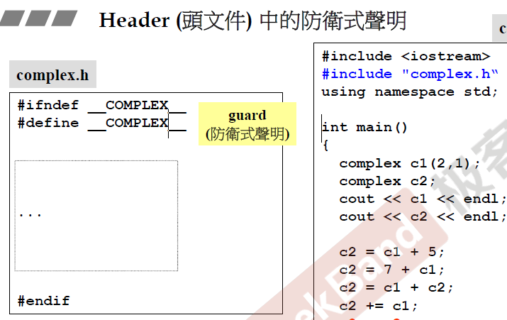

写头文件时，非常建议按这种格式写防卫式声明。

<!--more-->

## 2.基本数据类型

五种主要的数据类型如下：（其中bool是C语言所没有的）

其实还有别的。

| 类型     | 关键字 |
| -------- | ------ |
| 布尔型   | bool   |
| 字符型   | char   |
| 整型     | int    |
| 浮点型   | float  |
| 双浮点型 | double |

一些基本类型可以使用一个或多个类型修饰符进行修饰：

- signed

- unsigned

- short

- long

- long long

  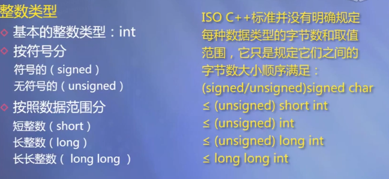

**注意：**不同系统会有所差异，一字节为 8 位。

**注意：**long int 8 个字节，int 都是 4 个字节，早期的 C 编译器定义了 long int 占用 4 个字节，int 占用 2 个字节，新版的 C/C++ 标准兼容了早期的这一设定。

bool ： 1个字节 ： 取值范围（false和true，小写）

| 类型               | 位            | 范围                                                         |
| ------------------ | ------------- | ------------------------------------------------------------ |
| char               | 1 个字节      | -128 到 127 或者 0 到 255                                    |
| unsigned char      | 1 个字节      | 0 到 255                                                     |
| signed char        | 1 个字节      | -128 到 127                                                  |
| int                | 4 个字节      | -2147483648 到 2147483647                                    |
| unsigned int       | 4 个字节      | 0 到 4294967295                                              |
| signed int         | 4 个字节      | -2147483648 到 2147483647                                    |
| short int          | 2 个字节      | -32768 到 32767                                              |
| unsigned short int | 2 个字节      | 0 到 65,535                                                  |
| signed short int   | 2 个字节      | -32768 到 32767                                              |
| long int           | 8 个字节      | -9,223,372,036,854,775,808 到 9,223,372,036,854,775,807      |
| signed long int    | 8 个字节      | -9,223,372,036,854,775,808 到 9,223,372,036,854,775,807      |
| unsigned long int  | 8 个字节      | 0 到 18,446,744,073,709,551,615                              |
| float              | 4 个字节      | 精度型占4个字节（32位）内存空间，+/- 3.4e +/- 38 (~7 个数字) |
| double             | 8 个字节      | 双精度型占8 个字节（64位）内存空间，+/- 1.7e +/- 308 (~15 个数字) |
| long double        | 16 个字节     | 长双精度型 16 个字节（128位）内存空间，可提供18-19位有效数字。 |
| wchar_t            | 2 或 4 个字节 | 1 个宽字符                                                   |

**注意：**C++中有字符串常量，但是基本类型中却没有字符串变量。

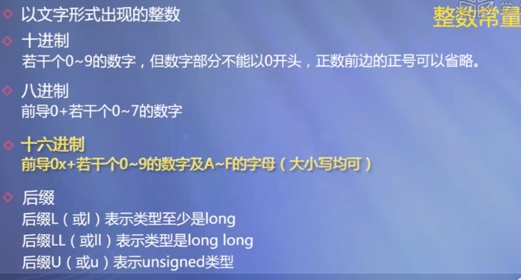


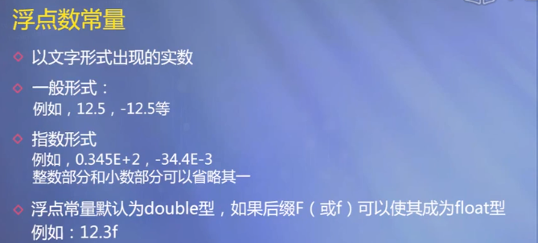

## 3.类型别名

### typedef 声明

您可以使用 **typedef** 为一个已有的类型取一个新的名字。下面是使用 typedef 定义一个新类型的语法：

```C++
typedef type newname; 
```

例如，下面的语句会告诉编译器，feet 是 int 的另一个名称：

```C++
typedef int feet;
```

现在，下面的声明是完全合法的，它创建了一个整型变量 distance：

```C++
feet distance;
```

### using

语法格式：`using 新类型名 = 已有类型名;`

```C++
using Area = double; // 这和typename类似
Area a = 10.10; // Area相当于double
```

## 4.枚举类型

不限定作用域枚举类型。


枚举类型(enumeration)是C++中的一种派生数据类型，它是由用户定义的若干枚举常量的集合。

如果一个变量只有几种可能的值，可以定义为枚举(enumeration)类型。所谓”枚举”是指将变量的值一一列举出来，变量的值只能在列举出来的值的范围内。

创建枚举，需要使用关键字 **enum**。枚举类型的一般形式为：

```C++
enum 枚举名{ 
     标识符[=整型常数], 
     标识符[=整型常数], 
... 
    标识符[=整型常数]
} 枚举变量;
```

如果枚举没有初始化, 即省掉”=整型常数”时, 则从第一个标识符开始。

例如，下面的代码定义了一个颜色枚举，变量 c 的类型为 color。最后，c 被赋值为 “blue”。

```C++
enum color { red, green, blue } c;
c = blue;
```

默认情况下，第一个名称的值为 0，第二个名称的值为 1，第三个名称的值为 2，以此类推。但是，您也可以给名称赋予一个特殊的值，只需要添加一个初始值即可。例如，在下面的枚举中，**green** 的值为 5。

```C++
enum color { red, green=5, blue };
```

在这里，**blue** 的值为 6，因为默认情况下，每个名称都会比它前面一个名称大 1，但 red 的值依然为 0。

**注意**：整数值不能直接赋值给枚举变量，如果需要将整数值赋值给枚举变量，应进行强制类型转换。

```C++
#include <iostream>

using namespace std;
enum GameResult{WIN,LOSE,TIE,CANCEL};
int main()
{
	GameResult result;
	enum GameResult omit = CANCEL; // 这两种声明枚举变量的方式相同
	for (int count = WIN; count <= CANCEL; count++)
	{
		result = GameResult(count); // 将int型变量count强制转换为GameResult
        // 等价于result = (GameResult)count;
		if (result == omit) cout << "The game was cancelled" << endl;
		else
		{
			cout << "The game was played";
			if (result == WIN) cout << "and we won!";
			if (result == LOSE) cout << "and we lost.";
			cout << endl;
		}
	}
	return 0;
}
/* output:
The game was playedand we won!
The game was playedand we lost.
The game was played
The game was cancelled
*/
```

## 5.auto类型与decltype类型

当变量类型名称太长时，可以使用auto进行简化。

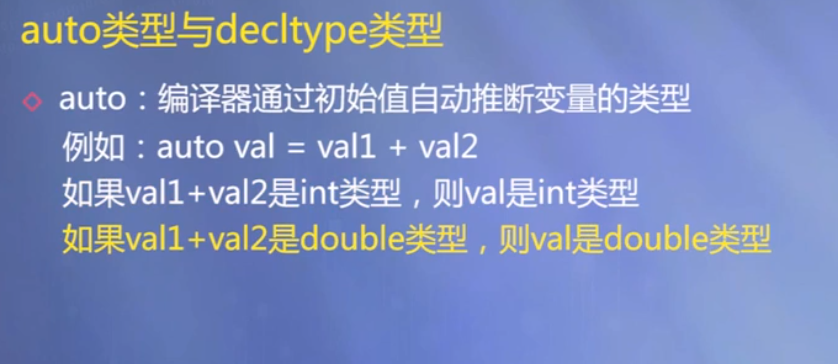


## 6.const修饰变量称为符号常量

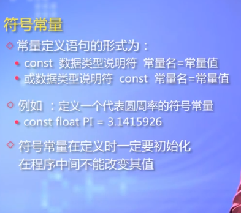

## 7.sizeof运算符与位运算

**sizeof运算符**

语法格式：`sizeof(类型名)`或者`sizeof 表达式`

结果值： 类型名或表达式的结果所占有的字节数。

例如：`sizeof(short)  sizeof x`

**位运算**

```C++
1.按位与（&）
运算规则：将两个运算量的每一个位进行逻辑与操作。
    3 : 0 0 0 0 0 0 1 1
    5 : 0 0 0 0 0 1 0 1
________________________
3 & 5 : 0 0 0 0 0 0 0 1
相同位的两个数字都为1，则为1；若有一个不为1，则为0。

2.按位或（|）
运算规则：将两个运算量的每一个位进行逻辑或操作。
    3 : 0 0 0 0 0 0 1 1
    5 : 0 0 0 0 0 1 0 1
________________________
3 | 5 : 0 0 0 0 0 1 1 1
相同位只要一个为1即为1。

3.按位异或（^）
运算规则：两个操作数进行异或，若对应位相同，该位为0，否则为1。
        0 7 1 : 0 1 0 0 0 1 1 1
        0 5 2 : 0 0 1 1 0 1 0 0
_______________________________
0 7 1 ^ 0 5 2 : 0 1 1 1 0 0 1 1
相同位不同则为1，相同则为0。

4.按位取反 （~）
运算规则：将一个二进制数按位取反。
3 : 0000 0011
~3: 1111 1100
```

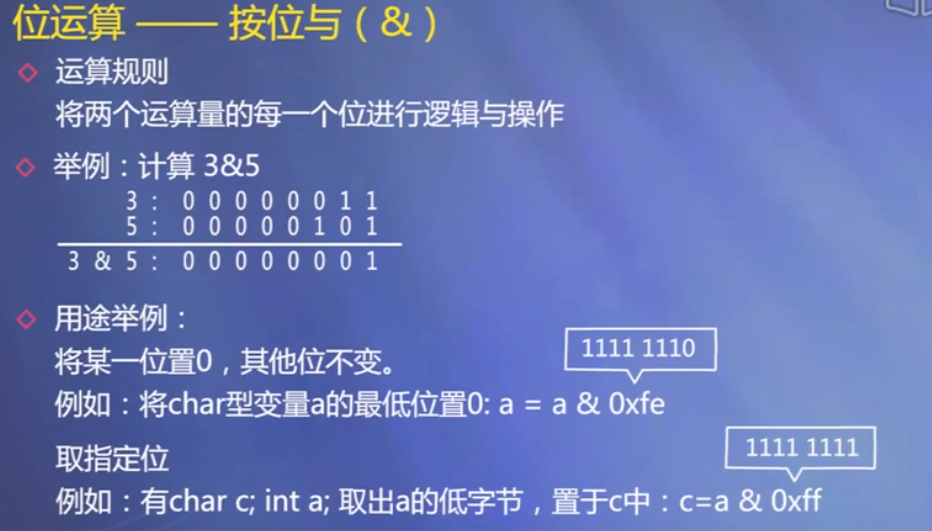

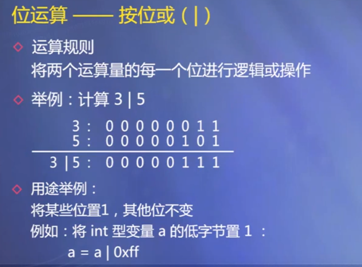

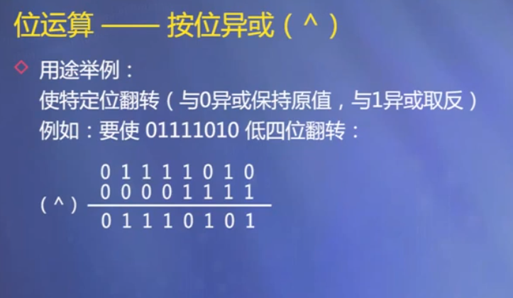

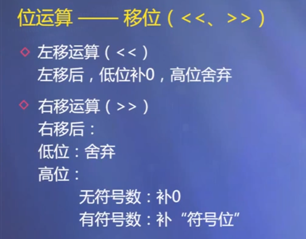


**移位运算：**

右移运算分为：逻辑右移和算术右移。

有符号数右移时，高位补符号位，如果是负数，补1，是整数则补0.

算术右移相当于除以2的效果；左移相当于乘以2的效果。

## 8.运算符的优先级与结合性表

不需要背，需要时查阅即可。

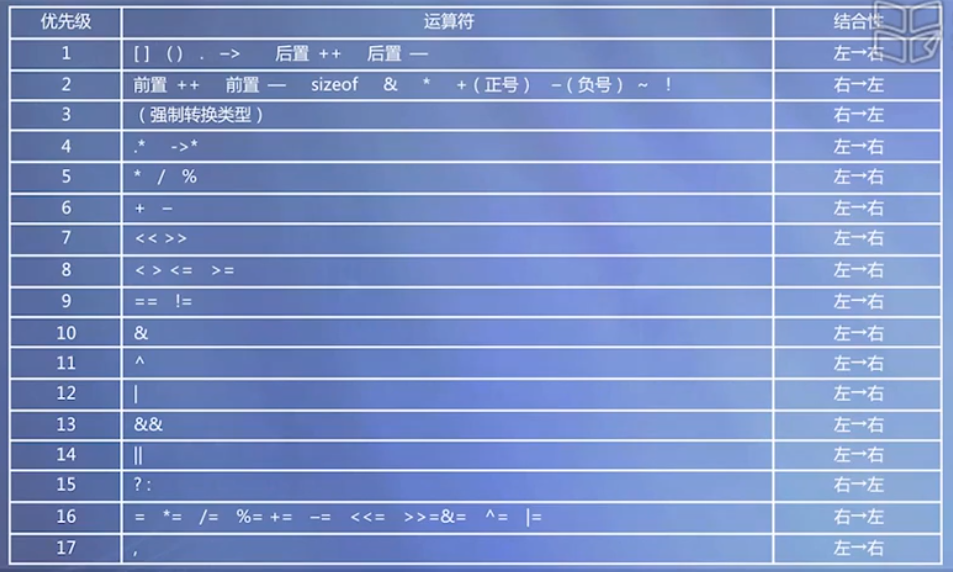

## 9.类型转换

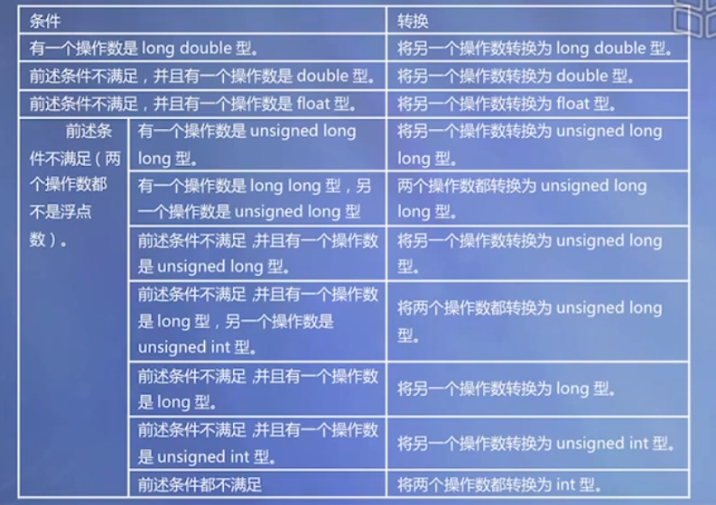


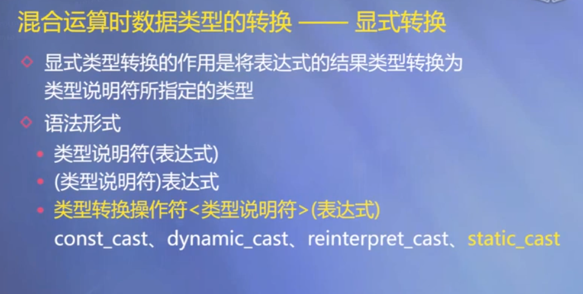


**注意**：`(int)a`和`int(a)`这两种方法都是等价的。

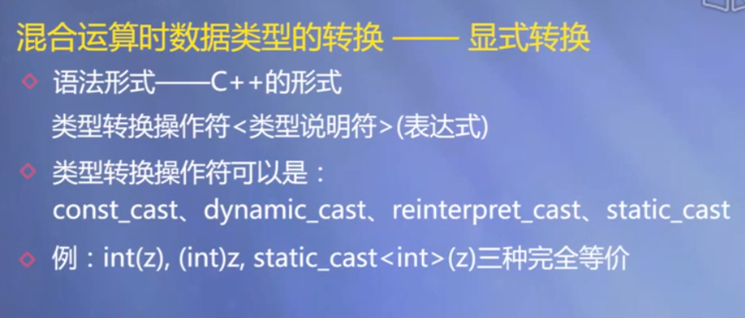

## 10.I/O流

我们很少用到这种格式控制，可以用printf来代替格式化输出。

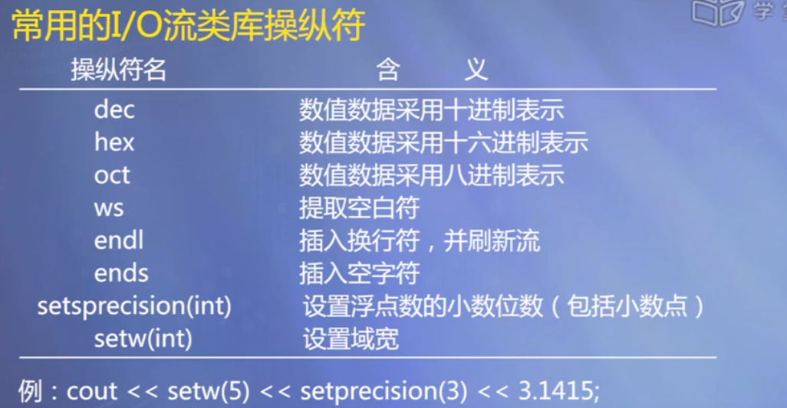

## 11.引用类型

引用是一种特殊类型的变量，可以被认为是另一个变量的别名。

引用可以作为形参，实现形实结合。

引用是双向传递的！！

**注意两点：**

- 声明一个引用时，必须同时对它进行初始化，使它指向一个已存在的对象；
- 一旦一个引用被初始化，就不能再指向其他对象。

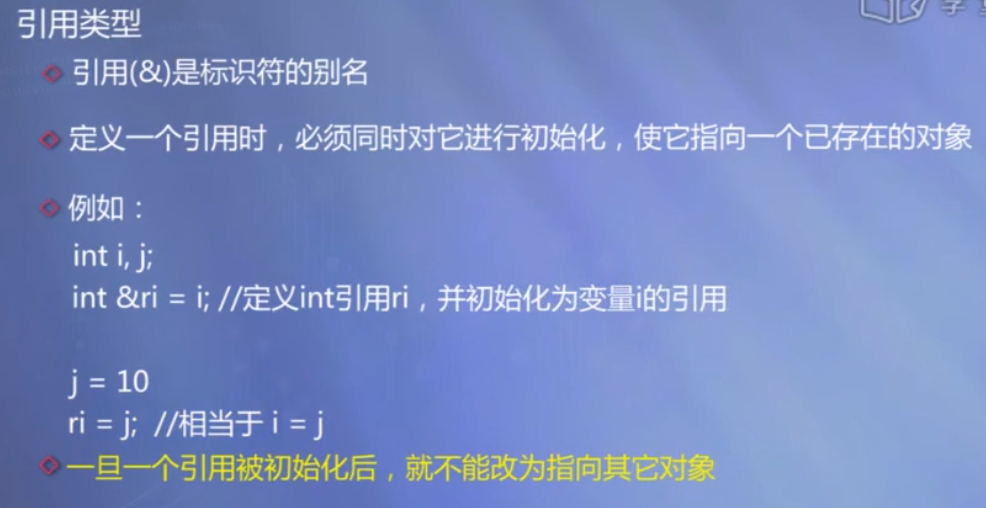

## *12.含有可变参数的函数

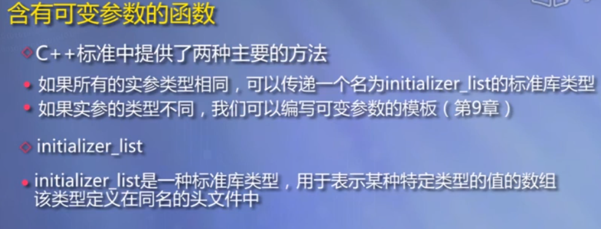

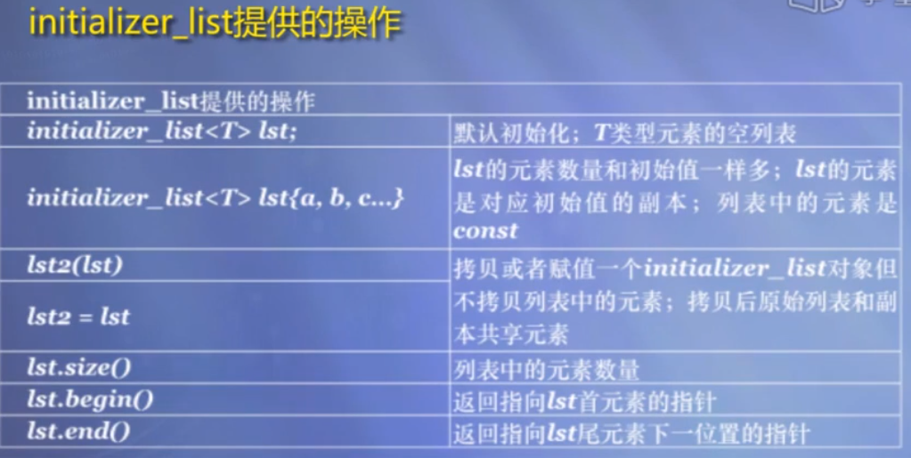

