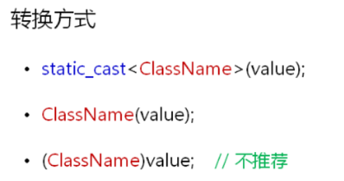

## 1.类类型与系统预定义类型之间的转换

这个标题很教科书，让人搞不懂，通俗的讲就是用户自己定义的类对象与内置的像int、double之类的数据之间的转换。

<!--more-->

给出两篇参考文章：

1. https://blog.csdn.net/zhulinzhulinlin/article/details/80031029
2. https://blog.csdn.net/SlowIsFastLemon/article/details/104250213

### 1.1转换构造函数:预定义类型转换成类类型

用转换构造函数可以将一个指定类型的数据转换为类的对象。但是不能反过来将一个类的对象转换为一个其他

类型的数据(例如将一个Complex类对象转换成double类型数据)。

例子：

```C++
class C {
public:
        double real;
        double imag;
        C() {}
        C(double i, double r) { real = i; imag = r; }
        C(double r) {//转换构造函数
            real = r; imag = 0;
        }
        C operator +(C &c1)
        {
            C tem;
            tem.real = c1.real + this->real;
            tem.imag = c1.imag + this->imag;
            return tem;
        }
        /*friend C operator +(C &c1, C&c2)
        {
            C tem;
            tem.real = c1.real + c2.real;
            tem.imag = c1.imag + c2.imag;
            return tem;
        }*/
};
int main()
{
    C c1(1.1, 2.2);
    C c2,c3;
    C c4(9.2);
    //不同调用转换构造函数的方式
    c2= C(2.3) + c1;//C（2.3）调用转换构造函数
    c3 = 4;//调用转换构造函数
    // C trans(int a)
    // { return a}
    //  该方式也调用转换构造函数 int->C 

    //b = a + C(2.3);//出错，+重载函数必须为friend
    cout << c1.real << "+" << c1.imag << "i" << endl;
    return 0;
}
```

C(2.1)和C c(2.1)两种方式都可以调用转换构造函数。第一种方式会生成一个临时对象。

- 先声明一个类。
- 在类中定义一个**只有一个参数**的构造函数，参数是待转换类型的数据。
- 凡是需要将系统预定义的数据类型转换为类类型的都要用到转换构造函数。
- 其中要注意的是在C++的类中，用单个实参来调用的构造函数默认定义了从形参类型到该类类型的一个隐式转换。可以写一个类测试一下 如下：

```C++
#include <iostream>
using namespace std;
class A
{
    public:
        int a;
        A(){};
        A(int a) :a(a) {}
    //加上explicit关键字的可以防止类构造函数的隐式自动转换
    //那么下面test= 3会报错
};
int main()
{
    A test;
    test= 3;
    //执行test=3时跳转到A(int a) :a(a) {} ,将3->A类型
    cout << test.a << endl;
    return 0;
}
```

### 1.2explicit关键字

作用就是**防止类构造函数的隐式自动转换**。

- 工程中通过explicit关键字杜绝编译器的转换尝试。

- 转换构造函数被explicit修饰时只能进行显示转换。

  

explicit在下面两种情况下有效：

- 类的构造函数只有一个参数时；
- 类的构造函数中除了第一个参数以外，其他参数都有默认值的时候。(第一个参数可以有默认值，也可以没有)

google C++规范中也约定所有单参数的构造函数都必须是显示的，即使用explicit关键字。

```C++
#include <iostream>
#include <string>
using namespace std;
class Test
{
    int mValue;
public:
    Test()
    {
        mValue = 0;
    }   
    explicit Test(int i)// 只能显式转换
    {
        mValue = i;
    }   
    Test operator + (const Test& p)
    {
        Test ret(mValue + p.mValue);
        
        return ret;
    }    
    int value()
    {
        return mValue;
    }
};

int main()
{   
    Test t;    
    t = static_cast<Test>(5);    // t = Test(5);
    
    Test r;  
    r = t + static_cast<Test>(10);   // r = t + Test(10);
    cout << r.value() << endl;
    return 0;
}
```

### 1.3类型转换函数:类类型转换成其他类型（系统预定义类型）

作用：将一个类的对象转换为**其他类型**的数据。这里的其他类型不仅仅指系统预定义类型。

格式：

```C++
operator 目标类型()
{
    return 目标类型的数据；
}
```

类型转换函数**没有返回类型**，但是要return 目标类型的数据，**没有参数**，只能定义为类的成员函数。

这样做导致的结果是：类型转换函数看起来没有返回值类型，其实是隐式地指明了返回值类型。

```C++
class A
    {
    public:
        int a;
        A() {}
        explicit A(int a) :a(a) {}
        operator int()//类型转换函数
        {
            return a;
        }
};
int main()
{
    A test(3);
    //用法1
    int d = test;
    //用法2
    int c = 2 + int(test);

    cout << d << endl;//3
    cout << c << endl;//5
    return 0;
}
```

注意：

1. 类型转换函数只能定义为成员函数，不能定义为友元函数
2. 一个类可以定义多个类型转换函数，但是要避免二义性