## 1.C++在非OOP方面的扩充

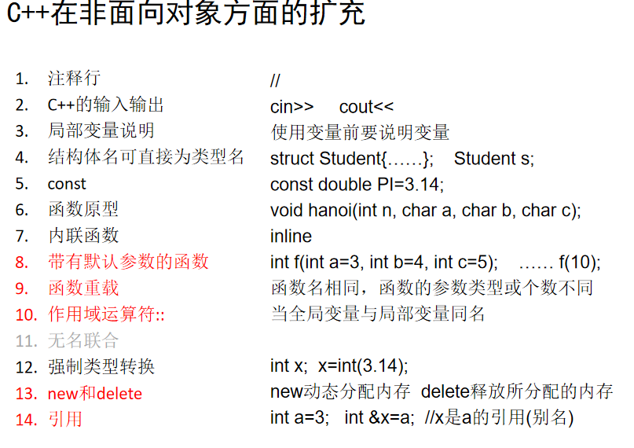

<!--more-->

## 2.函数重载回顾

注意：下图爆红代码，编译器无法正确匹配函数（存在多义性）。

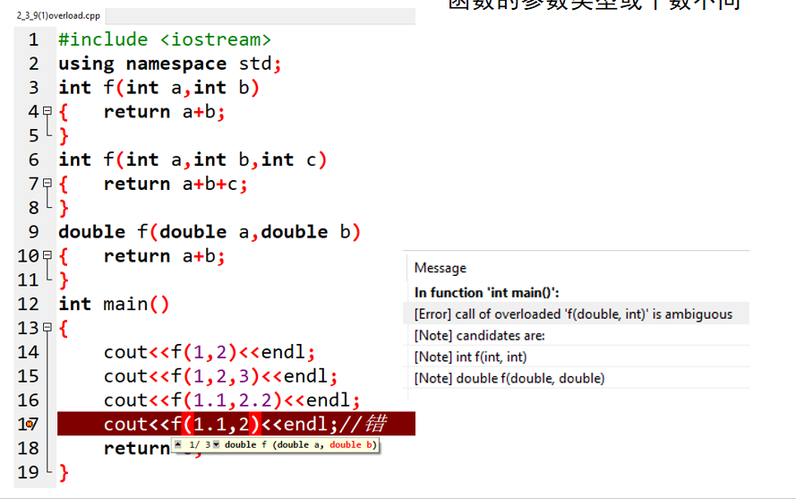

正常运行。

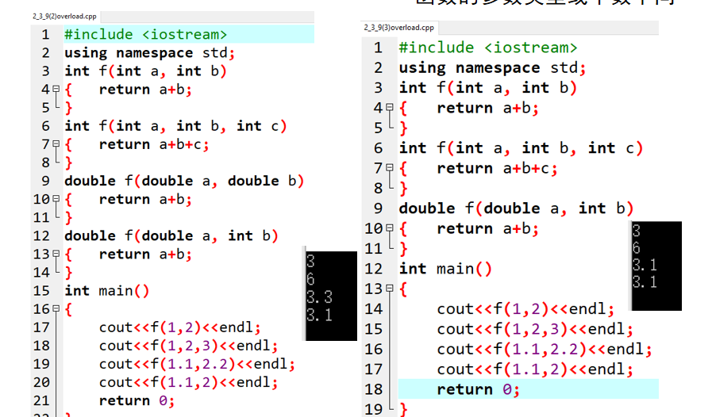

## 3.作用域运算符`::`

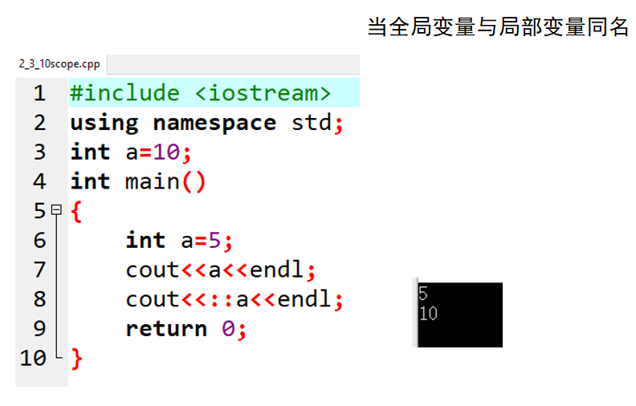

## 4.new和delete

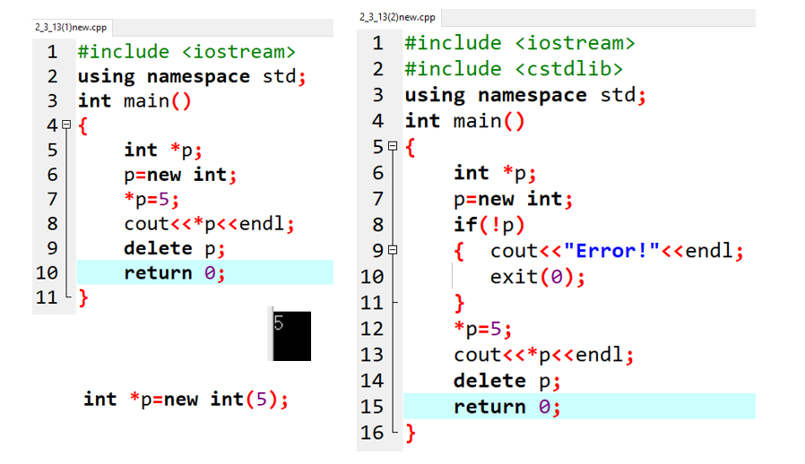

说明：这里p已经声明为int*指针，不需要特意强调new int编译器会自动识别。

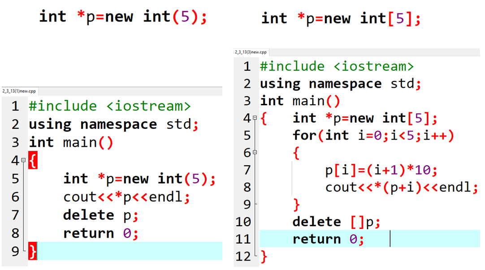

## 5.引用

demo1:

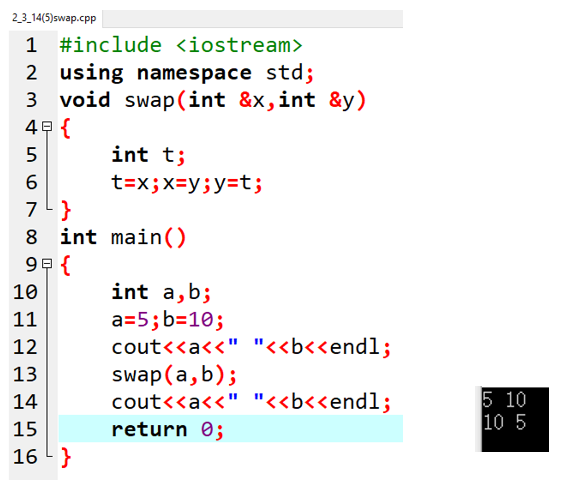

demo2:

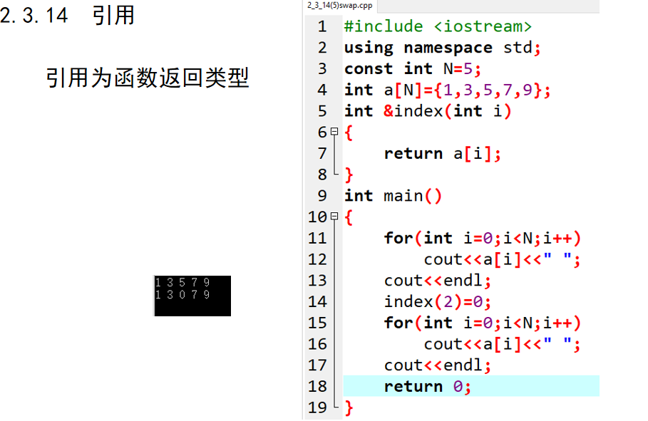

## 6.对象数组与数组指针

### 对象数组及其初始化

demo1：

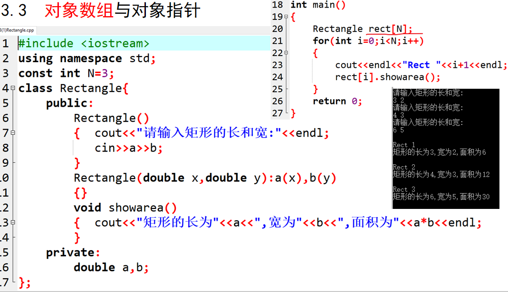

demo2：

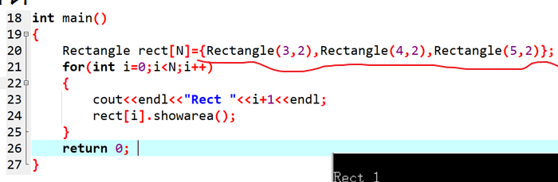

demo3：

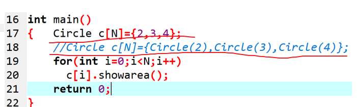

demo4：

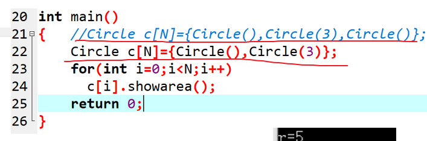

### 对象指针

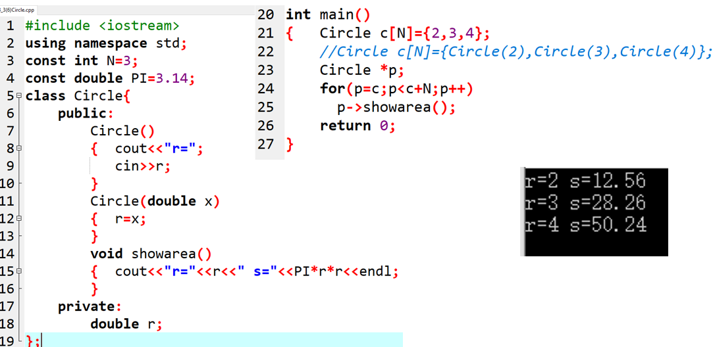

### this指针

作用基本同Java的this（这里其实没必要加上）

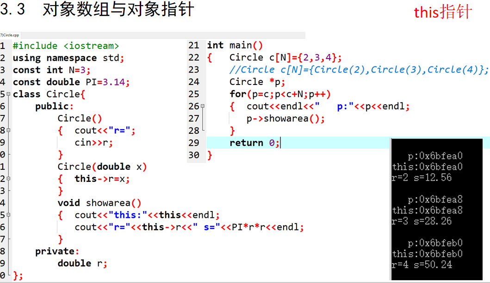

## 7.向函数传递对象

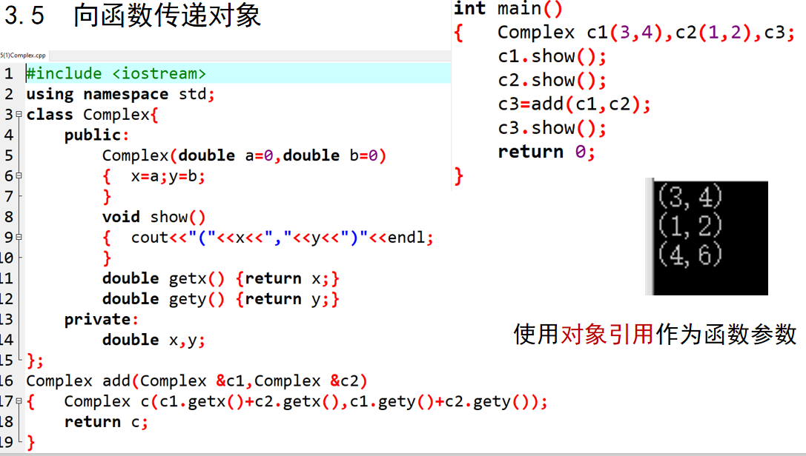

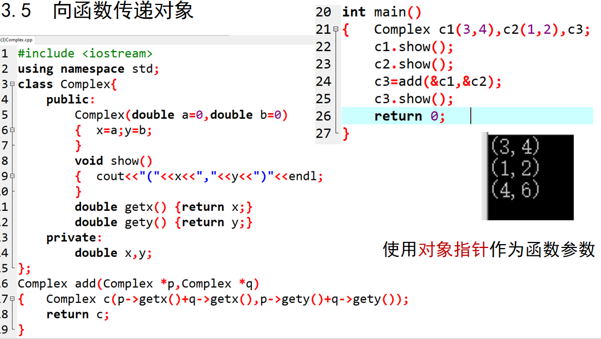

## 8.构造函数与析构函数的执行次序

- 构造函数在对象被创建时调用，析构函数在对象被删除前调用。

- 后调用的对象先调用析构函数，与构造函数的执行顺序相反。

```c++
#include <iostream>
using namespace std;
class Point {
public:
	Point(int xx = 0, int yy = 0) { // 构造函数
		x = xx;
		y = yy;
		printf("%d\n",x);
	}
    ~Point();
private:
	int x, y;
};
Point::~Point(){
	printf("this:%d\n",this->x);
}

int main()
{
	Point p1(1,1), p2(2,2);
	return 0;
}
/*1
2
this:2
this:1*/
```

