#### 1.内联函数

声明内联函数使用inline关键字。

编译时在调用处用函数体进行替换，这样可以节省参数传递，控制转移等开销。

<!--more-->

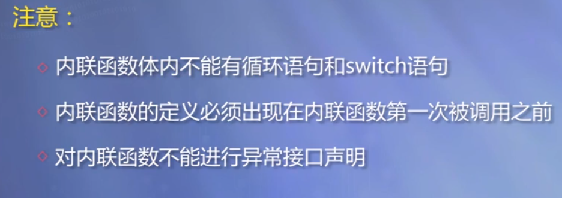


**强调：inline只是对编译器的建议，具体如何处理取决于编译器。**

没有用inline修饰的函数也可能被编译为内联。

```C++
#include <iostream>

using namespace std;
const double PI = 3.1415926535798954;
inline double calArea(double radius) {
	return PI * radius * radius;
}
int main()
{
	double r = 3.0;
	double area = calArea(r);
	cout << area << endl;
	return 0;
}
```

#### 2.constexpr函数（C++11新特性）

constexpr：也即常量表达式。

语法规定：constexpr修饰的函数在其所有参数都是constexpr时一定返回constexpr。

C++11规定，允许将变量声明为constexpr类型以便由编译器来验证变量的值是否是一个常量表达式。声明为constexpr的变量一定是一个常量，而且必须用常量表达式初始化。

```C++
constexpr int mf=20;		//20是常量表达式
constexper int limit=mf+1;	//mf+1是常量表达式
constxper int sz=size();	//只有当size是一个constxper函数时才是一条正确的声明语句
```

不能用普通函数作为constexpr变量的初始值，只能用constexpr函数去初始化constexpr变量。这种函数足够简单，以使得编译时就可以计算其结果。

**一般来说，如果你认定变量是一个常量表达式，那就把它声明成constexpr类型。**

constexpr函数是指能用于常量表达式的函数。该函数要遵循几项约定：函数的返回类型及所有形参的类型都得是字面值类型，而且函数体中必须有且只有一条return语句：

```C++
constexpr int new_sz() { return 42; }
constexpr int foo = new_sz();
```

在对变量foo初始化时，编译器把对constexpr函数的调用替换成其结果值。为了能在编译过程中随时展开，constexpr函数被隐式地指定为内联函数。

constexpr函数体内也可以包含其它语句，只要这些语句在运行时不执行任何操作就行。例如，constexpr函数中可以有空语句、类型别名以及using声明。

#### 3.函数重载（重要）

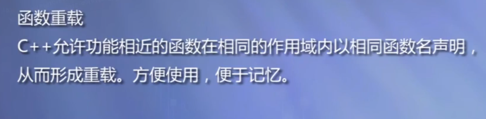


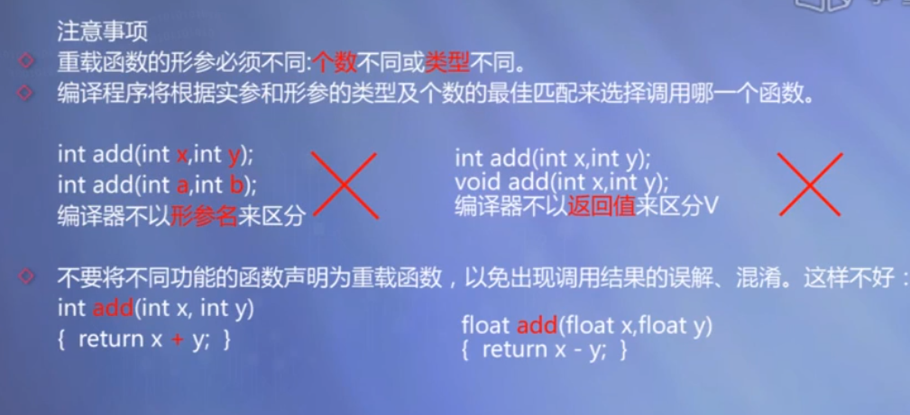

```C++
#include <iostream>

using namespace std;
int sumOfSquare(int a, int b)
{
	return a * a + b * b;
}
// 两个函数同名，只是参数类型和返回类型不同，功能类似
double sumOfSquare(double a, double b)
{
	return a * a + b * b;
}
int main()
{
	int m, n;
	cin >> m >> n;
	cout << sumOfSquare(m, n) << endl;
	double x, y;
	cin >> x >> y;
	cout << sumOfSquare(x, y) << endl;
	return 0;
}
```

#### 4.OOP的几大基本特点

##### 4.1抽象

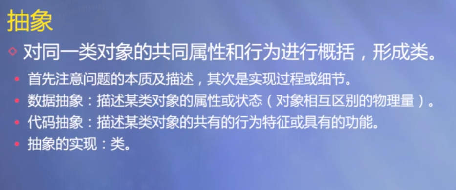


```C++
class Clock{
    public : // 类的外部访问接口
    void setTime(int newH,int newM,int newS);
    void showTime();
    private: // 数据隐藏在类的内部
    int hour,minute,second;
}; // 记得末尾的;
```

##### 4.2封装


##### 4.3继承

在已有类的基础上，进行扩展形成新的类。

##### 4.4多态

同一名称，采用不同的功能来实现。

目的：达到行为的标识统一，减少程序中标识符的个数。

#### 5.类和对象的定义

定义类的对象，才可以通过对象使用类中定义的功能。

##### 定义类

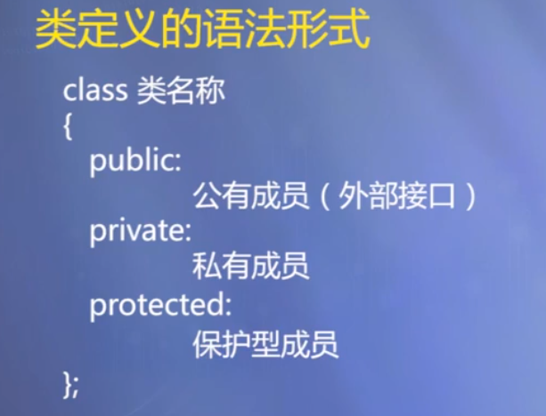


无论数据成员还是函数成员都可以分成以上三大类。

在类的定义中，不同属性的成员可以按任意顺序出现，修饰访问属性的关键字也可以多次出现。

**但是一个成员只能有一种访问属性。**

##### 公有类型成员

在关键字public后面声明，他们是类与外部的接口，任何外部函数都可以访问公有型数据和函数。

##### 私有类型成员

在关键字private后面声明，只允许本类中的函数访问，而类外部的任何函数都不能访问。

如果紧跟在类名称的后面声明私有成员，则关键字private可以省略。

##### 保护类型成员

与private类似，具体差别详见后面。

##### 定义对象

语法格式： 类名  对象名;

```C++
Clock myClock;
```

##### 访问成员

类中成员之间可以直接使用，成员名互相访问。

从类外访问成员使用“对象名.成员名”方式来访问public成员。

##### 类的成员函数

在类的成员函数中，可以访问到类的全部成员。


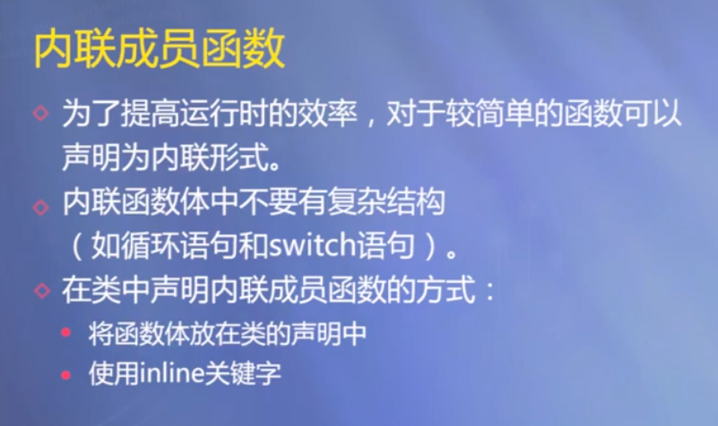


与普通函数不同的是，实现成员函数时要指明类的名称。可以在类的内部或者外部实现。

成员函数可以定义在类定义内部，或者单独使用**范围解析运算符 ::** 来定义。在类定义中定义的成员函数把函数声明为**内联**的，即便没有使用 inline 标识符。所以您可以按照如下方式定义 **getVolume()** 函数：

```C++
class Box
{
   public:
      double length;      // 长度
      double breadth;     // 宽度
      double height;      // 高度
   
      double getVolume(void)
      {
         return length * breadth * height;
      }
};
```

您也可以在类的外部使用**范围解析运算符 ::** 定义该函数，如下所示：

```C++
double Box::getVolume(void)
{
    return length * breadth * height;
}
```

##### 举个栗子

```C++
#include <iostream>
using namespace std;
class Clock {
public :
	void setTime(int newH = 0, int newM = 0, int newS = 0);
	void showTime();
private :
	int hour, minute, second;
};

void Clock::setTime(int newH, int newM, int newS) {
	hour = newH;
	minute = newM;
	second = newS;
}
void Clock::showTime() {
	cout << hour << ":" << minute << ":" << second;
}

int main()
{
	Clock myClock;// 定义对象
	myClock.setTime(8, 30, 30);// 使用对象
	myClock.showTime();
	return 0;
}
```

#### 6.构造函数

构造函数时是类中的特殊成员函数，用于描述初始化算法。

**构造函数的作用就是在对象被创建时利用特定的值构造对象，将对象初始化为一个特定的状态。**

**与一般函数的重要区别**：函数名与类名相同，不能定义返回值类型，没有return语句。

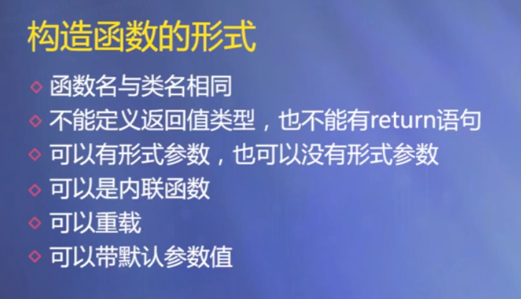


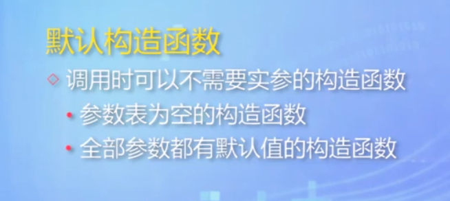


如果类中没有写构造函数，编译器会自动生成一个隐含的默认构造函数，该构造函数的参数列表和函数体皆为空。

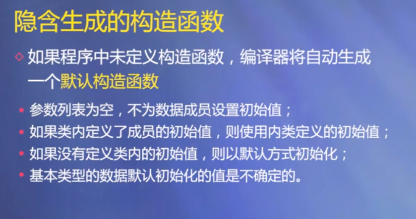


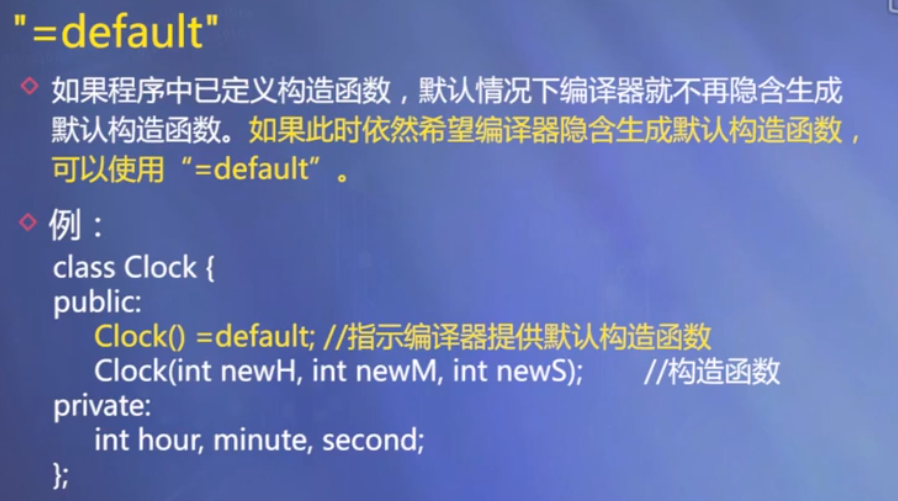

##### **构造函数初始化列表**

构造函数初始化列表以一个冒号开始，接着是以逗号分隔的数据成员列表，每个数据成员后面跟一个放在括号中的初始化式。例如：

```C++
class CExample {
public:
    int a;
    float b;
    //构造函数初始化列表
    CExample(): a(0),b(8.8)
    {}
    //构造函数内部赋值
    CExample()
    {
        a=0;
        b=8.8;
    }// 两个构造函数的结果是一样的
};
```

```C++
// example 1
// 类定义
class Clock{
    public:
    Clock(int newH,int newM,int newS);// 构造函数
    void setTime(int newH,int newM,int newS);
    void showTime();
    private:
    int hour,minute,second;
};
// 构造函数的实现1,初始化列表
Clock::Clock(int newH,int newM,int newS):
hour(newH),minute(newM),second(newS){
    // 将newH赋值给hour初始化，等价于在函数体中对应赋值
}
// 构造函数的实现2,一般方式，等价的
//Clock::Clock(int newH,int newM,int newS){
//    hour = newH;minute = newM;second = newS;
//}
int main(){
    Clock c(0,0,0);
    c.showTime();
    return 0;
}

// example 2
class Clock{
    public:
    Clock(int newH,int newM,int newS);
    Clock();// 默认构造函数，经验告诉我们最好加上
    void setTime(int newH,int newM,int newS);
    void showTime();
    private:
    int hour,minute,second;
};
Clock::Clock():hour(0),minute(0),second(0){}// 默认构造函数的实现
int main()
{
    Clock c1(8,10,0);// 调用有参数的构造函数
    Clock c2;// 调用无参数的构造函数
    c1.showTime();
    c2.showTime();
	return 0;
}
```

##### **委托构造函数**

作用：省事，方便修改。

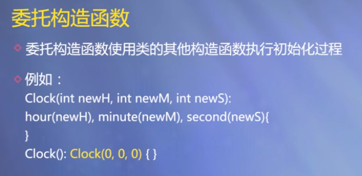

##### 复制构造函数


我们只能使用这里的引用进行复制，而不让它对指向的对象进行修改。

这样既能传参又能保证安全性。

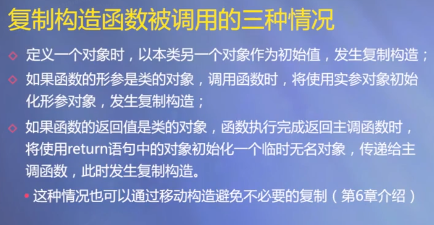


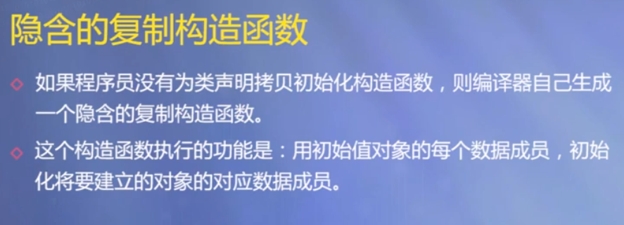


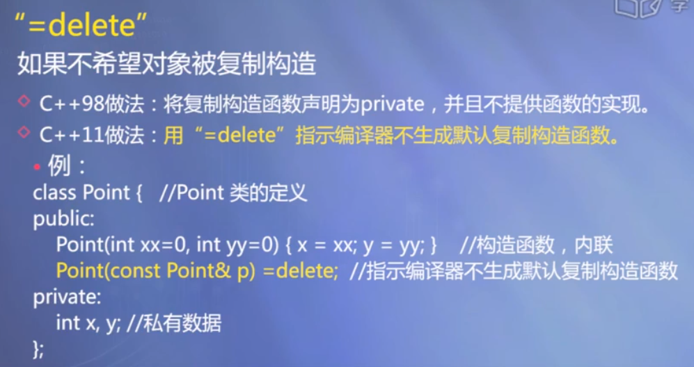

有点小难呢，举个栗子吧：

**调用复制构造函数的三种情况：**

（1）用类的一个对象去初始化另一个对象；

（2）如果函数的形参是类的对象，调用函数时，进行形参和实参的结合；

（3）如果函数的返回值是类的对象，函数执行完成返回调用者。

```C++
#include <iostream>
using namespace std;
class Point {
public:
	Point(int xx = 0, int yy = 0) { // 构造函数
		x = xx;
		y = yy;
	}
	Point(const Point& p);// 复制构造函数
	int getX() { return x; }
	int getY() { return y; }
private:
	int x, y;
};

Point::Point(const Point& p) {
	x = p.x;
	y = p.y;
	cout << "Calling the copy constructor" << endl;
}
void fun1(Point p) {
	cout << p.getX() << endl;
}

Point fun2() {
	Point a;
	return a;
}
int main() {
	Point a;// 对象a
	Point b(a);// 情况1，用a初始化b，第一次调用复制构造函数
	cout << b.getX() << endl;
	fun1(b);// 情况2，对象b作为fun1的实参，第二次调用复制构造函数
	b = fun2();//  情况3，函数的返回值是类对象，第三次调用复制构造函数
	cout << b.getX() << endl;
	return 0;
}
```

情况3下，a是fun2()的局部对象，离开建立它的函数fun2后就消亡了，编译器在处理这种情况时会创建一个无名临时变量，生存期在`b = fun2();`中。

#### 7.析构函数

它完成对象被删除前的一些清理工作。

如果程序中未声明析构函数，编译器会自动产生一个默认的构造函数，函数体为空。

它的名称由类名前加“~”构成，**没有参数和返回值**。

```C++
#include <iostream>
using namespace std;
class Point {
public:
	Point(int xx = 0, int yy = 0) { // 构造函数
		x = xx;
		y = yy;
	}
    ~Point(); 
private:
	int x, y;
};
Point::~Point(){}
```
