## 1常类型

<!--more-->

### 1.1常引用

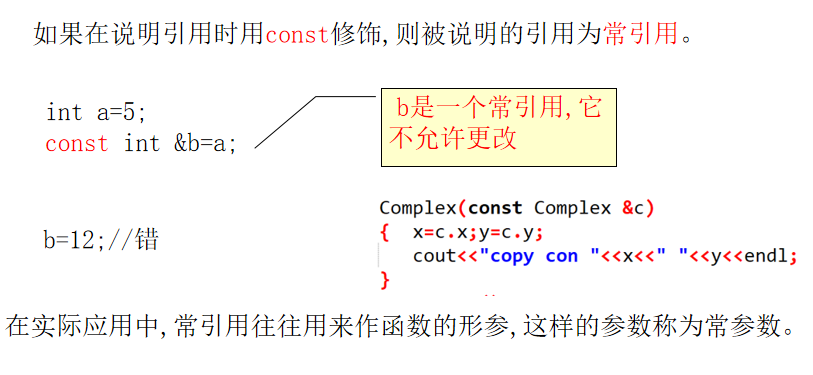

如果用常引用作为形参，便不会修改实参。

### 1.2常对象

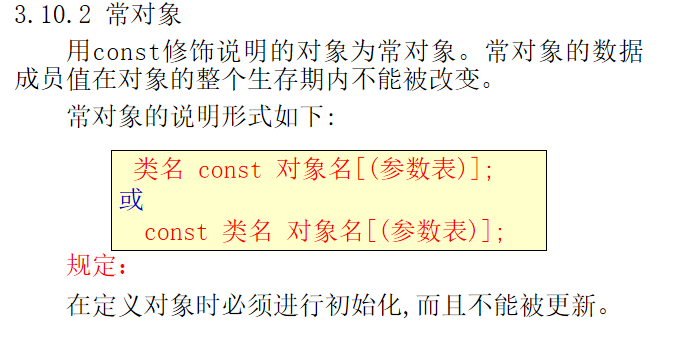

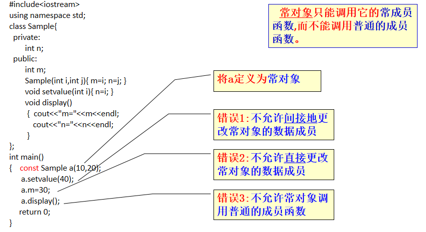

### 1.3常对象成员

#### 1.3.1常数据成员

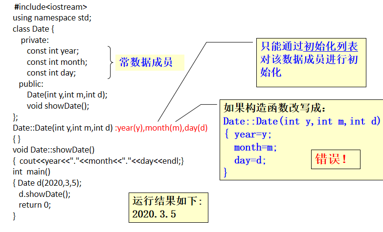

如果在一个类中声明了常数据成员，那么构造函数就只能通过成员初始化列表对该数据成员进行初始化，而其他任何函数都不能对该成员赋值。

一旦对常数据成员初始化后，它的值就不能改了。

#### 1.3.2常成员函数

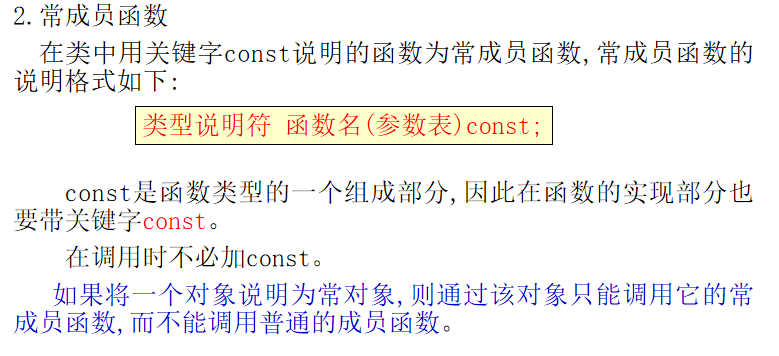

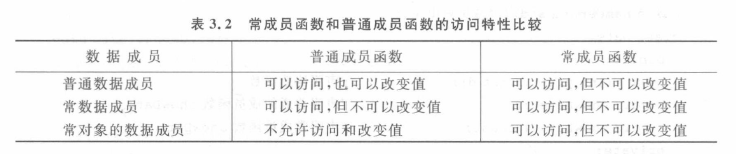

常成员函数不能更新对象的数据成员，也不能调用该类中的普通成员函数，这就保证它就一定不会更新数据成员的值。

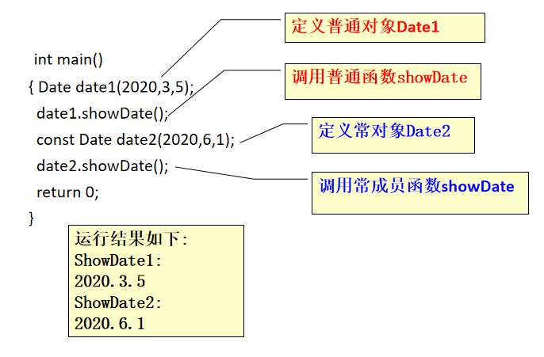

## 2派生类与继承

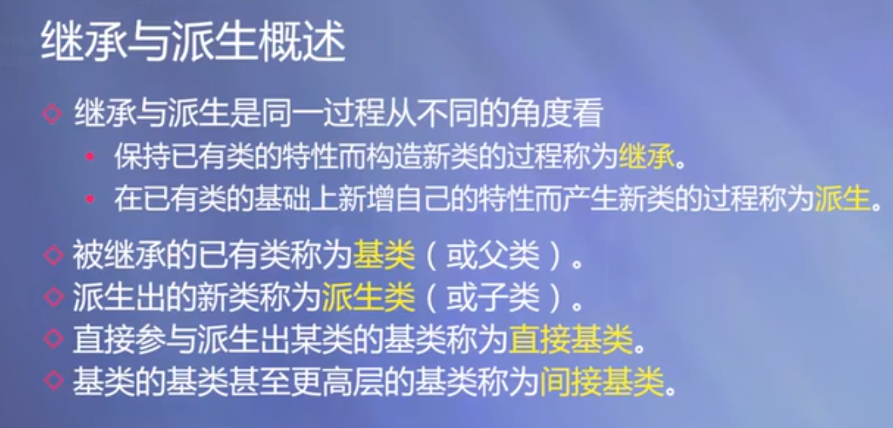

**示例**

```c++
#include <cstdio>
#include <iostream>
using namespace std;
class Person{
	public:
		void print(){
			cout << name << " " << age <<" "<< sex <<endl;
		}
	protected:
		string name;
		int age;
		char sex;
};
class Employee: public Person{
	public:
		void print(){
			cout << department << salary<<endl;
		}
	private:
		string department;
		float salary;
};
```

说明：

protected关键字修饰保护数据成员，可以被本类的成员函数访问，也可以被本类的派生类的成员函数访问，类以外的任何访问都是非法的，它是半隐藏的。

Employee类（派生类，子类）继承了Person类（基类，父类），public代表公有继承。

如果不显式地给出继承方式，则默认为私有方式继承。

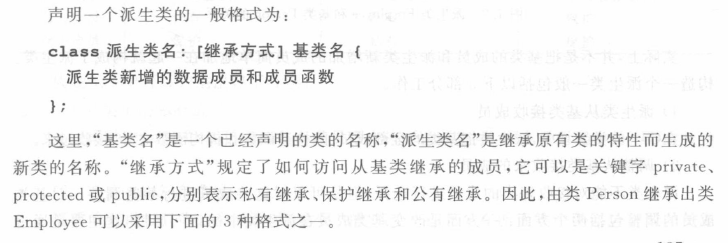


派生类把基类的全部成员（除构造函数和析构函数之外）接收过来。

调整从基类接收来的成员：

- 一方面改变基类成员在派生类中的访问属性，主要通过派生类声明时的继承方式来控制；
- 另一方面对基类的成员进行重定义，在派生类中声明一个与基类成员同名的成员，这时会覆盖基类的成员。

### **2.1基类成员在派生类中的访问属性** 
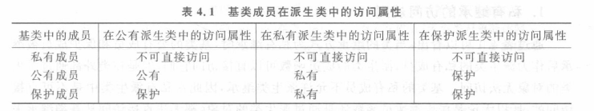

### **2.2派生类对基类成员的访问规则**

派生类对基类的访问形式主要有两种：

- 内部访问：派生类中新增的成员函数对于基类继承来的成员的访问；
- 对象访问：在派生类外部，通过对象进行访问。

#### 2.2.1私有继承的访问规则

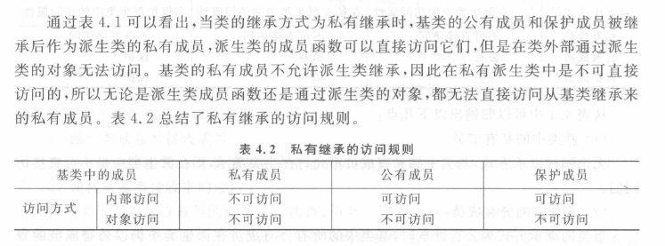

#### 2.2.2公有继承的访问规则

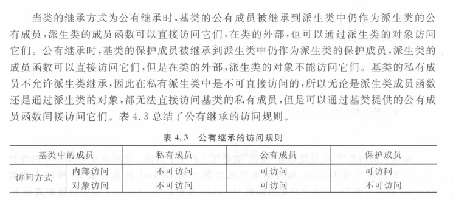

#### 2.2.3保护继承的访问规则

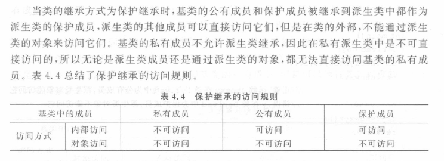

### 2.3派生类构造和析构函数

创建对象：先执行基类构造函数，再执行派生类的构造函数；

销毁对象：先执行派生类的析构函数，再执行基类的析构函数。

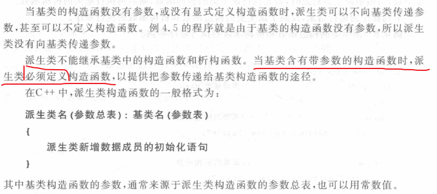

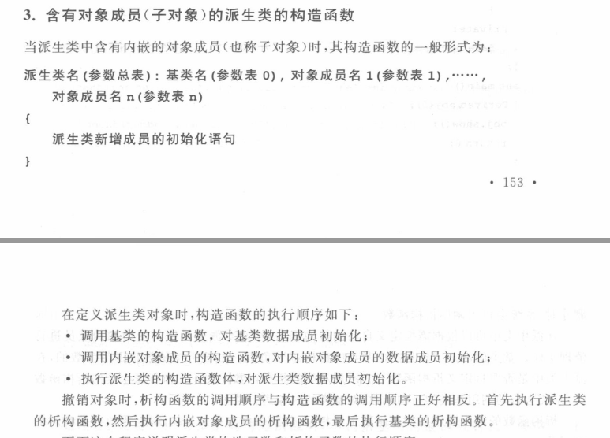

### 3多重继承

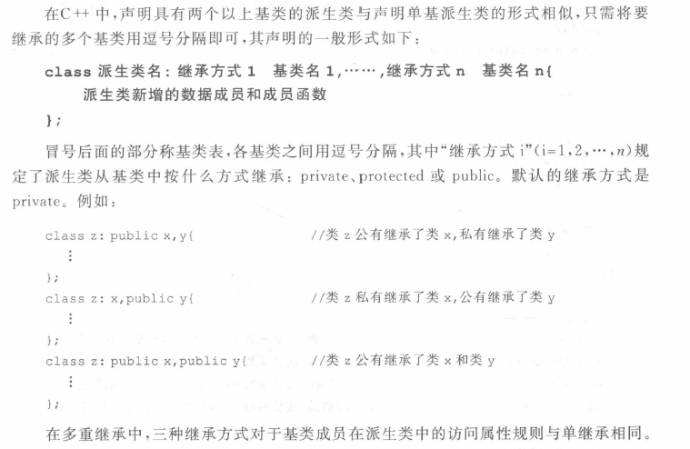

**多重继承的构造函数**

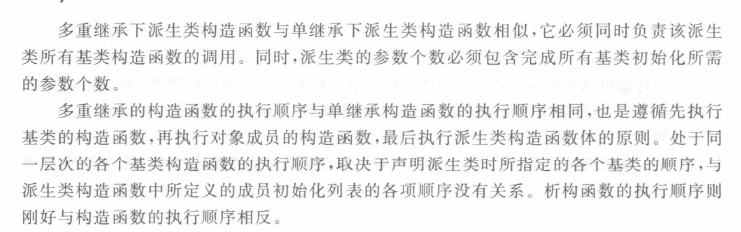