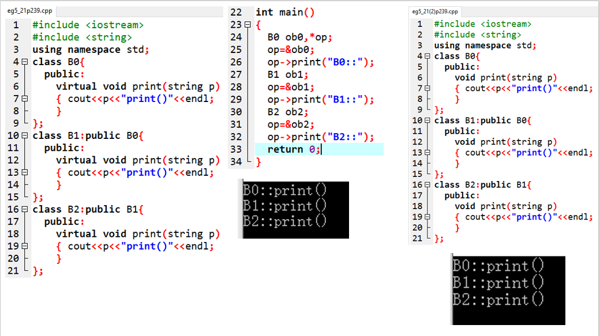

## 1.虚函数

参考文章：https://www.jianshu.com/p/d07e0ac0ba3c?from=singlemessage

在基类中，虚函数被virtual关键字修饰，并在派生类中重新被定义。

作用：允许在派生类中重新定义与基类同名的函数，并且可以通过基类指针或引用来访问基类和派生类的同名函数。

虚函数与Java中的覆盖同属于运行（动态）多态。

<!--more-->

与Java中的覆盖类似，在派生类重新定义时，函数原型（函数类型、函数名、参数个数和类型顺序），都必须与基类中的原型完全相同。

当一个成员函数被定义为虚函数之后，其派生类中符合虚函数特点的同名函数会自动成为虚函数，所以在派生类中重新定义虚函数时，virtual可以写或不写，但为了阅读方便，最好每一层都加上。

```C++
#include<iostream>
using namespace std;
// 基类 Father
class Father {
public:
    virtual void display() {
        cout<<"Father::display()\n";
    }

    // 在函数中调用了，子类覆盖基类的函数display()
    void fatherShowDisplay() {
        display();
    }
};

// 子类Son
class Son:public Father {
public:
    // 重写基类中的display()函数
    void display() {
        cout<<"Son::display()\n";
    }
};

int main() {
    Son son;                    // 子类对象
    son.fatherShowDisplay();    // 通过基类中未被覆盖的函数，想调用子类中覆盖的display函数
}
```

与Java类似，如果父类中有m1，m2两个方法。子类覆盖了m2方法。那么如果调用m1，则m1中调用的m2会是子类中定义的m2。

虚函数必须是成员函数，且不能是友元函数或静态函数，因为它的调用依赖特定的对象来决定。

**通过对象名和点运算调用是静态联编，只有通过基类指针的方式才是运行多态。**


对比上面两张图，一个定义虚函数，一个没有，很容易就理解虚函数的作用。

下图也是，左边定义了虚函数，右边没有定义。




## 2.虚析构函数


```C++
#include <iostream>
#include <cstdio>
using namespace std;
class B{
    public:
    ~B(){
        cout << "call ~B()\n";
    }
};
class D:public B{
    public:
    ~D(){
        cout << "call ~D()\n";
    }
};
int main(){
    D obj;
    /*call ~D()
	call ~B()*/
    return 0;
}
```

先调用派生类的析构函数，再调用基类的析构函数。

```C++
#include <iostream>
#include <cstdio>
using namespace std;
class B{
    public:
    ~B(){
        cout << "call ~B()\n";
    }
};
class D:public B{
    public:
    ~D(){
        cout << "call ~D()\n";
    }
};
int main(){
    B* p;
    p = new D; // 基类指针p指向无名派生类对象
    delete p; // 撤销无名对象，释放动态空间
    //call ~B()
    return 0;
}
```


```C++
#include <iostream>
#include <cstdio>
using namespace std;
class B{
    public:
    virtual ~B(){
        cout << "call ~B()\n";
    }
};
class D:public B{
    public:
    ~D(){
        cout << "call ~D()\n";
    }
};
int main(){
    B* p;
    p = new D; // 基类指针p指向无名派生类对象
    delete p; // 撤销无名对象，释放动态空间
    /*call ~B()
    call ~D()*/
    // 通过虚析构函数实现了动态多态
    return 0;
}
```


## 3.虚函数与重载函数的关系


## 4.虚函数与多重继承


