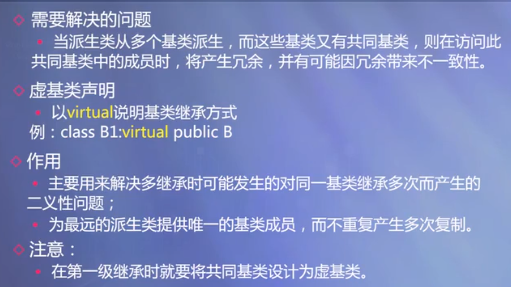
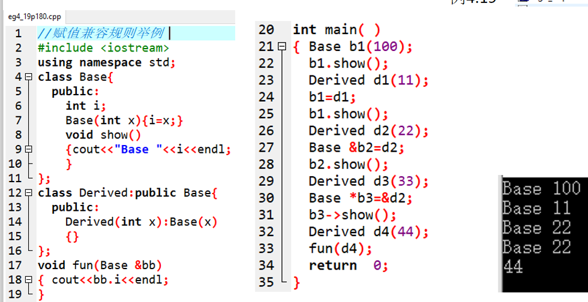
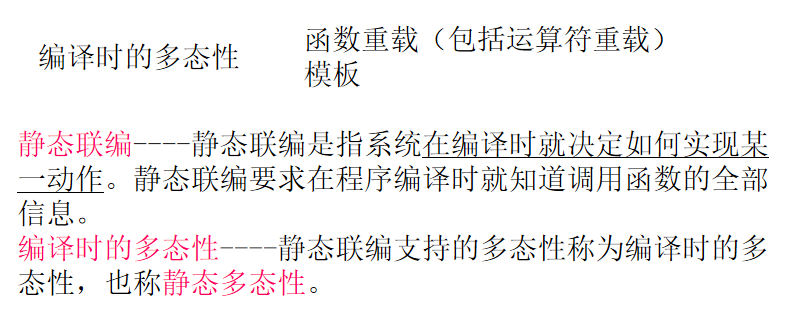
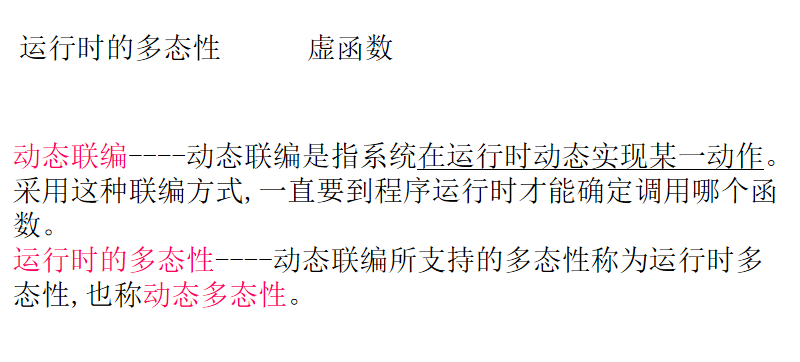
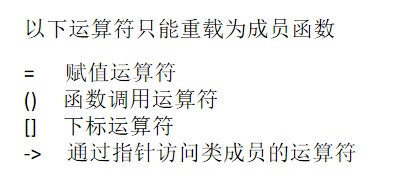
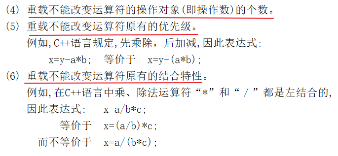
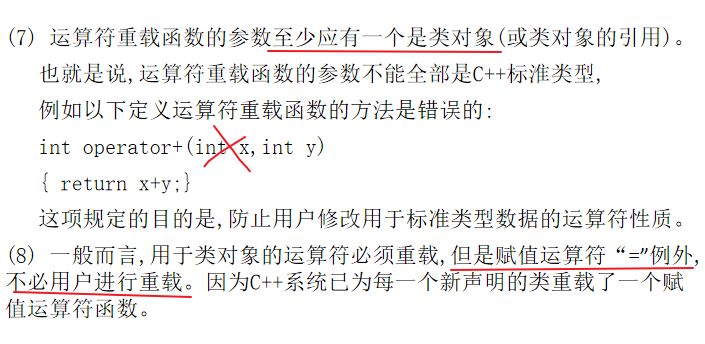

## 1.虚基类

在多条继承路径上有一个公共的基类,在这些路径中的某几条汇合处，这个公共的基类就会产生多个实例(或多个副本)，若只想保存这个基类的一个实例，**可以将这个公共基类说明为虚基类**。

<!--more-->



```c++
#include <iostream>
using namespace std;
class Base0{
    public:
        Base0(int var):var0(var){}
        int var0;
        void fun0(){
            cout << "Member of Base0" << endl;
        }
};

class Base1:virtual public Base0{
    public:
        Base1(int var):Base0(var){}
        int var1;
};

class Base2:virtual public Base0{
    public:
        Base2(int var):Base0(var){}
        int var2;
};

class Derived:public Base1,public Base2{
    public:
        // 需要给最远的基类Base0传参
        Derived(int var):Base0(var),Base1(var),Base2(var){}
        int var;
        void fun(){
            cout << "Member of Derived" << endl;
        }
};
int main(){
    Derived d(1);
    d.var0 = 2; // 直接访问虚基类的数据成员
    d.fun0(); // 直接访问虚基类的函数成员
    return 0;
}
```

建立对象时，由最远的派生类的构造函数调用虚基类的构造函数进行初始化。该派生类的其他基类对虚基类的构造函数的调用都自动忽略。

构造函数调用顺序

- 先调用虚基类的构造函数，再调用非虚基类的构造函数，最后调用派生类的构造函数

- 对于多个虚基类或非虚基类，先左后右，自上而下

## 2.基类与派生类对象之间的赋值兼容关系

**在需要基类对象的任何地方，都可以使用公有派生类的对象来替代。**

1. 派生类的对象可以隐含（自动）转换为基类对象
2. 派生类的对象可以初始化基类的引用
3. 派生类的指针可以隐含转换为基类的指针
4. 若函数的形参是基类对象或基类对象的引用，在调用函数时可以用派生类对象作为实参

在替代之后，派生类对象就可以作为基类对象使用，但只能使用从基类继承的成员。



## 3.多态性

### 3.1多态的分类

C++里的多态包括了静态多态和动态多态。





### 3.2运算符重载（重要）

运算符重载通过创建<u>运算符重载函数</u>来实现，包括：类外的普通函数、类的成员函数和友元函数。

重载的运算符是带有特殊名称的函数，函数名是由关键字 operator 和其后要重载的运算符符号构成的。与其他函数一样，重载运算符有一个返回类型和一个参数列表。

```C++
Box operator+(const Box&);
```

声明加法运算符用于把两个 Box 对象相加，返回最终的 Box 对象。大多数的重载运算符可被定义为普通的非成员函数或者被定义为类成员函数。如果我们定义上面的函数为类的非成员函数，那么我们需要为每次操作传递两个参数，如下所示：

```C++
Box operator+(const Box&, const Box&);
```

```C++
// 作为类成员函数的运算符重载函数
// 重载 + 运算符，用于把两个 Box 对象相加
Box operator+(const Box& b)
{
    Box box;
    box.length = this->length + b.length;
    box.breadth = this->breadth + b.breadth;
    box.height = this->height + b.height;
    return box;
}

// 把两个对象相加，得到 Box3
Box3 = Box1 + Box2;
```

#### 可重载运算符/不可重载运算符

下面是可重载的运算符列表：

| 双目算术运算符 | + (加)，-(减)，*(乘)，/(除)，% (取模)                        |
| -------------- | ------------------------------------------------------------ |
| 关系运算符     | ==(等于)，!= (不等于)，< (小于)，> (大于)，<=(小于等于)，>=(大于等于) |
| 逻辑运算符     | \|\|(逻辑或)，&&(逻辑与)，!(逻辑非)                          |
| 单目运算符     | + (正)，-(负)，*(指针)，&(取地址)                            |
| 自增自减运算符 | ++(自增)，--(自减)                                           |
| 位运算符       | \| (按位或)，& (按位与)，~(按位取反)，^(按位异或),，<< (左移)，>>(右移) |
| 赋值运算符     | =, +=, -=, *=, /= , % = , &=, \|=, ^=, <<=, >>=              |
| 空间申请与释放 | new, delete, new[ ] , delete[]                               |
| 其他运算符     | `()`(函数调用)，`->`(成员访问)，`,`(逗号)，`[]`(下标)        |

下面是不可重载的运算符列表：

- `.`：成员访问运算符
- `.*`,` ->*`：成员指针访问运算符
- `::`：域运算符
- `sizeof`：长度运算符
- `?:`：条件运算符
- `#`： 预处理符号

补充：







对于++和--的重载：

前缀形式重载调用 Check operator ++ () ，后缀形式重载调用 operator ++ (int)。

后缀形式中的int形参不起任何作用，只是为了区分前置和后置++或--。

```C++
// 重载前缀递增运算符（ ++ ）
Time operator++ ()  
{
    ++minutes;          // 对象加 1
    if(minutes >= 60)  
    {
        ++hours;
        minutes -= 60;
    }
    return Time(hours, minutes);
}
// 重载后缀递增运算符（ ++ ）
Time operator++( int )         
{
    // 保存原始值
    Time T(hours, minutes);
    // 对象加 1
    ++minutes;                    
    if(minutes >= 60)
    {
        ++hours;
        minutes -= 60;
    }
    // 返回旧的原始值
    return T; 
}
```

