## 1.异常处理

C++处理异常的机制由：检查、抛出和捕获组成，与其他语言类似。

分别由3种语句完成：try、throw、和catch。

<!--more-->

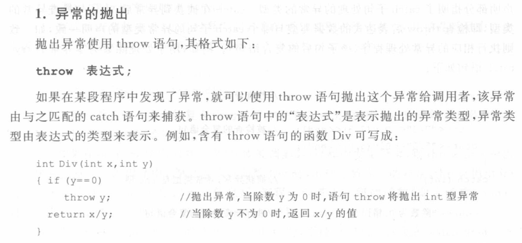

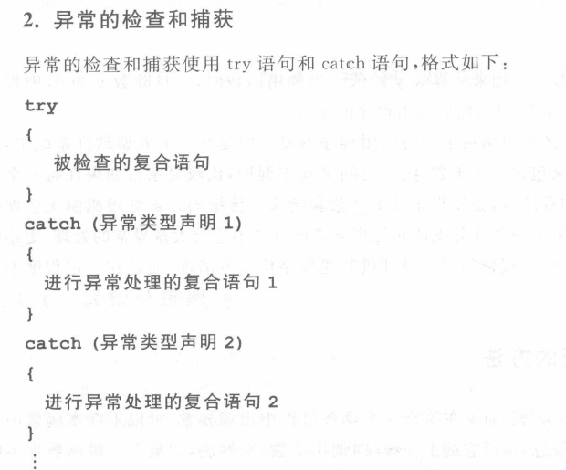

异常处理的例子：

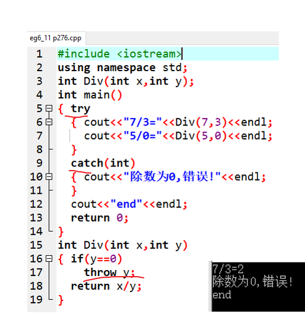 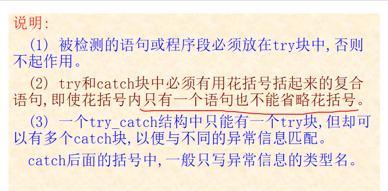

## 2.C++为什么要建立自己的I/O系统

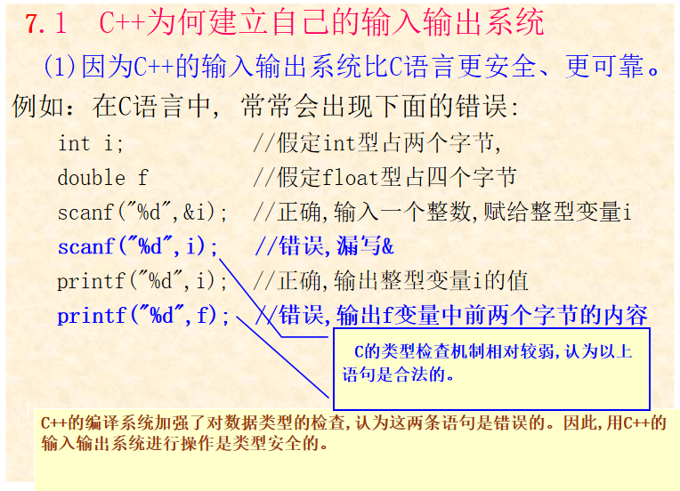

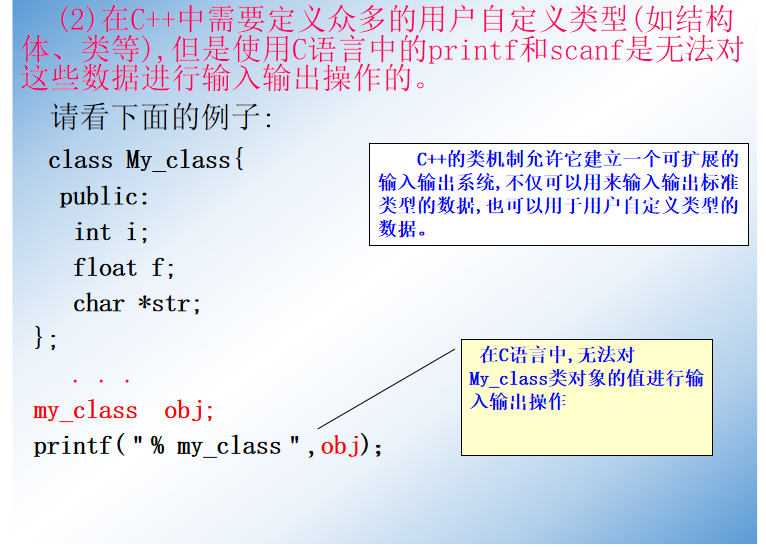

## 3.C++的输入输出流

在C++中,**“流”指的是数据从一个源流到一个目的的抽象**,它负责在数据的生产者(源)和数据的消费者(目的)

之间建立联系,并管理数据的流动。

从流中提取数据称为输入操作；向流中添加数据称为输出操作。

C++编译系统带有一个**I/O流类库**。在I/O流类库中包含许多用于输入输出的类,称为流类。用流类定义的对象称

为**流对象**。

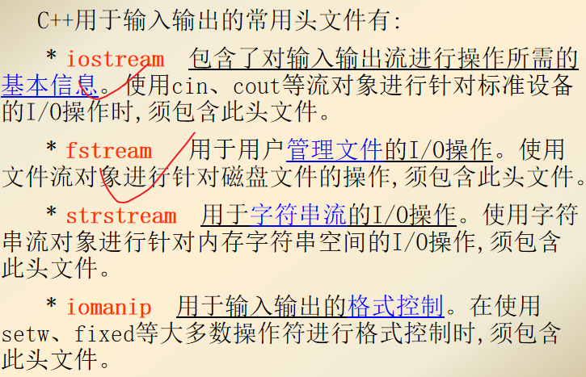

I/O流类库中包含了许多用于输入输出操作的类,

 ios是抽象基类,输入流类istream和输出流类ostream是通过单继承从基类ios派生而来的,

输入输出流类iostream是通过多继承从类istream和ostream派生而来的。

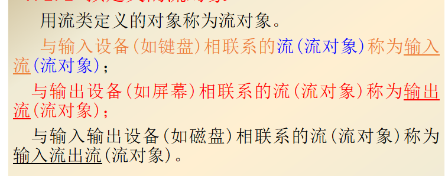

- 标准输入流 (流对象) cin
- 标准输出流(流对象) cout
- 非缓冲型的标准出错流 (流对象) cerr（简单了解）
- 缓冲型的标准出错流 (流对象) clog（简单了解）

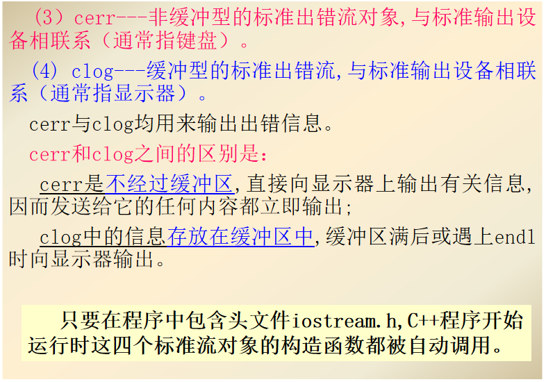

## 4.输入输出流的成员函数

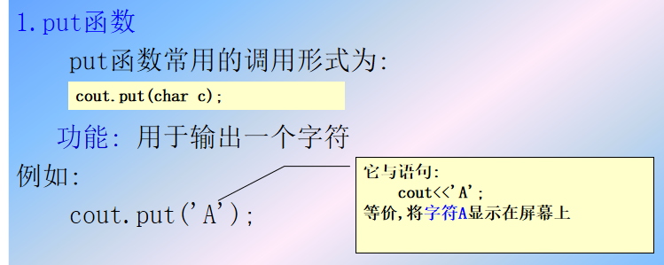

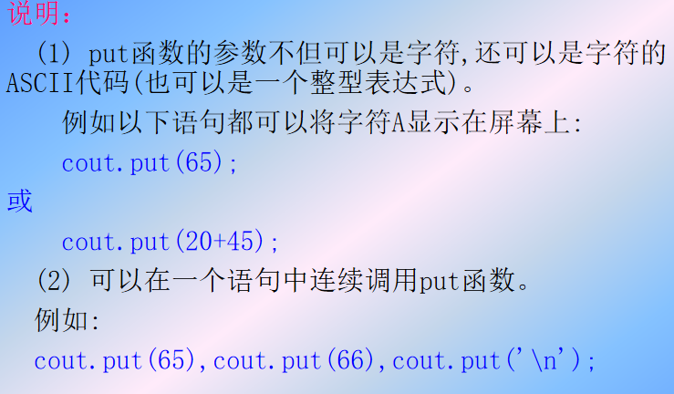

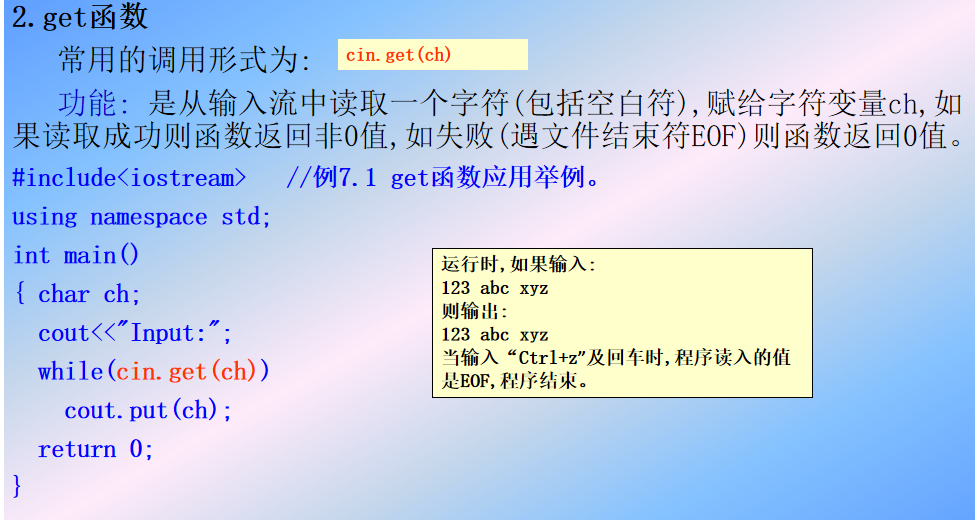

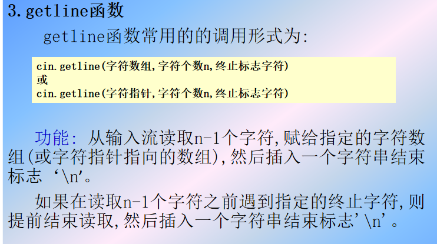

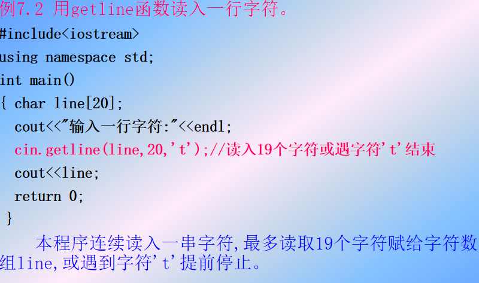

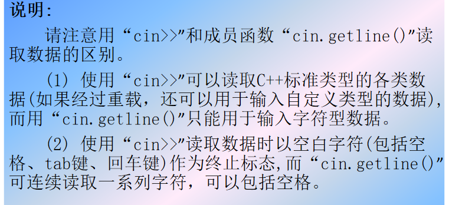

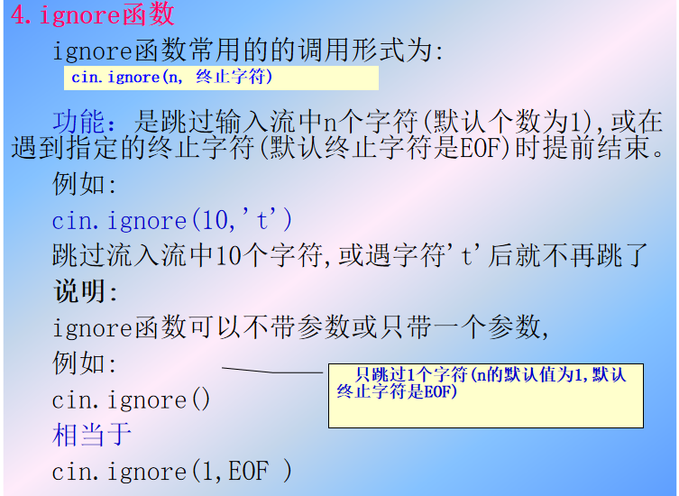

