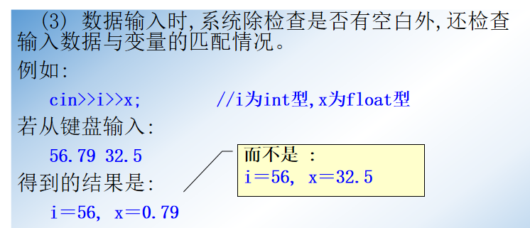

## 1.输入输出运算符的实现原理

**对输入输出运算符的重载是关键知识点。**

<!--more-->




## 2.预定义的操纵符输入输出格式控制

除了操纵符，还有**流成员函数**可以控制输入输出格式，这里就不说了。

有关C++输入输出的完整内容可以参考[菜鸟教程](https://www.runoob.com/cplusplus/cpp-basic-input-output.html)。


## 3.自定义操纵符输入输出格式控制


```C++
// 输入流操纵符函数
#include <iostream>
using namespace std;

istream& input(istream& in){
    in >> hex;
    cout << "Enter number using hex format:";
    return in;
}
int main(){
    int i;
    cin >> input >> i;
    cout << "hex:" << hex << i << "-----dec:" << dec << i << endl;
    return 0;
}
/*Enter number using hex format:23ae
hex:23ae-----dec:9134*/
```

## 4.重载输入输出运算符

注意：

**重载输入输出运算符不能是所操作类的成员函数，但可以是该类的友元函数或普通函数。**

```C++
// 重载插入运算符
#include <iostream>
using namespace std;

class Coord{
    public:
    Coord(int i = 0,int j = 0){
        x = i,y = j;
    }
    friend ostream& operator<< (ostream& stream,Coord& ob);
    private:
    int x,y;
};
ostream& operator<< (ostream& stream,Coord& ob){
    stream << ob.x << "," << ob.y << endl;
    return stream;
}
int main(){
    Coord a(55,56),b(100,200);
    cout << a << b;
    return 0;
}
```


```C++
// // 重载插入与提取运算符
#include <iostream>
using namespace std;

class Three_d{
    public:
    Three_d(int a,int b,int c){
        x = a,y = b,z = c;
    }
    friend ostream& operator<< (ostream& output,Three_d ob);
    friend istream& operator>> (istream& input,Three_d& ob);
    private:
    int x,y,z;
};
ostream& operator<< (ostream& output,Three_d ob){
    output << ob.x << ",";
    output << ob.y << ",";
    output << ob.z << endl;
    return output;
}
istream& operator>> (istream& input,Three_d& ob){
    cout << "Enter x,y,z value:";
    input >> ob.x;
    input >> ob.y;
    input >> ob.z;
    return input;
}
int main(){
    Three_d obj(10,20,30);
    cout << obj;
    cin >> obj;
    cout << obj;
    return 0;
}
```

## 5.文件的输入输出

文件的两种形式：


为什么文本形式会多一个字节？

因为要做一些转码处理，换行转为回车换行。


文件的关闭：`out.close();`

```C++
#include <iostream>
#include <fstream>
using namespace std;
int main(){
    // 写文件与读文件
    ofstream fout("f2.txt");// 不存在会新建
    if (!fout){ // 文件打开失败时fout返回0
        cout << "Cannot open output file\n";
        return 1;
    }
    fout << 10 << " "<<hex<<100<<endl;
    fout.close();
    ifstream fin("f2.txt");
    if (!fin){ // 文件打开失败时fin返回0
        cout << "Cannot open input file\n";
        return 1;
    }
    char str[80];
    while (fin){
        fin.getline(str,80);// 读入信息赋值给str
        cout << str << endl;
    }
    fin.close();
    return 0;
}
/* 输出：
10 64\n*/
```

提一点，C++的多行注释最好写成`/**/`，而不要写成`//`。在某种情况下，注释会与“/”产生一些奇怪的BUG。

## 6.命名空间

也就是namespace。


## 7.补充

C++入门笔记系列就到这结束了！

大佬两万字总结《C++ Primer》要点：https://mp.weixin.qq.com/s/05IdvsA3NtOJwheu1ljqSQ