## 1.什么是模板

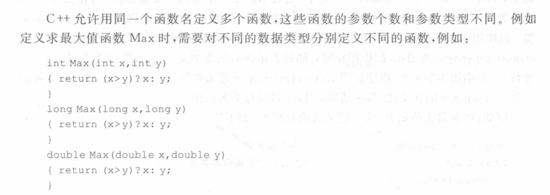

<!--more-->

为什么要使用模板？

因为使用重载还是有重复代码，使用模板可以写一个通用的函数适用多种不同的数据类型。

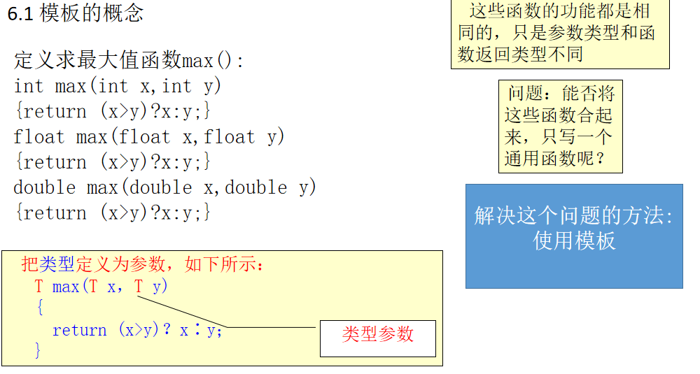

## 2.函数模板与模板函数

**函数模板**就是建立一个通用函数，其函数返回类型和形参类型不具体指定，用一个虚拟类型来代表。

在调用函数时系统会根据实参的类型（模板实参）来取代模板中的虚拟类型从而实现不同的函数功能。

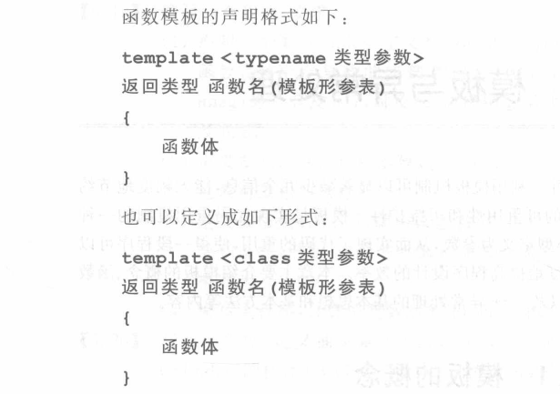

使用函数模板时必须将类型参数实例化，类型参数前要加上关键字typename或者class，推荐加上typename，class容易与类搞混。

**typename后面的类型参数必须实例化。**

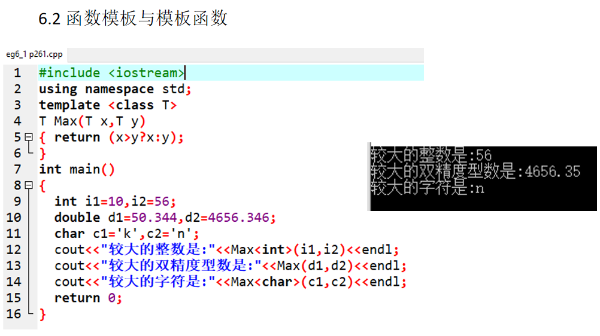

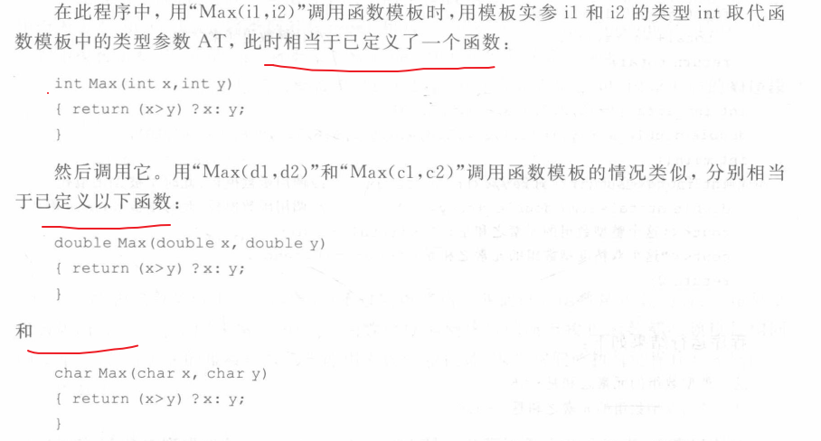

**实际上函数模板提供了一类函数的抽象，它经过实例化而生成的具体函数成为模板函数。**

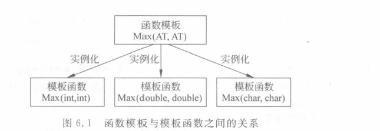

定义两种类型参数的函数模板：

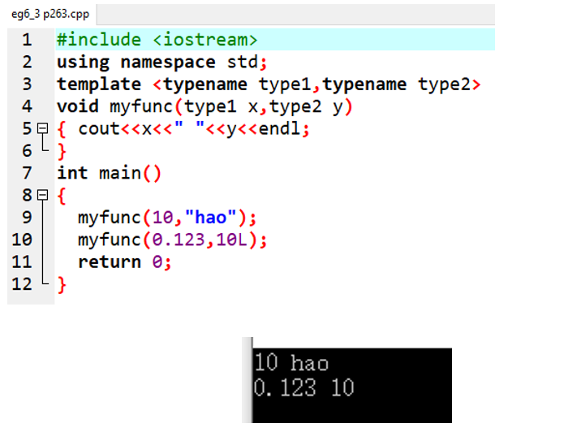

注意点：

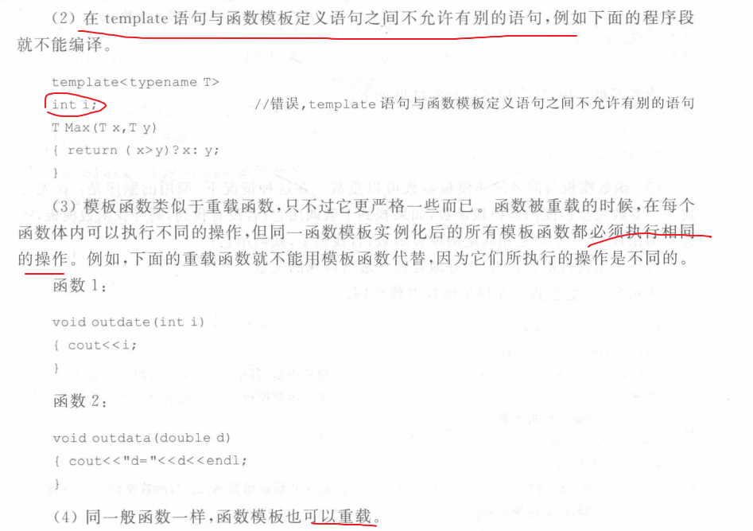

重载的函数模板例子：

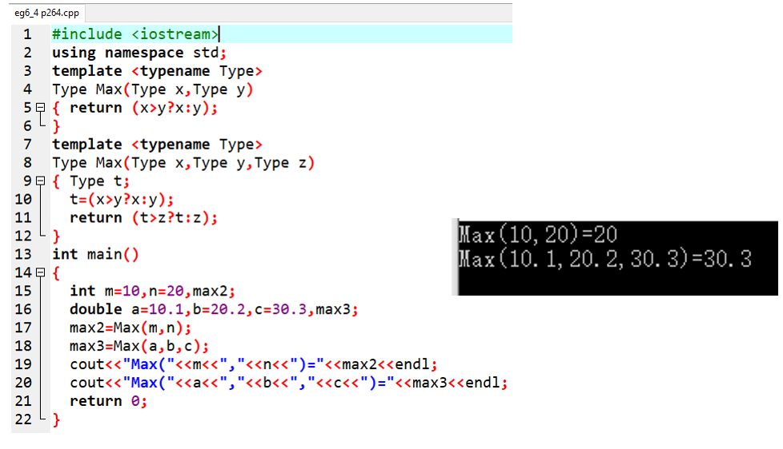

函数模板与同名的非模板函数也能重载。

这时的调用顺序是：先寻找一个参数完全匹配的非模板函数，找到了就调用它，否则寻找一个匹配的函数模板，实例化产生模板函数，调用它。

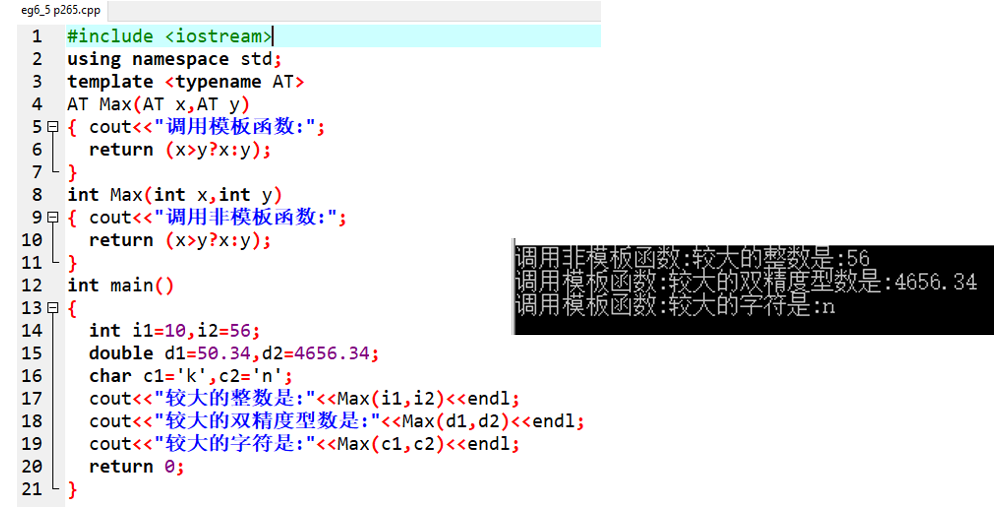

## 3.类模板与模板类

**类模板**就是建立一个通用类，其数据成员、成员函数的返回类型和形参类型不具体指定，用一个虚拟类型来代表。使用类模板定义对象时，系统会根据实参的类型来取代模板中的虚拟类型从而实现了不同类的功能。

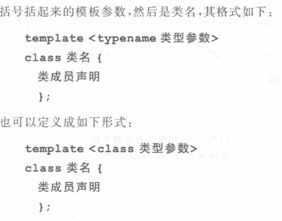

还是建议使用typename关键字。

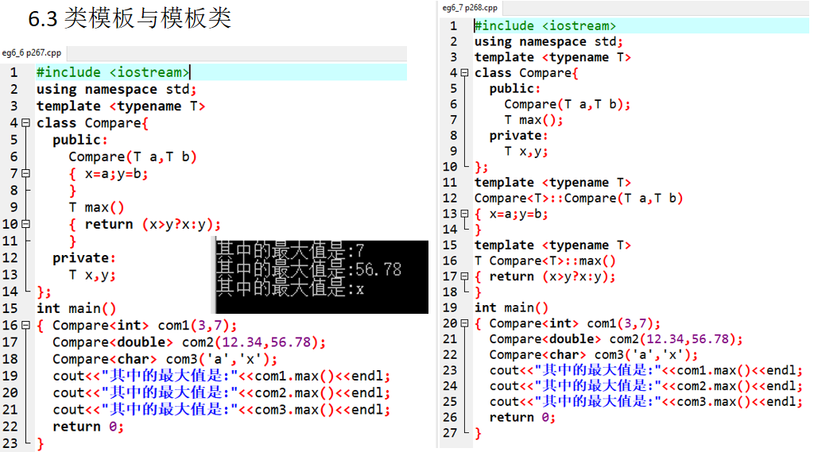

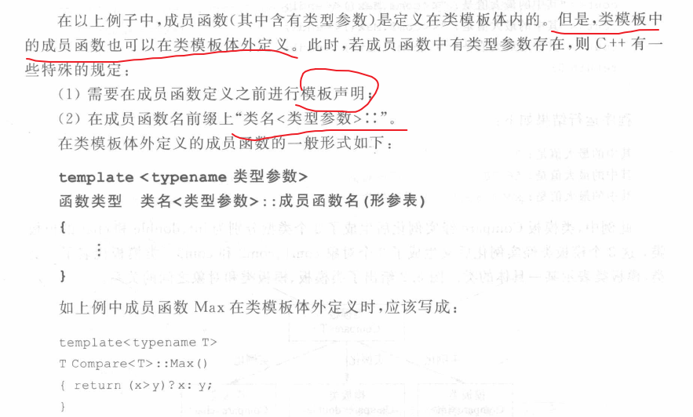

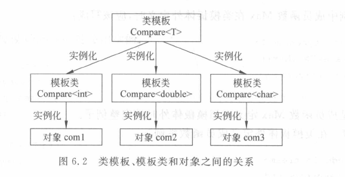

用数组实现的栈的例子：

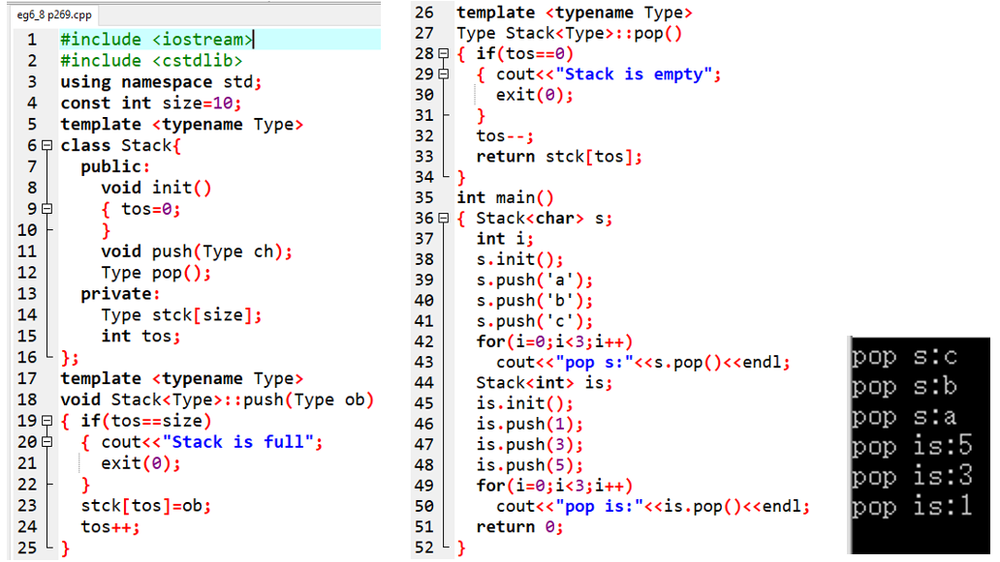

含有两个类型参数的模板类的例子：

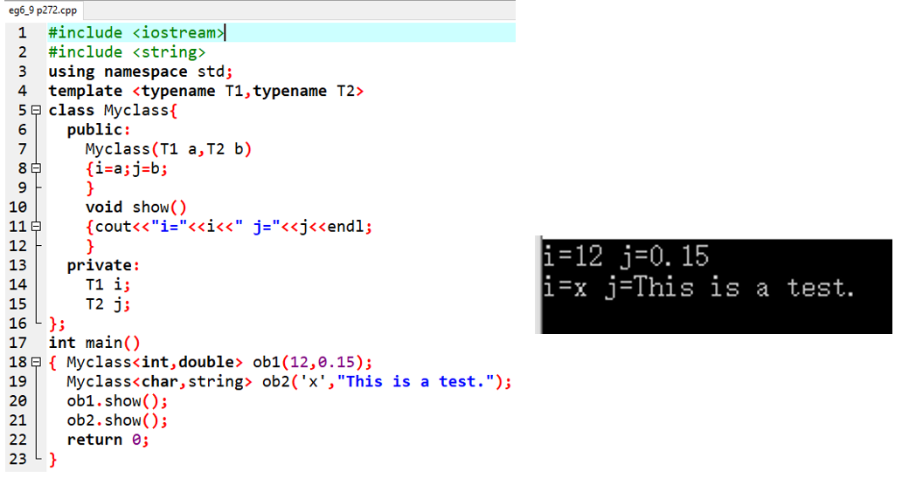