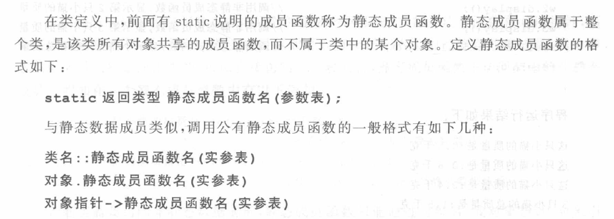
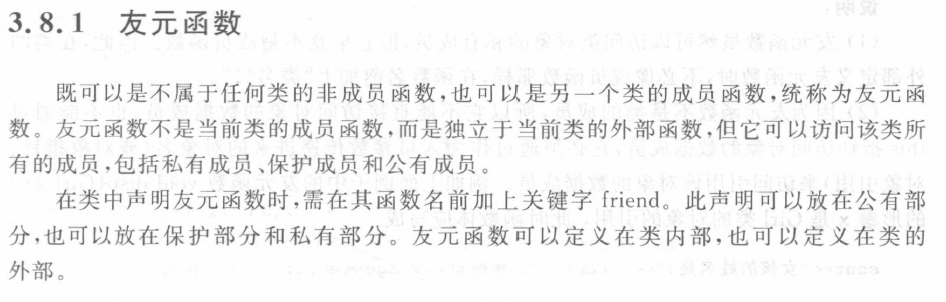

## 1.静态成员

### 1.1静态数据成员

在某些情况下，我们需要在类中使用作用类似全局变量的变量，这时会用到静态数据成员。

静态数据成员类似于Java中的类变量（静态变量），随类一起加载。

<!--more-->

OOP中有着”类属性“的概念。**也就是说，如果某个属性为整个类所共有，不属于任何一个具体的对象，则采用static关键字修饰。**

静态成员在每一个类只有一个副本，有该类的所有对象共同维护和使用，从而实现同一类不同对象的数据共享。

- 如何初始化静态数据成员？

它的初始化应在类外单独进行，而且应在定义对象之前。一般在main函数之前和定义对象之后初始化。

语法：`int Student::count = 0;` --> 数据类型   类名：：静态数据成员名   =   初始值；

- 如何访问静态数据成员？

1.类名：：静态数据成员名

2.对象名.静态数据成员名

3.对象指针->静态数据成员名

注意：私有静态数据成员不能在类外直接访问，必须通过公有的（静态）成员函数访问。

**示例**

```c++
class Student{
	public:
		Student(){
			cout << "请输入学生的学号、姓名、成绩：\n";
			cin >> id >> name >> score;
			stuNum ++;
			sumScore += score;
			averScore = sumScore/stuNum;
		}
		void showIfmation(){
			cout << id +" "+name << " " << score << endl;
		}
		static void showsumScore(){
			cout << stuNum<<"个学生的总分为:"<<sumScore << endl;
		}
		static void showaverScore(){
			cout << stuNum<<"个学生的平均为:"<<averScore << endl;
		}
		~Student(){
			stuNum--;
			sumScore -= score;
			averScore = sumScore/stuNum;
		}
	private:
		string name,id;
		double score; 
		static int stuNum;
		static double sumScore,averScore;
};
// 静态数据成员初始化 
int Student::stuNum = 0;
double Student::sumScore = 0.0;
double Student::averScore = 0.0;
int main()
{
	Student s1,s2,s3;
	cout << "学生信息为：\n";
	s1.showIfmation();
	s2.showIfmation();
	s3.showIfmation();
	Student::showsumScore();
	s1.showsumScore();// 两种访问静态数据成员方式
	Student::showaverScore();
	s3.showaverScore();
	return 0;
}
```

### 1.2静态成员函数



**示例**

```c++
#include <cstdio>
#include <iostream>
using namespace std;
class Cat{
	public:
		Cat(double w);
		void display();
		static void total_disp();
	private:
		double weight;
		static double total_weight;
		static double total_number;
};
Cat::Cat(double w){
	weight = w;
	total_weight += w;
	total_number ++;
}
void Cat::display(){ // 定义静态成员函数不需要加上static
	cout << "This cat's weight is:" << weight << endl;
}
void Cat::total_disp(){
	cout << "total_number is:"<<total_number<<endl;
	cout << "total_weight is:"<<total_weight<<endl;
}
double Cat::total_weight = 0; // 静态数据成员初始化
double Cat::total_number = 0;
int main()
{
	Cat w1(0.5),w2(0.6);
	w1.display();
	w2.display();
	Cat::total_disp();
	return 0;
}
```

**补充说明**

1. 一般情形，用于访问静态数据成员；
2. 私有静态成员函数不能做类外的函数和对象访问；
3. 使用静态成员函数的一个原因是，可以用在建立对象之前调用它，已处理静态数据成员；
4. 编译系统将静态成员函数限定为内部链接，与其他文件中的同名函数不会冲突；
5. 静态成员函数与非静态成员函数的重要区别：前者没有this指针，而后者有this指针。

## 2友元函数

类的主要特点之一就是隐藏和封装。C++中的友元为数据隐藏这堵不透明的墙开了一个小洞，也就是一扇通向私有（保护）成员的后门。



友元函数不是当前类的成员函数，但它可以访问该类所有成员。

**示例**

```c++
class Girl{
	public:
		Girl(string n,int d):
		name(n),age(d){}
		friend void disp(Girl&);// 声明友元函数
	private:
		string name;
		int age;
};
void disp(Girl& x){
	cout << "girl's name is:" << x.name << ",age is:" << x.age << endl;
}
int main()
{
	Girl g("xiaoli",18);
	disp(g);
	return 0;
}
```

**补充说明**

1. 在类的外部定义友元函数时，不必像成员函数那样加上`类名::`；
2. 友元函数不是类的成员，**不能直接访问对象的数据成员**，也不能通过this指针访问，它必须通过作为入口参数传递进来的对象名（或对象指针、引用）来访问该对象的数据成员；

## 3类的组合

```c++
class Score{
	public:
		Score(double c = 0,double m = 0,double e = 0);
		void show();
	private:
		double chinese,math,english;
};
Score::Score(double c,double m,double e):
	chinese(c),math(m),english(e){
	}
void Score::show(){
	cout << "chinese:"<<chinese << " ";
	cout << "math:"<<math << " ";
	cout << "english:"<<english<<endl;
}

class Student{
	public:
		Student(string n,string i,double a,double b,double c);
		void show();
	private:
		string name,id;
		Score s;
};
Student::Student(string n,string i,double a,double b,double c):
	name(n),id(i),s(a,b,c){ // 注意这里的初始化列表
	}
void Student::show(){
	cout << "name:" << name << " ";
	cout << "id:" << id << " ";
	s.show();
}
int main()
{
	Student s1("小明","1001",97,78,81);
	s1.show();
	return 0;
}
```

调用构造函数时：先对内部嵌套对象按照声明顺序调用，最后调用类的构造函数；

调用析构函数时：与构造函数顺序相反。