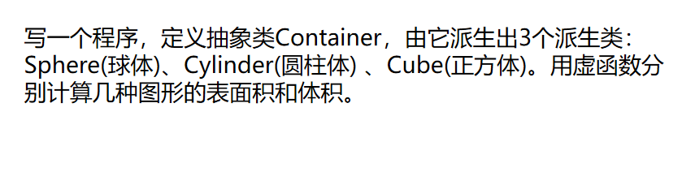
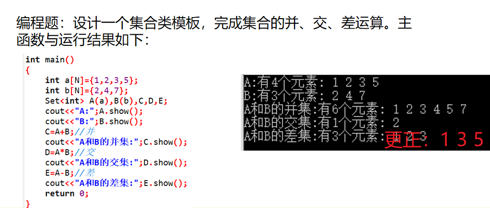

## 1.抽象类的应用



<!--more-->

C++程序如下：

```C++
#include <iostream>
#define _USE_MATH_DEFINES // 使用M_PI 
#include <cmath>
using namespace std;
class Container{
	public:
		virtual calcSurface() = 0;
		virtual calcVolume() = 0;	
}; 
class Sphere{
	public:
		Sphere(double _r):r(_r){}
		virtual double calcSurface(){
			return 4*M_PI*r*r;
		}
		virtual double calcVolume(){
			return 4*r*r*r*M_PI/3;
		}
	private:
		double r;
};
class Cylinder{
	public:
		Cylinder(int _r,int _h):r(_r),h(_h){}
		virtual double calcSurface(){
			return r*r*2*M_PI+2*M_PI*r*h;
		}
		virtual double calcVolume(){
			return r*r*M_PI*h;
		}
	private:
		double r;
		double h;
};
class Cube{
	public:
		Cube(double _a):a(_a){}
		virtual double calcSurface(){
			return 6*a*a;
		}
		virtual double calcVolume(){
			return a*a*a;
		}
	private:
		double a;
};
int main(){
	Sphere s(4.5);
	cout << "Surface:"<<s.calcSurface();
	cout << ", Volume:"<<s.calcVolume()<<endl;
	cout << "---------------------------------\n";
	Cylinder c1(4.3,1.2);
	cout << "Surface:"<<c1.calcSurface();
	cout << ", Volume:"<<c1.calcVolume()<<endl;
	cout << "---------------------------------\n";
	Cube c2(9.0);
	cout << "Surface:"<<c2.calcSurface();
	cout << ", Volume:"<<c2.calcVolume()<<endl;
	return 0;
}
```

## 2.模板类的应用



C++程序如下：

```C++
#include <cstdio>
#include <iostream>
#include <cstring>
using namespace std;
const int N = 15;

template<typename T>
class Set {
public:
    Set() {
        t[N] = {0};
        size = 0;
    }
    Set(T num[N]) {
        memcpy(t, num, sizeof(T) * N);
        size = 0;
        for (int i = 0; i < N; i++, size++) {
            if (t[i] == 0) break;
        }
    }
    void show() {
        printf("有%d个元素：", size);
        for (int i = 0; i < size; i++) cout << t[i] << ' ';
        puts("");
    }
    Set operator+(Set &s);
    Set operator-(Set &s);
    Set operator*(Set &s);

private:
    T t[N];
    int size;
};

template<typename T>
Set<T> Set<T>::operator+(Set<T> &s) {
    Set<T> temp;
    memcpy(temp.t, t, sizeof(T) * size);
    int k = size;
    for (int i = 0; i < s.size; i++) {
        bool flag = false;
        for (int j = 0; j < size; j++) {
            if (s.t[i] == temp.t[j]) {
                flag = true;
                break;
            }
        }
        if (flag == false) temp.t[k++] = s.t[i];
    }
    temp.size = k;
    return temp;
}

template<typename T>
Set<T> Set<T>::operator-(Set<T> &s) {
    Set<T> temp;
    int k = 0;
    for (int i = 0; i < size; i++) {
        bool flag = false;
        for (int j = 0; j < s.size; j++) {
            if (t[i] == s.t[j]) {
                flag = true;
                break;
            }
        }
        if (flag == false) temp.t[k++] = t[i];
    }
    temp.size = k;
    return temp;
}
template<typename T>
Set<T> Set<T>::operator*(Set<T> &s) {
    Set<T> temp;
    int k = 0;
    for (int i = 0; i < size; i++)
        for (int j = 0; j < s.size; j++) {
            if (t[i] == s.t[j]) temp.t[k++] = s.t[j];
        }
    temp.size = k;
    return temp;
}

int main() {
    int a[N] = {1, 2, 3, 5};
    int b[N] = {2, 4, 7};
    Set<int> A(a), B(b), C, D, E;
    cout << "A:";
    A.show();
    cout << "B:";
    B.show();
    C = A + B; // 并
    cout << "A和B的并集:";
    C.show();
    D = A * B; // 交
    cout << "A和B的交集:";
    D.show();
    E = A - B; // 差
    cout << "A和B的差集:";
    E.show();
    return 0;
}
```

