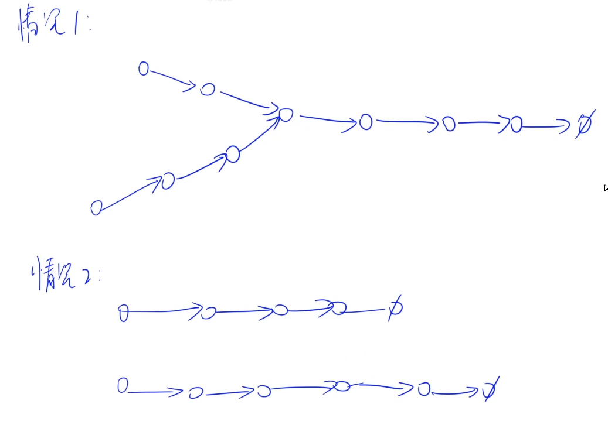
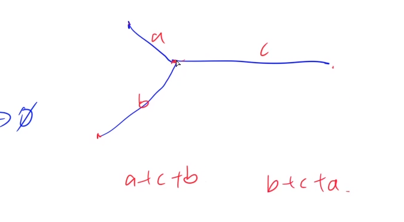

#### 1.acwing.66.两个链表的第一个公共结点

<u>这几道链表题大多来自《剑指offer》，都不太会啊！</u>

输入两个链表，找出它们的第一个公共结点。

当不存在公共结点时，返回空结点。

<!--more-->

样例

```
给出两个链表如下所示：
A：        a1 → a2
                   ↘
                     c1 → c2 → c3
                   ↗            
B:     b1 → b2 → b3

输出第一个公共结点c1
```







```C++
class Solution {
public:
    ListNode *findFirstCommonNode(ListNode *headA, ListNode *headB) {
        ListNode* p = headA;ListNode* q = headB;
        while (p != q) // 直到p，q走到公共结点或同时为空时跳出
        {
            if (p) p = p->next;
            else p = headB;
            if (q) q = q->next;
            else q = headA;
        }
        return p;
    }
};
```

#### 2.acwing.29.删除链表中的重复结点

在一个排序的链表中，存在重复的结点，请删除该链表中重复的结点，重复的结点不保留。

样例11

```
输入：1->2->3->3->4->4->5

输出：1->2->5
```

样例2

```
输入：1->1->1->2->3

输出：2->3
```

**算法：(线性扫描) O(n)**
为了方便处理边界情况，我们定义一个虚拟元素 dummy指向链表头节点。
然后从前往后扫描整个链表，每次扫描元素相同的一段，如果这段中的元素个数多于1个，则将整段元素直接删除。

**时间复杂度**
整个链表只扫描一遍，所以时间复杂度是 O(n)。

```C++
class Solution {
public:
    ListNode* deleteDuplication(ListNode* head) {
        ListNode* dummy = new ListNode(-1);// 定义虚拟头结点避免特判第一个结点被删除的情况
        dummy->next = head;
        ListNode* p = dummy;
        while (p->next)
        {
            auto q = p->next;
            while (q->next && p->next->val == q->next->val) q = q->next;
            if (p->next == q) p = q;
            else p->next = q->next;
        }
        return dummy->next;
    }
};
```

#### 3.C++ STL容器

STL是提高C++编写效率的一个利器。                                                                                                            ——yxc

最后两章要背的东西比较多！

##### 3.1 `#include <vector>`

vector是**变长数组，支持随机访问，不支持在任意位置O(1)插入**。为了保证效率，元素的增删一般应该在末尾进行。 

###### 3.1.1  声明

```C++
#include <vector>    头文件

       vector<int> a;       相当于一个长度动态变化的int数组

       vector<int> b[233];   相当于第一维长233，第二位长度动态变化的int数组

       struct rec{…};

       vector<rec> c;       自定义的结构体类型也可以保存在vector中
```

###### 3.1.2 size/empty

size函数返回vector的实际长度（包含的元素个数），empty函数返回一个bool类型，表明vector是否为空，为空返回true，否则返回false。二者的时间复杂度都是O(1)。

**所有的STL容器都支持这两个方法，含义也相同**，之后我们就不再重复给出。 

###### 3.1.3 clear

​       clear函数把vector清空。 

###### 3.1.4 迭代器(iterator)

​       **迭代器就像STL容器的“指针”**，可以用星号“*”操作符解除引用。

​       一个保存int的vector的迭代器声明方法为：

​       `vector<int>::iterator it;`

vector的迭代器是“随机访问迭代器”，可以把vector的迭代器与一个整数相加减，其行为和指针的移动类似。可以把vector的两个迭代器相减，其结果也和指针相减类似，得到两个迭代器对应下标之间的距离。 

###### 3.1.5 begin/end–[begin,end)

begin函数返回指向vector中第一个元素的迭代器。例如a是一个非空的vector，则`*a.begin()`与a[0]的作用相同。

**所有的容器都可以视作一个“前闭后开”的结构**，end函数返回vector的尾部，即第n个元素再往后的“边界”。`*a.end()`与a[n]都是越界访问，其中n=`a.size()`。

下面两份代码都遍历了`vector<int> a`，并输出它的所有元素。

```C++
for (int I = 0; I < a.size(); I ++) cout << a[i] << endl;

for (vector<int>::iterator it = a.begin(); it != a.end(); it ++) cout << *it << endl;
```

###### 3.1.6 front/back

​       front函数返回vector的第一个元素，等价于`*a.begin()` 和 a[0]。

​       back函数返回vector的最后一个元素，等价于`*==a.end()` 和 `a[a.size() – 1]`。 

###### 3.1.7  push_back() 和 pop_back()

`a.push_back(x)` 把元素x插入到vector a的尾部。

<u>在数组结尾插入时间复杂度是O(1)，在数组开头插入时间复杂度是O(n)。</u>

 `b.pop_back()` 删除vector a的最后一个元素。

###### 3.1.8 实例

```c++
#include <iostream>
#include <vector>
using namespace std;
int main()
{
    vector<int> a{{1,2,3}};
    cout << a.front() << ' ' << a[0] << ' ' << *a.begin() << endl;// 3种等价写法
    cout << a.back() << ' ' << a[a.size()-1] << endl; 
    // a.end()在最后一个元素之后的位置，索引会越界
    
    // 3种迭代vector的方法
    // solution 1
    for (int i = 0;i < a.size();i ++) cout << a[i] << ' ';
    cout << endl;
    // solution 2，迭代器用到较少，太麻烦，只是介绍语法
    for (vector<int>::iterator it = a.begin();it != a.end();it ++) cout << *it << ' ';
    // for (auto it = ...)简化
    cout << endl;
    // solution 3，常用
    for (int x : a) cout << x << ' ';
    cout << endl;
    
   	a.push_back(4);
    for (auto x:a) cout << x << ' ';
    cout << endl;// 1 2 3 4
    
    a.pop_back();
    for (auto x:a) cout << x << ' ';
    cout << endl;// 1 2 3
    return 0;
}
```

##### 3.2 `#include <queue> `

头文件queue主要包括循环队列queue和优先队列priority_queue两个容器。 

没有clear函数。

**先进先出(FIFO)，队头插入，队尾删除。**

优先队列：

- 定义大根堆时结构体要重载小于号<；
- 定义小根堆时结构体要重载大于号>；

###### 3.2.1 声明

```C++
queue<int> q;

       struct rec{…}; queue<rec> q;    //在优先队列中，结构体rec中必须定义小于号

       priority_queue<int> q;    // 大根堆，每次返回最大值

       priority_queue<int, vector<int>, greater<int>> q;   // 小根堆，每次返回最小值

       priority_queue<pair<int, int>> q;// pair是二元组
```

###### 3.2.2 循环队列 queue

​       push 从队尾插入

​       pop 从队头弹出

​       front 返回队头元素

​       back 返回队尾元素 

###### 3.2.3 优先队列 priority_queue

​       push 把元素插入堆

​       pop 删除堆顶元素

​       top 查询堆顶元素（最大值）

###### 3.2.4 实例

```C++
#include <iostream>
#include <vector>
#include <queue>
using namespace std;
int main()
{
    queue<int> a;
    a.push(1);// 从队尾插入
    a.push(2);
    a.push(3);
    a.pop();// 弹出队头元素1
    cout << a.front() << endl;// 返回队头2
    cout << a.back() << endl;// 返回队尾3
    a = queue<int>();// 重新初始化以清空队列
    // 因为队列，栈容器没有clear函数

    queue<double> q;
    priority_queue<int> b;// 大根堆
    b.push(2);
    b.push(4);
    b.push(8);
    cout << b.top() << endl;// 取最大值8
    b.pop();// 删除最大值，无返回值
    cout << b.top() << endl;// 4

    priority_queue<int,vector<int>,greater<int>> x;// 小根堆
    struct Rec
    {
        int a,b;
        bool operator< (const Rec& t) const
        {
            return a < t.a;// 没有重载"<"时插入元素会报错
        }
    };
    priority_queue<Rec> s;// 大根堆重载<
    s.push({1,2});

    struct Res
    {
        int a,b;
        bool operator> (const Res& t) const
        {
            return a > t.a;// 没有重载">"时插入元素会报错
        }
    };
    priority_queue<Res,vector<Res>,greater<Res>> n;// 小根堆重载>
    n.push({1,2});

    queue<Rec> v;
    v.push({1});
    return 0;
}
```

##### 3.3 `#include <stack>`

头文件stack包含栈。声明和前面的容器类似。

没有clear函数。

**先进后出(FILO)，栈顶插入，栈顶删除**

push 向栈顶插入

pop 弹出栈顶元素

top 取栈顶元素

```C++
#include <iostream>
#include <stack>
using namespace std;
int main()
{
    stack<int> stk;
    stk.push(1);
    stk.push(8);
    cout << stk.top() << endl;
    stk.pop();
    stk.push(12);
    cout << stk.top() << endl;
    return 0;
}
/* output
8
12*/
```

##### 3.4 `#include <deque>`

双端队列deque是一个支持在两端高效插入或删除元素的连续线性存储空间。它就像是vector和queue的结合。**与vector相比，deque在头部增删元素仅需要O(1)的时间；与queue相比，deque像数组一样支持随机访问。运行效率会比stack和vector慢。**

[] 随机访问

begin/end，返回deque的头/尾迭代器，**左闭右开**

front/back 队头/队尾元素

push_back 从队尾入队

push_front 从队头入队

pop_back 从队尾出队

pop_front 从队头出队

clear 清空队列

```C++
#include <iostream>
#include <deque>
using namespace std;
int main()
{
    deque<int> a;
    a.push_back(1),a.push_front(2);
    a.push_back(3);
    cout << *a.begin() << ' ' << *a.end() << endl;
    cout << a.front() << ' ' << a.back() << endl;
    cout << a[0] << ' ' << a[2] << endl;
    a.pop_back(),a.pop_front();
    a.clear();
    return 0;
}
/* output
2 17367376
2 3
2 3*/
```