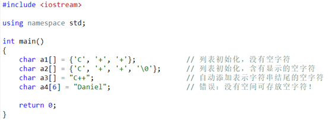
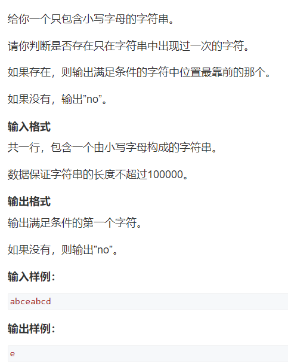
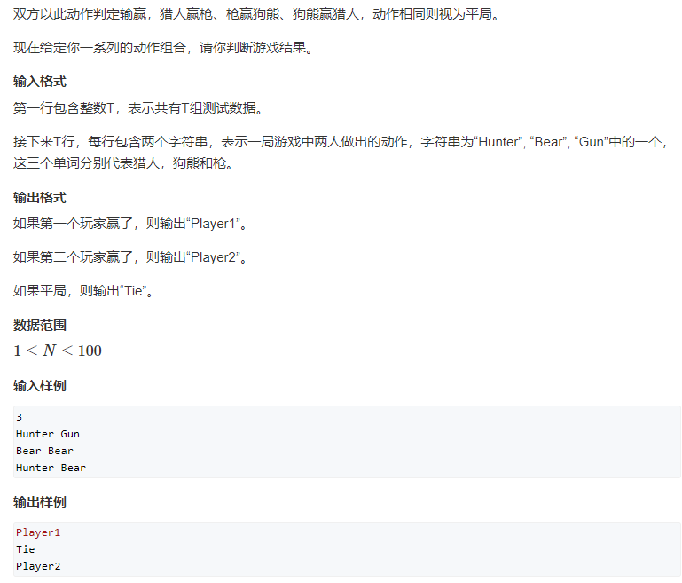

## 1.scanf()函数

**scanf()函数接收输入数据时，遇以下情况结束一个数据的输入：** 

① 遇空格、“回车”、“跳格”键。
        ② 遇宽度结束。
        ③ 遇非法输入。

**cin遇到空格或者回车也会结束读取！！！**

**scanf接收包含空格的字符串**

<!--more-->

```C++
#include <stdio.h> 
int main() 
{ 
    char str[80]; 
    scanf("%s",str); 
    printf("%s",str);
    return 0; 
}
```

输入：I love you!
        输出：I
        原因：scanf遇空格结束读取。

## 2.ASCII码

每个常用字符都对应一个-128~127的数字，二者之间可以相互转化。

| ASCII码 | 字符 |
| ------- | ---- |
| 48      | ‘0’  |
| 65      | ‘A’  |
| 97      | ‘a’  |

## 3.字符数组

### 3.1

字符串就是字符数组加上==结束符’\0’==。没有’\0’不算字符串，只是普通的字符数组。

可以使用字符串来初始化字符数组，但此时要注意，每个字符串结尾会暗含一个’\0’字符，因此字符数组的长度至少要比字符串的长度多1！



这里第二、三种初始化方式是等价的。

### 3.2

```C++
char s[100];
cin >> s + 1;
cout << s + 1 << endl;
cout << s[1] << endl;
// 输入：abc
/*
    输出：
    abc
    a 
*/
// 这样就可以让读取的字符串的数组从1开始
// 使用scanf函数有同样的效果,scanf("%s",s + 1)
```

### 3.3

#### 3.3.1

读入一行字符串（包括空格），可以使用gets函数，但由于它不安全，已经被淘汰。

#### 3.3.2

现在使用fgets函数

```c++
char s[100];
fgets(s,100,stdin);
```

原型  `char *  fgets(char * s, int n,FILE *stream);`

  参数：

​     s: 字符型指针，指向存储读入数据的缓冲区的地址。

​     n: 从流中读入n-1个字符

​     stream ： 指向读取的流。

  返回值：

1. ​     当n<=0 时返回NULL，即空指针。
2. ​     当n=1 时，返回空串””。
3. ​     如果读入成功，则返回缓冲区的地址。
4. ​     如果读入错误或遇到文件结尾(EOF)，则返回NULL。

#### 3.3.3

在用fgets(..)读入数据时，先定义一个字符数组或字符指针，如果定义了字符指针 ，那么一定要初始化。

​    example:

​       char s[100]; //可以。

​       char *s;  //不可以，因为只是声明了一个指针。但并没有为它分配内存缓冲区。

​       所以，如果要用指针，则  `char *s=(char*)malloc(100*sizeof(char));` 为其分配内存空间,c++中用`char *s=new char [100];`    如果未分配内存空间，编译时不会检查出问题，但运行时会出现未知错误。。

#### 3.3.4

fgets(…)读入文本行时的两种情况。

​     1.   如果n大于一行的字符串长度，那么当读到字符串末尾的换行符时，fgets(..)会返回。并且在s的最后插入字符串结束标志’\0’。 而s缓冲区剩余的位置不会再填充。

​      example：

​       123abc

​       fgets(s,10,fp);

​       此时，读入七个字符，123abc\n,实际上还有最后的’\0’,所以，strlen(s)=7; 如果要去除末尾的\n，s[strlen(s)-1]=’\0’;便可。

​     2.   如果n小于等于一行的字符串的长度，那么读入n-1个字符，此时并没有读入\n因为并没有到行尾 ，同样在最后会插入’\0’.

​     example:

​      123abc

​      char  s[5];

​      fgets(s,5,fp);

​      这时读入4个字符，123a,并没有换行符，所以strlen(s)=4.

### 3.4

用getline函数来读取字符串中的空格。（定义在头文件中）

getline 函数如下所示：

getline(cin, inputLine);

其中 cin 是正在读取的输入流，而 inputLine 是接收输入字符串的 string 变量的名称。

注意：第二个参数不能是字符数组，必须是string变量！！<u>它将继续读取，直到它读取至最大指定的字符数，或直到按下了回车键。</u>

```C++
string name;
string city;
cout << "Please enter your name: ";
getline(cin, name);
cout << "Enter the city you live in: ";
getline(cin, city);// 上一次用户输入的'\n'被去除了，没有读入city
cout << "Hello, " << name << endl;
cout << "You live in " << city << endl;

// 输出如下
Please enter your name: John Doe
Enter the city you live in: Chicago
Hello, John Doe
You live in Chicago
```

补充：getline()中读入结束的回车后，结束符不放入缓存区，会将读入的\n直接去除，下一个输入前，缓冲区为空，并不会因为回车留下\n。而cin的结束后，以及getchar()此类的读入结束后,按下回车或者使用空格读入下一个，此时按下的回车或空格会还在缓存区,继续用getline()就会出现前面所提到的情况。

scanf函数并不会清空缓冲区回车！！

```C++
// 用scanf过滤空格
char str[30],c;
scanf("%s",s);
scanf("\n%c",&c);
```

### 3.5

cin.getline函数。

与 getline 一样，cin.getline 允许读取包含空格的字符串。它将继续读取，直到它读取至最大指定的字符数，或直到按下了回车键。

```c++
char s[100];
cin.getline(s,100);// 最多读取99个字符，最后一个位置放'\0'
```

### 3.6

puts函数。（引入)

```c++
char name[] = "asaf";
printf("%s\n",name);
puts(name);// 两者是完全等价的
```

## 4.字符数组常用操作

下面几个函数需要引入头文件:

`#include <string.h>`  或者也可以

(1)  strlen(str)，求字符串的长度，注意：不包括最后的’\0’

```C++
// 自己实现代码
char s[100];
scanf("%s",s);
int len = 0;
for (int i = 0;s[i];i++) len++;// 用s[i]作为判断条件，因为'\0'代表停止
cout << len << endl;
```

(2)  strcmp(a, b)，比较两个字符串的大小，a < b 返回-1，a == b 返回0，a > b返回1。这里的比较方式是字典序！

(3)  strcpy(a, b)，将字符串b复制给从a开始的字符数组。

## 5.acwing772.只出现一次的字符



```c++
#include <iostream>
// 巧妙的做法
using namespace std;
int main()
{
    string str;cin >> str;
    int s[300] = {0};
    for (char &c : str) s[c]++;// 遍历string
    char p = -1;
    for (char &c: str)// 注意这里还是遍历str，不是s
        // 因为题目要求第一个出现的满足要求的字符
    {
        if (s[c] == 1) {p = c;break;}
    }
    if (p == -1) cout << "no";
    else
    {
        cout << p;
    }
    return 0;
}
```

## 6.acwing763.循环相克令



```c++
// 原解法，太过低效，直接暴力枚举
// y总题解
#include <cstdio>
#include <cstring>
#include <iostream>
using namespace std;// 这行代码最后紧跟着include
int get(string s)
{
    if (s == "Hunter") return 0;
    if (s == "Bear") return 1;
    else return 2;
}

int main()
{
    int n;cin >> n;
    while (n--)
    {
        string a,b;
        cin >> a >> b;
        int x = get(a),y = get(b);
        if (x == y) puts("Tie");
        else if ((y+1)%3 == x) puts("Player1");
        else puts("Player2");
    }
	return 0;
}

// 巧妙的解题思路，利用字母的长度之差，读题能力实在佩服
#include <iostream>

using namespace std;

int main()
{
    int n;
    cin >> n;

    string x, y;
    while (n --)
    {
        cin >> x >> y;
        int a = x.size(), b = y.size();
        if (a - b == -1 || a - b == -2 || a - b == 3)
            cout << "Player1" << endl;
        else if (a == b)
            cout << "Tie" << endl;
        else cout << "Player2" << endl;
    }

    return 0;
}

作者：黄
链接：https://www.acwing.com/solution/content/15253/
来源：AcWing
```

## 7.acwing765.字符串加空格

给定一个字符串，在字符串的每个字符之间都加一个空格。

输出修改后的新字符串。

输入格式
共一行，包含一个字符串。注意字符串中可能包含空格。

输出格式
输出增加空格后的字符串。

数据范围
1≤字符串长度≤100

样例
输入样例：
`test case`
输出样例：
`t e s t   c a s e`

```c++
// 遍历字符串的非常巧妙的做法
#include<iostream>
using namespace std;
int main()
{
    string a;
    getline(cin, a);
    for(char &c : a) cout << c << ' '; // 遍历字符串
}
```

## 8.acwing773.字符串插入

有两个不包含空白字符的字符串str和substr，str的字符个数不超过10，substr的字符个数为3（字符个数不包括字符串结尾处的’\0’。）

将substr插入到str中ASCII码最大的那个字符后面，若有多个最大则只考虑第一个。

输入格式

输入包括若干行，每一行为一组测试数据，格式为

str substr

 输出格式

对于每一组测试数据，输出插入之后的字符串。

输入样例：

```
abcab eee
12343 555
```

输出样例：

```
abceeeab
12345553
```

关于substr的说明：

0. 用途：一种构造string的方法

1. 形式：s.substr(pos, n)
2. 解释：返回一个string，包含s中从pos开始的n个字符的拷贝（pos的默认值是0，n的默认值是s.size() - pos，即不加参数会默认拷贝整个s）
   当只有一个数字pos表示从下标为pos开始一直到结尾
3. 补充：若pos的值超过了string的大小，则substr函数会抛出一个out_of_range异常；若pos+n的值超过了string的大小，则substr会调整n的值，只拷贝到string的末尾

```c++
 string s = "0123456789";
    cout << s.substr(0,3) << endl << s.substr(3) << endl;
	// 第一个参数代表下标，第二个参数代表长度（可以不加）
/*    输出如下
 012
3456789
*/
```

```c++
// 原解法TLE了，超时，写错了
// y总题解
#include <iostream>

using namespace std;

int main()
{
	string a,b;
	
	while (cin >> a >> b)
	{
		int p = 0;
        for (int i = 1;i < a.size();i++)
        {
            if (a[i] > a[p]) p = i;
        }
        cout << a.substr(0,p + 1) + b + a.substr(p + 1) << endl;
	}
	return 0;
}
// 题解2
#include <bits/stdc++.h>

using namespace std;

int main()
{
    char str[11], substr[4];

    int n = 2;
    while(scanf("%s %s", str, substr) != EOF){
        int cnt = str[0], res = 0;
        for(int i = 0; i < strlen(str); i++){
            if(str[i] > cnt) cnt = str[i], res = i;
            else if(str[i] == cnt) continue;
        }
        for(int i = 0; i <= res; i ++){
            cout<< str[i];
        }
        for(int i = 0; i < strlen(substr); i++){
            cout<< substr[i];
        }
        for(int i = res + 1; i < strlen(str); i++){
            cout<< str[i];
        }
        puts("");
    }
    return 0;
}

作者：zhiling
链接：https://www.acwing.com/solution/content/2913/
来源：AcWing
```