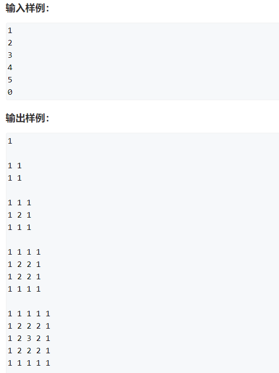

## 1.acwing725.完全数

一个整数，除了本身以外的其他所有约数的和如果等于该数，那么我们就称这个整数为完全数。

例如，6就是一个完全数，因为它的除了本身以外的其他约数的和为 1+2+3 = 6。

现在，给定你N个整数，请你依次判断这些数是否是完全数。

每个测试用例输出一个结果，每个结果占一行。

<!--more-->

```c++
// 注意这样时间复杂度太大，会超时
#include <cstdio>

using namespace std;

int main()
{
	int n;
	scanf("%d", &n);
	while (n--)
	{
		int x,sum = 0;
		scanf("%d", &x);
		for (int i = 1;i < x;i++)
		{
			if (x%i == 0) sum += i;
		}
		if (sum == x) printf("%d is perfect\n",x);
		else
		{
			printf("%d is not perfect\n",x);
		}
		
	}
	
	return 0;
}

// 优化版本
#include <cstdio>
using namespace std;
int main()
{
	int n;
	scanf("%d", &n);
	while (n--)
	{
		int x,sum = 0;
		scanf("%d", &x);
		for (int i = 1;i*i <= x;i++)// 减少循环次数
		{
			if (x%i == 0)
            {
                if (i < x) sum += i;
                if (i != x/i && x/i < x) sum += x/i; // 关键步骤
            }
		}
		if (sum == x) printf("%d is perfect\n",x);
		else
		{
			printf("%d is not perfect\n",x);
		}		
	}	
	return 0;
}
```

### 特别解法

有点数学基础的人都应该知道100000000内的完全数没有几个……

数学部分
100000000100000000内的完全数有6,28,496,8128,335503366,28,496,8128,33550336.所以说多背一点数字是很有用的

既然这道题可以直接O(1)O(1)解决,我们不妨来说一下完全数的各种性质以备于各种毒瘤的算法竞赛.

完全数比较重要的几个性质
(也是我只知道的几个性质)

所有完全数都是三角形数
目前截止发现的所有完全数都以66或2828结尾
到现在为止,数学家们一共发现了4848个完全数,且4848个完全数全部是偶数
如果有人们没有找到的奇完全数,则它一定可以写成12p+112p+1或36p+936p+9的形式,而且pp是素数
奇完全数一定大于1030010300
完全数的约数的倒数之和为调和数
完全数可以表示成连续奇数的立方和
完全数可以表示成22的连续自然数的次幂之和,且这些自然数的数量必定是素数
完全数计算法
若2p−1是素数(亦称其为梅森素数),则2p−1∗(2p−1)是完全数.

时间复杂度
这里数据小了一点,对于每个数据时间复杂度为O(1)O(1).
数据再大我都不怕,反正现在找到48个不如个map然后映射一个布尔类不就好了!

```C++
#include <bits/stdc++.h>
using namespace std;

int main() {
    int t;
    cin >> t;
    while (t--) {
        int n;
        cin >> n;
        if (n == 6 || n == 28 || n == 496 || n == 8128 || n == 33550336)  
            cout << n << " is perfect" << endl;
        else cout << n << " is not perfect" << endl;
    }

    return 0;

}
```

## 2.错误小提示

```c++
// 错误写法，第二句不会执行，很容易犯错
if (...) xxx; xxx;
// 正确写法
1.if (...) {xxx; xxx;}
2.if (...)
{
    xxx; xxx;
}
3.if() xxx,xxx;
```

## 3.acwing727.菱形


```c++
#include <cstdio>
#include <algorithm>
using namespace std;

int main()
{
	int n;
	scanf("%d", &n);
	for (int i = 0;i < n;i++)
	{
		for (int j = 0;j < n;j++)
		{
			if (abs(i-n/2) + abs(j-n/2) <= n/2)// abs函数求绝对值
			{
				printf("*");
			}
			else printf(" ");// 漏掉这里就只能打印右半边图形
		}
		printf("\n");
	}
	
	return 0;
}
```

大致思路：来自于y总讲解。根据图形特点，这是一个正方形中的菱形，离正方形中心的曼哈顿距离<= n/2的点打印*，其他点打印空格。

例如在平面上，坐标(x1,y1)的i点与坐标(x2,y2)的j点的曼哈顿距离为：

`d(i,j)=|X1-X2|+|Y1-Y2|.`

## 4.高精度浮点数运算问题

如果进行了一系列对浮点数的运算，精度可能变得不准确，这时运算之前、之后的浮点数可能不相等，但实际上是相等的，只是因为精度丢失。看例子：

```c++
int a = 3;
if (sqrt(3) * sqrt(3) != 3) puts("!!!");
```

结果我们会发现显示！！！，说明精度丢失了，但实际结果应该相等。

解决方案如下：

```c++
// 当两个浮点数相差足够小时，我们可以认为他们相等
const double eps = 1e-6;
int a = 3;
if (fabs(sqrt(3) * sqrt(3) - 3) < eps) puts("相等");
// double fabs(double x)，fabs用于求绝对值
```

这时我们便会发现显示相等了。

## 5.数组的初始化

注意一下：


```C++
// 将数组全部初始化为0的写法
int f[10] = {0};// 很常用
```

切记：定义在函数内部（包括main函数）的数组，如果不初始化，则是随机的。

知识点：放在函数内部的数组空间存放在栈里，如果栈的空间不够，则可能会出现段错误。

但放在函数外部的数组空间存放在堆里，只要不超过内存限制，可以定的比较大。比如可以放main函数之外。

定义在函数外部的数组，如果不初始化，则是全部默认为0的。

这就是局部变量和全局变量的区别。

注意数组下标越界的问题，会导致段错误！

## 6.练习题.旋转数组

输入一个n，再输入n个整数。将这个数组顺时针旋转k(k <= n)次，最后将结果输出。

相关题目：[acwing.816. 数组翻转](https://www.acwing.com/problem/content/description/818/)。

```c++
// 一般做法，有两重循环
int a[100];
int n,k;
cin >> n >> k;
for (int i = 0;i < n;i++) cin >> a[i];

while (k--)
{
	int t = a[n-1];
	for (int i = n-2;i >= 0;i--)
	{
		a[i+1] = a[i];
	}
	a[0] = t;
}
for (int i = 0;i < n;i++) cout << a[i] << ' ';
```


```c++
// 更巧妙的做法，只有一重循环
//reverse函数用于反转在[first,last)范围内的顺序（包括first指向的元素，不包括last指向的元素），reverse函数没有返回值

int a[100];

int n,k;
cin >> n >> k;

for (int i = 0;i < n;i++) cin >> a[i];
reverse(a,a + n);// 翻转a[0]到a[n-1]的n个数
reverse(a,a + k);// 翻转a[0]到a[k-1]的k个数
reverse(a + k,a + n);
```

<u>注意：reverse函数的参数是左闭右开的。</u>

```c++
//演示reverse函数
int a[3] = {0,1,2},b[3] = {0,1,2};
	reverse(a,a+1);// 翻转1个数
	reverse(b,b+2);// 翻转2个数
	for (int i = 0;i < 3;i++) cout << a[i] << endl;
	cout << endl;
	for (int i = 0;i < 3;i++) cout << b[i] << endl;

//输出如下
0
1
2
    
1
0
2
```

## 7.acwing743.数组中的行

输入一个二维数组`M[12][12]`，根据输入的要求，求出二维数组中某一行的元素的平均值或元素的和。

 **输入格式**

第一行输入整数L，表示所求的具体行数（行数从0开始计数）。

第二行包含一个大写字母，若为’S’，则表示需要求出第 L 行的元素的和，若为’M’，则表示需要求出第 L 行的元素的平均值。

接下来12行，每行包含12个用空格隔开的浮点数，表示这个二维数组，其中第 i+1 行的第 j+1 个数表示数组元素`M[i][j]`。输出一个数，表示所求的平均数或元素的和的值，保留一位小数。

```c++
#include <iostream>

using namespace std;

int main()
{
    int l;
    char op;
    cin >> l >> op;
    double s=0;
    for(int i=0;i<12;i++)
    {
        for(int j=0;j<12;j++)
        {
            double a;
            cin >> a;
            if(i==l) s+=a;
        }
    }

    printf("%.1lf",op=='S' ? s : s/12);//简化操作
}
```

##  8.acwing749.数组的上方区域


```c++
#include <iostream>
using namespace std;
int main()
{
    char c;
    cin>>c;
    double a,res=0;
    for(int i=0;i<12;i++)
        for(int j=0;j<12;j++)
        {
            cin>>a;
            if(j>i&&i+j<11)res+=a;//关键是找到绿色方块的分布规律，两块区域的交集
        }
    printf("%.1lf",c=='S'?res:res/30);
}
```

## 9.acwing753.平方矩阵 I




```c++
// 这题不会做，困难
// 主要思路就是求到上下左右四条边的最小值，找到规律就不难
// y总解法
#include <iostream>
#include <algorithm>

using namespace std;

int main()
{
    int n,up,down,left,right;
    while (cin >> n,n)
    {
        for (int i = 1;i <= n;i++)
        {
            for (int j = 1;j <= n;j++)
            {
                up = i;down = n-i+1;left = j;right = n-j+1;// 这四个变量还可以省略
                cout << min(min(up,down),min(left,right)) << ' ';
            }
            cout << endl;
        }
        cout << endl;
    }
    return 0;
}
```

## 10.acwing756.蛇形矩阵


```c++
// 来自于微软面试题，尝试写了一小段，没完成
// 有一定难度
// y总解题思路
#include <iostream>

using namespace std;

int res[100][100];// 小细节，定义为全局变量默认初始化为0
int main()
{
    int n,m;
    cin >> n >> m;
    
    int dx[] = {0,1,0,-1},dy[] = {1,0,-1,0};// 定义横纵坐标偏移量
    for (int x = 0,y = 0,d = 0,k = 1;k <= n*m;k++)
        // d用于确定前进方向，开始时向右走
    {
        res[x][y] = k;
        int a = x + dx[d],b = y + dy[d];
        if (a < 0 || a >= n || b < 0 || b >= m || res[a][b])
        // 判断是否出界，或者已经遍历过，未遍历过res[a][b] == 0
        // 符合条件则将方向顺时针旋转90度
        {
            d = (d + 1)%4;
            a = x + dx[d],b = y + dy[d];
        }
        x = a,y = b;
    }
    for (int i = 0;i < n;i++)
    {
        for (int j = 0;j < m;j++)
        {
            cout << res[i][j] << ' ';
        }
        cout << endl;
    }
    return 0;
}
```

```c++
// 题解2，紫书
#include <iostream>
#include <cstring>
#include <cstdio>

using namespace std;

const int maxn = 150;
int a[maxn][maxn];

int main() 
{
    int n, m;
    cin >> n >> m;

    memset(a, 0, sizeof(a));// 初始化数组a为0
    // 作用是在一段内存块中填充某个给定的值，它是对较大的结构体或数组进行清零操作的一种最快方法
    int x = 0, y = 0;       //初始坐标坐标，（0,0） 
    int cnt = 1;            //初始化第一个数 
    a[x][y] = cnt;

    while (cnt < n * m ) 
    {   
        //用下一笔的位置来判断
        //向右， 符合条件，则填入下一笔。____提前预判  
        while (y + 1 < m && !a[x][y + 1]) a[x][ ++ y] = ++ cnt;
        //向下 
        while (x + 1 < n && !a[x + 1][y]) a[ ++ x][y] = ++ cnt;
        //向左
        while (y - 1 >= 0 && !a[x][y - 1]) a[x][ -- y] = ++ cnt;
        //向上
        while (x - 1 >= 0 && !a[x - 1][y]) a[ -- x][y] = ++ cnt;    
    }
    for (int i = 0; i < n; i ++ ) 
    {
        for (int j = 0; j < m; j ++ )
        {
            cout << a[i][j] << " ";
        }   
        cout << endl;
    } 

    return 0;
}

作者：大锤
链接：https://www.acwing.com/solution/content/12905/
来源：AcWing
```