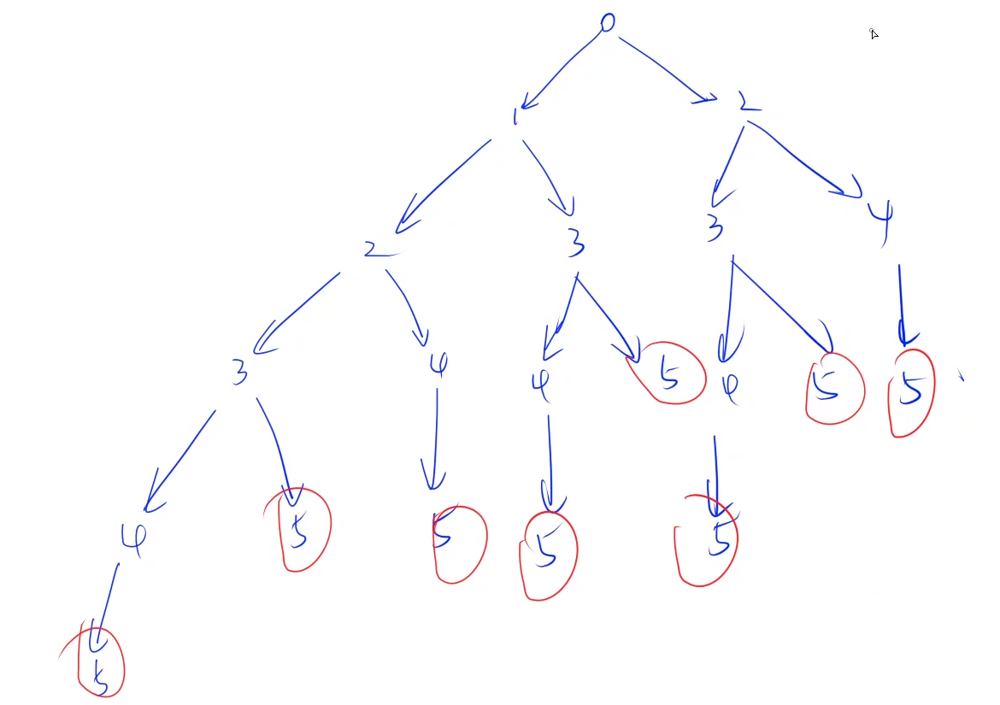
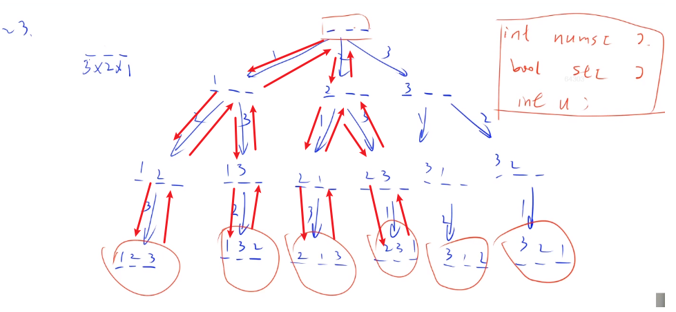

## 1.acwing.779.最长公共字符串后缀

**注：字符串这一章知识点比较多，有点难，要经常复习消化。**

输入格式

由若干组输入组成。

每组输入的第一行是一个整数N。

N为0时表示输入结束，否则后面会继续有N行输入，每行是一个字符串（字符串内不含空白符）。

每个字符串的长度不超过200。

输出格式

共一行，为N个字符串的最长公共后缀（可能为空）。

<!--more-->

数据范围

1≤N≤200

输入样例：

```C++
3
baba
aba
cba
2
aa
cc
2
aa
a
0
```

输出样例：

```C++
ba

a
```

```C++
// y总题解，通过循环枚举后缀长度
#include <iostream>

using namespace std;
const int N = 210;
int n;
string str[N];
int main()
{
    while (cin >> n,n)
    {
        int len = 1000;
        for (int i = 0;i < n;i ++)
        {
            cin >> str[i];
            if (len > str[i].size()) len = str[i].size();
        }
        
        while (len)
        {
            bool success = true;
            for (int i = 1;i < n;i ++)
            {
                bool is_same = true;
                for (int j = 1;j <= len;j ++)
                {
                    if (str[0][str[0].size() - j] != str[i][str[i].size() - j])
                    {
                        is_same = false;break;
                    }
                }
                if (!is_same)
                {
                    success = false;break;
                }
            }
            if (success) break;
            len --;
        }
        cout << str[0].substr(str[0].size() - len) << endl;
    }
    return 0;
}
```

## 2.static静态关键字修饰变量

### 2.1 修饰局部变量

用于函数内部修饰变量。**相当于在函数内部开了一个只有该函数能用的全局变量。**

调用堆空间，和全局变量有相同之处，未初始化时默认为0。

```C++
int foo(){
	static int i = 1; // note:1
	//int i = 1;  // note:2
	i += 1;
	return i;
}
```

那么我们总结一下，静态局部变量的特点（括号内为note:2,也就是局部变量的对比）：

（1）该变量在全局数据区分配内存(局部变量在栈区分配内存);
        （2）静态局部变量在程序执行到该对象的声明处时被首次初始化，**即以后的函数调用不再进行初始化**(局部变量每次函数调用都会被初始化);
        （3）静态局部变量一般在声明处初始化，如果没有显式初始化，会被程序自动初始化为0(局部变量不会被初始化);
        （4）它始终驻留在全局数据区，直到程序运行结束。但其作用域为局部作用域，也就是不能在函数体外面使用它(局部变量在栈区，在函数结束后立即释放内存);

### 2.2 修饰全局变量

定义在函数体之外，用于修饰全局变量，表示该变量只在本文件可见。

```C++
static int i = 1;  //note:3
//int i = 1;  //note:4
 
 
int foo()
{
	i += 1;
	return i;
}
```

以上我们就可以得出静态全局变量的特点：

静态全局变量不能被其它文件所用(全局变量可以);
其它文件中可以定义相同名字的变量，不会发生冲突(自然了，因为static隔离了文件，其它文件使用相同的名字的变量，也跟它没关系了);

### 2.3 修饰函数

表明该函数只在同一文件中调用。

其它文件中可以定义相同名字的函数，不会发生冲突;

## 3.函数引用

当函数的形参为引用类型时，对形参的修改会影响实参的值。使用引用的作用：避免拷贝、让函数返回额外信息。

```C++
#include <iostream>
using namespace std;
int max(int &x,&y)
{
	x = 10;y = 20;
    if (x > y) return x; // 修改形参会影响实参的值
    return y;
}
int main()
{
    int a,b;
    cin >> a >> b;
    cout << max(a,b) << endl;
    cout << a << ' ' << b << endl;
    return 0;
}
// input:3 4
/* output:
20
10 20
*/
```

## 4.函数的参数

### 4.1 数组参数

```C++
// 声明、定义函数
void output(int a[]) // 一维数组可省略
void output(int a[][4]) // 二维数组可省略第一个参数，第二个不可以
void output(int a[][4][3][4]) // 多维数组可省略第一个参数，后面的多不可以
    
// 调用函数
output(a); // 注意不要写成a[]或a[][4]这种形式
```

数组的传递是引用传递，对形参的修改会影响实参的值。

### 4.2 默认参数

默认参数只能放在位置参数的后面，允许有多个默认参数和全部是默认参数。

```C++
#include <iostream>

using namespace std;
void foo(int a,int b = 10)
{
	cout << a << ' ' << b << endl;	
}
int main()
{
    foo(5);// 不加参数则执行默认参数
    foo(5,3);// 加了参数则按照加的参数
    return 0;
}
/* output:
5 10
5 3*/
```

## 5.acwing.817.数组去重

给定一个长度为n的数组a，请你编写一个函数：

```C++
int get_unique_count(int a[], int n);  // 返回数组前n个数中的不同数的个数
```

输入格式

第一行包含一个整数n。

第二行包含n个整数，表示数组a。

输出格式

共一行，包含一个整数表示数组中不同数的个数。

数据范围

1≤n≤1000

输入样例：

```C++
5
1 1 2 4 5
```

输出样例：

```
4
```

```C++
// 我的暴力做法
#include <iostream>
using namespace std;
const int N = 1001;
int get_unique_count(int a[],int n)
{
    int b[N] = {0};
    int cnt = 0;
    for (int i = 0;i <n;i ++)
    {
        b[a[i]] ++;
    }
    for (int i = 0;i < N;i ++)
    {
        if(b[i]) cnt ++;
    }
    return cnt;
}

int main()
{
    int n;
    cin >> n;
    int a[N];
    for (int i = 0;i < n;i ++) cin >> a[i];
    
    cout << get_unique_count(a,n);
    return 0;
}

// y总题解
#include <iostream>

using namespace std;

int unique(int a[], int size)
{
    int cnt = 0;
    for (int i = 0; i < size; i ++ )
    {
        bool is_exist = false;
        for (int j = 0; j < i; j ++ )
            if (a[j] == a[i])
            {
                is_exist = true;
                break;
            }
        if (!is_exist) cnt ++ ;
    }

    return cnt;
}

int main()
{
    int a[1000];
    int n;
    cin >> n;
    for (int i = 0; i < n; i ++ ) cin >> a[i];

    cout << unique(a, n) << endl;

    return 0;
}

作者：yxc
链接：https://www.acwing.com/activity/content/code/content/275258/
来源：AcWing
著作权归作者所有。商业转载请联系作者获得授权，非商业转载请注明出处。
```

## 6.acwing.818.数组排序

给定一个长度为n的数组a以及两个整数 l 和 r，请你编写一个函数，`void sort(int a[], int l, int r)`，将a[l] ~ a[r]从小到大排序。

输出排好序的数组a。

输入格式
第一行包含三个整数n，l，r。

第二行包含n个整数，表示数组a。

输出格式
共一行，包含n个整数，表示排序完成后的数组a。

数据范围
0≤l≤r<n≤1000
输入样例：
5 2 4
4 5 1 3 2
输出样例：
4 5 1 2 3

```C++
// select sort,最简单的排序，y总题解
#include <iostream>
using namespace std;

void sort(int a[],int l,int r)
{
    for (int i = l;i <= r;i ++)
        for (int j = i + 1;j <= r;j ++)
            if(a[j] < a[i]) swap(a[j],a[i]);
}
int main()
{
    int n,l,r;int a[1001];
    cin >> n >> l >> r;
    for (int i = 0;i < n;i++) cin >> a[i];
    sort(a,l,r);
    for (int i = 0;i < n;i ++) cout << a[i] << ' ';
    return 0;
}
// bubble sort,参考的这位dalao的做法
#include <iostream>
using namespace std;
void sort(int a[],int l,int r)
{
    for (int i = l;i < r;i ++)
    {
        for (int j = l;j < r -i + l;j ++)
        {
            if (a[j] > a[j+1])
            {
                int t = a[j];
                a[j] = a[j+1];
                a[j+1] = t;
            }
        }
    }
}
int main()
{
    int n,l,r;
    cin >> n >> l >> r;
    int a[1001];
    for (int i = 0;i <n;i ++) cin >> a[i];
    sort(a,l,r);
    for (int i = 0;i < n;i ++) cout << a[i] << ' ';
    return 0;
}
作者：Struggle
链接：https://www.acwing.com/solution/content/13638/
来源：AcWing
著作权归作者所有。商业转载请联系作者获得授权，非商业转载请注明出处。
```

## 7.acwing.821.跳台阶

这题并不难，只是没有认真思考。

**蓝鲸dalao题解**

题目描述
一个楼梯共有n级台阶，每次可以走一级或者两级，问从第0级台阶走到第n级台阶一共有多少种方案。

输入格式
共一行，包含一个整数n。

输出格式
共一行，包含一个整数，表示方案数。

数据范围
1≤n≤15

样例
输入样例：
5
输出样例：
8
解题思路
先自己手动列举一下，

| 台阶/级 | 步数/步 |
| ------- | ------- |
| 1       | 1       |
| 2       | 2       |
| 3       | 3       |
| 4       | 5       |
| 5       | 8       |
| 6       | 13      |

根据以上列举，不难发现，这TM就是一斐波那契数列！

**算法1**
递归
说人话就是到这一级的步数等于到上一级的方案数和上上级的方案数，
而第一级台阶方案数为1，第二级台阶方案数为2，后面的步骤就是有手就行了。

```C++
C++ 代码
#include <bits/stdc++.h>
using namespace std;

int n;

int dg(int dep)
{
    if (dep == 1)  return 1;
    if (dep == 2)  return 2; //终止条件
    return dg(dep - 1) + dg(dep - 2);
}

int main()
{
    scanf("%d", &n);
    printf("%d\n", dg(n)); //用递归
    return 0;
}
```

**算法2**
for循环

```C++
C++代码
#include <bits/stdc++.h>
using namespace std;

int a[20], n;

int main()
{
    a[1] = 1;
    a[2] = 2;
    for (int i = 3; i <= 15; i++) //不要管他丫的，一共就15个，肝就对了
        a[i] = a[i - 1] + a[i - 2];
    scanf("%d", &n);
    printf("%d\n", a[n]);
    return 0;
}

作者：蓝鲸
链接：https://www.acwing.com/solution/content/11022/
来源：AcWing
著作权归作者所有。商业转载请联系作者获得授权，非商业转载请注明出处。
```

**y总题解**

先画出递归搜索树：（枚举n=5的所有情况）



```C++
#include <iostream>

using namespace std;
int n;
int ans;
void f(int k)
{
    if(k == n) ans ++;
    else if(k < n)
    {
        f(k + 1);
        f(k + 2);
    }
}
int main()
{
    cin >> n;
    f(0);
    cout <<ans << endl;
    return 0;
}
```

## 8.acwing.823.排列

**有点难度！要逐步分析！用VScode单步调试分析，画递归搜索树分析！！！**

给定一个整数n，将数字1~n排成一排，将会有很多种排列方法。

现在，请你按照字典序将所有的排列方法输出。

输入格式

共一行，包含一个整数n。

输出格式

按字典序输出所有排列方案，每个方案占一行。

数据范围

1≤n≤9

输入样例：

```
3
```

输出样例：

```
1 2 3
1 3 2
2 1 3
2 3 1
3 1 2
3 2 1
```

首先画出**深度遍历搜索树**！！！用到深度遍历的思想。



```C++
// y总题解
#include <iostream>
using namespace std;
const int N = 10;

int n;
void dfs(int u,int nums[],bool st[])// u是填充的位数
{
    if (u > n)
    {
        for (int i = 1;i <= n;i ++) cout << nums[i] << ' ';
        cout << endl;
    }
    else
    {
        for (int i = 1;i <= n;i ++)
            if (!st[i])
            {
                st[i] = true;
                nums[u] = i;
                dfs(u + 1,nums,st);
                st[i] = false; // 恢复现场
            }
    }    
}

int main()
{
    cin >> n;
    int nums[N];
    bool st[N] = {0};// 初始化为false
    dfs(1,nums,st);
    return 0;
}
// 注意：当输入输出比较多时，用scanf和printf会快很多
```