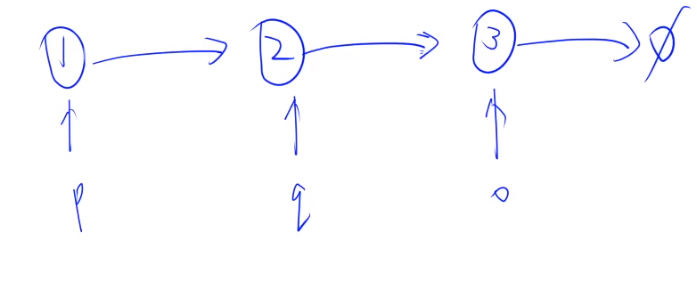
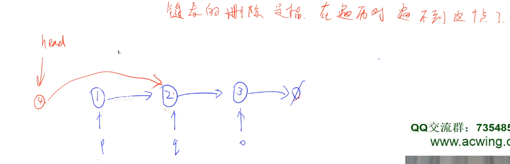
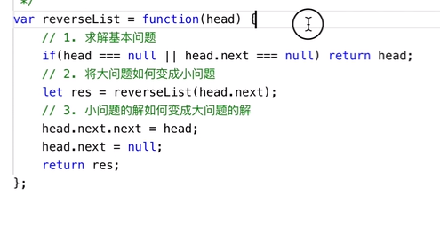
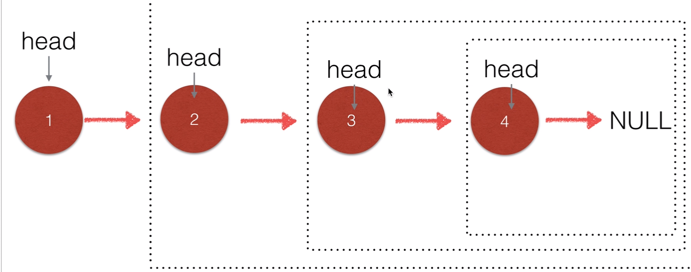

类可以将变量、数组和函数完美地打包在一起。

​                                                            ——yxc

## 1.类

类中的变量和函数被统一称为类的成员变量。

private后面的内容是私有成员变量，在类的外部不能访问；public后面的内容是公有成员变量，在类的外部可以访问。

<!--more-->

## 2.结构体与类的唯一区别

结构体和类的作用是一样的。不同点在于类默认是private，结构体默认是public。

习惯上把结构较为简单的函数较少的代码定义成**结构体**，较为复杂的麻烦的代码定义成**类**。

成员变量在**使用初始化列表**初始化时，与构造函数中初始化成员列表的**顺序无关**，只与定义成员变量的顺序有关。因为成员变量的初始化次序是根据变量在内存中次序有关，而内存中的排列顺序早在编译期就根据变量的定义次序决定了。

```C++
#include <iostream>
using namespace std;

class Person{
    private:
        int age,height;
        double money;
    public:
        string name;

        void say(){
            cout << "Hello, " << name << endl;
        }
        int get_age()
        {
            return age;
        }
        void add_money(double x)
        {
            money += x;
        }
    private:
        string books[100];
}d,Persons[100]; //! 一定记得加分号

int main()
{
    Person C;
    Person Per[120];
    C.name = "John";
    //C.age = 18;// 私有成员不可访问
    return 0;
}
```

```C++
#include <iostream>
using namespace std;
struct Person{
    int age,height;// 不加默认是public
    double money;
    Person (){}
    Person(int _age,int _height):age(_age),height(_height) {}
    Person(int _age,int _height,double _money):age(_age),height(_height),money(_money) {}
};
Person b;// 定义在函数体外默认初始化为0
int main()
{
    Person p ;
    Person c = {18,180};
    cout << p.money << endl;
    cout << b.money << endl;
    cout << c.money << endl;// 一些编译器输出0，一些输出随机值
    return 0;
}
/*
7.90505e-323 随机值
0 默认初始化为0
1.43279e-322 随机值
*/

```

编译器关于构造函数使用与变量初始化相同的规则来初始化数据成员。对象a在函数体外定义，其int、double类型数据成员被初始为0；对象b在函数体内定义，构造函数不会对其进行初始化（符合内置类型变量初始化规则），其中存放的都是随机值。

## 3.指针与引用(回顾指针的用法)

### **指针即地址**

```C++
#include <iostream>
using namespace std;
char a,b;// 堆空间，地址从小到大
int main()
{
    char c = 'a',d;// 栈空间，地址从大到小
    cout << (void*)&a << endl;
    cout << (void*)&b << endl;
    cout << (void*)&c << endl;
    cout << (void*)&d << endl;
    return 0;
}
/*
0x407030
0x407031
0x61fe1f
0x61fe1e
*/
```

```C++
#include <iostream>
using namespace std;

int main()
{
    int a = 10;
    int* p = &a;
    cout << "before:" << a << ' '<< *p << endl;
    
    *p = 12;
    cout << "after:" << a <<' '<< *p << endl;
    return 0;
}
/*
before:10 10
after:12 12
*/
```

指针指向存放变量的值的地址。因此我们可以通过指针来修改变量的值。

这类似于我们通过数组下标来修改数组中的值。

数组名是一种特殊的指针。指针可以做运算：

```C++
#include <iostream>
using namespace std;
int main()
{
    char c;
    int a[5] = {1,2,3,4,5};
    cout << a << endl;
    for (int i = 0;i < 5;i ++)
        cout << (void*)&a[i] << endl;
    return 0;
}
/*
0x61fe00
0x61fe00
0x61fe04
0x61fe08
0x61fe0c
0x61fe10
*/
```

```C++
#include <iostream>
using namespace std;
int main()
{
    char c;
    int a[5] = {1,2,3,4,5};

    int* p = a;
    cout << p << endl;
    cout << p + 1 << endl;
    cout << *p << endl;
    cout << *(p + 2) << endl;    
    return 0;
}
/*
0x61fe00
0x61fe04
1
3
*/
```

### **引用**

引用和指针类似，相当于给变量起了个别名。

```C++
#include <iostream>
using namespace std;
int main()
{
    int a = 10;
    int* p = &a;
    int& p = a;// C++的简化写法，引用（别名）
    return 0;
}
```

## 4.链表

```C++
#include <iostream>
using namespace std;
struct Node{
    int val;
    Node* next;

    Node(int _val) : val(_val),next(NULL){}
};
int main()
{
    Node node = Node(1);
    // 写法一，定义Node型变量，值是1
    Node* p = new Node(1);
    // 写法二，定义Node型变量，返回值是Node的地址，p是指针
    // new Node(1);返回的是Node*
}
```

如图：



```C++
#include <iostream>
using namespace std;
struct Node{
    int val;
    Node* next;

    Node(int _val) : val(_val),next(NULL){}
};
int main()
{
    auto p = new Node(1);
    auto q = new Node(2);
    auto o = new Node(3);

    p->next = q;
    q->next = o;// 构造链表
    
    // 遍历单链表
    Node* head = p;// 头结点存放第一个结点的地址，也即头结点指向第一个结点
    cout << "before:\t" << endl;
    for (Node* i = head;i;i = i->next) // 循环结束条件等价于i != NULL 
        cout << i->val << endl;
    // 头插法添加结点
    Node* u = new Node(4);
    u->next = head;
    head = u;
    cout << "after:\t" << endl;
    for (Node* i = head;i;i = i->next) // 循环结束条件等价于i != NULL 
        cout << i->val << endl;
    //删除结点
    head->next = head->next->next;
    return 0;
}
/* output:
before: 
1
2
3
after:
4
1
2
3
*/
```

链表的头结点（head）：**大部分情况下指的是第一个结点的地址。而不是它的值**。记牢！



## 5.acwing.21.斐波那契数列

输入一个整数 n ，求斐波那契数列的第 n 项。

假定从0开始，第0项为0。(n<=39)（0,1,1,2，…)

样例

```
输入整数 n=5 

返回 5
```

```C++
// y总题解
class Solution {
public:
    int Fibonacci(int n) {
        if (n <= 1) return n;
        return Fibonacci(n-1) + Fibonacci(n-2);
    }
};
```

## 6.acwing.84.求1 + 2 + 3 + … + n

求1+2+…+n,要求不能使用乘除法、for、while、if、else、switch、case等关键字及条件判断语句（A?B:C）。

```C++
// solution 1,y总题解，利用短路
class Solution {
    public:
    	int getSum(int n) {
            int res = n;
            n > 0 && (res += getSum(n-1));//利用短路运算终止递归，因为不能用if
            // 如果改成n >= 0则到getSum(-1)才停止，比真实值少1
            return res;
        }
};
// solution 2
class Solution {
public:
    int getSum(int n) {
        char a[n][n+1]; // 变相求前n项和
        return sizeof(a)>>1;// >>1 右移相当于除以2，因为不能用除法
    }
};
```

## 7.acwing.87.把字符串转换成整数

请你写一个函数StrToInt，实现把字符串转换成整数这个功能。

当然，不能使用atoi或者其他类似的库函数。

样例

```
输入："123"

输出：123
```

**注意**:

你的函数应满足下列条件：

1. 忽略所有行首空格，找到第一个非空格字符，可以是 ‘+/−’ 表示是正数或者负数，紧随其后找到最长的一串连续数字，将其解析成一个整数；
2. 整数后可能有任意非数字字符，请将其忽略；
3. 如果整数长度为0，则返回0；
4. 如果整数大于INT_MAX(2^31 − 1)，请返回INT_MAX；如果整数小于INT_MIN(−2^31) ，请返回INT_MIN；

```C++
// solution 1,我的题解，非常复杂
class Solution {
public:
    int strToInt(string str) {
        int sign = 0;long long n = 0;int num[40] = {0};
        int i = 0;
        for (char &c:str)
        {
            if (c == '+' ) {sign = 1;continue;}
            else if (c == '-') {sign = -1;continue;}
            else if (sign != 0|| (c >= '0' && c <= '9'))
            {
                if (c >= '0' && c <= '9')
                    {num[i] = c -48;i ++;}
                else break;
            }
            else if(c != ' ') break;
        }
        if (i && !sign) sign = 1;
        for (int j = 0;j < i;j ++)
        {
            n += (long long)num[j]*pow(10,i-1-j);
        }
        if (sign *n > pow(2,31)-1) return INT_MAX;
        else if (sign *n < -1*pow(2,31)) return INT_MIN;
        else return sign * n;
    }
};
// solution 2,y总题解
class Solution {
    public:
        int strToInt(string str) {
            int k = 0;
            while (k < str.size() && str[k] == ' ') k ++;// 过滤空格
            long long res = 0;
            int minus = 1;// 符号位
            if (k < str.size())
            {
                if (str[k] == '-') {minus = -1;k ++;}
                else if (str[k] == '+') k ++;
            }
            while (k < str.size() && str[k] <= '9' && str[k] >= '0')
            {
                res = res * 10 + str[k] - '0';// 这个思路特别好，可以不用数组存放
                if (res > 1e11) break;// 数据太大就直接跳出来
                k ++;
            }
            res *= minus;
            if (res > INT_MAX) res = INT_MAX;
            if (res < INT_MIN) res = INT_MIN;
            return res;
        }
};
```

## 8.acWing 28. 在O(1)时间删除链表结点

<u>tips：链表题多画图，方便思考，空想还是有难度的！</u>

给定单向链表的一个节点指针，定义一个函数在O(1)时间删除该结点。

假设链表一定存在，并且该节点一定不是尾节点。

样例

```C++
输入：链表 1->4->6->8
      删掉节点：第2个节点即6（头节点为第0个节点）

输出：新链表 1->4->8
```

```C++
// solution 1,y总题解
class Solution {
public:
    void deleteNode(ListNode* node) {
        node->val = node->next->val;// 将待删除结点伪装成它的下一个结点
        node->next = node->next->next;// 删除它的后一个结点
    }
};
// solution 2,y总题解
class Solution {
public:
    void deleteNode(ListNode* node) {
        *(node) = *(node->next);// 结构体整体赋值，相当于往前推进一个结点
    }
};
```

## 9.acwing.36.合并两个排序的链表

输入两个递增排序的链表，合并这两个链表并使新链表中的结点仍然是按照递增排序的。

样例

```
输入：1->3->5 , 2->4->5

输出：1->2->3->4->5->5
```

**算法：(二路归并) O(n)**
	新建头部的保护结点dummy，设置cur指针指向dummy。
若当前l1指针指向的结点的值val比l2指针指向的结点的值val小，则令cur的next指针指向l1，且l1后移；否则指向l2，且l2后移。
	然后cur指针按照上一部设置好的位置后移。
	循环以上步骤直到l1或l2为空。
	将剩余的l1或l2接到cur指针后边。
**时间复杂度**
两个链表各遍历一次，所以时间复杂度为O(n)。

```C++
// y总题解
class Solution {
public:
    ListNode* merge(ListNode* l1, ListNode* l2) {
        ListNode *dummy = new ListNode(0);
        ListNode *cur = dummy;
        while (l1 != NULL && l2 != NULL) {
            if (l1 -> val < l2 -> val) {
                cur -> next = l1;
                l1 = l1 -> next;
            }
            else {
                cur -> next = l2;
                l2 = l2 -> next;
            }
            cur = cur -> next;
        }
        cur -> next = (l1 != NULL ? l1 : l2);
        return dummy -> next;
    }
};
```

## 10.acwing.35.反转链表

定义一个函数，输入一个链表的头结点，反转该链表并输出反转后链表的头结点。

**思考题：**

- 请同时实现迭代版本和递归版本。

样例

```
输入:1->2->3->4->5->NULL

输出:5->4->3->2->1->NULL
```

作者：yxc
        链接：https://www.acwing.com/solution/content/743/
        来源：AcWing
著作权归作者所有。商业转载请联系作者获得授权，非商业转载请注明出处。

**算法1：(链表操作，迭代) O(n)**

迭代也就是循环的意思。

翻转即将所有节点的next指针指向前驱节点。
由于是单链表，我们在迭代时不能直接找到前驱节点，所以我们需要一个额外的指针保存前驱节点。同时在改变当前节点的next指针前，不要忘记保存它的后继节点。

- 空间复杂度分析：遍历时只有3个额外变量，所以额外的空间复杂度是 O(1)。
- 时间复杂度分析：只遍历一次链表，时间复杂度是 O(n)。

```C++
// solution 1
class Solution {
public:
    ListNode* reverseList(ListNode* head) {
        if (!head || !head->next) return head;
        ListNode* p = head;
        ListNode* q = p->next;
        while (q)
        {
            ListNode* o = q->next;
            q->next = p;
            p = q,q = o;
        }
        head->next = nullptr;// 一定注意这里不能忘
        // nullptr和0，NULL等价
        return p;
    }
};
// solution 1
class Solution {
    public:
        ListNode* reverseList(ListNode* head) {
            ListNode *prev = nullptr;// 这里不用考虑上面的初始头结点指空
            ListNode *cur = head;
            while (cur)
            {
                ListNode *next = cur->next;
                cur->next = prev;
                prev = cur, cur = next;
            }
            return prev;
        }
};
```

**算法2:(链表操作，递归) O(n)**
首先我们先考虑 reverseList 函数能做什么，它可以翻转一个链表，并返回新链表的头节点，也就是原链表的尾节点。
所以我们可以先递归处理 `reverseList(head->next)`，这样我们可以将以`head->next`为头节点的链表翻转，并得到原链表的尾节点tail，此时`head->next`是新链表的尾节点，我们令它的next指针指向head，并将`head->next`指向空即可将整个链表翻转，**且新链表的头节点是tail**。

- 空间复杂度分析：总共递归 n 层，系统栈的空间复杂度是 O(n)，所以总共需要额外 O(n) 的空间。
- 时间复杂度分析：链表中每个节点只被遍历一次，所以时间复杂度是 O(n)。






​                                                      **head是每一层函数的返回值res。**

讲解链接：https://www.bilibili.com/video/av83907207?t=1

```C++
class Solution {
    public:
        ListNode* reverseList(ListNode* head) {
            if (!head || !head->next) return head;// 递归最小一层返回head
            ListNode *tail = reverseList(head->next);
            head->next->next = head;
            head->next = nullptr;
            return tail;
        }
};
```