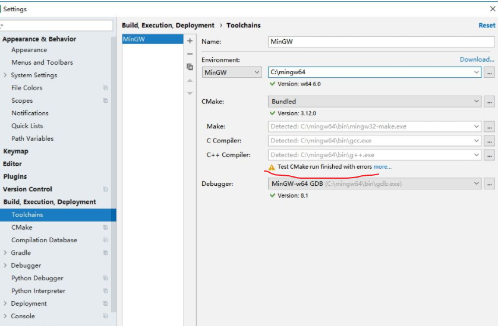
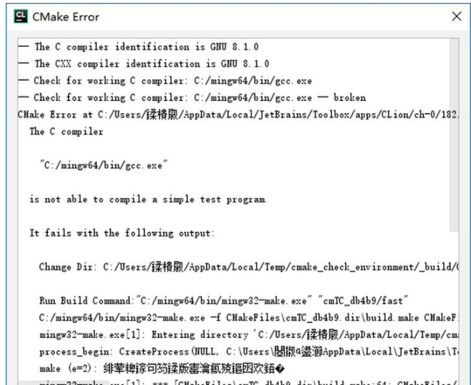
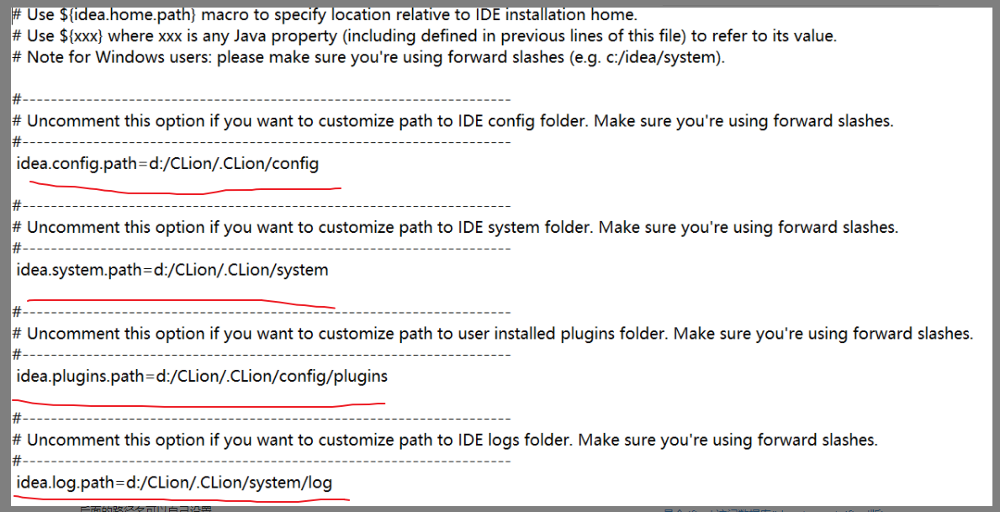
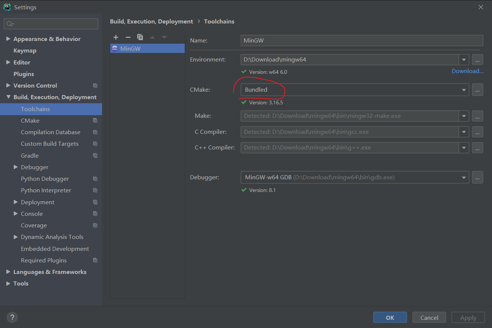
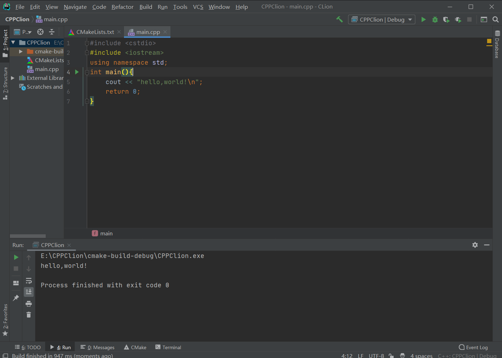
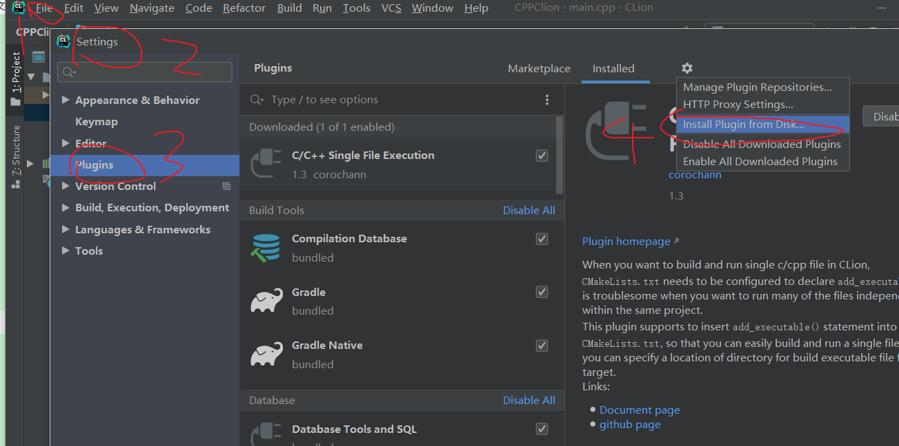
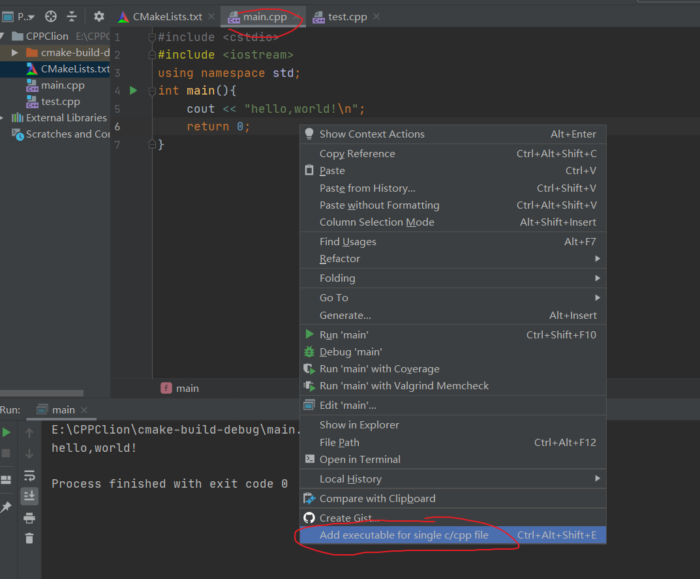
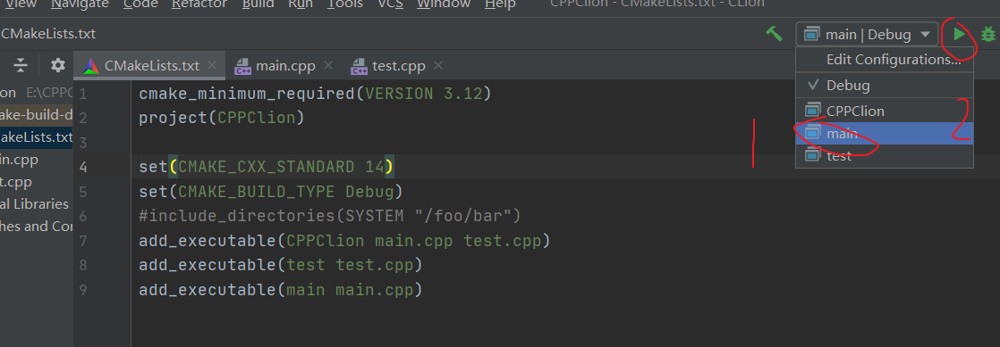

## CLion配置使用教程

参考下载安装教程：https://www.jb51.net/article/193508.htm

最好不要下载最新的，破解可能失效，然后跟着教程来就行了。

<!--more-->

下面讲一下会遇到的问题（坑）：

配置MinGW时可能会出现如下警告。

我们点击More，可以看到类似下图的错误：

解决方案请参照[这里](https://zhuanlan.zhihu.com/p/43680621)

有的人内容可能不是完全一样（没有乱码，都是英文，其他一致）：如果上面的方案不行，再接着往下看

参照这篇[文章](https://www.pianshen.com/article/33861131114/)，我花了大半天时间才找到这个非常有效的解决方案，我们根据提示，在D盘下新建一个CLion文件夹（或者你找别的路径也行），对照下图修改这四个部分。

然后打开CLion，新建工程，点击 help – edit custom vm options

在后面加上一行 `-Djava.io.tmpdir=d:/CLion/Temp`

这下再重新执行CMakelist就行了，运行main.cpp会顺利看到hello，world就成功了。

有人可能还会出现头文件下方红线提示找不到的情况，可能是因为你CMake的路径改成了下载的CMake了，

再按照下图改回MinGW默认的就不会报错了。

最后就可以放心的使用CLion了！

**补充关于CLion的多文件编译：**

CLion默认一个项目之下只能有一个带main函数的源文件。

我们可以通过修改CMakeList文件来分别编译一个项目下的多个带main函数的源文件。

参考自：https://zhuanlan.zhihu.com/p/124284203。

这里我们采用安装插件的方式来实现，如果不能在CLion中在线下载安装插件，可以直接在官网中下载，然后通过本地安装插件。

官网插件下载链接：https://plugins.jetbrains.com/

安装插件之后就可以编写代码了。

这里有两段测试程序，main.cpp和test.cpp。

分别在cpp文件下单击右键：

这时会发现CMakeList文件中多了一行代码add_executable(main main.cpp)。（其实可以不用插件手动添加）

要运行单个文件，只要选择对应的文件即可，然后点击'Run'按钮。

现在你已经成功掌握了CLion的基本用法了！