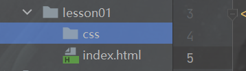

## 1.什么是CSS？

HTML+CSS+JavaScript

结构+表现+交互

1. CSS最重要的部分就是**选择器（重点+难点）**；
2. 美化网页（文字，阴影，超链接，列表，渐变...）；
3. 盒子模型；
4. 浮动；
5. 定位。

<!--more-->

推荐前端学习网站：w3cschool和菜鸟教程。

入门教程： https://www.runoob.com/css/css-tutorial.html。

狂神CSS3教程配套笔记： https://blog.csdn.net/pan_h1995/article/details/105827181。

前端和Java程序员一个很重要的区别就是：CSS。

作为Java程序员只要**重点掌握选择器**就行。

---

CSS 是层叠样式表 ( Cascading Style Sheets ) 的简称。

 是用来表现HTML或XML的标记语言。

是由W3C的CSS工作组发布推荐和维护的。

CSS核心：表现层（**美化网页**）

字体，颜色，边距，高度，宽度，背景图片，网页定位，网页浮动...

CSS发展史：

CSS1.0 -->

 CSS2.0 --> DIV（块）+ CSS，HTML与CSS结构分离的思想，网页变得简单，SEO

 CSS2.1 --> 浮动，定位

 CSS3.0 圆角，阴影，动画

## 2.CSS程序

以后尽量都保持这样的练习格式：



```html
<!--index.html-->
<!DOCTYPE html>
<html lang="en">
<head>
    <meta charset="UTF-8">
    <title>Title</title>
<!--规范，尽量在head中写CSS代码
    语法：
        选择器{
            声明1;
            声明2;
        }
-->
    <!--在html的style属性中写css代码-->
    <style>
        h1{
            color: brown;
        }
    </style>
</head>
<body>
<h1>我是一个标题</h1>
</body>
</html>
```

html与css分离：建议使用这种格式

```html
<!--index.html-->
<!DOCTYPE html>
<html lang="en">
<head>
    <meta charset="UTF-8">
    <title>Title</title>
<!--规范，尽量在head中写CSS代码
    语法：
        选择器{
            声明1;
            声明2;
        }
-->
    <!--引用css代码-->
    <link rel="stylesheet" href="css/style.css">
</head>
<body>
<h1>我是一个标题</h1>
</body>
</html>
```

```css
/*这是CSS注释，html也行
style.css*/
h1{
    color: brown;
}
```

css的优势：

1. 内容和表现分离
2. 网页结构表现统一，可以实现复用
3. 样式丰富
4. 利用SEO，容易被搜索引擎收录

## 3.CSS的三种导入方式

1. 行内样式
2. 内部样式
3. 外部样式

优先级：就近原则。(覆盖原则)

```html
<!DOCTYPE html>
<html lang="en">
<head>
    <meta charset="UTF-8">
    <title>Title</title>
    <style>
        /*内部样式*/
        h1{
            color: aqua;
        }
    </style>
    /*外部样式*/
    <link rel="stylesheet" href="css/style.css">
</head>
<body>
<!--行内样式：在标签元素中编写style属性-->
<h1 style="color: red";>我是标题</h1>
</body>
</html>
```

拓展：外部样式的两种写法，仅作为了解内容

- 链接式：

    html标签，只能用于html源码

    ```html
    /*外部样式*/
    <link rel="stylesheet" href="css/style.css">
    ```

- 导入式：一般不使用

    CSS2.1特有，必须放入style标签

    ```html
    <!DOCTYPE html>
    <html lang="en">
    <head>
        <meta charset="UTF-8">
        <title>Title</title>
        <style>
            @import url("css/style.css");
        </style>
    </head>
    <body>
    <h1>Java世界第一</h1>
    </body>
    </html>
    ```

## 4.选择器

> 作用：选择页面上的某一个或者某一类元素

### 4.1基本选择器（必须掌握）

1. 标签选择器：选择一类标签，`标签{}`
2. 类选择器 class：选择所有class属性的标签，可跨标签，`.类名{}`
3. id选择器：id名字不能以数字开头，ID 属性只能在每个 HTML 文档中出现一次，`#id名{}`
4. **固定的**优先级：行内样式 > id选择器 > class选择器 > 标签选择器

```html
/*标签选择器*/
<!DOCTYPE html>
<html lang="en">
<head>
    <meta charset="UTF-8">
    <title>Title</title>
    <style>
        /*标签选择器，会选择页面上所有带这个标签的元素*/
        /*两个h1标签都会改变*/
        h1{
            color: darkgrey;
            background: crimson;
            border-radius: 6px;
        }
        p{
            font-size: 23px;
        }
    </style>
</head>
<body>
<h1>学习使我快乐</h1>
<h1>疯狂卷起来</h1>
<p>一日不学心慌张</p>
</body>
</html>
```

```html
/*类选择器*/
<!DOCTYPE html>
<html lang="en">
<head>
    <meta charset="UTF-8">
    <title>Title</title>
    <style>
        /*类选择器，".class的名称{}"
        好处：可以让多个标签归类，是同一个class，可以复用
        */
        .learn{
            color: crimson;
        }
        .juan{
            color: #24c497;
        }
    </style>
</head>
<body>
<h1 class="learn">学习使我快乐</h1>
<h1 class="juan">疯狂卷起来</h1>
<p class="learn">一日不学心慌张</p>
</body>
</html>
```

```html
/*id选择器*/
<!DOCTYPE html>
<html lang="en">
<head>
    <meta charset="UTF-8">
    <title>Title</title>
    <style>
        /*id选择器 : id必须保证全局唯一！
        #id名称{}
         */
        #learn{
            color: #24c497;
        }
        .juan{
            color:darkorange;
        }
        h1{
            color: blue;
        }
    </style>
</head>
<body>
<h1 id="learn">学习使我快乐</h1>
<h1 class="juan">疯狂卷起来</h1>
<p class="learn">一日不学心慌张</p>
</body>
</html>
```

