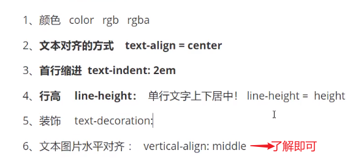
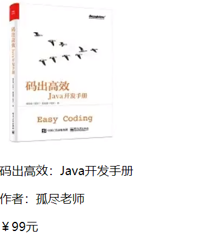
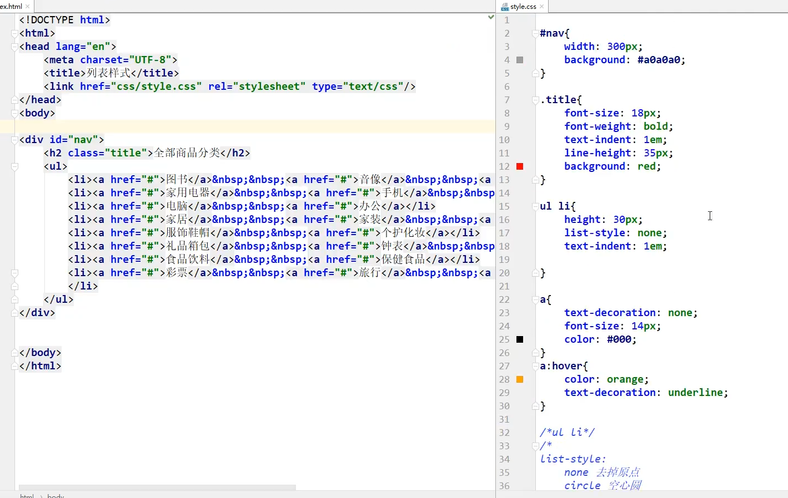
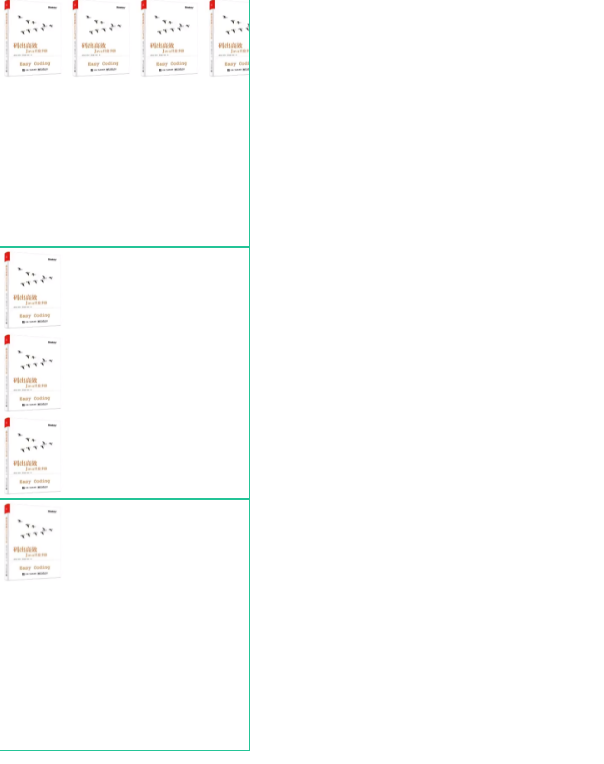
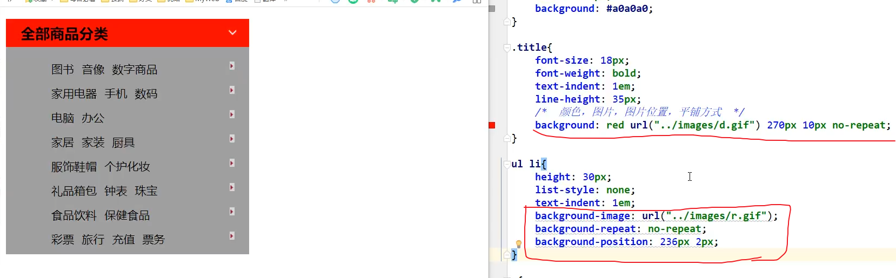
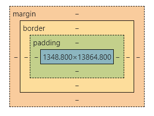

## 5.CSS字体样式

span标签：用span套起来重点要突出的字。（约定俗成）

<!--more-->

```html
<head>
    <meta charset="UTF-8">
    <title>Title</title>
    <style>
         #title1{
            font-size: 40px;
        }
        body{
            font-family: Consolas,宋体;/*字体种类*/
            /*分别设置中英文字体*/
            color: darkorange;/*字体颜色*/
        }
        h1{
            font-size: 50px;/*字体大小*/
        }
        .p1{
            font-weight: bolder;/*字体粗细*/
        }
    </style>
</head>
<body>
欢迎学习<span id="title1">Java</span>/*修改字体样式*/
<h1>林清玄散文</h1>
<p>You did not come,
    　　And marching Time drew on, and wore me numb.</p>
<p class="p1">少年时代读到苏轼的一阕词，非常喜欢，到现在还能背诵：</p>
　　<p>西雨斜风作小寒，淡烟疏柳媚晴滩。</p>
　　<p>入淮清洛渐漫漫，雪沫乳花浮午盏。</p>
　　<p>蓼茸蒿笋试春盘，人间有味是清欢。</p>
　　<p>这阕词，苏东坡在旁边写着“元丰七年十一月二十四日，从泗州刘倩叔游南山”，原来是苏轼和朋友到郊外去玩，在南山里喝了浮着雪沫乳花的小酒，配着春日山野里的蓼菜、茼蒿、新笋，以及野草的嫩芽等等，然后自己赞叹着“人间有味是清欢!”</p>
</body>
```

字体样式：

种类、颜色、大小、粗细、风格（斜体等）。

1.分开写

```html
<head>
    <meta charset="UTF-8">
    <title>Title</title>
    <style>
        body{
            font-family: Consolas,宋体;/*字体种类*/
            /*分别设置中英文字体*/
            color: darkorange;/*字体颜色*/
        }
        h1{
            font-size: 50px;/*字体大小*/
            opacity: 0.5;/*透明度*/
        }
        .p1{
            font-weight: bolder;/*字体粗细*/
        }
    </style>
</head>
<body>
<h1>林清玄散文</h1>
<p>You did not come,
    　　And marching Time drew on, and wore me numb.</p>
<p class="p1">少年时代读到苏轼的一阕词，非常喜欢，到现在还能背诵：</p>
　　<p>这阕词，苏东坡xxx</p>
</body>
```

2.合起来写

```html
<head>
    <meta charset="UTF-8">
    <title>Title</title>
    <style>
        p{
            /*风格 粗细 大小 种类*/
            font: oblique bolder 14px "楷体";
        }
    </style>
</head>
<body>
<p>少年时代读到苏轼的一阕词，非常喜欢，到现在还能背诵：</p>
</body>
```

## 6.CSS文本样式

颜色、对齐方式、首行缩进、行高、下划线。



加粗的是重点。

```html
<head>
    <meta charset="UTF-8">
    <title>Title</title>
    <style>
        /*颜色：1.单词 2.RGB，十六进制,0~F 3.RGBA，多一个透明度
        4.rgb(a,b,c) 0~255 5.rgba(a,b,c,d)*/
        h1{
            /*color: red;*/
            /*color: #00FF00;!*绿色*!*/
            color: rgba(0,255,0,0.8);
            text-align: center;/*文本居中:center,left,right*/
        }
        .p1{
            /*em比px大得多*/
            text-indent: 2em;/*段落首行缩进2字符*/
        }
        .p3{
            /*行高的块的高度（height）一致，就可以上下居中*/
            background: blue;
            height: 100px;
            line-height: 100px;
        }

        .l1{/*下划线*/
            text-decoration: underline;
        }
        .l2{/*中划线*/
            text-decoration: line-through;
            /*上划线*/
            text-decoration: overline;
        }
        a{/*超链接去下划线*/
            text-decoration: none;
        }
    </style>
</head>
<body>
<a href="">asd</a>
<h1>林清玄散文</h1>
<p class="p1">少年时代读到苏轼的一阕词，非常喜欢，到现在还能背诵：</p>
    <p>西雨斜风作小寒，淡烟疏柳媚晴滩。</p>
    <p class="p3">入淮清洛渐漫漫，雪沫乳花浮午盏。</p>
    <p class="l1">12314</p>
    <p class="l2">12314</p>
</body>
```

## 7.超链接伪类

补充相对路径小知识：（和Linux中一致）

上一级目录表示：../

上上级：../../

上上上级：../../../

以此类推。

---

鼠标悬浮的状态（记住这个就行）**a:hover**

```html
<head>
    <meta charset="UTF-8">
    <title>Title</title>
    <style>
        /*默认颜色*/
        a{
            text-decoration: none;
            color: #000000;
        }
        /*鼠标悬浮的状态（记住这个就行）*/
        a:hover{
            color: orange;
            font-size: 30px;/*放大效果*/
        }
        /*鼠标按住未释放的状态*/
        a:active{
            color: green;
        }
        #price{
            text-shadow: blue;
        }
    </style>
</head>
<body>
<a href="#">
    
</a>
<p>
    <a href="#">码出高效：Java开发手册</a>
</p>
<p>
    <a href="">作者：孤尽老师</a>
</p>
<p id="price">
    ￥99元
</p>
</body>
```

效果图：



## 8.列表样式练习



## 9.背景

分为背景颜色和背景图片。

如何使用背景图片。

```html
<!DOCTYPE html>
<html lang="en">
<head>
    <meta charset="UTF-8">
    <title>Title</title>

    <style>
        div{
            height:600px;
            width:600px;
            border: 1px solid #24c497;/* 边框 */
            /*默认是全部平铺的repeat*/
            background-image: url("../../resources/image/a.png");
        }
        .div1{/*水平平铺*/
            background-repeat: repeat-x;
        }
        .div2{/*垂直平铺*/
            background-repeat: repeat-y;
        }
        .div3{/*不平铺*/
            background-repeat: no-repeat;
        }
    </style>
</head>
<body>

<div class="div1"></div>
<div class="div2"></div>
<div class="div3"></div>

</body>
</html>
```

效果：



完善列表的练习。



渐变背景css样式网站：https://www.grabient.com/。

## 10.盒子模型



不同部分的说明：

- **Margin(外边距)** - 清除边框外的区域，外边距是透明的。
- **Border(边框)** - 围绕在内边距和内容外的边框。
- **Padding(内边距)** - 清除内容周围的区域，内边距是透明的。
- **Content(内容)** - 盒子的内容，显示文本和图像。

Border（边框）：粗细，样式，颜色。

### 边框

```html
<!DOCTYPE html>
<html lang="en">
<head>
    <meta charset="UTF-8">
    <title>Title</title>
    <style>
        /*body{*/
        /*    margin: 0;*/
        /*}*/
        #box{/*border: 粗细，样式，颜色*/
            text-indent: 2em;
            width: 300px;
            border: 1px solid red;
        }
        h2{
            background: #f39cff;
	    font-size: 16px;
            line-height: 30px;
        }
        form{
            background: #24c497;
        }
        div:nth-of-type(1) >input{
            border: 4px solid #2e4370;/*solid实线*/
        }
        div:nth-of-type(2) input{
            border: 4px dashed #40b52f;/*dashed虚线*/
        }
    </style>

</head>
<body>

<div id="box">
    <h2>会员登录</h2>
    <form action="#">
        <div>
            <span>用户名：</span>
            <input type="text">
        </div>
        <div>
            <span>密码：</span>
            <input type="text">
        </div>
        <div>
            <span>邮箱：</span>
            <input type="text">
        </div>
    </form>
</div>

</body>
</html>
```
