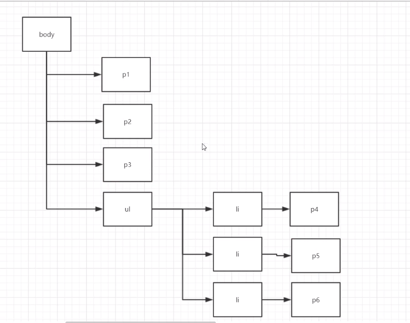
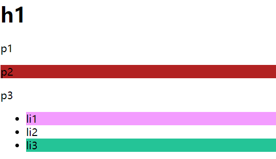
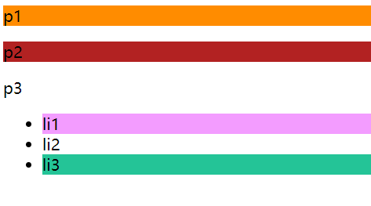

> 续CSS学习笔记（一）。

### 4.2高级选择器（现查现用）

#### 4.2.1层次选择器

先设计网页框架。

<!--more-->



1. 后代选择器：在某个元素的后面   祖父  父亲 儿子  孙子

    ```css
    body p{
        background: #24c497;
    }
    ```

2. 子选择器：只有一代，儿子

    ```css
    body>p{
        background: #f39cff;
        /*p1 p2 p3变色*/
    }
    ```

3. 相邻兄弟选择器：同辈
   ”弟弟“选择器

只有一个相邻兄弟，向下

 ```css
.active+p{
    background: #f39cff;
    /*p2会变色*/
}
<p class="active">p1</p>
<p>p2</p>
 ```


4. 通用”弟弟“选择器

    当前选中元素向下的所有兄弟元素

    ```css
    .active~p{
        background: #f39cff;
        /*p2 p3 p7 p8变色*/
    }
    ```

    ---

    ```html
    <!DOCTYPE html>
    <html lang="en">
    <head>
        <meta charset="UTF-8">
        <title>Title</title>
        <style>
            /*后代选择器*/
            /*body p{*/
            /*    background: #24c497;*/
            /*}*/
            /*子选择器*/
            /*body>p{*/
            /*    background: #f39cff;*/
            /*}*/
            /*兄弟选择器
            只有一个，向下
            */
            /*.active+p{*/
            /*    background: #f39cff;*/
            /*}*/
            /*通用选择器*/
            .active~p{
                background: #f39cff;
            }
        </style>
    </head>
    <body>
        <p class="active">p1</p>
        <p>p2</p>
        <p>p3</p>
        <ul>
            <li>
                <p>p4</p>
            </li>
            <li>
                <p>p5</p>
            </li>
            <li>
                <p>p6</p>
            </li>
        </ul>
        <p>p7</p>
        <p>p8</p>
    </body>
    </html>
    ```

#### 4.2.2结构伪类选择器

我们直接从例子上手：

```css
<!DOCTYPE html>
<html lang="en">
<head>
    <meta charset="UTF-8">
    <title>结构伪类选择器</title>

    <!--避免使用class和id选择器-->
    <style>
        /*ul的第一个子元素*/
        ul li:first-child{
            background: #f39cff;
        }
        /*ul的最后一个子元素*/
        ul li:last-child{
            background: #24c497;
        }
        /*选中p1：定位到父元素，选择当前第一个子元素
        选择当前p元素的父元素的第n个子元素，并且这个元素也是p元素才行
        比如p的父元素是body，body的第1个子元素是h1，不生效，是p1，生效
         */
        p:nth-child(1){
            background: darkorange;
        }
        /*选中当前元素的父元素中第n个类型为p的元素
        注意与上面的区别
        上面按顺序选择，这里按类型选择
         */
        p:nth-of-type(2){
            background:firebrick;
        }
    </style>
</head>
<body>
    <h1>h1</h1>
    <p>p1</p>
    <p>p2</p>
    <p>p3</p>
    <ul>
        <li>li1</li>
        <li>li2</li>
        <li>li3</li>
    </ul>
</body>
</html>
```



再把h1注释掉，试试：



#### 4.2.3属性选择器（常用）

把id和class选择器结合使用。

使用语法

1.属性名
        2.属性名=属性值 =是绝对等于，*=是包含这个元素，^=以这个开头，$=以这个结尾

```html
<!DOCTYPE html>
<html lang="en">
<head>
    <meta charset="UTF-8">
    <title>结构伪类选择器</title>
    <style>
        .demo a{
            /*
            作为演示，不需要记住
             */
            float:left;
            display: block;
            height: 50px;
            width: 50px;
            border-radius: 10px;
            background: darkorange;
            text-align: center;
            text-decoration: none;
            margin: 5px;
            font: bold 20px/50px Arial;
        }
        /*选择存在id属性的元素，正则表达式
        1.属性名
        2.属性名=属性值 =是绝对等于，*=是包含这个元素，^=以这个开头，$=以这个结尾
         */
        /*a[id]{*/
        /*    background: #f39cff;*/
        /*}*/
        a[id=first]{
            background: #f39cff;
        }
        a[class *= last]{
            background: #24c497;
        }
        /*选择href中以images开头的元素*/
        a[href ^= images]{
            background: yellow;
        }
    </style>

</head>
<body>
    <p class="demo">
<!--        1包含多个class-->
        <a href="http://www.baidu.com" class="links item first" id="first">1</a>
        <a href="" class="links item first" target="_blank" title="test">2</a>
        <a href="images/123.html">3</a>
        <a href="images/12.pdf">4</a>
        <a href="../images/1.txt" class="links item last">5</a>
    </p>
</body>
</html>
```

