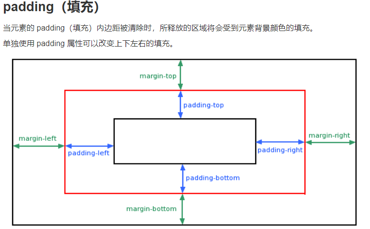
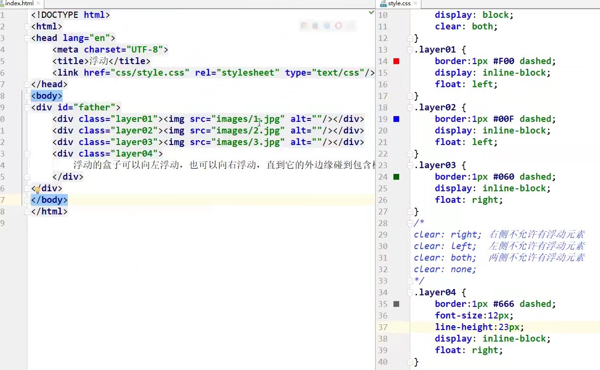

### 内外边距

外边距的妙用：居中元素！

顺时针：上，右，下，左。

margin居中的要求：必须是块元素（如div），且块元素有固定宽度，body宽度是无限的。

<!--more-->



```css
<style>
/*body{*/
/*    margin: 0;*/
/*}*/
#box{/*border: 粗细，样式，颜色*/
    text-indent: 2em;
    width: 300px;
    border: 1px solid red;
    margin: 0 auto;/*上下为0，左右自动*/
}
h2{
    background: #f39cff;
    font-size: 16px;
    line-height: 30px;
    margin: 0;
}
form{
    background: #24c497;
}
div:nth-of-type(1) >input{
    border: 4px solid #2e4370;/*solid实线*/
    padding: 8px;/*填充*/
    margin: 4px;/*外边距*/
}
div:nth-of-type(2) input{
    border: 4px dashed #40b52f;/*dashed虚线*/
}
</style>
```

## 1.圆角边框

radius对应各个角的弧度。

当正方形的width和height都是100px时，四个方向的radius为50px时，可以画出圆。

```css
div{           /*圆形*/
    width: 100px;
    height: 100px;
    border: 4px solid red;
    border-radius: 50px 50px 0 0;
    /*两个参数：主、次对角线，四个参数：左上，右上，右下，左下。顺时针*/
}
div{           /*半圆*/
    width: 100px;
    height: 50px;
    border: 4px solid red;
    border-radius: 50px 50px 0 0;
    /*两个参数：主、次对角线，四个参数：左上，右上，右下，左下。顺时针*/
}
```

radius也可以写百分比的形式，应用：将方形图片改成圆形作为头像。

## 2.盒子阴影

```css
div{
    width: 100px;
    height: 50px;
    border: 4px solid red;
    border-radius: 50px 50px 0 0;
    box-shadow: 10px 10px 10px yellow;/*阴影*/
}
```

## 3.浮动（display与float）

行内元素：不独占一行，如span，a，img，strong等等。

块级元素：独占一行，如h1~h6，p，div，ul列表等等。

行内元素可以包在块级元素之内。

```css
<head>
    <meta charset="UTF-8">
    <title>Title</title>
    <style>
        /*display
        inline：行内元素，block：块级元素
        inline-block：块元素，但有行内特性
        */
        div{
            width: 100px;
            height: 100px;
            border: 1px solid green;
            display: inline;
        }
        span{
            width: 100px;
            height: 100px;
            border: 1px solid green;
            display: block;
        }
    </style>

</head>
<body>

<div>div块级元素</div>
<span>span行内元素</span>
</body>
```

CSS 的 Float（浮动），会使元素**向左或向右移动**，其周围的元素也会重新排列。

Float（浮动），往往是用于图像，但它在布局时一样非常有用。

display和float都能实现行内元素排列，常用float。

元素的水平方向浮动，意味着元素只能左右移动而不能上下移动。

一个浮动元素会尽量向左或向右移动，直到它的外边缘碰到包含框或另一个浮动框的边框为止。

浮动元素之后的元素将围绕它。

浮动元素之前的元素将不会受到影响。

```css
img{
    float: right;/*图片周围的文本会环绕，使得图像保持在右边*/
}
```

如果你把几个浮动的元素放到一起，如果有空间的话，它们将彼此相邻。

clear 属性指定元素两侧不能出现浮动元素。

clear：
right：右侧不允许有浮动元素
left：左侧不允许有浮动元素
both：两侧不允许有浮动元素
none：

```css
.text_line
{
    clear:both;/*text_line元素将不会环绕浮动的图片*/
}
```

## 4.解决父级边框塌陷问题（处理浮动影响）



father以下的div设置浮动后，会导致father边框塌陷，往里缩

解决塌陷问题方案：

- 方案一：增加父级元素的高度height；
- 方案二：增加一个空的div标签，清除浮动

```css
<div class = "clear"></div>
<style>
	.clear{
		clear:both;
		margin:0;
		padding:0;
}
</style>
```

- 方案三：在父级元素中增加一个overflow：hidden，超过父级元素的范围就隐藏。


```css
overflow:hidden/*隐藏*/
overflow：scoll/*滚动*/
```

| hidden | 内容会被修剪，并且其余内容是不可见的。                   |
| ------ | -------------------------------------------------------- |
| scroll | 内容会被修剪，但是浏览器会显示滚动条以便查看其余的内容。 |
| auto   | 如果内容被修剪，则浏览器会显示滚动条以便查看其余的内容。 |

有时候会用到auto。

- 方案四：父类添加一个伪类:after。

```css
#father:after{
	content:'';
	display:block;/*将空内容变成div块，和方案二效果一样*/
	clear:both;
}
```

:after 选择器向选定元素的最后子元素后面插入内容。使用content 属性来指定要插入的内容。

小结：

1. 浮动元素增加空div----》简单、代码尽量避免空div
2. 设置父元素的高度-----》简单，元素假设没有了固定的高度，就会超出
3. overflow----》简单，下拉的一些场景避免使用
4. 父类添加一个伪类:after（推荐）----》写法稍微复杂，但是没有副作用，**推荐使用**

**补充：关于display与float的对比**

1. display：方向不可以控制，没有父级边框塌陷问题。
2. float：浮动起来的话会脱离标准文档流，所以要解决父级边框塌陷的问题。