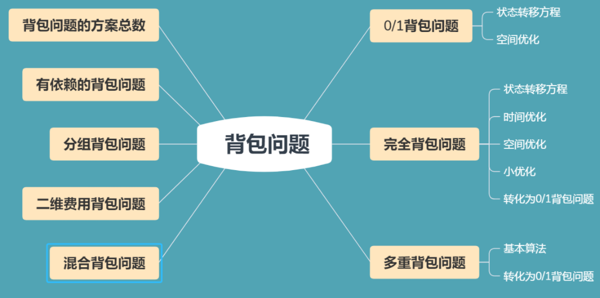

# 背包问题

所有背包问题的视频讲解参照：[y总2018年视频](https://www.bilibili.com/video/av33930433/)

主要背包问题模板整理：https://www.acwing.com/blog/content/228/

八类背包问题笔记整理：[点这里](https://valen.blog.csdn.net/article/details/87878853)

OI-wiki背包问题简单总结：https://oi-wiki.org/dp/knapsack/

本文仅介绍主要的四个背包问题，不会全部介绍背包九讲。

<!--more-->



## 1.01背包问题

特点：每件物品最多只能用一次。

蓝桥杯系列文章已有相关题解。

请参考这篇文章：https://www.grantdrew.top/posts/a75e4e46.html

## 2.完全背包问题

特点：每件物品有无限个。

### acwing.3.完全背包问题

```C++
有 N 种物品和一个容量是 V 的背包，每种物品都有无限件可用。
第 i 种物品的体积是 vi，价值是 wi。
求解将哪些物品装入背包，可使这些物品的总体积不超过背包容量，且总价值最大。
输出最大价值。

输入格式
第一行两个整数，N，V，用空格隔开，分别表示物品种数和背包容积。
接下来有 N 行，每行两个整数 vi,wi，用空格隔开，分别表示第 i 种物品的体积和价值。

输出格式
输出一个整数，表示最大价值。

数据范围
0<N,V≤1000
0<vi,wi≤1000
输入样例
4 5
1 2
2 4
3 4
4 5
输出样例：
10
```

思路：

参考题解：https://www.acwing.com/solution/content/10454/

y氏DP分析法：


三重循环（朴素）做法：数据加强后TLE，重在理解写法

```C++
// y总题解
// 注意:TLE
#include <iostream>
#include <algorithm>
using namespace std;

const int N = 1010;

int n,m;
int dp[N][N];
int v[N],w[N];
int main(){
    cin >> n >> m;

    for (int i = 1;i <= n;i++) cin >> v[i] >> w[i];

    // i从1开始枚举，j从0开始枚举
    for (int i = 1;i <= n;i++)
        for (int j = 0;j <= m;j++)
            for (int k = 0;k*v[i]<=j;k++)
                dp[i][j] = max(dp[i][j],dp[i-1][j-k*v[i]] + k*w[i]);
    cout << dp[n][m] << endl;
    return 0;
}
```

优化：

时间复杂度：O(n*m)。

减少一重循环。


对比01背包问题的状态转移方程是：`f[i][j] = max(f[i-1][j],f[i-1][j-v[i]]+w[i])`

我们很容易发现，01背包和完全背包的区别就在于第二项的第一维，前者是`i-1`，而后者是`i`。

```C++
#include <iostream>
#include <algorithm>
using namespace std;

const int N = 1010;

int n,m;
int dp[N][N];
int v[N],w[N];
int main(){
    cin >> n >> m;

    for (int i = 1;i <= n;i++) cin >> v[i] >> w[i];

    for (int i = 1;i <= n;i++)
        for (int j = 0;j <= m;j++){
            dp[i][j] = dp[i-1][j];// 特判第一种情况
            if (j >= v[i]) dp[i][j] = max(dp[i][j],dp[i][j-v[i]]+w[i]);
        }
        
    cout << dp[n][m] << endl;
    return 0;
}
```

因为和01背包代码很相像，我们很容易想到进一步优化。

这里先介绍降低第一维度的题解，在01背包中没有提到过。

就是将第一个维度直接&1，那么数据就会保存在`dp[0][x]`和`dp[1][x]`中。只要用到`dp[2][N]`这么大的数组就足够了。（这就是一个两层的滚动数组）

我们还可以再优化，边读入变处理。

```C++
#include <iostream>
#include <algorithm>
using namespace std;

const int N = 1010;

int n,m;
int dp[2][N];
int v,w;
int main(){
    cin >> n >> m;

    for (int i = 1;i <= n;i++){
        cin >> v >> w;
        for (int j = 0;j <= m;j++){
            dp[i&1][j] = dp[(i-1)&1][j];
            if (j >= v) dp[i&1][j] = max(dp[i&1][j],dp[i&1][j-v] + w);
        }
    }    
    cout << dp[n&1][m] << endl;
    return 0;
}
```

接下来是类似01背包的更优化的滚动数组。

利用滚动数组优化成一维：

由于完全背包用到的`dp[i][j-v[i]]`是第`i`（即本次）次的结果，不像01背包一样用到的是上一次的结果，所以可以直接正向枚举。

```C++
#include <iostream>
#include <algorithm>
using namespace std;

const int N = 1010;

int n,m;
int dp[N];
int v[N],w[N];
int main(){
    cin >> n >> m;

    for (int i = 1;i <= n;i++) cin >> v[i] >> w[i];

    for (int i = 1;i <= n;i++)
        for (int j = v[i];j <= m;j++){
            dp[j] = max(dp[j],dp[j-v[i]]+w[i]);
        }
        
    cout << dp[m] << endl;
    return 0;
}
```

## 3.多重背包问题

特点：每件物品有给定个数（有限个）。

### acwing.4.多重背包问题 I

```C++
有 N 种物品和一个容量是 V 的背包。
第 i 种物品最多有 si 件，每件体积是 vi，价值是 wi。
求解将哪些物品装入背包，可使物品体积总和不超过背包容量，且价值总和最大。
输出最大价值。

输入格式
第一行两个整数，N，V，用空格隔开，分别表示物品种数和背包容积。
接下来有 N 行，每行三个整数 vi,wi,si，用空格隔开，分别表示第 i 种物品的体积、价值和数量。

输出格式
输出一个整数，表示最大价值。

数据范围
0<N,V≤100
0<vi,wi,si≤100
输入样例
4 5
1 2 3
2 4 1
3 4 3
4 5 2
输出样例：
10
```

思路：

根据y氏DP分析法，参照上面的完全背包问题，很容易想到朴素做法：

```C++
#include <iostream>
#include <algorithm>
using namespace std;

const int N = 1010;

int dp[N][N];
int v[N],w[N],s[N];
int n,m;
int main(){
    cin >> n >> m;
    for (int i = 1;i <= n;i++) cin >> v[i] >> w[i] >> s[i];

    for (int i = 1;i <= n;i++){
        for (int j = 0;j <= m;j++){
            // 比完全背包多一个物品件数限制
            for (int k = 0;k <= s[i] && j >= k*v[i];k++)
                dp[i][j] = max(dp[i][j],dp[i-1][j-k*v[i]] + k*w[i]);
        }
    }
    cout << dp[n][m] << endl;
    return 0;
}
```

这题数据范围比较小，所以三重循环也能过。

### acwing.5. 多重背包问题 II

数据范围：

```C++
0<N≤1000
0<V≤2000
0<vi,wi,si≤2000
```

数据范围比上一题加强了。

朴素写法时间复杂度O(n^3) 接近 1e9，必超时。

那么需要优化解题思路了，我们是否可以尝试类似完全背包的二重优化呢？


由上图的两个式子，我们发现并不能推导出一个递推式。

 再考虑其他的思路：

二进制优化！（也就是倍增思想加速DP状态转移，快速缩小较大的状态空间）

我们知道任意一个实数可以由二进制数来表示，也就是`2^0~2^k`其中一项或几项的和。

下面给出两个例子：

假设对于一个物品，它有s=1023件。

那么我们可以用10组数字1,2,4,8,...,512来表示0到1023中的任意一个数字。

**简单证明一下：**

1可以表示出0和1；再加上2可以表示出2和3，一共是0到3；再加上4可以表示出4到7，一共是0到7；

以此类推，1到512可以表示出0到1023中的任意一个数字。

修改一下条件，s=200件。

那么我们可以用1,2,4,8,...,64,73来表示出0到200中的任意一个数字。

简单证明一下：

由上一个例子不难得出1,2,4,8,...,64可以表示出0到64*2-1，也就是0到127，再加上73，就能表示73到200，

合起来就能表示出0到200中的任意一个数字。

最后将s看成一个变量，看看如何处理：

如果`s > 2^(k+1) - 1`，显然有`c < 2^(k+1)`。


由1,2,4,8,...,2^k可以组合出0到2^(k+1) -1，

再补上c，就能组合出c到s（`s = 2^(k+1) -1 + c`），

最后再来判断两个区间是不是能完整地拼凑出区间[0,s]。

如果`c > 2^(k+1)`，则区间存在缝隙，又上面得到`c < 2^(k+1)`，所以区间[0,s]必然能完整拼凑。

时间复杂度为：`O(n*v*logs)`。

s件物品可以拆分成logs个小组求解01背包问题。

总之，每一小组有选和不选两种情况，这里有点像蓝桥杯"费解的开关"问题。

二进制优化思维就是：现在给出一堆苹果和10个箱子，选出n个苹果。将这一堆苹果分别按照

1,2,4,8,16,.....512分到10个箱子里，那么由于任何一个数字x ∈[1,1024]

都可以从这10个箱子里的苹果数量表示出来，但是这样选择的次数就是 ≤10次 。

```C++
#include <iostream>
#include <algorithm>
using namespace std;

// N的上限是n*logS == 1000*log2000
// M表示背包物品总体积不超过2010
const int N = 12000,M = 2010;

int n,m;
int v[N],w[N];
int dp[M];
int main(){
    cin >> n >> m;

    int cnt = 0;
    // 重新按二进制分组
    for (int i = 1;i <= n;i++){
        int a,b,s;
        cin >> a >> b >> s;
        int k = 1;
        while (k <= s){
            cnt++;//组别先增加，下标从1开始
            v[cnt] = a*k;//整体体积
            w[cnt] = b*k;// 整体价值
            s -= k;
            k *= 2;// k = 1,2,4,8,...
        }
        // 处理最后的剩余一组
        if (s > 0){
            cnt ++;
            v[cnt] = a*s;
            w[cnt] = b*s;
        }
    }
    n = cnt;//枚举次数由个数变成重新划分的组别数
	// 求解优化后的01背包问题
    for (int i = 1;i <= n;i++)
        for (int j = m;j >= v[i];j--)
            dp[j] = max(dp[j],dp[j-v[i]] + w[i]);
    
    cout << dp[m] << endl;
    return 0;
}
```

建议选一组数据手动模拟一下，会对二进制优化过程更清楚。

比如初始s=10，进入while循环，s,10-1=9，k=2；第二次，s=9-2=7，k=4；第三次，s=7-4=3，k=8；退出循

环，s有剩余，最后一组是3。

> 其实，多重背包问题还可以用单调队列进一步优化。

## 4.分组背包问题

特点：每组物品只能选一个。

### acwing.9. 分组背包问题

```C++
有 N 组物品和一个容量是 V 的背包。
每组物品有若干个，同一组内的物品最多只能选一个。
每件物品的体积是 vij，价值是 wij，其中 i 是组号，j 是组内编号。
求解将哪些物品装入背包，可使物品总体积不超过背包容量，且总价值最大。
输出最大价值。

输入格式
第一行有两个整数 N，V，用空格隔开，分别表示物品组数和背包容量。
接下来有 N 组数据：
每组数据第一行有一个整数 Si，表示第 i 个物品组的物品数量；
每组数据接下来有 Si 行，每行有两个整数 vij,wij，用空格隔开，分别表示第 i 个物品组的第 j 个物品的体积和价值；
    
输出格式
输出一个整数，表示最大价值。

数据范围
0<N,V≤100
0<Si≤100
0<vij,wij≤100
输入样例
3 5
2
1 2
2 4
1
3 4
1
4 5
输出样例：
8
```

思路：

根据y氏DP分析法：

分析思路和前面的01背包问题有相似之处。

对于每一组中的每个物品，只有选和不选两种状态。

相当于在01背包问题中多加了一个维度。


二维朴素做法：01背包问题其实可以看成是每一组只有1件物品的分组背包问题。

这里和01背包的区别就在于：01背包max的第一项是`dp[i-1][j]`，而分组背包max的第一项是`dp[i][j]`，

因为01背包每组只有1件物品，而分组背包每组有多件物品，需要每次更新最大值。

说明一下：01背包max的第一项也可以写成`dp[i][j]`，可以AC。

```C++
#include <iostream>
#include <algorithm>
using namespace std;

const int N = 110;
int n,m;
int dp[N][N];
int v[N][N],w[N][N],s[N];

int main(){
    cin >> n >> m;
    for (int i = 1;i <= n;i++){
        cin >> s[i];
        for (int j = 0;j < s[i];j++){
            cin >> v[i][j] >> w[i][j];
        }
    }
    
    for (int i = 1;i <= n;i++)
        for (int j = 0;j <= m;j++){
            dp[i][j] = dp[i-1][j];// 不选
            for (int k = 0;k < s[i];k++){// 选第k件
                if (j >= v[i][k])
                    dp[i][j] = max(dp[i][j],dp[i-1][j-v[i][k]] + w[i][k]);
            }
        }
    cout << dp[n][m] << endl;
    return 0;
}
```

类似01背包的滚动数组优化做法：

```C++
#include <iostream>
#include <algorithm>
using namespace std;

const int N = 110;

int n,m;
int v[N][N],w[N][N],s[N];
int dp[N];

int main(){
    cin >> n >> m;
    for (int i = 1;i <= n;i++){
        cin >> s[i];
        for (int j = 0;j < s[i];j++){
            cin >> v[i][j] >> w[i][j];
        }
    }

    for (int i = 1;i <= n;i++)
        // 逆序枚举j
        for (int j = m;j >= 0;j--){
            for (int k = 0;k < s[i];k++){
               // if判断不能放在for的条件判断里面，相当于break
                if (j >= v[i][k]) dp[j] = max(dp[j],dp[j-v[i][k]] + w[i][k]);
            }
        }
    cout << dp[m] << endl;
    return 0;
}
```
