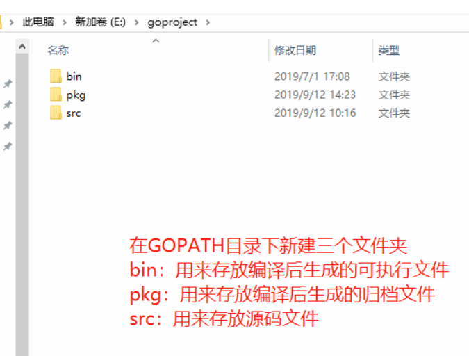

## 1.Golang简介

Go语言为并发而生，go语言（或 Golang）是Google开发的开源编程语言。

<!--more-->

一个Golang相关资源导航网站： https://www.topgoer.cn/。（非常棒）

Go语言中文文档： https://www.topgoer.cn/docs/golang/golang-1ccjbpfstsfi1。

在线交互式学习Golang： http://tour.studygolang.com/welcome/1。

菜鸟教程： https://www.runoob.com/go/go-tutorial.html。

go是非常年轻的一门语言，它的主要目标是“兼具Python 等动态语言的开发速度和C/C++等编译型语言的性能与安全性”。

## 2.第一个Go程序

在Goland-->project之下，一般会创建三个目录：



```Go
package main  // 声明 main 包，表明当前是一个可执行程序

import "fmt"  // 导入内置 fmt 

func main(){  // main函数，是程序执行的入口
    // 注意错误，{ 不能在单独的行上
    fmt.Println("Hello World!")  // 在终端打印 Hello World!
}
```

```go
所有的go源码都是以 ".go" 结尾。
```

如何运行Go语言代码？

```shell
$ go run hello.go  # go run命令：编译+执行
Hello, World!
```

你必须在源文件中非注释的第一行指明这个文件属于哪个包，如：package main。package main表示一个可独立执行的程序，每个 Go 应用程序都包含一个名为 main 的包。

*import "fmt"* 告诉 Go 编译器这个程序需要使用 fmt 包（的函数，或其他元素），fmt 包实现了格式化 IO（输入/输出）的函数。

main 函数是每一个可执行程序所必须包含的，一般来说都是在启动后第一个执行的函数（如果有 init() 函数则会先执行该函数）。

常用的打印输出的函数有`Print,Println`。

在Go中，一行表示一个语句结束。多个语句写在同一行，它们则必须使用 ; 人为区分，但在实际开发中我们并不鼓励这种做法。

## 3.格式化字符串

使用 **fmt.Sprintf** 格式化字符串并赋值给新串：

```Go
package main

import (
    "fmt"
)

func main() {
   // %d 表示整型数字，%s 表示字符串
    var stockcode=123
    var enddate="2020-12-31"
    var url="Code=%d&endDate=%s"
    var target_url=fmt.Sprintf(url,stockcode,enddate)
    fmt.Println(target_url)
}
```

