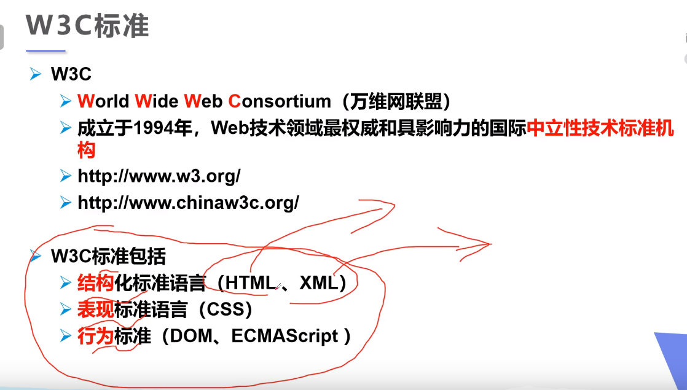
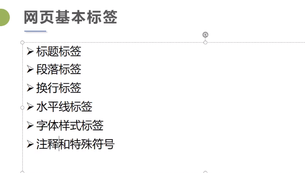
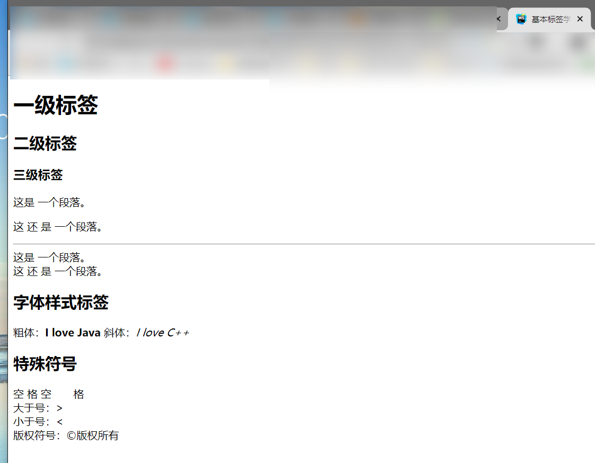
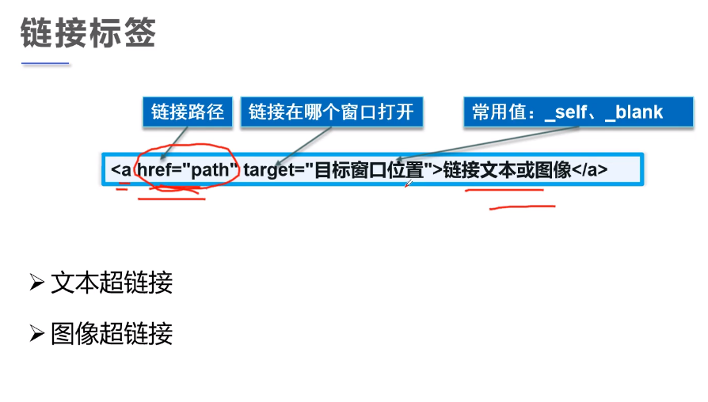

## 1.HTML简介

**超文本标记语言**（Hyper Text Markup Language，简称：HTML）是一种用于创建网页的标准标记语言。

2014年10月由**万维网联盟**（W3C）完成标准制定。

<!--more-->

推荐实战训练巩固知识：https://www.w3cschool.cn/codecamp/list?pename=html5_and_css_camp



```html
<!-- 第一个网页-->
<!-- 告诉浏览器使用说明规范-->
<!DOCTYPE html>
<!-- 显示内容必须包含在html标签之内-->
<html lang="en">
<!--网页头部-->
<head>
    <!--meta描述性标签，描述网站信息-->
    <!--一般用来做SEO-->
    <meta charset="UTF-8">
    <meta name="keywords" content="一起学Java">
    <meta name="description" content="来这里学Java">
    <!--title网页标题-->
    <title>Title</title>
</head>
<body>
hello,world!
<!--body代表网页主题-->
</body>
</html>
```

## 2.网页基本标签



```html
<!DOCTYPE html>
<html lang="en">
<head>
    <meta charset="UTF-8">
    <title>基本标签学习</title>
</head>
<body>
<!--标题标签-->
<h1>一级标签</h1>
<h2>二级标签</h2>
<h3>三级标签</h3>
<!--段落标签-->
<p>这是    一个段落。</p>
<p>这  还    是 一个段落。</p>
<!--水平线标签-->
<hr/>
<!--换行标签，间距比上面小，自闭合-->
这是    一个段落。<br>
这  还    是 一个段落。<br/>

<!--斜体与粗体-->
<h2>字体样式标签</h2>
粗体：<strong>I love Java</strong>
斜体：<em>I love C++</em>
<br/>
<h2>特殊符号</h2>
<!--空    格，实际只有一个空格-->
空     格
空&nbsp;&nbsp;&nbsp;&nbsp;&nbsp;&nbsp;&nbsp;格
<br>
大于号：&gt;
<br>
小于号：&lt;
<br>
版权符号：&copy;版权所有
<br>
<!--
多行注释
-->
<a name="down">底部</a>
</body>
</html>
```



### 图像标签

```html
<!DOCTYPE html>
<html lang="en">
<head>
    <meta charset="UTF-8">
    <title>图像</title>
</head>
<body>
<!--img标签学习
src: 图片地址,相对（推荐使用）、绝对路径
 ../  上一级目录
alt: 图片名字

src和alt必填
-->

</body>
</html>
```

### 链接标签



```html
<!DOCTYPE html>
<html lang="en">
<head>
    <meta charset="UTF-8">
    <title>链接</title>
</head>
<body>
<!--a标签
href : 必填，表示要跳转到哪个网页
target : 表示窗口在哪里打开
 _blank : 在新标签中打开链接
 _self : 在自己网页打开
-->
<!--使用name作为标记-->
<a name="top">顶部</a>
<a href="图像.html" target="_blank">点击查看初音未来</a>
<br/>
<a href="https://www.w3cschool.cn/html5/html5-intro.html" target="_self">点击学习html</a>
<br/>
<!--点击图像跳转-->
<a href="https://www.w3cschool.cn/html5/html5-intro.html">
    
</a>

<!--文字填充-->
<br/>
默认情况下，链接将以以下形式出现在浏览器中：

一个未访问过的链接显示为蓝色字体并带有下划线。
访问过的链接显示为紫色并带有下划线。
点击链接时，链接显示为红色并带有下划线。
<br/>
默认情况下，链接将以以下形式出现在浏览器中：

一个未访问过的链接显示为蓝色字体并带有下划线。
访问过的链接显示为紫色并带有下划线。
点击链接时，链接显示为红色并带有下划线。
<br/>
默认情况下，链接将以以下形式出现在浏览器中：

一个未访问过的链接显示为蓝色字体并带有下划线。
访问过的链接显示为紫色并带有下划线。
点击链接时，链接显示为红色并带有下划线。
<br/>
<!--锚链接
1.需要一个锚标记
2.跳转到标记
#
-->
<a href="#top">回到顶部</a>
<a href="基本标签学习.html#down">跳转底部</a>
<br/>

<!--功能性链接
邮件链接 ： mailto:
-->
<a href="mailto:2478881580@q.com">点击联系我</a>
</body>
</html>
```

