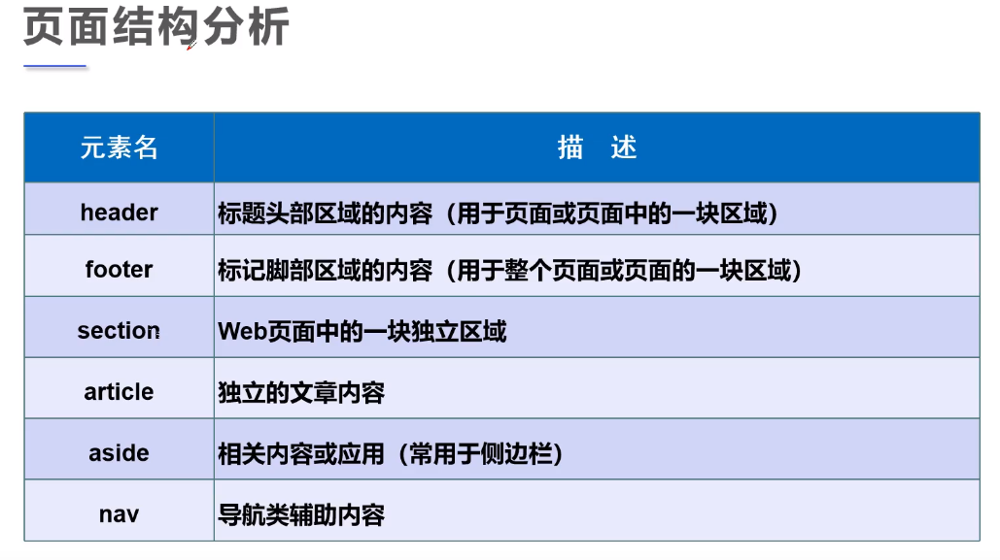
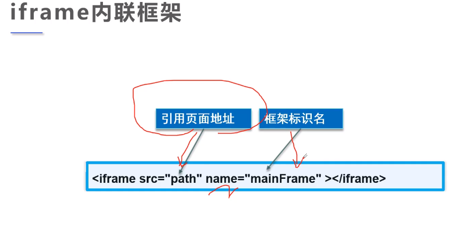
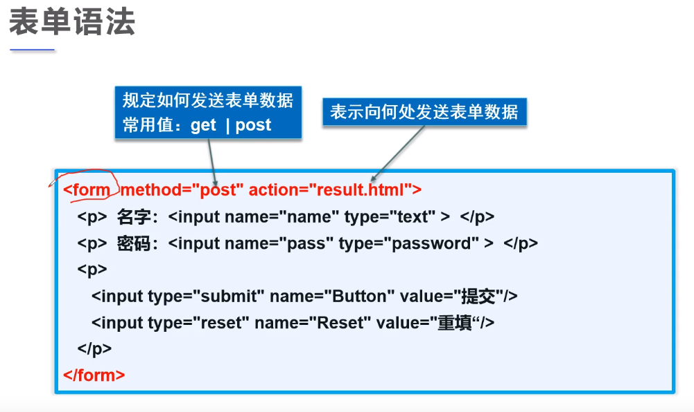
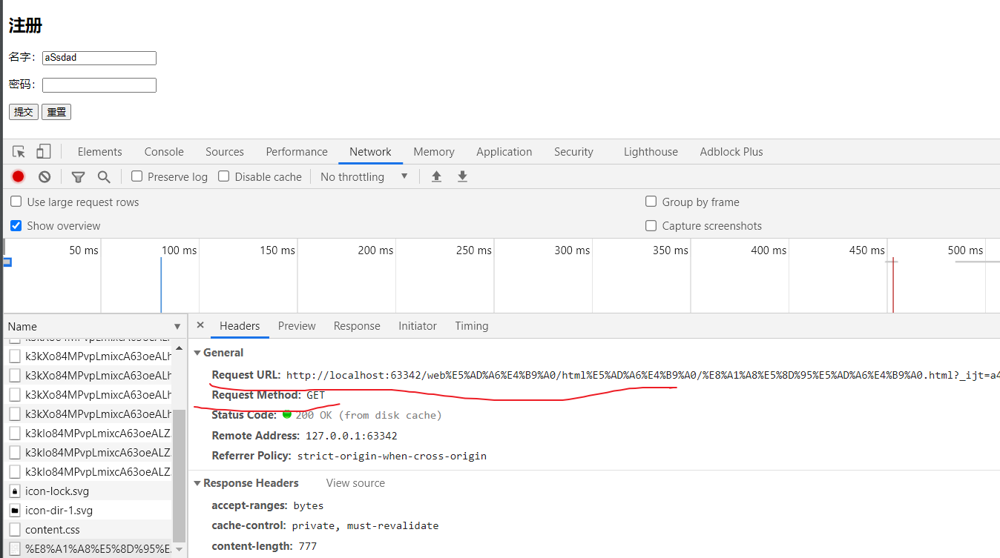
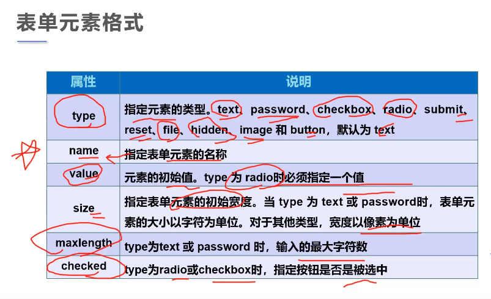

## 1.页面结构分析



<!--more-->

HTML <div> 标签，常用于组合块级元素，以便通过 CSS 来对这些元素进行格式化。

上图的标签也就是div标签的语义化标签，只是换个名字。

头部、脚部和导航比较重要。

```html
<!DOCTYPE html>
<html lang="en">
<head>
    <meta charset="UTF-8">
    <title>页面结构分析</title>
</head>
<body>
<header>
    <h2>网页头部</h2>
</header>
<section>
    <h2>网页主体</h2>
</section>
<footer>
    <h2>网页脚部</h2>
</footer>
</body>
</html>
```

## 2.iframe内联框架



```html
<!DOCTYPE html>
<html lang="en">
<head>
    <meta charset="UTF-8">
    <title>内联框架</title>
</head>
<body>
<!--内联框架
src: 地址
w-h：宽-高度
name：标识名
-->
<iframe src="https://www.baidu.com/"
        name="hello"
        frameborder="0"
        width="1200px" height="800px">
</iframe>
<a href="媒体元素.html" target="hello">点击跳转</a>
</body>
</html>
```

## 3.表单语法



```html
<!DOCTYPE html>
<html lang="en">
<head>
    <meta charset="UTF-8">
    <title>表单学习</title>
</head>
<body>
<h2>注册</h2>
<!--表单form
action: 表单提交的位置，可以是网站，也可以是一个请求处理地址
method：post，get 提交方式
get方式：可以在提交位置的url看到提交信息，不安全，高效
post方式：比较安全，传输大文件，可以在F12看到密码等信息
-->
<form action="表格.html" method="post">
<!--文本输入框：input type="text"-->
    <p>名字：<input type="text" name="username"></p>
<!--密码框：input type="password"-->
    <p>密码：<input type="password" name="pwd"></p>
<!--提交和重置-->
        <input type="submit">
        <input type="reset">
    </p>
</form>
</body>
</html>
```

post方式：在填写注册信息时，打开F12，查看network-->Headers.





name属性是必填的！！！

## 4.更多表单语法

单选框、多选框、按钮、下拉框、文本域、文件域、邮箱验证、url验证、数字验证、滑块、搜索框。

如果使用get方式，name对应的value可以在URL中看到。

```html
<!DOCTYPE html>
<html lang="en">
<head>
    <meta charset="UTF-8">
    <title>表单学习</title>
</head>
<body>
<h2>注册</h2>
<!--表单form
action: 表单提交的位置，可以是网站，也可以是一个请求处理地址
method：post，get 提交方式
get方式：可以在提交位置的url看到提交信息，不安全，高效
post方法：比较安全，传输大文件
-->
<form action="表格.html" method="get">
<!--文本输入框：input type="text"-->
<!--value="Java is best"  默认初始值
maxlength="8"  最长能写几个字符
size="30"  文本框的长度
-->
    <p>名字：<input type="text" name="username" value="Java is best" maxlength="8" size="30"></p>
<!--密码框：input type="password"-->
    <p>密码：<input type="password" name="pwd"></p>
    <p>性别：
<!--单选框：radio
checked表示默认值-->
<!--两个name属性一致才能进行唯一的选择
value：单选框的值
name：表示组名。同组只能选一个-->
        <input type="radio" value="boy" name="gender" checked/>男
        <input type="radio" value="girl" name="gender"/>女
    </p>
<!--多选框 checkbox
checked表示默认值
-->
    <p>爱好：
        <input type="checkbox" value="sleep" name="hobby" checked>睡觉
        <input type="checkbox" value="basketball" name="hobby">篮球
        <input type="checkbox" value="soccer" name="hobby">足球
        <input type="checkbox" value="art" name="hobby">艺术
    </p>
<!--button 普通按钮
image 图片按钮
submit 提交按钮
reset 重置按钮
-->
    <p>
        <input type="button" name="btn1" value="懂的都懂">
        <input type="image" src="../resources/image/miku.png" width="50" height="80">
    </p>
<!--下拉框和列表框select
selected表示默认值
-->
    <p>国家：
        <select name="country">
            <option value="CN">中国</option>
            <option value="US" selected>美国</option>
            <option value="UK">英国</option>
            <option value="FRC">法国</option>
        </select>
    </p>
<!-- 文本域 textarea
 cols="30" 30列
 rows="10" 10行-->
    <p>反馈：
        <textarea name="feedback" cols="30" rows="10">提交反馈</textarea>
    </p>
<!--  文件域input file
-->
    <p>
        <input type="file" name="files">
        <input type="button" value="文件" name="upload">
    </p>

<!--    邮件验证email
-->
    <p>邮箱：
        <input type="email" name="email">
    </p>
<!--    url验证url
-->
    <p>URL：
        <input type="url" name="url">
    </p>
<!--    数字验证number
最大值、最小值、步长-->
    <p>商品数量：
        <input type="number" name="num" max="100" min="0" step="10">
    </p>

<!--    滑块range
最大值、最小值、步长-->
    <p>音量：
        <input type="range" name="voice" max="100" min="0" step="1">
    </p>
<!--    搜索框search
-->
    <p>搜索：
        <input type="search" name="search">
    </p>
<!--提交和重置-->
    <p>
        <input type="submit">
        <input type="reset" value="清空表单">
    </p>
</form>
</body>
</html>
```

