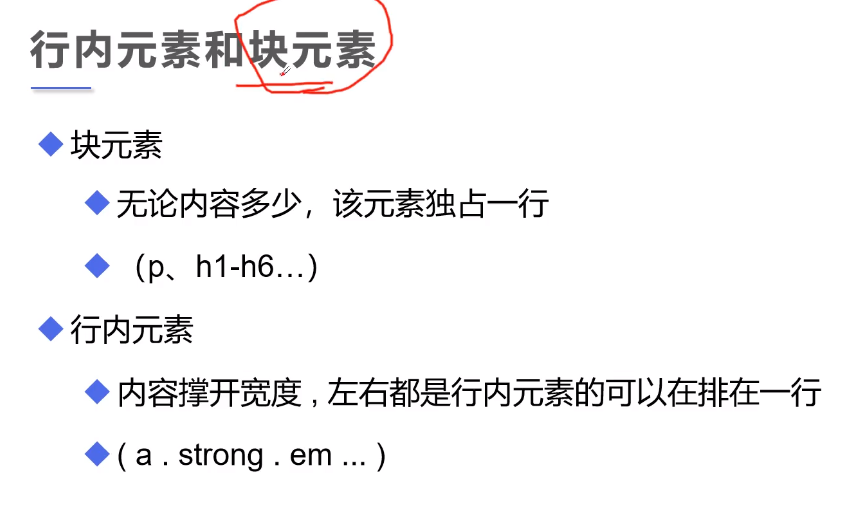
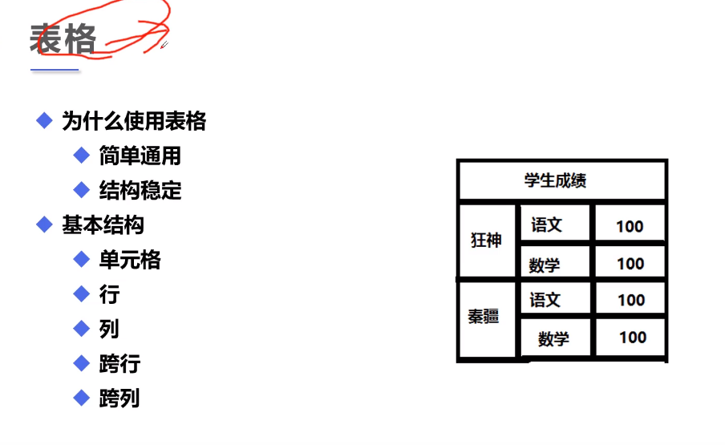

## 1.行内元素和块元素



<!--more-->

## 2.列表

- 有序列表
- 无序列表
- 自定义列表

```html
<!DOCTYPE html>
<html lang="en">
<head>
    <meta charset="UTF-8">
    <title>列表学习</title>
</head>
<body>
<!--有序列表 orderlist
按123排序
-->
<ol>
    <li>Java</li>
    <li>C++</li>
    <li>C</li>
    <li>Python</li>
    <li>PHP</li>
    <li>Go</li>
    <li>JavaScript</li>
</ol>
<hr/>
<!--无序列表 unorderlist
按圆点分隔
应用：导航栏，侧边栏
-->
<ul>
    <li>Java</li>
    <li>C++</li>
    <li>C</li>
    <li>Python</li>
</ul>
<hr>
<!--自定义列表
dl : 标签
dt : 列表名称
dd : 列表内容
应用：一些网站的底部
-->
<dl>
    <dt>Language</dt>

    <dd>Python</dd>
    <dd>Java</dd>
    <dd>C++</dd>

    <dt>Cities</dt>

    <dd>西安</dd>
    <dd>合肥</dd>
</dl>
</body>
</html>
```

## 3.表格



```html
<!DOCTYPE html>
<html lang="en">
<head>
    <meta charset="UTF-8">
    <title>表格</title>
</head>
<body>
<!--表格table
行：tr
列：td
border:添加边框
-->
<table border="1px">
    <tr>
        <!--跨列colspan-->
        <td colspan="3">1-1</td>
<!--        <td>1-2</td>-->
<!--        <td>1-3</td>-->
    </tr>
    <tr>
        <!--跨行rowspan-->
        <td>2-1</td>
        <td rowspan="2">2-2</td>
        <td>2-3</td>
    </tr>
    <tr>
        <td>3-1</td>
<!--        <td>3-2</td>-->
        <td>3-3</td>
    </tr>
</table>
</body>
</html>
```

## 4.视频和音频

```html
<!DOCTYPE html>
<html lang="en">
<head>
    <meta charset="UTF-8">
    <title>媒体元素</title>
</head>
<body>
<!--视频
src：路径
controls：视频控制条，不加看不到视频
autoplay：自动播放，chrome现在好像不行，其他浏览器可以
-->
<!--<video src="../resources/video/girlbythesea.mp4" controls autoplay></video>-->

<audio src="../resources/audio/music.mp3" controls autoplay></audio>
</body>
</html>
```

