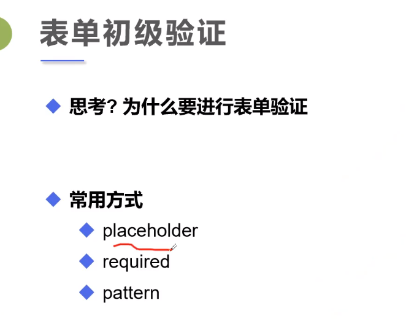

## 1.表单的应用

1. 隐藏域
2. 只读
3. 禁用

<!--more-->

```html
<!--只读 readonly-->
<p>名字：<input type="text" name="username" value="admin" readonly></p>
```

```html
<!--禁用 disabled-->
<input type="radio" value="boy" name="gender" disabled/>男
```

```html
<!--隐藏 hidden密码框并设定value的默认值-->
<p>密码：<input type="password" name="pwd" value="123456" hidden></p>
```

```html
<!--增强鼠标可用性-->
<!--拓展内容-->
    <p>
        <label for="mark">点击有惊喜</label>
        <input type="text" id="mark">
    </p>
<!--id可以放在你想放的位置-->
```

## 2.表单的初级验证



```html
palceholder用在输入框中，提示信息
<p>名字：<input type="text" name="username" placeholder="请输入用户名"></p>

required要求输入非空，用在输入框中
<p>反馈：
    <textarea name="feedback" cols="30" rows="10" required></textarea>
</p>

pattern正则表达式
直接百度搜索CV就行
别人写好的可以直接用
<p>自定义邮箱：
    <input type="text" name="diymail" pattern="^[a-zA-Z0-9_-]+@[a-zA-Z0-9_-]+(\.[a-zA-Z0-9_-]+)+$">
</p>
```

HTML简单入门系列到这里正式结束！！！