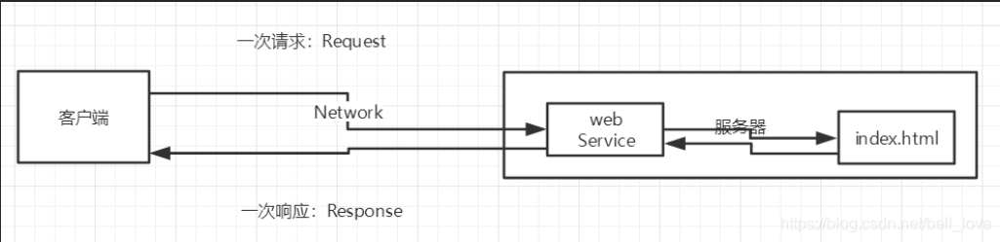
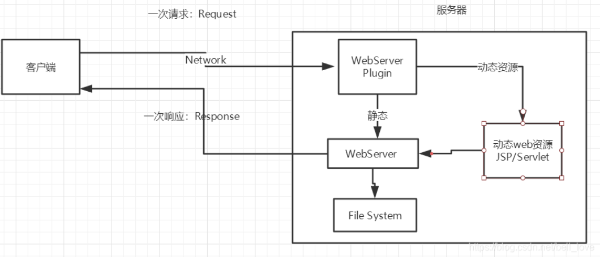
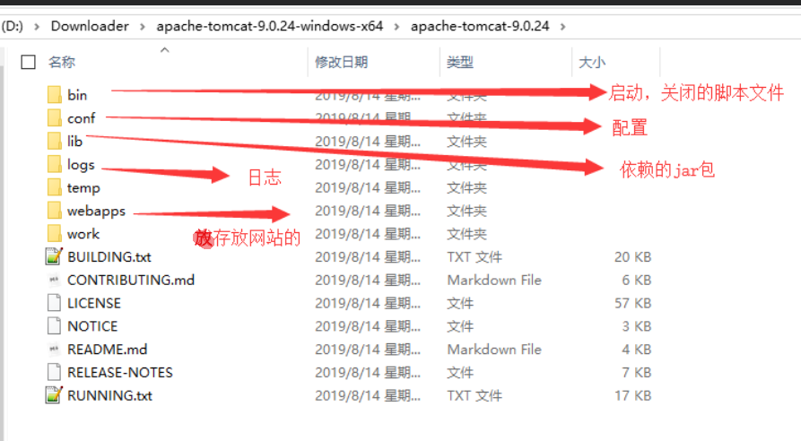
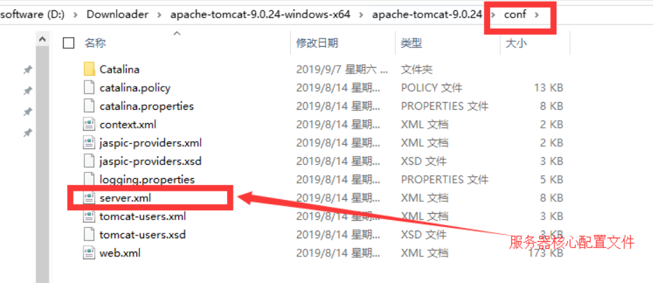

## 1.Java Web学习

视频教程： https://www.bilibili.com/video/BV12J411M7Sj。

<!--more-->

配套笔记： https://blog.csdn.net/bell_love/article/details/105667638。

相关课件： 尚硅谷Java web课件。

Java Web教程1： https://www.liaoxuefeng.com/wiki/1252599548343744/1304265903570978。

Java Web教程2：https://caochenlei.blog.csdn.net/article/details/108544801。

一个很全面的Java学习网站： https://how2j.cn/stage/13.html。

全面的Java开发知识栈： https://blog.csdn.net/qq_38490457/article/details/108281646。

非常棒的WEb Docs网站： https://developer.mozilla.org/en-US/。（英文，包含http等各种基础文档）

web开发：

web，网页的意思，www.baidu.com。

静态web：html,css，提供给所有人看的数据始终不会发生变化！

动态web：淘宝，几乎是所有的网站。

提供给所有人看的数据始终会发生变化，每个人在不同的时间，不同的地点看到的信息各不相同！

技术栈：Servlet/JSP，ASP，PHP。

在Java中，动态Web资源开发的技术统称为Java Web。

## 2.什么是web应用程序

可以提供浏览器访问的程序。

- a.html、b.html.….多个web资源，这些web资源可以被外界访问，对外界提供服务
- 你们能访问到的任何一个页面或者资源，都存在于这个世界的某一个角落的计算机上

- 这个统一的web资源会被放在同一个文件夹下，web应用程序>Tomcat：服务器

- 一个web应用由多部分组成（静态web，动态web)
    - html,css,js
    - jsp,servlet
    - Java程序
    - jar包
    - 配置文件（Properties)

Web应用程序编写完毕后，若想提供给外界访问，需费一个服务器来统一管理。

## 3.静态Web

*.htm， *.html这些都是网员的后境、如果服务器上一直存在这些东四，我们就可以直接进行读取、需要网络。



- 静态web存在的缺点
    - Web页面无法动态更新，所有用户看到都是同一个页面
        - 轮播图，点击特效：伪动态
        - JavaScript[实际开发中，它用的最多]
        - VBScript
    - 它无法和数据库交互（数据无法持久化，用户无法交互）

## 4.动态Web

页面会动态展示，“web页面的展示效果因人而异”。



缺点：

- 加入服务器的动态web资源出现了错误，我们需要重新编写我们的后台程序，重新发布；
    - 停机维护

优点：

- Web页面可以动态更新，所有用户看到都不是同一个页面
- 它可以与数据库交互（数据持久化：注册，商品信息，用户信息………）

## 5.Web技术发展简述

**ASP:**

- 微软：国内最早流行的就是ASP； C#
- ·在HTML中嵌入了VB的脚本，ASP+COM；
- ·在ASP开发中，基本一个页面都有几干行的业务代码，页面极其混乱；
- ·维护成本高！

**php:**

- PHP开发速度很快，功能很强大，跨平台，代码很简单（70%，WP）
- ·无法承载大访问量的情况（局限性）

**jSP/Servlet:**

主推B/S架构：浏览和服务器；   C/S：客户端和服务器

- sun公司主推的B/S架构；
- 基于Java语言的（所有的大公司，或者一些开源的组件，都是用Java写的）；
- 可以承载三高问题带来的影响；（高并发，高可用，高性能）
- 语法像ASP，ASP->JSP，加强市场强度。

## 6.Web服务器

服务器是一种被动的操作，用来处理用户的一些请求和给用户一些响应信息。

**lIS**：微软的；ASP.,Windows中自带的。

**Tomcat**：对于一个Java初学web的人来说，它是最佳的选择。Tomcat 实际上运行JSP页面和Serlet。

## 7.Tomcat详解

Tomcat的下载配置百度就行。（下载压缩包）

文件结构：



启动：点击bin目录下的start.bat；

关闭：把命令行窗口关掉。或者点击shutdown.bat。

测试页面： http://localhost:8080/。

Tomcat配置：



可以配置启动的端口号

- tomcat的默认端口号为：8080
- mysql:3306
- http:80
- https:443

```xml
<Connector port="8081" protocol="HTTP/1.1"
      connectionTimeout="20000"
      redirectPort="8443" />
```

可以配置主机的名称

- 默认的主机名为：localhost->127.0.0.1
- 默认网站应用存放的位置为：webapps目录

```xml
  <Host name="www.qinjiang.com"  appBase="webapps"
        unpackWARs="true" autoDeploy="true">
```

一道面试题：请你谈谈网站是如何进行访问的！

1. 输入一个域名；回车

2. 检查本机的C:\Windows\System32\drivers\etc\hosts配置文件下有没有这个域名映射；

    1. 有：直接返回对应的ip地址，这个地址中，有我们需要访问的web程序，可以直接访问

        ` 127.0.0.1 www.qinjiang.com`

     2. 没有：去DNS服务器找，找到的话就返回，找不到就返回找不到

浏览器查看网页的IP地址和端口号：F12-->Network-->刷新一下网页-->Name-->查看Remote Address。

