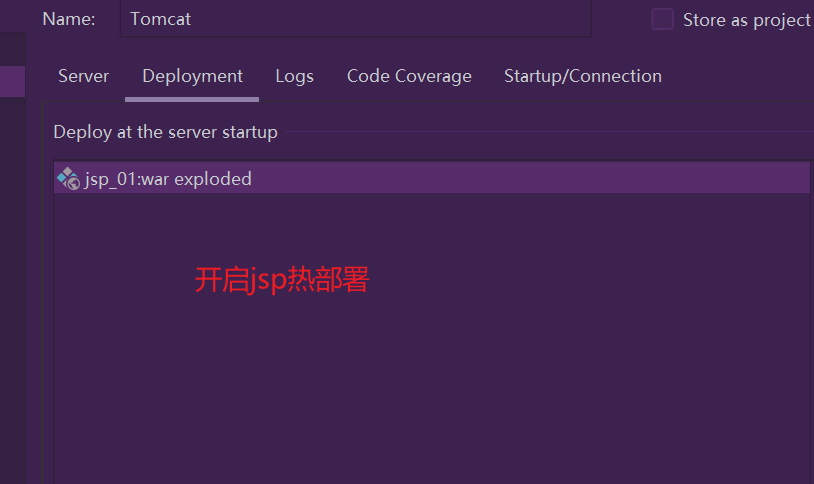
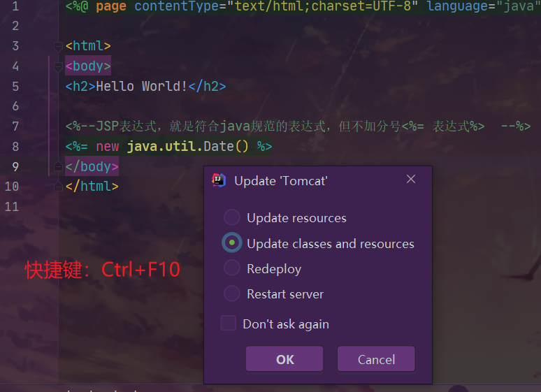

## 1.JSP基础语法

<!--more-->

> JSP细节内容可以不用掌握，如有必要看PPT或者[博客](https://caochenlei.blog.csdn.net/article/details/108544801)第七章或者尚硅谷Java web课件或者菜鸟教程。

一个`hello.jsp`文件：

```jsp
<%@ page contentType="text/html;charset=UTF-8" language="java" %>
<html>
<head>
    <title>Title</title>
</head>
<body>
<%  
    String name = "kuangshen";
%>

<h1>name = <%=name%></h1>
</body>
</html>
```

访问 http://localhost:8080/servlet_02_war/hello.jsp  ，可以看到name被解析出来了。

在`pom.xml`中导入`jstl`和`standard`依赖：

```xml
<dependency>
    <groupId>javax.servlet</groupId>
    <artifactId>jstl</artifactId>  // jstl标签
    <version>1.2</version>
</dependency>
<dependency>
    <groupId>taglibs</groupId>
    <artifactId>standard</artifactId>  // 标签库
    <version>1.1.2</version>
</dependency>
```

**JSP了解即可，不需要掌握细节！**

jsp热部署：idea热部署（更新jsp代码不用重编译Tomcat）。





### JSP表达式

一个JSP表达式中包含的脚本语言表达式，先被转化成String，然后插入到表达式出现的地方。

表达式元素中可以包含任何符合Java语言规范的表达式，但是不能使用分号来结束表达式。

### JSP脚本片段

```jsp
<%--JSP表达式，就是符合java规范的表达式，但不加分号<%= 表达式%>  --%>
<%= new java.util.Date() %>

<%--JSP脚本片段--%>
<%
    int sum = 0;
    for (int i = 0;i <= 100;i ++) sum += i;
    out.write("<h3>Sum = " + sum + "</h3>");
%>

<%--在代码嵌入HTML元素--%> // 在一个JSP中多个<%%>是相通的
<%
	for (int i = 0; i < 5; i++) {
%>
	<h1>Hello,World  <%=i%> </h1>
<%
}
%>
```

JSP脚本片段一般就会被生成到_jspService方法中。

### JSP声明

```jsp
  <%!
    static {
      System.out.println("Loading Servlet!");
    }

    private int globalVar = 0;

    public void kuang(){
      System.out.println("进入了方法Kuang！");
    }
  %>
```

JSP声明：会被编译到JSP生成Java的类中！其他的脚本，就会被生成到_jspService方法中！

JSP的注释，不会在客户端显示，HTML就会！

### JSP指令

JSP指令用来设置整个JSP页面相关的属性，如网页的编码方式和脚本语言。

语法格式：`<%@ 指令 属性="值" %>`

**三种指令：**

| **指令**         | **描述**                                                |
| ---------------- | ------------------------------------------------------- |
| <%@ page … %>    | 定义网页依赖属性，比如脚本语言、error页面、缓存需求等等 |
| <%@ include … %> | 包含其他文件                                            |
| <%@ taglib … %>  | 引入标签库的定义                                        |

```jsp
<%@page args.... %>
<%@include file=""%>

<%--@include会将两个页面合二为一--%>

<%@include file="common/header.jsp"%>
<h1>网页主体</h1>

<%@include file="common/footer.jsp"%>

<hr>


<%--jSP标签
    jsp:include：拼接页面，本质还是三个
    --%>
<jsp:include page="/common/header.jsp"/>
<h1>网页主体</h1>
<jsp:include page="/common/footer.jsp"/>
```

#### page指令

page指令为容器提供当前页面的使用说明，一个JSP页面可以包含多个page指令。

**第一种格式：**

`<%@ page 属性="值" %>`

**第二种格式：**

`<jsp:directive.page 属性="值" />`

#### include指令

JSP可以通过include指令来包含其他文件，被包含的文件可以是JSP文件、HTML文件或文本文件，包含的文件就好像是该JSP文件的一部分，会被同时编译执行。

**第一种格式：**

`<%@ include file="文件相对url地址" %>`

**第二种格式：**

`<jsp:directive.include file="文件相对url地址" />`

#### taglib指令

JSP允许用户自定义标签，一个自定义标签库就是自定义标签的集合，taglib指令引入一个自定义标签集合的定义，包括库路径、自定义标签。

### 9大内置对象

- PageContext 存东西
- Request 存东西
- Response
- Session 存东西
- Application 【SerlvetContext】 应用上下文，存东西
- config 【SerlvetConfig】
- out 输出信息
- page ，不用了解
- exception

JSP的四大作用域：作用域从低到高排列。

```java
pageContext.setAttribute("name1","秦疆1号"); //保存的数据只在一个页面中有效
request.setAttribute("name2","秦疆2号"); //保存的数据只在一次请求中有效，请求转发会携带这个数据
session.setAttribute("name3","秦疆3号"); //保存的数据只在一次会话中有效，从打开浏览器到关闭浏览器
application.setAttribute("name4","秦疆4号");  //保存的数据只在服务器中有效，从打开服务器到关闭服务器
```

request：客户端向服务器发送请求，产生的数据，用户看完就没用了，比如：新闻，用户看完没用的！

session：客户端向服务器发送请求，产生的数据，用户用完一会还有用，比如：购物车；

application：客户端向服务器发送请求，产生的数据，一个用户用完了，其他用户还可能使用，比如：聊天数据。