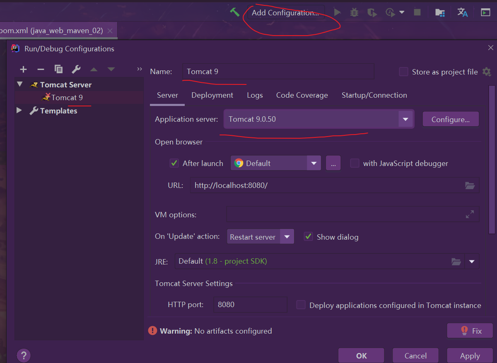
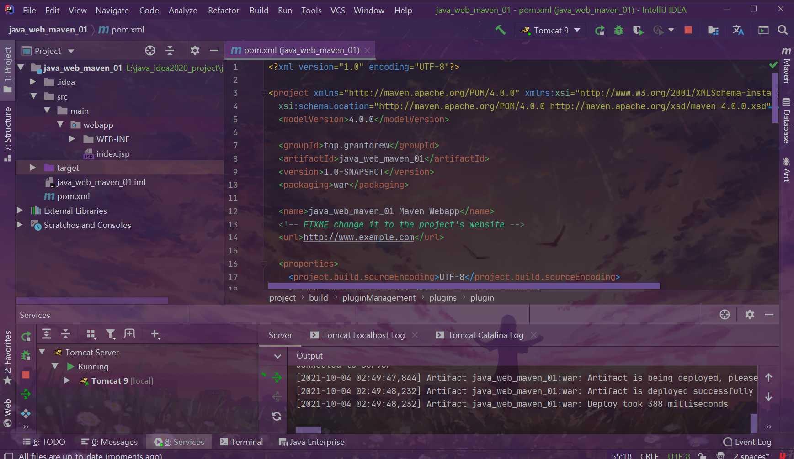
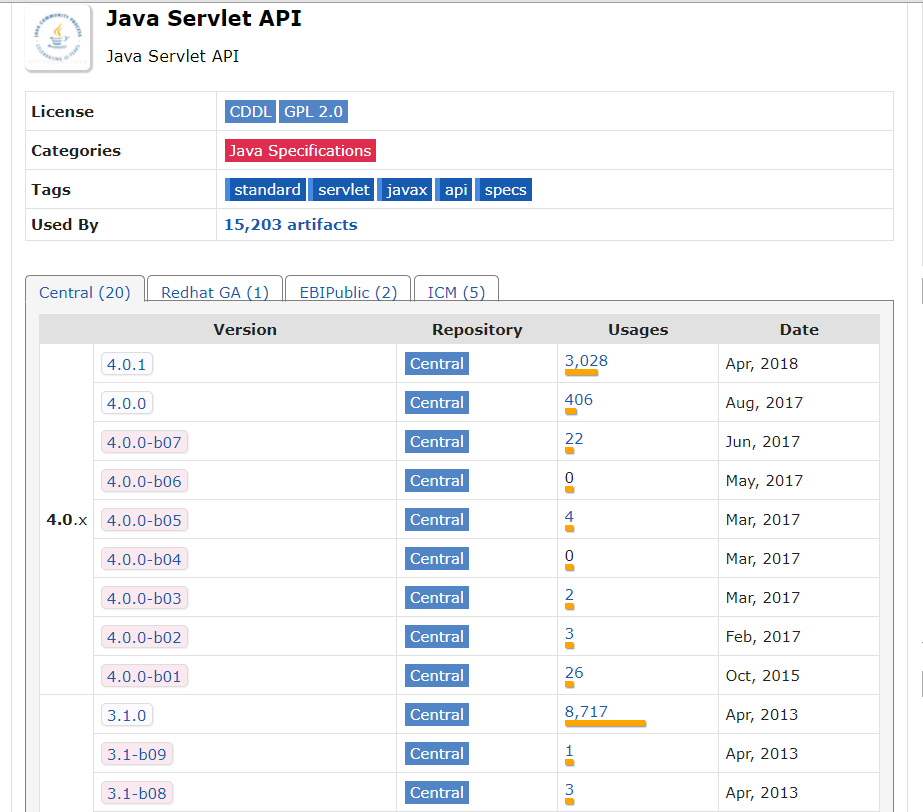
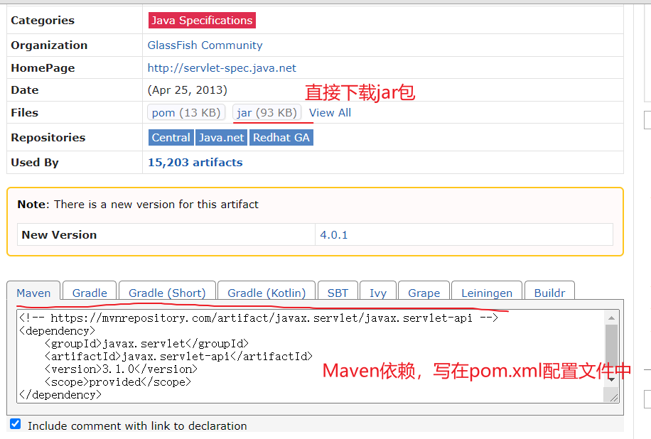
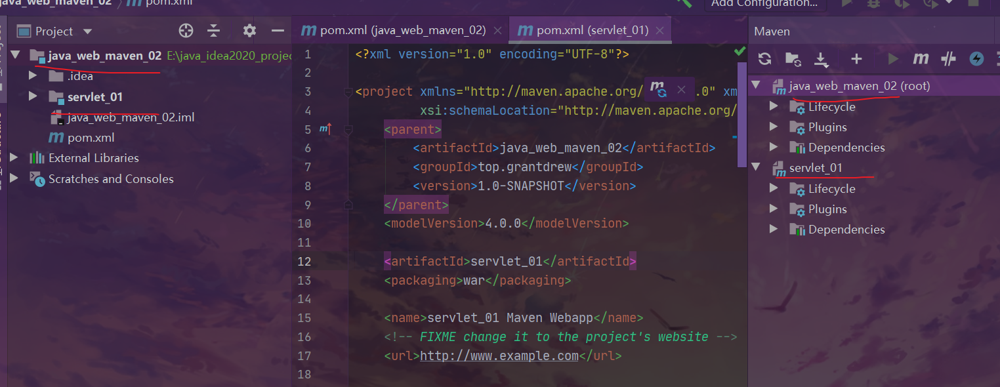
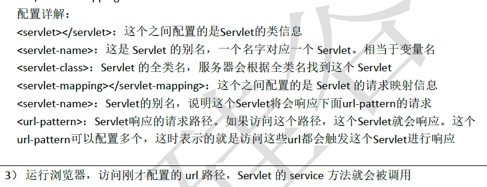
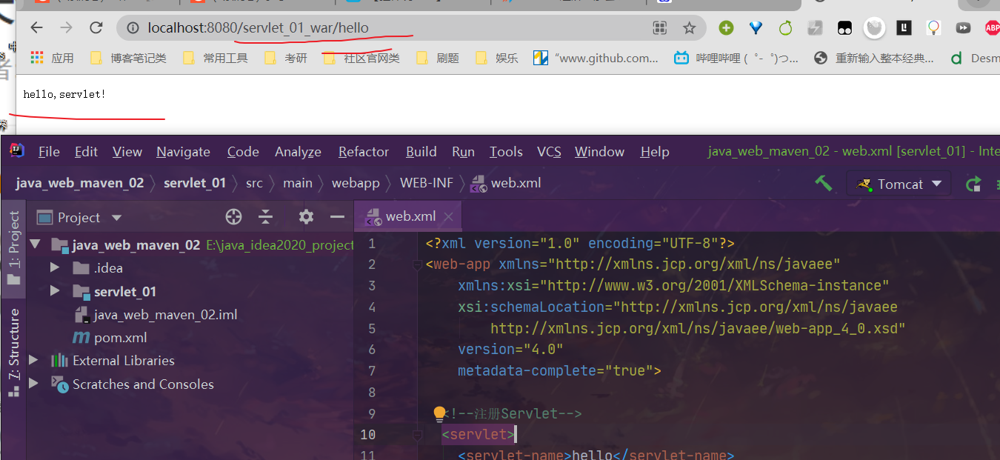
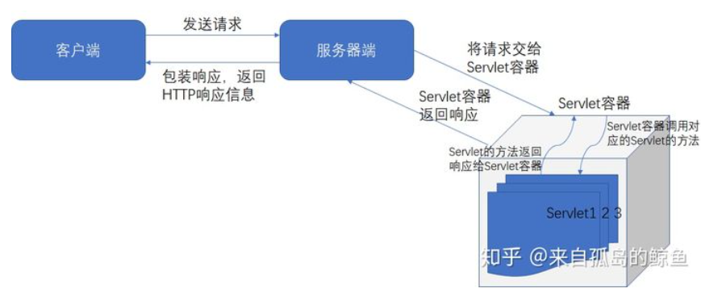
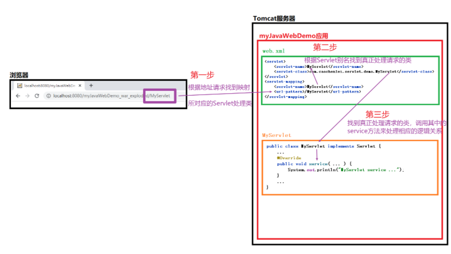

## 1.idea中配置Tomcat

<!--more-->

注意是在Maven Web项目中配置Tomcat，不是Maven空项目！

看清楚，不要选成了Tomcat EE server。

配置Tomcat选择local：

成功运行Tomcat：

浏览器会显示默认的index.jsp中的hello,world!

## 2.Maven的核心配置文件：pom.xml

由于Maven的标准结构**约定大于配置**，可能出现资源导出失败的问题：

在`<build></build>`中配置resources，来防止资源导出失败的问题。

- IDEA中每次新建项目都要重新配置Maven？

- 解决方案：在全局默认中配置Maven，在IDEA启动时，点击右下角Configure-->Settings配置。

使用Maven仓库导入本地仓库不存在的jar包：

**maven仓库： https://mvnrepository.com/。**

搜索需要的jar包，看看哪个版本用的人多。



放在`<dependencies></dependencies>`之间。

## 3.HelloServlet

Servlet虽然已经是过时的技术了，但还是有必要学的，对于后面框架的学习有帮助。

**事实上，servlet就是一个Java接口**，interface! 

Java Servlet 是运行在 **Web 服务器或应用服务器**上的**程序**，它是作为来自 Web 浏览器或其他 HTTP 客户端的**请求**和 HTTP **服务器上的数据库或应用程序**之间的**中间层**。使用 Servlet，您可以收集来自网页表单的用户输入，呈现来自数据库或者其他源的记录，还可以动态创建网页。

总结：开发动态web的一门技术。

开发一个servlet程序的两个步骤：

- 编写一个类，实现Servlet接口；
- 把开发好的java类部署到web服务器中。

构建一个空白的Maven项目，把src目录删除，以后在这个项目中创建模块，这个空白工程就是Maven的主工程。

```xml
<!--servelt api需要用到的maven依赖-->
<dependencies>
    <!-- https://mvnrepository.com/artifact/javax.servlet/javax.servlet-api -->
    <dependency>
        <groupId>javax.servlet</groupId>
        <artifactId>javax.servlet-api</artifactId>
        <version>4.0.0</version>
        <scope>provided</scope>
    </dependency>
</dependencies>
```

在项目下新建模块：**外面的项目是空白项目，里面的模块选择Maven web**。

关于Maven父子工程的理解：

```xml
<!--父工程：-->
<modules>
    <module>servlet-01</module>
</modules>
<!--子项目：-->
<parent>
    <artifactId>javaweb-02-servlet</artifactId>
    <groupId>com.kuang</groupId>
    <version>1.0-SNAPSHOT</version>
</parent>
<!--父项目中的jar包，子项目可以直接使用-->
```

Maven环境优化：

修改模块下的web.xml。（也可以用自带的）

```xml
<?xml version="1.0" encoding="UTF-8"?>
<web-app xmlns="http://xmlns.jcp.org/xml/ns/javaee"
    xmlns:xsi="http://www.w3.org/2001/XMLSchema-instance"
    xsi:schemaLocation="http://xmlns.jcp.org/xml/ns/javaee
        http://xmlns.jcp.org/xml/ns/javaee/web-app_4_0.xsd"
    version="4.0"
    metadata-complete="true">
</web-app>
```

**编写一个Servlet程序**

1. 编写一个普通类
2. 实现Servlet接口，这里我们直接继承HttpServlet

HttpServlet又继承自抽象类GenericServlet。

```java
import javax.servlet.*;
import java.io.*;

public class HelloServlet extends HttpServlet {
    // 重写doGet和doPost方法
    // 由于get或者post只是请求实现的不同的方式，可以相互调用，业务逻辑都一样
    @Override
    protected void doGet(HttpServletRequest req, HttpServletResponse resp) throws ServletException, IOException {
        PrintWriter writer = resp.getWriter(); // 响应流
        writer.print("<h1>hello,servlet!</h1>"); // 访问xxx/hello看到h1标题
    }

    @Override
    protected void doPost(HttpServletRequest req, HttpServletResponse resp) throws ServletException, IOException {
        doGet(req,resp);
    }
}
```

一个Servlet总是继承自`HttpServlet`，然后覆写`doGet()`或`doPost()`方法。注意到`doGet()`方法传入了`HttpServletRequest`和`HttpServletResponse`两个对象，分别代表HTTP请求和响应。我们使用Servlet API时，并不直接与底层TCP交互，也不需要解析HTTP协议，因为`HttpServletRequest`和`HttpServletResponse`就已经封装好了请求和响应。以发送响应为例，我们只需要设置正确的响应类型，然后获取`PrintWriter`，写入响应即可。

**所谓的Request和Response是Tomcat传给servlet的，用来处理请求和响应的工具，但它本身不处理这些。**

编写servlet的映射：

为什么需要映射？

我们写的是JAVA程序，但是要通过浏览器访问，而浏览器需要连接web服务器，所以我们需
要在web服务中注册我们写的Servlet，还需给他一个浏览器能够访问的路径。

在web.xml的<web-app>标签中添加下面内容：

```xml
 <!--注册Servlet-->
  <servlet>
    <servlet-name>hello</servlet-name>
    <servlet-class>top.grantdrew.HelloServlet</servlet-class>
  </servlet>
  <!--Servlet的请求路径-->
  <servlet-mapping>
    <servlet-name>hello</servlet-name>
    <url-pattern>/hello</url-pattern> //  注意hello前面的/
  </servlet-mapping>
```



**mapping映射问题：**

一个Servlet可以指定一个映射路径，就像上面的例子；

一个servlet可以指定多个映射路径，

```xml
 <servlet-mapping>
          <servlet-name>hello</servlet-name>
          <url-pattern>/hello</url-pattern>
</servlet-mapping>
<servlet-mapping>
          <servlet-name>hello</servlet-name>
          <url-pattern>/hello2</url-pattern>
 </servlet-mapping>
```

一个servlet可以指定通用映射路径，

```xml
<servlet-mapping>
          <servlet-name>hello</servlet-name>
          <url-pattern>/hello/*</url-pattern>
</servlet-mapping>
```

默认请求路径，

```xml
<!--默认请求路径-->
<servlet-mapping>
           <servlet-name>hello</servlet-name>
           <url-pattern>/*</url-pattern>
 </servlet-mapping>
```

指定一些后缀或者前缀等等…

```xml
<!--可以自定义后缀实现请求映射
 注意点，*前面不能加项目映射的路径
hello/sajdlkajda.qinjiang
 -->
<servlet-mapping>
      <servlet-name>hello</servlet-name>
      <url-pattern>*.qinjiang</url-pattern>
</servlet-mapping>
```

优先级：指定了固有的映射路径优先级最高，如果找不到就会走默认的处理请求，

```xml
<!--404-->
<servlet>
      <servlet-name>error</servlet-name>
      <servlet-class>com.kuang.servlet.ErrorServlet</servlet-class>
</servlet>
<servlet-mapping>
      <servlet-name>error</servlet-name>
      <url-pattern>/*</url-pattern>
</servlet-mapping>
```

接下来配置Tomcat：

配置好项目发布的路径。

启动Tomcat测试：这个`/servlet_01_war`是在Tomcat配置中设置的，可以修改名字。

## 4.Servlet运行原理

Servlet是由Web服务器调用，web服务器在收到浏览器请求之后，会：

Web服务器在与客户端交互时Servlet的工作过程是:

1.在客户端对web服务器发出请求.

2.web服务器接收到请求后将其发送给Servlet.

3.Servlet容器为此产生一个实例对象并调用ServletAPI中相应的方法来对客户端HTTP请求进行处理,然后将处理的响应结果返回给Web服务器.

4.web服务器将从Servlet实例对象中收到的响应结构发送回客户端.

整体理解：



代码理解：


