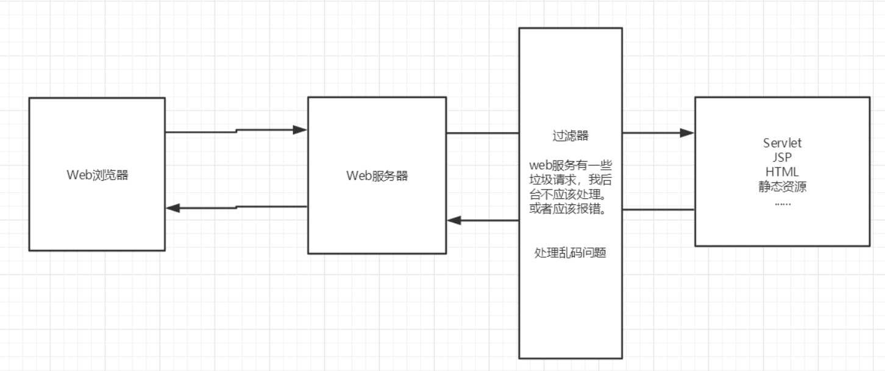
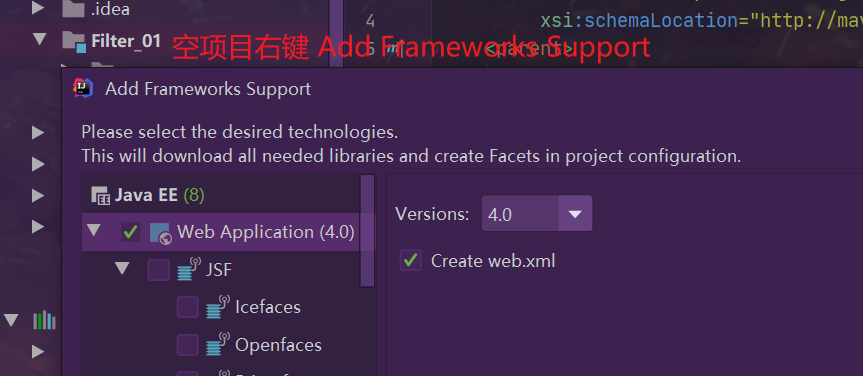

## 1.Filter

Filter是过滤器，就是对客户端发出来的请求进行过滤。浏览器发出请求，然后服务器派servlet处理。在中间就可以过滤，其实过滤器起到的是拦截的作用。使用过滤器可以对一些敏感词汇进行过滤、统一设置编码、实现自动登录等功能。

<!--more-->



参考博客： https://www.liaoxuefeng.com/wiki/1252599548343744/1266264823560128。

新建Maven空项目。



Filter开发步骤：

1. 导包
2. 编写过滤器，和servlet类似

这里导mysql，servlet，jsp，jstl和standard五个包。

```xml
<dependency>
    <groupId>mysql</groupId>
    <artifactId>mysql-connector-java</artifactId>
    <version>5.1.47</version>
</dependency>
```

在java目录下新建两个包(servlets和filters)：

创建`CharacterEncodingFilter.java`和`ShowServlet.java`。

```java
public class CharacterEncodingFilter implements Filter {

    //初始化：web服务器启动，就以及初始化了，随时等待过滤对象出现！
    @Override
    public void init(FilterConfig filterConfig) throws ServletException {
        System.out.println("CharacterEncodingFilter初始化！");
    }

    //Chain : 链
          /*
          1. 过滤中的所有代码，在过滤特定请求的时候都会执行
          2. 必须要让过滤器继续同行
              chain.doFilter(request,response);
           */
    @Override
    public void doFilter(ServletRequest servletRequest, ServletResponse servletResponse, FilterChain filterChain) throws IOException, ServletException {
        servletRequest.setCharacterEncoding("utf-8");// 处理中文编码
        servletResponse.setCharacterEncoding("utf-8");
        servletResponse.setContentType("text/html;charset=utf-8");

        System.out.println("CharacterEncodingFilter执行前！");
        filterChain.doFilter(servletRequest,servletResponse);// 放行，让请求到达下一个目标
        System.out.println("CharacterEncodingFilter执行后！");
    }
    //销毁：web服务器关闭的时候，过滤器会销毁
    @Override
    public void destroy() {
        System.out.println("CharacterEncodingFilter销毁！");
    }
}
```

```java
public class ShowServlet extends HttpServlet {
    @Override
    protected void doGet(HttpServletRequest req, HttpServletResponse resp) throws ServletException, IOException {
        // 通过过滤器实现中文编码
        resp.getWriter().write("你好，世界！");
    }

    @Override
    protected void doPost(HttpServletRequest req, HttpServletResponse resp) throws ServletException, IOException {
        doGet(req,resp);
    }
}
```

在web.xml中配置 Filter：

```xml
<servlet>
    <servlet-name>showservlet</servlet-name>
    <servlet-class>top.grantdrew.servlets.ShowServlet</servlet-class>
</servlet>
<servlet-mapping>
    <servlet-name>showservlet</servlet-name>
    <url-pattern>/servlet/show</url-pattern>
</servlet-mapping>

<filter>
    <filter-name>CharacterEncoding</filter-name>
    <filter-class>top.grantdrew.filters.CharacterEncodingFilter</filter-class>
</filter>
<filter-mapping>
    <filter-name>CharacterEncoding</filter-name>
    <!--只要是/servlet的任何请求，都会经过这个过滤器-->
    <url-pattern>/servlet/*</url-pattern>
</filter-mapping>
```

Filter执行顺序：

1. 客户端发出请求，先经过过滤器，如果过滤器放行，那么才能到servlet。
2. 如果有多个过滤器，那么他们会按照注册的映射顺序来排队。只要有一个过滤器不放行，那么后面排队的过滤器以及咱们的servlet都不会收到请求。如果全部放行了，那么回来的时候将会是反向执行。

## 2.Listener

Listener是监听器，监听Servlet某一个事件的发生或者状态的改变，它的内部其实就是接口回调。

在java目录下新建包listens：

创建`OnlineCountListener.java`：

可以实现的监听器接口有非常多种，这里只举一个例子。


还得看jquery，Json，ajax，java并发。

