## 1.发布一个web网站

不会就先模仿。

<!--more-->

- 将自己写的网站，放到服务器（Tomcat)中指定的web应用的文件夹（webapps)下，就可以（本机）访问了。

网站文件布局：

```shell
--webapps ：Tomcat服务器的web目录
	-ROOT
	-kuangstudy ：网站的目录名
		- WEB-INF   网站的程序
			-classes : java程序
			-lib：web应用所依赖的jar包
			-web.xml ：网站配置文件
		- index.html 默认的首页，index.jsp,..,也是一样的
		- static 
            -css
            	-style.css
            -js
            -img
         -.....
```

## 2.什么是HTTP

(超文本传输协议）是一个简单的请求-响应协议，它通常运行在TCP之上。

http简单教程： https://www.runoob.com/http/http-tutorial.html。

> 这块内容**《图解HTTP》**讲得很详细。

- 文本：html，字符串，…
- 超文本：图片，音乐，视频，定位，地图.……
- 端口:80

Https:安全的    端口：443

发展历史：

- http1.0
    - HTTP/1.0：**非持续连接**，短连接，客户端可以与web服务器连接后，只能获得一个web资源，断开连接
- http2.0
    - HTTP/1.1：**持续连接**，长连接，客户端可以与web服务器连接后，可以获得多个web资源。

## 3.HTTP请求

- 客户端–发请求（Request）–服务器

以百度为例：

```http
// General, http 请求 和 响应 的请始行 的一个 公共部分
Request URL:https://www.baidu.com/   // 请求地址
Request Method:GET    // get方法/post方法
Status Code:200 OK    // 状态码：200
Remote（远程） Address:14.215.177.39:443
// Request Headers, 请求头
Accept:text/html  
Accept-Encoding:gzip, deflate, br
Accept-Language:zh-CN,zh;q=0.9    // 语言
Cache-Control:max-age=0
Connection:keep-alive
```

请求行：

- 请求行中的请求方式：GET
- 请求方式：Get,Post,HEAD,DELETE,PUT,TRACT.…
    - get：请求能够携带的参数比较少，大小有限制，会在浏览器的URL地址栏显示数据内容，**不安全，但高效**；
    - post:请求能够携带的参数没有限制，大小没有限制，不会在浏览器的URL地址栏显示数据内容，**安全，但不高效**。

消息头：

```http
Accept：告诉浏览器，它所支持的数据类型
Accept-Encoding：支持哪种编码格式  GBK   UTF-8   GB2312  ISO8859-1
Accept-Language：告诉浏览器，它的语言环境
Cache-Control：缓存控制
Connection：告诉浏览器，请求完成是断开还是保持连接
HOST：主机..../.
```

## 4.HTTP响应

- 服务器–响应…….客户端

百度：

```http
// Response Headers, 响应头
Cache-Control:private    缓存控制
Connection:Keep-Alive    连接
Content-Encoding:gzip    编码
Content-Type:text/html   类型  
```

响应体：

```http
Accept：告诉浏览器，它所支持的数据类型
Accept-Encoding：支持哪种编码格式  GBK   UTF-8   GB2312  ISO8859-1
Accept-Language：告诉浏览器，它的语言环境
Cache-Control：缓存控制
Connection：告诉浏览器，请求完成是断开还是保持连接
HOST：主机..../.
Refresh：告诉客户端，多久刷新一次；
Location：让网页重新定位；
```

## 5.响应状态码

状态码告知从服务端返回的请求结果。

下面是常见的HTTP状态码：

- 200 - 请求成功
- 301 - 资源（网页等）被永久转移到其它URL
- 404 - 请求的资源（网页等）不存在
- 500 - 内部服务器错误

| 分类 | 分类描述                                           |
| :--- | :------------------------------------------------- |
| 1**  | 信息，服务器收到请求，需要请求者继续执行操作       |
| 2**  | **成功**，操作被成功接收并处理                     |
| 3**  | **重定向**，需要进一步的操作以完成请求             |
| 4**  | **客户端错误**，请求包含语法错误或无法完成请求     |
| 5**  | **服务器错误**，服务器在处理请求的过程中发生了错误 |

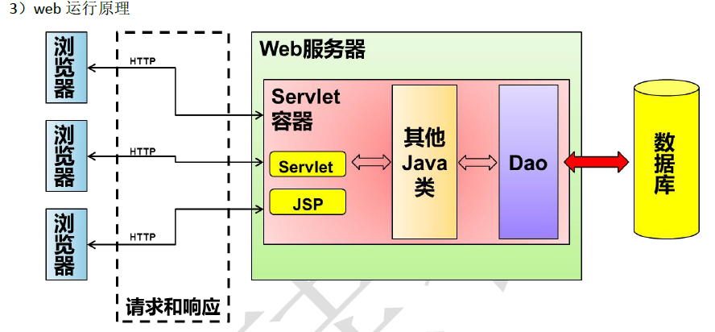


## 6.Maven介绍

Maven是一个Java项目管理和构建工具，它可以定义项目结构、项目依赖，并使用统一的方式进行自动化构建，是**Java项目不可缺少的工具**。

**我为什么要学习这个工具？**

1. 在Javaweb开发中，需要使用大量的jar包，我们手动去导入；
2. 如何能够让一个东西自动帮我导入和配置这个jar包。

由此，Maven诞生了！

Maven的核心思想：**约定大于配置**

- 有约束，不要去违反。（目录结构等约束）

Maven会规定好你该如何去编写我们Java代码，必须要按照这个规范来。

一个使用Maven管理的普通的Java项目，它的目录结构默认如下：

```ascii
a-maven-project
├── pom.xml
├── src
│   ├── main
│   │   ├── java
│   │   └── resources
│   └── test
│       ├── java
│       └── resources
└── target
```

项目的根目录`a-maven-project`是项目名，它有一个项目描述文件`pom.xml`，存放Java源码的目录是`src/main/java`，存放资源文件的目录是`src/main/resources`，存放测试源码的目录是`src/test/java`，存放测试资源的目录是`src/test/resources`，最后，所有编译、打包生成的文件都放在`target`目录里。这些就是一个Maven项目的标准目录结构。

**所有的目录结构都是约定好的标准结构，我们千万不要随意修改目录结构。**使用标准结构不需要做任何配置，Maven就可以正常使用。（约定大于配置）

## 7.Maven下载安装

Maven官网： https://maven.apache.org/。

**maven仓库： https://mvnrepository.com/。**

历史版本： https://archive.apache.org/dist/maven/maven-3/3.6.0/binaries/。

下载配置教程： https://iqqcode.blog.csdn.net/article/details/97840767。

注意：idea2019似乎与3.6.1及以上的版本不兼容。

下载之后解压缩。

然后配置环境变量：

在我们的系统环境变量中配置如下配置：

- MAVEN_HOME ，maven的目录
- 在系统的path中配置%MAVEN_HOME%\bin

然后打开 cmd，输入 **mvn -v** ，出现相关信息就配好了。

接着修改配置文件：使用阿里云镜像

找到`%MAVEN_HOME%\conf\settings.xml`，其中的`<mirrors>`，添加镜像：

```xml
<mirror>
      <id>aliyunmaven</id>
      <mirrorOf>*</mirrorOf>
      <name>阿里云公共仓库</name>
      <url>https://maven.aliyun.com/repository/public</url>
</mirror>
```

配置本地仓库：

**maven会将从中央仓库下载的jar包放到本地仓库中，而这个本地仓库其实就是maven帮我们建立的一个文件夹，目录为`C:\Users\你的用户名\.m2\repository`，这个路径是可以修改的。**

运行Maven的时候，Maven所需要的任何构件都是直接从本地仓库获取的。如果本地仓库没有，它会首先尝试从远程仓库下载构件至本地仓库，然后再使用本地仓库的构件。

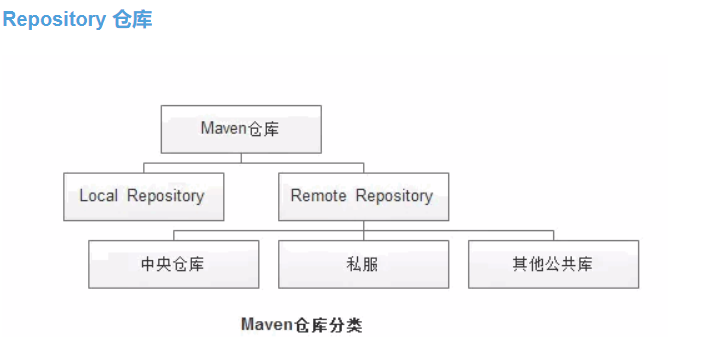

在maven目录下新建maven-repo文件夹作为本地仓库。

在配置文件中添加：

`<localRepository>D:\maven3.6.0\apache-maven-3.6.0\maven-repo</localRepository>`

## 8.idea2020中使用Maven

**创建一个Maven Web项目：**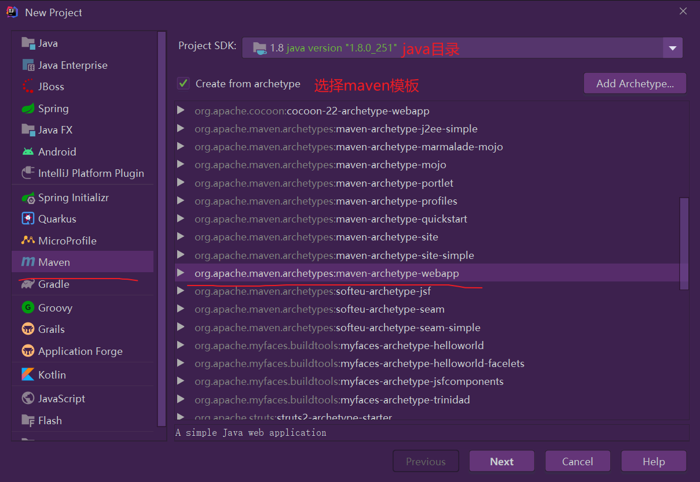

下一步：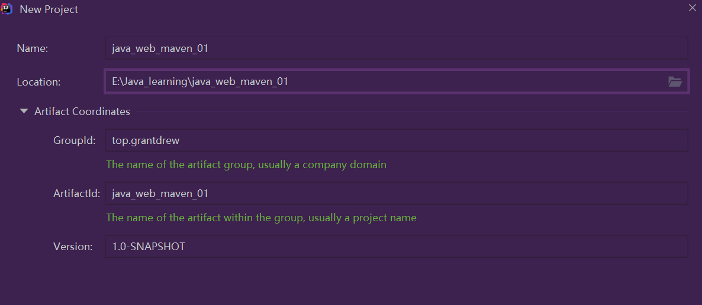

其中，`groupId`类似于Java的包名，通常是公司或组织名称，`artifactId`类似于Java的类名，通常是项目名称，再加上`version`，一个Maven工程就是由`groupId`，`artifactId`和`version`作为唯一标识。我们在引用其他第三方库的时候，也是通过这3个变量确定。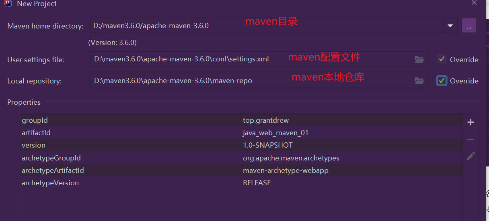

完成之后：

结构和tomcat的web网站很像。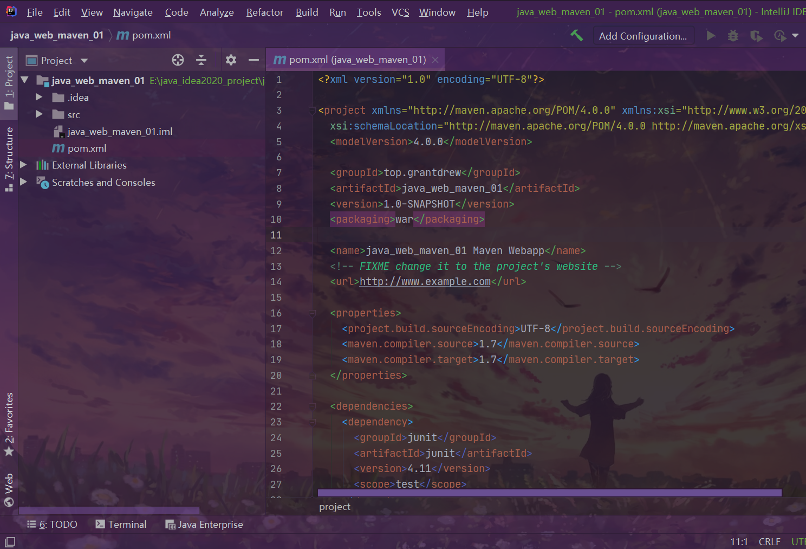

idea创建项目完成后：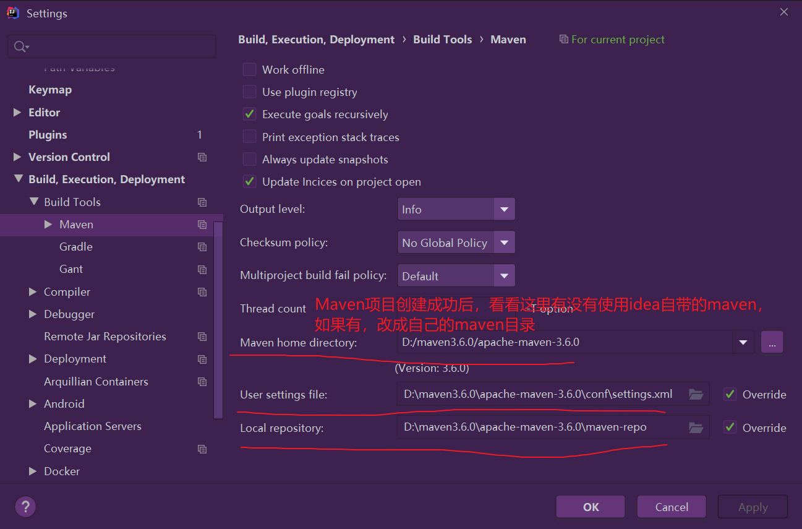

---

**创建一个普通的Maven项目：**

和上面基本一样，只是创建时不要勾选模板，也不要选择文件，空的。

后面操作就一样了。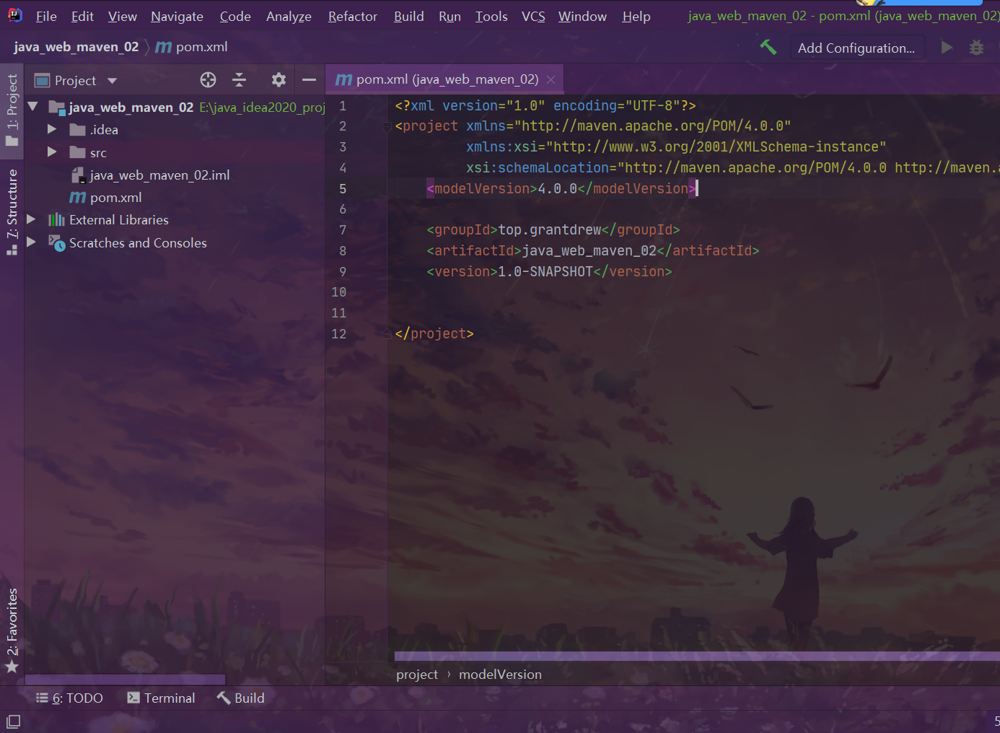

idead标记文件夹功能：

这样就和maven标准项目结构差不多了。

方式1：文件夹右击：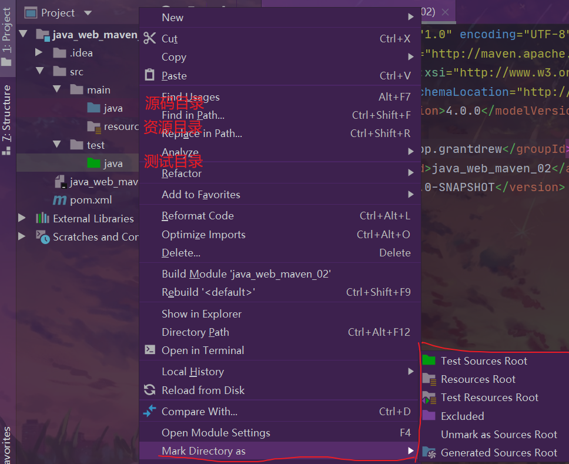

方式2：

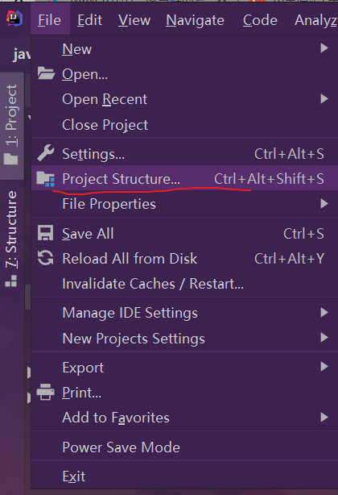

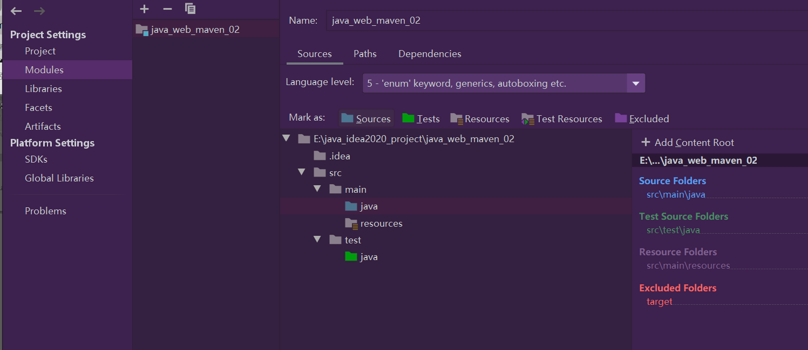