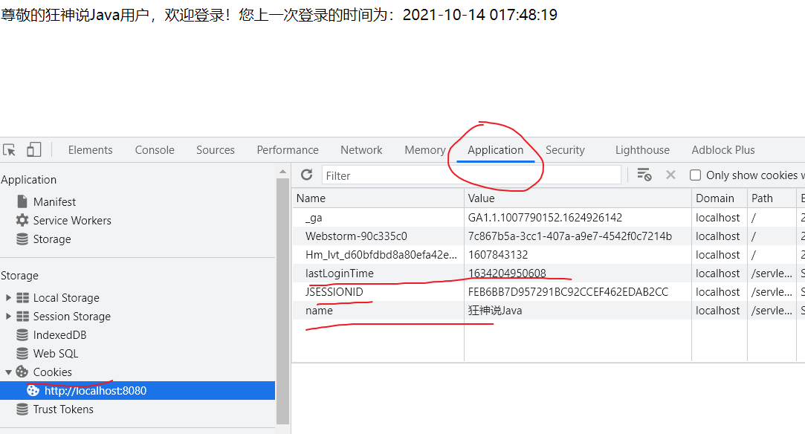
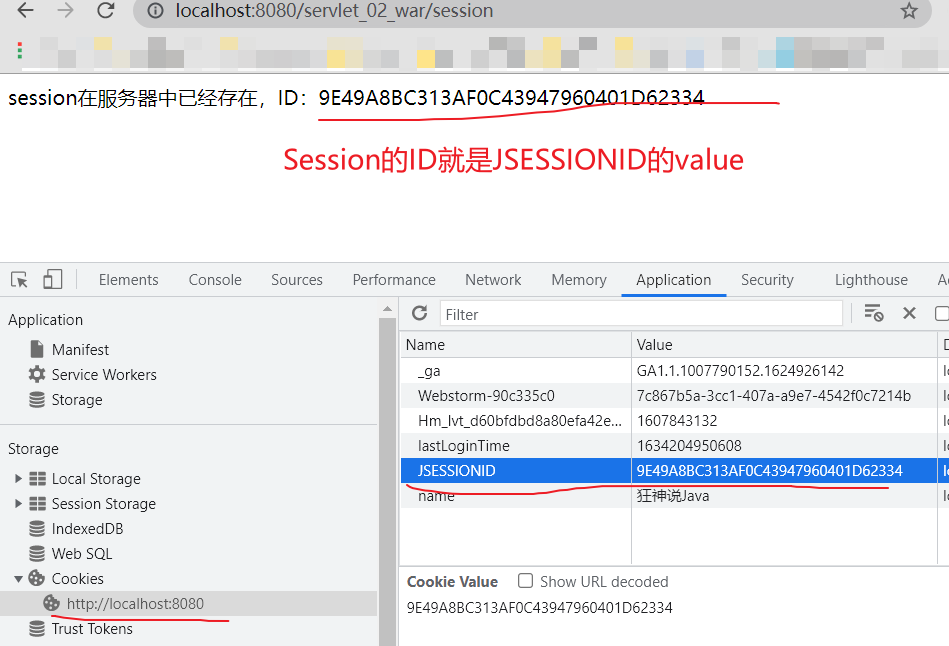
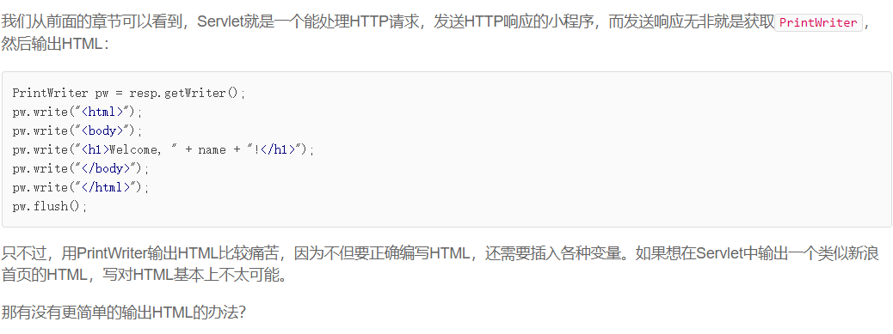
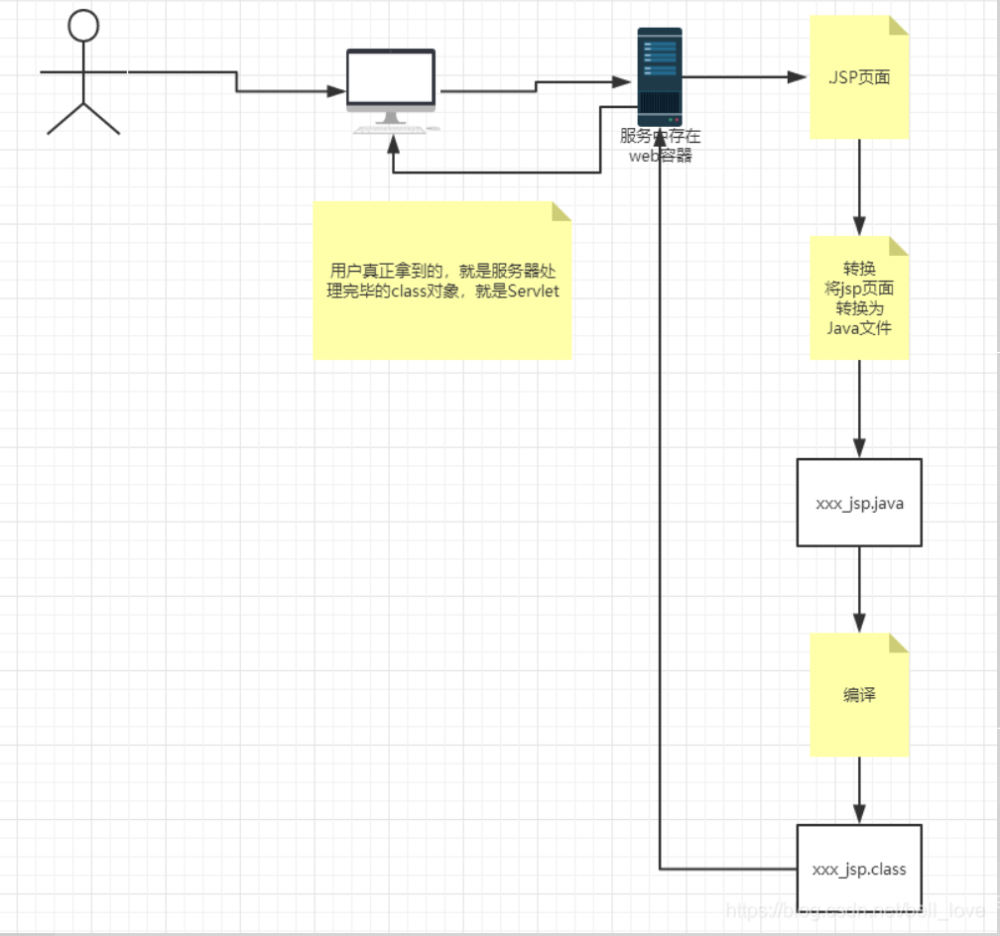

## 1.保存会话的两种技术

<!--more-->

### Cookie

Cookie测试：

```java
public class CookieDemo extends HttpServlet {
    @Override
    protected void doGet(HttpServletRequest req, HttpServletResponse resp) throws ServletException, IOException {
        resp.setContentType("text/html"); // 防止中文乱码，一定要放PrintWriter out xxx之前
        resp.setCharacterEncoding("utf-8");
        PrintWriter out = resp.getWriter();
        // Cookie，服务器从客户端获取，Cookie可以有多个
        Cookie[] cookies = req.getCookies();
        // 判断Cookie是否存在
        if (cookies != null){
            for (Cookie c : cookies){
                if (c.getName().equals("name")){
                    out.write("尊敬的" + c.getValue() + "用户，欢迎登录！");
                }
                if (c.getName().equals("lastLoginTime")){
                    Long lastLoginTime = Long.parseLong(c.getValue()); // String转化为Long类型
                    SimpleDateFormat dateFormat = new SimpleDateFormat("yyyy-MM-dd HH:mm:ss");
                    String dataStr = dateFormat.format(lastLoginTime); // Long类型转化为格式化后的时间字符串
                    out.write("您上一次登录的时间为：" + dataStr);
                }
            }
        }else{
            out.write("这是您第一次访问本站！");
        }
        // 服务器创建cookie响应给客户保存到本地
        Cookie cookie1 = new Cookie("name","狂神说Java"); // 如果有修改，会更新
        Cookie cookie2 = new Cookie("lastLoginTime",System.currentTimeMillis()+"");
        //  cookie1.setMaxAge(24*60*60); 设置Cookie的有效时间，以秒为单位
        resp.addCookie(cookie1);
        resp.addCookie(cookie2);
    }

    @Override
    protected void doPost(HttpServletRequest req, HttpServletResponse resp) throws ServletException, IOException {
        doGet(req, resp);
    }
}
```



查看HTTP的请求和响应报文，可以发现有Cookie字段。

- 一个Cookie只能保存一个信息
- 一个web站点可以给浏览器发送多个cookie，最多存放20个左右cookie
- Cookie大小有限制4kb
- 浏览器上限：300个左右cookie

**删除Cookie；**

- 方法1：不设置有效期，关闭浏览器，自动失效
- 方法2：设置有效期时间为 0 

解决中文的乱码问题：

```java
URLEncoder.encode("秦疆","UTF-8")
URLDecoder.decode(cookie.getValue(),"UTF-8")
```

### Session（重点）

什么是Session：

- 服务器会给每一个用户（浏览器）创建一个Seesion对象；
- Session是基于Cookie的一种会话机制；
- **一个Seesion独占一个浏览器**，只要浏览器没有关闭，这个Session就存在；
- 用户登录之后，**整个网站它都可以访问**！–> 保存用户的信息；保存购物车的信息……

Session测试：

```java
public class SessionTest extends HttpServlet {
    @Override
    protected void doGet(HttpServletRequest req, HttpServletResponse resp) throws ServletException, IOException {
        resp.setCharacterEncoding("UTF-8");
        req.setCharacterEncoding("UTF-8");
        resp.setContentType("text/html;charset=utf-8");
        // 从客户端请求中得到Session
        HttpSession session = req.getSession();

        // 在Session中存东西
        session.setAttribute("name","Java"); // (String,Object)，比Cookie的存储类型广
        // Session还可以存储对象session.setAttribute("name",new Person("秦疆",1));
        // 获取Session的id
        String sessionId = session.getId();

        // 判断Session是不是新创建的
        if (session.isNew()){
            resp.getWriter().write("session创建成功！ID：" + sessionId);
        }else{
            resp.getWriter().write("session在服务器中已经存在，ID：" + sessionId);
        }
    }

    @Override
    protected void doPost(HttpServletRequest req, HttpServletResponse resp) throws ServletException, IOException {
        doGet(req, resp);
    }
}
```

测试结果：



注销Session：

```java
HttpSession session = req.getSession();
session.removeAttribute("name");
//手动注销Session
session.invalidate(); // 然后会自动生成一个新的ID
```

**会话自动过期：web.xml配置**

```xml
<!--设置Session默认的失效时间-->
<session-config>
    <!--15分钟后Session自动失效，以分钟为单位-->
    <session-timeout>15</session-timeout>
</session-config>
```

## 2.JSP原理剖析



我们可以使用JSP，它和Servlet一样用于开发动态Web。

**JSP还是有必要了解一下，不需要花很多时间，知道即可。**

JSP是Java Server Pages的缩写，它的文件必须放到`/src/main/webapp`下，文件名必须以`.jsp`结尾，**整个文件与HTML并无太大区别**，但需要插入变量，或者动态输出的地方，使用特殊指令`<% ... %>`。

- 包含在`<%--`和`--%>`之间的是JSP的注释，它们会被完全忽略；
- 包含在`<%`和`%>`之间的是Java代码，可以编写任意Java代码；
- 如果使用`<%= xxx %>`则可以快捷输出一个变量的值。

- 区别：
    - HTML只给用户提供静态的数据
    - JSP页面中可以嵌入JAVA代码，为用户提供动态数据

JSP到底是怎么执行的？

在服务器内部工作：

tomcat中有一个work目录；

IDEA中使用Tomcat的会在IDEA的tomcat中生产一个work目录。

工作目录下有2个文件：`index_jsp.class`和`index_jsp.java`。

也就是说`index.jsp`页面最终转变成了Java程序。

**浏览器向服务器发送请求，不管访问什么资源，其实都是在访问Servlet！**

JSP最终也会被转换成为一个Java类！

---

在`pom.xml`中引入`jsp-api 2.2`：

```xml
<dependency>
    <groupId>javax.servlet.jsp</groupId>
    <artifactId>jsp-api</artifactId>
    <version>2.2</version>
    <scope>provided</scope>
</dependency>
```

JSP内置的一些对象：可以直接使用了

```java
final javax.servlet.jsp.PageContext pageContext;  //页面上下文
javax.servlet.http.HttpSession session = null;    //session
final javax.servlet.ServletContext application;   //applicationContext
final javax.servlet.ServletConfig config;         //config
javax.servlet.jsp.JspWriter out = null;           //out
final java.lang.Object page = this;               //page：当前
HttpServletRequest request                        //请求
HttpServletResponse response                      //响应
```

JSP本质上就是一个Servlet，将一些相关对象实例化了，所以可以内嵌Java代码。



