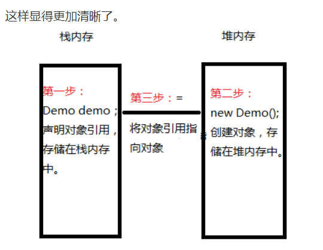
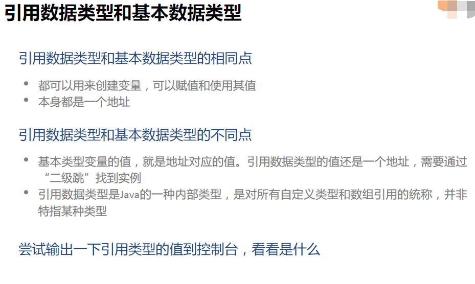
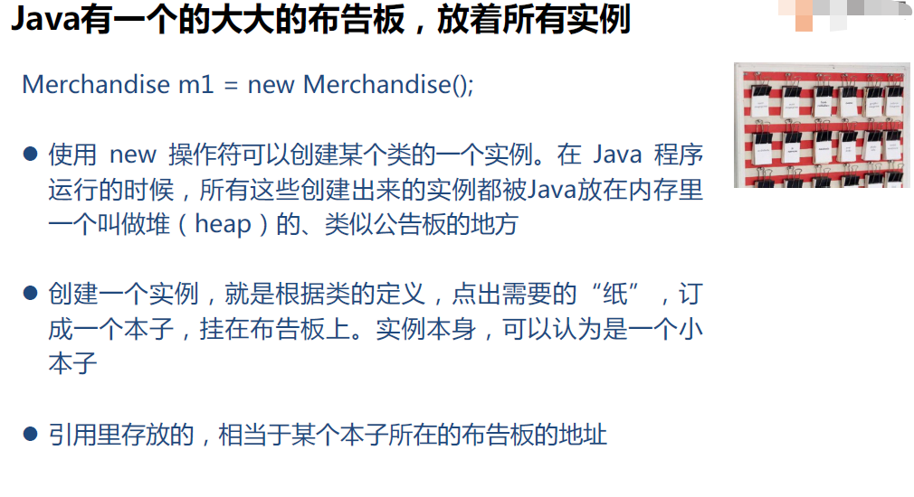
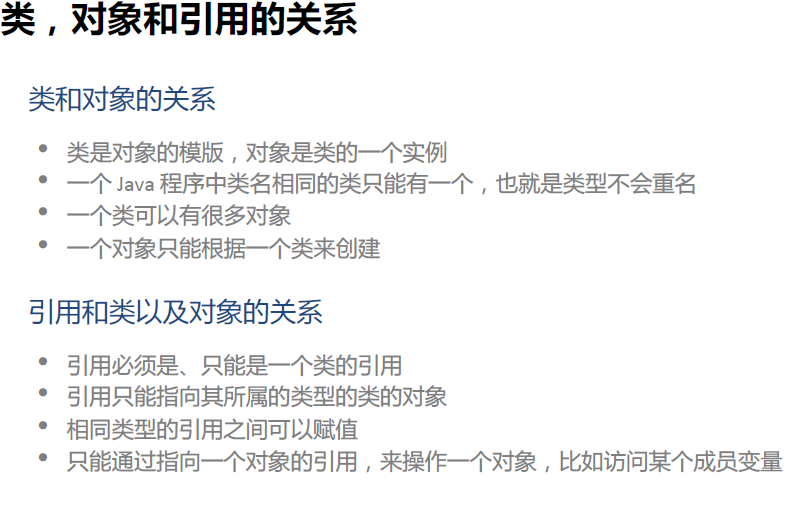

## 对象和对象引用的区别

不理解的话建议参考

1. 书籍：《Java核心技术：卷I》（第11版）---> 4.2.1 对象与对象变量
2.  博客：CSDN博主「技术小栈」的原创文章[原文链接](https://blog.csdn.net/qq_26805137/article/details/52945688)

<!--more-->

首先举个例子：`Demo demo=new Demo();`

  这一条语句，其实包括了四个动作：
                1）右边的“new Demo”，是以Demo类为模板，在堆空间里创建一个Demo对象。**这条语句的返回值是对Demo对象的一个引用。**
                2）末尾的()意味着，在对象创建后，立即调用Demo类的构造函数，对刚生成的对象进行初始化。 
                3）左边的“Demo demo”创建了一个Demo类引用变量，它存放在栈空间中。也就是用来指向Demo对象的对象引用。 这里的demo，我们也可以称之为对象变量。
                4）“=”操作符使对象引用指向刚创建的那个Demo对象。

当然这条语句我们也可以写成：

```java
Demo demo;//创建对象引用
demo=/*将对象引用指向对象*/new Demo();//创建对象
```



## 对象引用与对象之间的关系

 1）从对象引用出发:

 一个对象引用可以指向一个对象。

```java
Demo demo；//一个对象引用
demo=new Demo();//一个对象引用指向一个对象
```

 也可以不指向对象。 

```java
Demo demo;//创建对象引用，但是没有指向对象
```

 2）从对象出发：

​       一个对象可以被一个对象引用引用

```java
Demo demo;//创建对象引用
demo=new Demo();//创建对象，并被一个对象引用指向
```

  也可以被多个对象引用同时引用。

```java
Demo demo1，demo2，demo3;//创建多个对象引用
demo1=new Demo();
demo2=demo1;// 它们地址相同，指向同一个对象
demo3=demo2;//创建对象，并被多个对象引用指向
```

## 引用数据类型





