## 1.Scanner（扫描器）对象

java.util.Scanner 是 Java5 的新特征，我们可以通过 Scanner 类来获取用户的输入。

下面是创建 Scanner 对象的基本语法：

`import java.util.Scanner;`

`Scanner s = new Scanner(System.in);`

<!--more-->

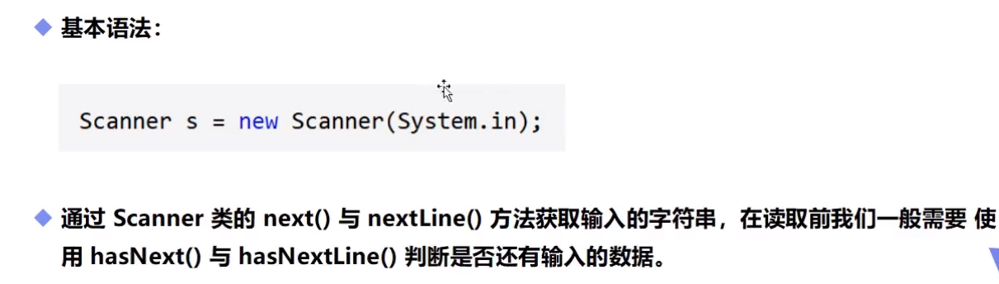

```java
import java.util.Scanner;

public class Demo{
	public static void main(String[] args){
		Scanner s = new Scanner(System.in);// 创建Scanner对象s
	    System.out.println("使用next方式接受：");
	    //判断用户有没有输入字符串
	    if (s.hasNext()){
	    	String str = s.next();
	    	System.out.println("输入的内容是："+str);
	    }
	    s.close();// 凡是属于IO流的类如果不关闭会一直占用资源
	}
}
/* input:  hello world
output:hello*/ hello之前的空格会过滤

public static void main(String[] args){
		Scanner s = new Scanner(System.in);// 创建Scanner对象s
	    System.out.println("使用nextLine方式接受：");
	    //判断用户有没有输入字符串
	    if (s.hasNextLine()){
	    	String str = s.nextLine();
	    	System.out.println("输入的内容是："+str);
	    }
	    s.close();// 凡是属于IO流的类如果不关闭会一直占用资源
}
/* input:  hello world
output:  hello world*/ hello之前的空格会接收
```

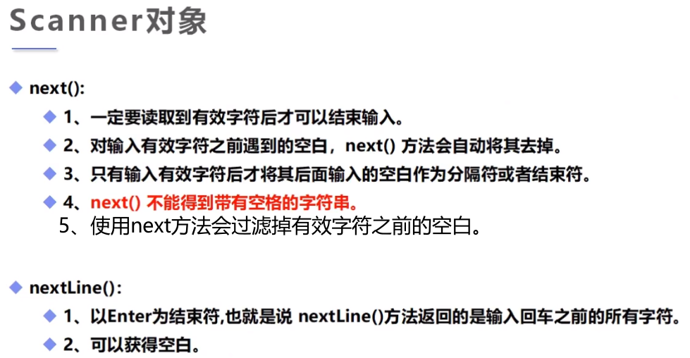

```java
// 例子
public class Demo{
	public static void main(String[] args){
		Scanner s = new Scanner(System.in);
		double sum = 0;
		int sign = 0;
		while (s.hasNextDouble()){
			sum += s.nextDouble();
			sign ++;
			System.out.println("你输入了第"+sign+"个数据，结果是"+sum);
		}
		System.out.println(sign+"个数的总和是"+sum+"，平均值是"+sum/sign);
	    s.close();
	}
}
```

## 2.选择分支

### if选择分支

```java
public class Demo{
	public static void main(String[] args){
		Scanner s = new Scanner(System.in);
		System.out.println("请输入内容：");
		String str = s.nextLine();
		// equals:用于判断字符串是否相等，与==不一样，少用==判断
		if(s.equals("hello")){
			System.out.println(str);
		}
		System.out.println("End!");
	    s.close();
	}
}
```

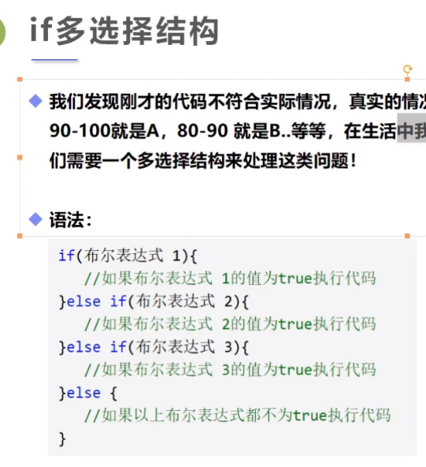

### switch选择分支

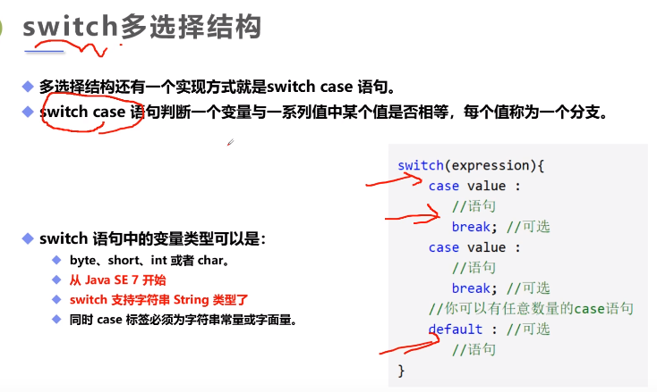

```java
public class Demo{
	public static void main(String[] args){
		char grade = 'F';
        switch (grade){// 大致同C++
            case 'A':// case语句有穿透效果，用break跳出
                System.out.println("优秀");break;
            case 'B':
            	System.out.println("良好");break;
            case 'C':
            	System.out.println("挂科");break;
            default:
            	System.out.println("未知");
        }
	}// JDK7的新特性，switch支持string字符串
}
```

## 3.循环结构

包括while，do-while和for循环，break和continue跳出循环。大致语法结构与C++相同。

在JDK5中引入了一种主要用于数组的增强型for循环。

关于goto，它是java的保留字，但是并没有得到正式使用。

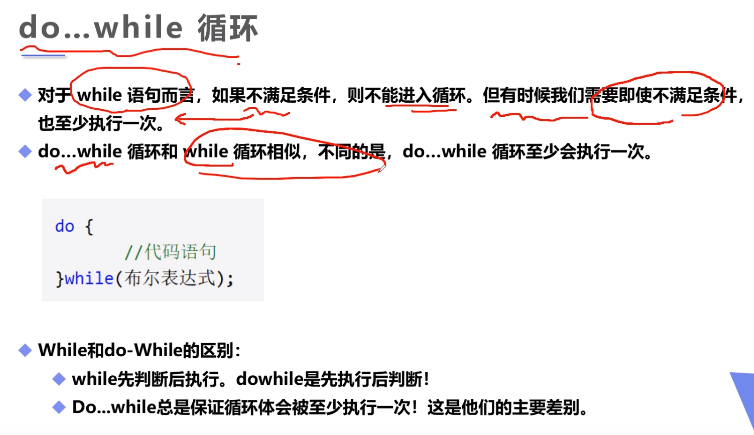

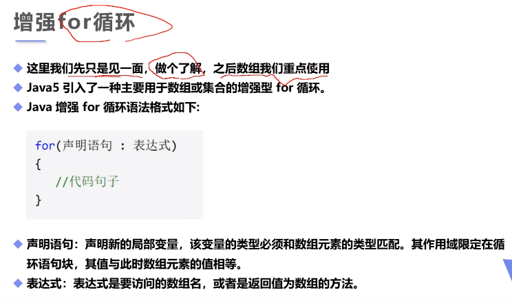

```java
public class Demo{
	public static void main(String[] args){
		int[] nums = {1,2,3,4,5,6};
		for (int x:nums){// 增强for循环，遍历数组中的元素
			System.out.println(x);
        }
	}
}
// 1 2 3 4 5 6
```

## 4.Java中的方法

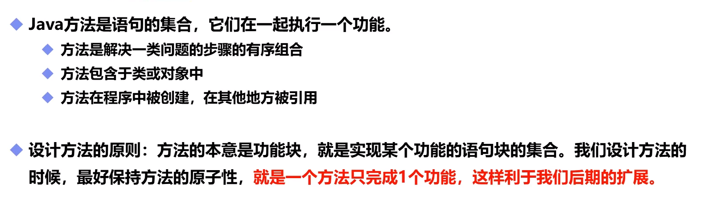

```java
public class Demo{
	public static void main(String[] args){
		int sum = add(1,2);
		System.out.println(sum);// 3
	}
	public static int add(int a,int b){// static修饰，可以直接在main方法中使用
		return a+b;
	}
}
```

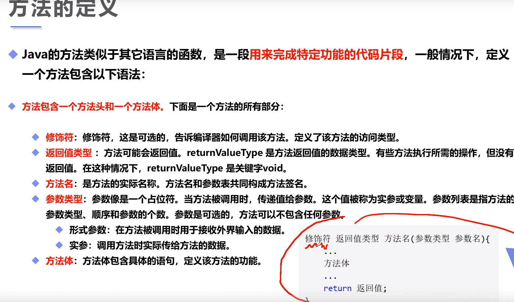

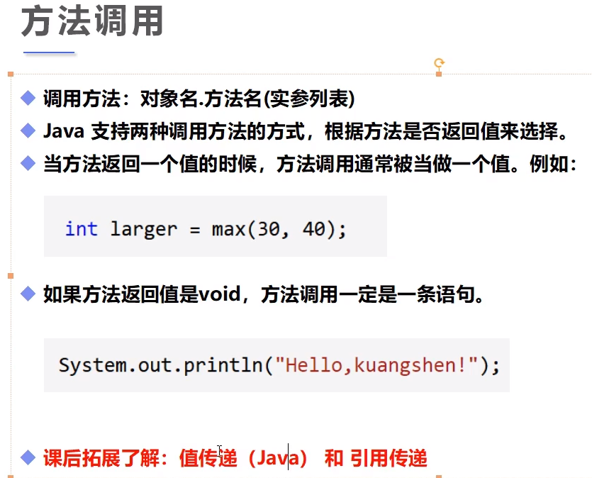

记住：**Java中的方法都是值传递**。**其实 Java 只存在一种传参的方式，就是用实参给形参赋值。**

## 5.方法的重载（非常重要）

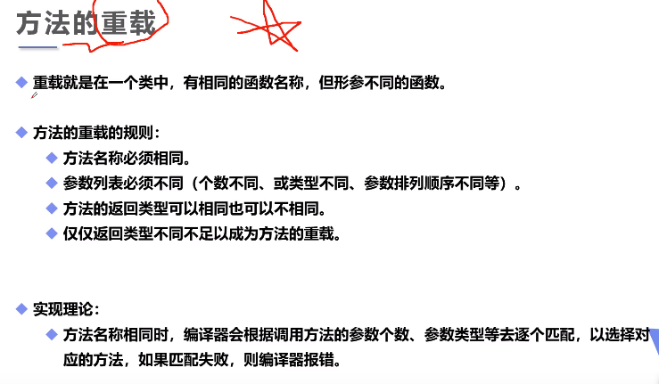

方法重载基本类似C++中的函数重载。

```java
public class Demo{
	public static void main(String[] args){
		int sum1 = add(1,2);
		double sum2 = add(1.0,2.0);
		double sum3 = add(1,2.0);
		System.out.println(sum1);
		System.out.println(sum2);
		System.out.println(sum3);
	}
	public static int add(int a,int b){
		return a+b;
	}
	public static double add(double a,double b){
		return a+b;
	}
}// 注意：仅仅返回类型不同不足以成为方法的重载，要求参数列表必须不同
//必须参数类型不同，名字相同也不行
```

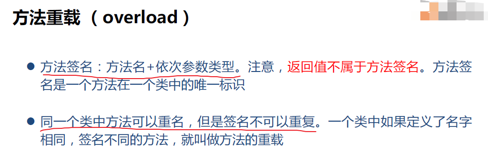

重载的特殊之处在于：如果参数满足自动类型转换的方法有好几个，重载规则是选择最近的调用。

比如：int add(int a)和int add(double b)，如果传入byte,short,int类型的参数a，会调用第一个，传入float,double类型的参数a会调用第二个。自己写的话最好避免这样的情况。

## 6.给main函数传参

### 6.1通过命令行传参

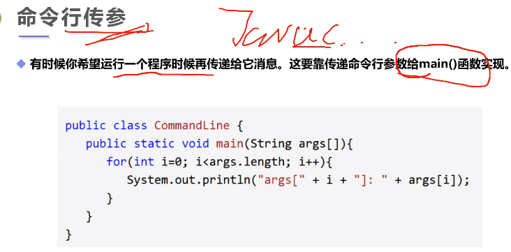

上图中`String args[]`意思同`String[] args`，前者是类C的写法，后者是Java写法。

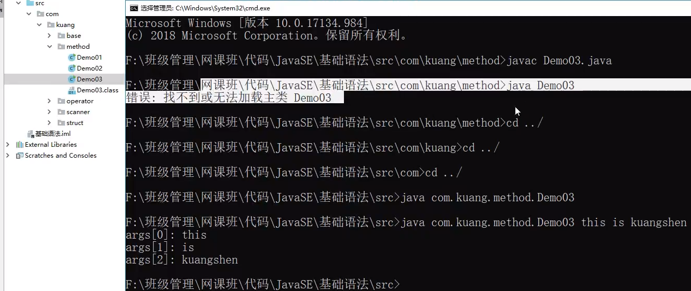

注意：要通过java命令运行放在package中的class文件，必须回退到包的路径（此处是src目录）。

通过java命令给main方法传递参数"this is..."，并打印参数。

### 6.2通过IDEA传参

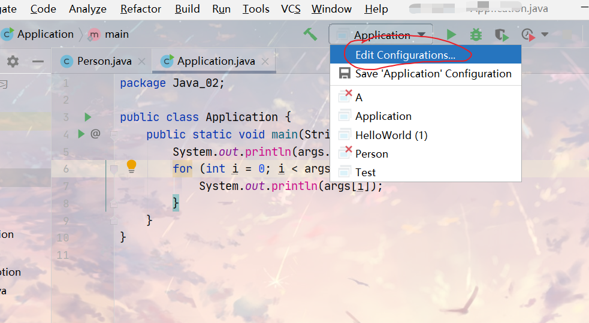

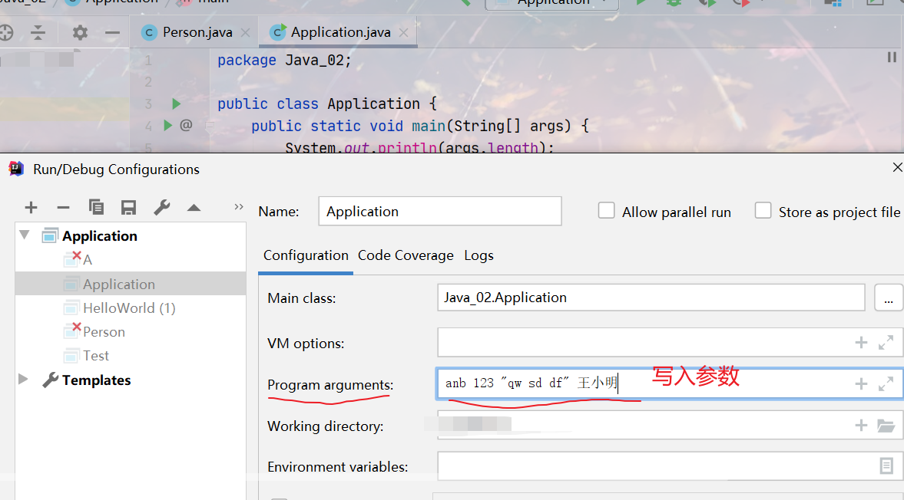


```java
输出：
4
anb
123
qw sd df
王小明
```

## 7.可变参数（不定项参数）

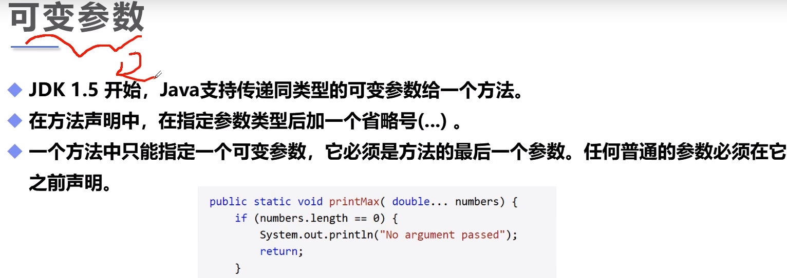

```java
public class Demo{
	public static void main(String[] args){
		Demo demo = new Demo();
		demo.test(1,2,3);// 2
	}
	public void test(int... i){
		System.out.println(i[1]);
	}
}
```

## 8.数组

数组是引用数据类型。数组的长度是固定的，一旦创建就不能修改。

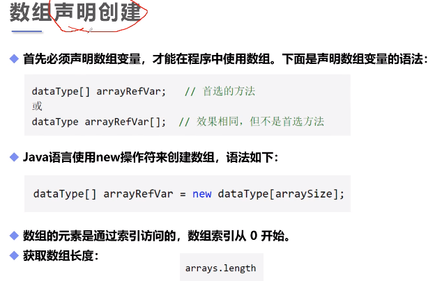

```java
public class Demo{
	public static void main(String[] args){
		int[] num1;// 1.首选声明方法
		num1 = new int[10];// 定义，存放10个int型数字		
		int num2[];// 2.
		int[] num3 = new int[12];// 3.
		
		for (int i = 0;i < num1.length;i ++){
			num1[i] = i+1;// 赋值
		}
		for(int x: num1){
			System.out.println(x);
		}
	}
}
```

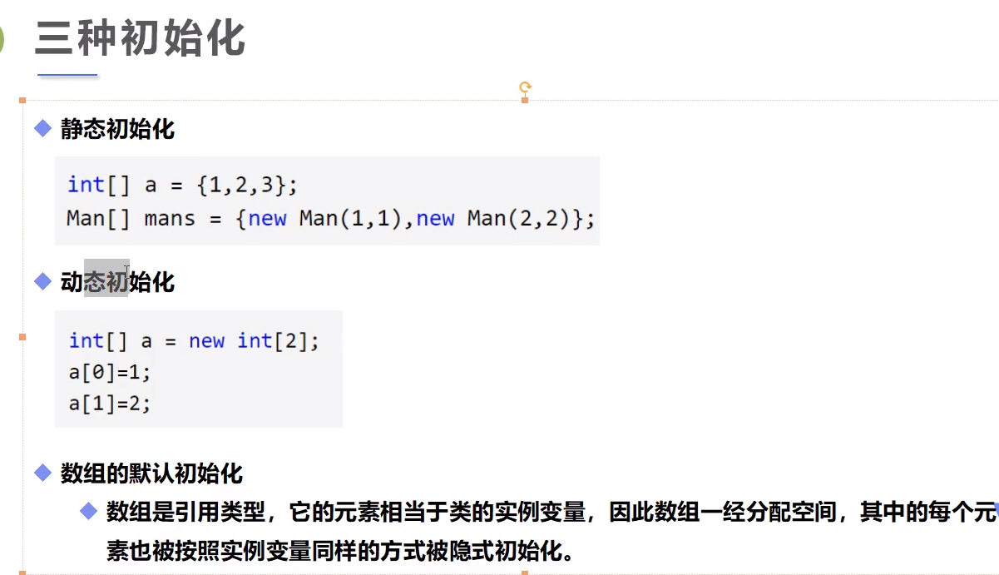

```java
public class Demo{
	public static void main(String[] args){
		// 静态初始化:创建 +赋值
		int[] a = {1,2,3,4,5,6,7,8,9,0};
		// 动态初始化：包含默认初始化
		int[] b = new int[10];
		b[0] = 10;
	}
}
```

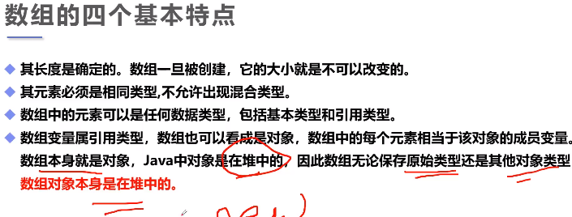

```java
public class Demo{
	public static void main(String[] args){
		int[] arrays = {1,2,3,4,5};
		int[] result = reverse(arrays);
		printArray(result);
	}
	// 打印数组
	public static void printArray(int[] arrays){
		for (int array:arrays){
			System.out.println(array);
		}
	}
	// 翻转数组
	public static int[] reverse(int[] arrays){
		int[] result = new int[arrays.length];
		for (int i = 0,j = result.length-1;i < arrays.length;i++,j--){
			result[j] = arrays[i];
		}
 		return result;
	}
}
```

**多维数组**

```java
public class Demo{
	public static void main(String[] args){
		int[][] array = {{1,2},{2,3},{3,4},{4,5}};
		System.out.println(array[0][1]);
	}	
}
```

## 9.内存分析

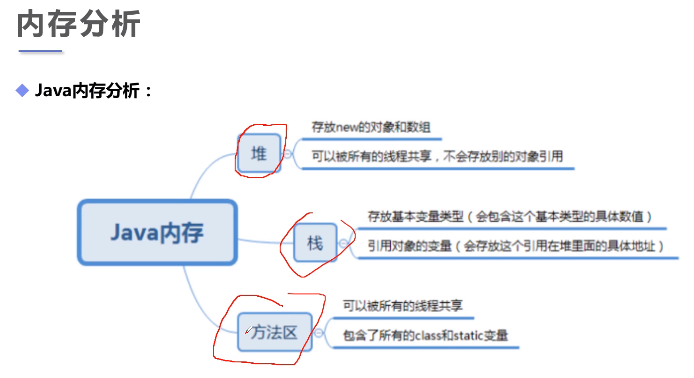

数组的内存机制：

1.声明数组array，存放于栈中；

2.创建数组array，在堆中开辟空间。(**数组对象本身是在堆中的**)

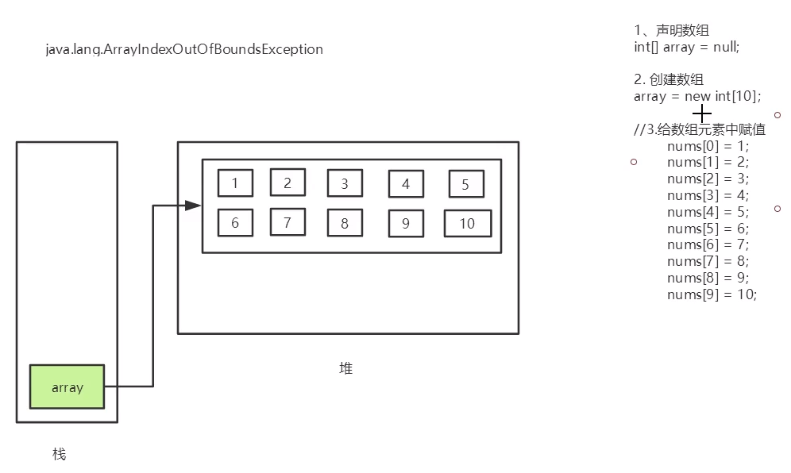

## 10.Arrays类

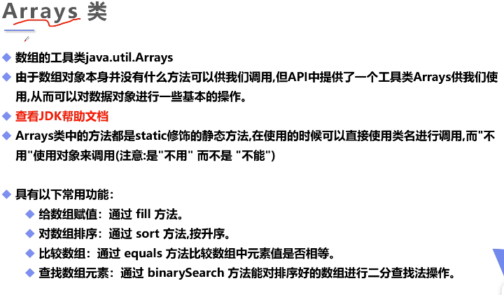

```java
import java.util.Arrays;
// Arrays类中的方法都是通过类名调用
public class Demo{
	public static void main(String[] args){
		int[] a = {1,5,67,345,2,456,67,45};
		// 打印数组元素：Arrays.toString
		System.out.println(Arrays.toString(a));
		
		Arrays.sort(a);// 对数组排序，从小到大
		System.out.println(Arrays.toString(a));
		
		Arrays.fill(a, 0);// 将数组全部用0填充
		System.out.println(Arrays.toString(a));
		Arrays.fill(a, 2,4,1);// 将数组（左闭右开）下标2~4全部用1填充
		System.out.println(Arrays.toString(a));
	}	
}
```

