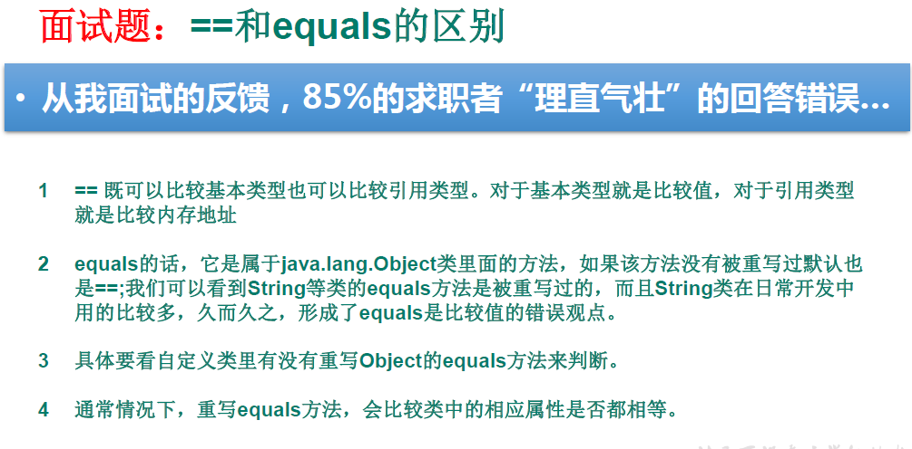
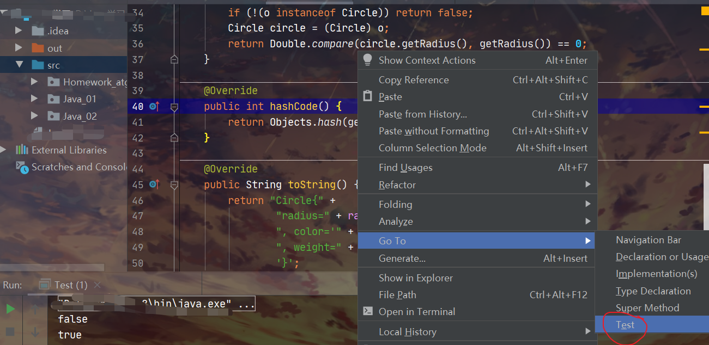
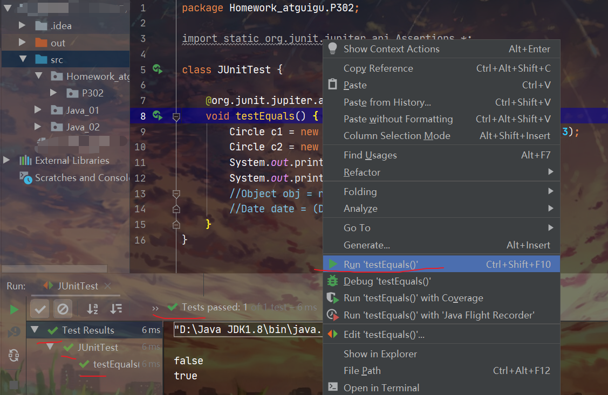

## 1.万类之祖：Object类

**所有的类，都间接或者直接的继承自Object 类。**

**数组属于引用类型，也是继承自Object 类。**

Object 类没有成员变量，只有一些成员方法。

注意：hashCode和equals方法基本面试必考！！！

<!--more-->

Object getClass() 方法用于获取对象的运行时对象的类。

```java
class RunoobTest {
    public static void main(String[] args) {
 
        // 创建 RunoobTest 类的对象
        RunoobTest obj = new RunoobTest();
        
        // RunoobTest 继承 Object 类，Object 是所有类的超类
        // 调用 getClass() 方法
        System.out.println(obj.getClass());
    }
}
//class RunoobTest
```

**Object toString() 方法**用于返回对象的字符串表示形式。对于有数据的类，常用 toString() 方法展示数据内容。

当输出对象s时，会调用toString() 方法。唯一的一点区别就是：若对象是null时，打印s显示null（保护机制，避免异常），而打印s.toString()会出现NullPointerException。

```Java
// 例子演示
@Override
    public String toString() {
        return "Circle{" +
                "radius=" + radius +
                ", color='" + color + '\'' +
                ", weight=" + weight +
                '}';
    }
```

默认返回格式：**对象的 class 名称 + @ + hashCode 的十六进制字符串**。

Object hashCode() 方法用于获取对象的 hash 值。

返回对象哈希值，是一个整数，表示在哈希表中的位置。

```java
class RunoobTest {
    public static void main(String[] args) {

        // toString() with Object
        Object obj1 = new Object();
        System.out.println(obj1.toString());
        Object obj2 = new Object();
        System.out.println(obj2.hashCode());
    }
}
//java.lang.Object@d716361
//1878246837
```

Object equals() 方法用于比较两个对象是否相等。

equals() 方法比较两个对象，是判断两个对象引用指向的是同一个对象，即比较 2 个对象的内存地址是否相等。

**注意：**如果子类重写了 equals() 方法，就需要重写hashCode()方法，比如 String 类就重写了 equals() 方法，同时也重写了 hashCode() 方法。

```java
class RunoobTest {
    public static void main(String[] args) {
 
        // Object 类使用 equals() 方法
        // 创建两个对象
        Object obj1 = new Object();
        Object obj2 = new Object();
 
        // 判断 obj1 与 obj2 是否相等
        // 不同对象，内存地址不同，不相等，返回 false
        System.out.println(obj1.equals(obj2)); // false
 
        // obj1 赋值给 obj3
        // String 重写了 equals() 方法
        // 对象引用，内存地址相同，相等，返回 true
        Object obj3 = obj1;
        System.out.println(obj1.equals(obj3)); // true
    }
}
//false
//true
```

说明：

**hashCode和equals是我们最常覆盖的两个方法。**

覆盖的原则：equals是true，hashCode就应该相等，这是一种约定俗成的规范。

即equals为true是hashCode相等的充分非必要条件，hashCode相等是equals为true的必要不充分条件。

在IDEA中，右键-->Generate，可以选择生成hashCode和equals方法。

**自动生成**的equals方法比自己手动写要更准确，手动可能存在漏洞。

**以后直接自动生成就行。**

```java
@Override
    public boolean equals(Object o) {
        if (this == o) return true;
        if (!(o instanceof MerchandiseV2)) return false;
        MerchandiseV2 that = (MerchandiseV2) o;
        // 判断成员变量等是否相等
        return this.getCount() == that.getCount() &&
                Double.compare(that.getSoldPrice(), getSoldPrice()) == 0 &&
                Double.compare(that.getPurchasePrice(), getPurchasePrice()) == 0 &&
                getName().equals(that.getName()) &&
                getId().equals(that.getId());
    }

    @Override
    public int hashCode() {
        return Objects.hash(getName(), getId(), getCount(), getSoldPrice(), getPurchasePrice());
    }
```

用“==”不能判断两个对象是否相等，只能判断两个引用是否指向同一个对象。




## 2.判断String类是否相等

```java
public class Application {
    public static void main(String[] args) {
        String s1 = "aaabbb";

        String s2 = "aaa" + "bbb";

        // >> TODO 说好的每次创建一个新的String对象呢？
        System.out.println("s1和s2用==判断结果："+(s1 == s2));
		// 是因为Java对String的优化，发现有一样的String，就直接返回
        System.out.println("s1和s2用 equals 判断结果："+(s1.equals(s2)));

        // >> TODO 打乱Java对String的的优化，再试试看
        Scanner scanner = new Scanner(System.in);

        System.out.println("请输入s1");
        s1 = scanner.nextLine();

        System.out.println("请输入s2");
        s2 = scanner.nextLine();

        System.out.println("s1和s2用==判断结果："+(s1 == s2));

        System.out.println("s1和s2用 equals 判断结果："+(s1.equals(s2)));
    }
}
/*s1和s2用==判断结果：true
s1和s2用 equals 判断结果：true
请输入s1
acsde
请输入s2
acsde
s1和s2用==判断结果：false
s1和s2用 equals 判断结果：true*/
```

## 3.Class类

Class类是代表类的类。

每个Class类的实例，都代表了一个类。

`getName()` 来产生完整（带包名）的类名，使用 `getSimpleName()` 产生不带包名的类名。

## 4.JUnit单元测试

先讲讲什么是单元测试？

IDEA为Java类创建JUnit单元测试。





此时的Java类要求：① 此类是public的  ②此类提供公共的无参的构造器
 * 此类中声明单元测试方法。

   此时的单元测试方法：方法的权限是public,没有返回值，没有形参

 * 此单元测试方法上需要**声明注解：@Test**,并在单元测试类中导入：import org.junit.Test;（不同版本junit可能导入不一样）

 * 声明好单元测试方法以后，就可以在方法体内测试相关的代码。
 * 写完代码以后，左键双击单元测试方法名，右键：run as - JUnit Test

 * 说明：
 * 1.如果执行结果没有任何异常：绿条
 * 2.如果执行结果出现异常：红条