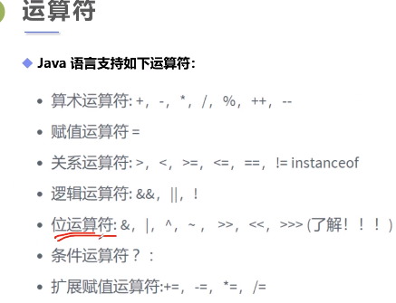
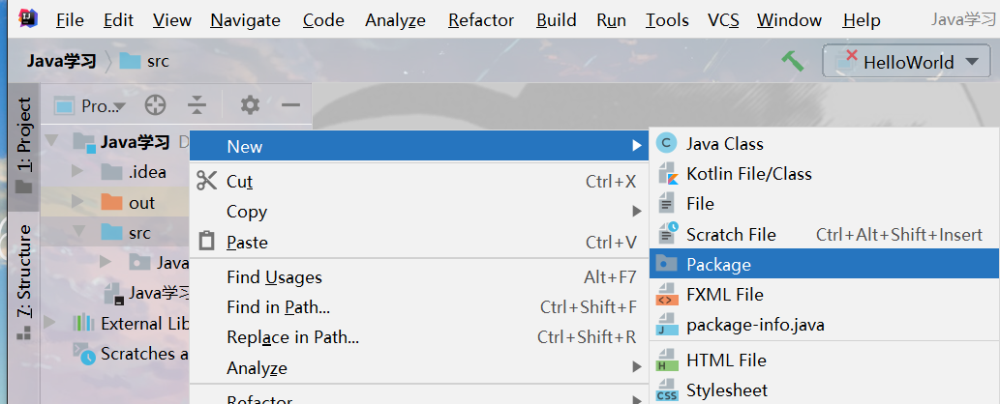
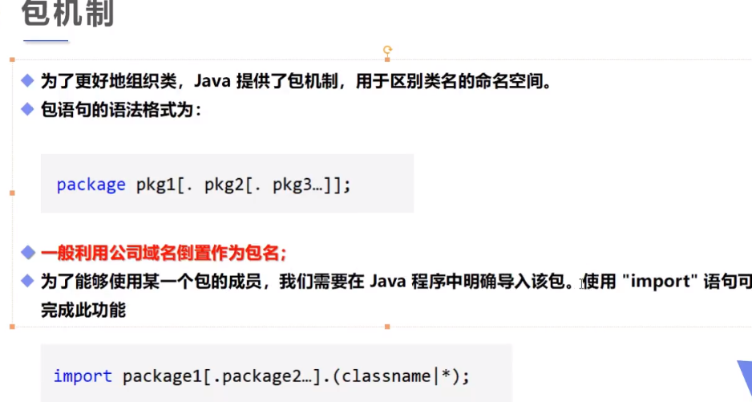
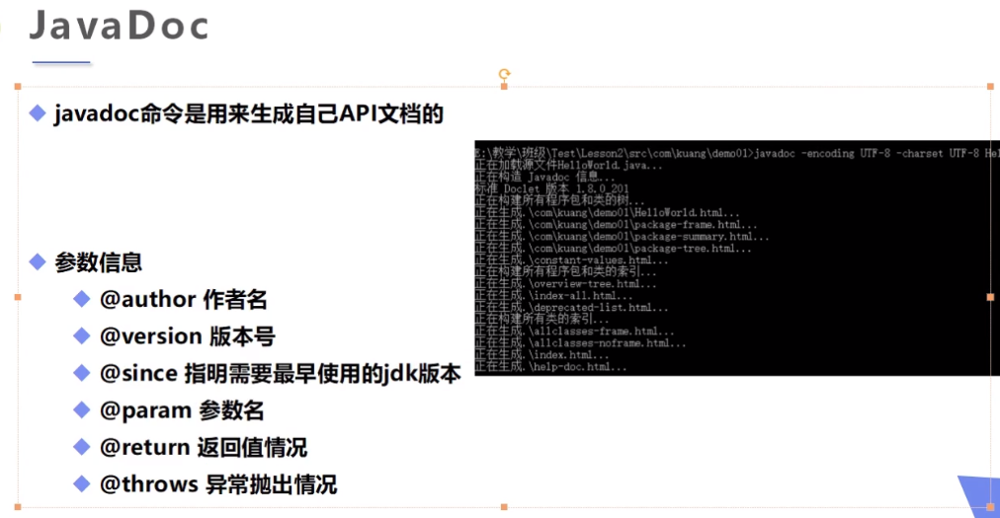

## 1.IDEA快捷键

psvm：`public static void main(String[] args)`

sout：`System.out.println("")`

ctrl + D：复制当前行到下一行

Alt + Insert：生成构造器，get/set方法

<!--more-->

## 2.HelloWorld

```java
public class HelloWorld {
	public static void main(String[] args){
		System.out.println("hello world!");// print line
		System.out.print("Hello World!");
	}
}
```

## 3.数据类型扩展

```java
// 1.整数扩展
public class HelloWorld {
	public static void main(String[] args){
		int i = 010,i2 = 10,i3 = 0x10;
		System.out.println(i);// 八进制0，以0开头的就是八进制
		System.out.println(i2);// 十进制，默认
		System.out.println(i3);// 十六进制0x
        // 二进制0b
	}
}
/* 8 10 16 */
// 2.浮点数扩展
// 最好完全避免使用浮点数进行比较，因为存在精度丢失！！！

// 3.字符扩展
// 所有字符本质还是数字
// java中采用Unicode编码字符char，2字节，0~65536(2^16)，对应16进制Unicode字符U0000~UFFFF
//Java 中的 char 类型之所以占 2 个字节，是因为 Java 使用的是 Unicode 字符集而不是 ASCII 字符集
public class HelloWorld {
	public static void main(String[] args){
		char c1 = 'A';
		char c2 = '中';
        char c3 = '\u0061';// 采用十六进制，对应十进制下的97，即a
		System.out.println(c1);
		System.out.println((int)c1);
		System.out.println(c2);
		System.out.println((int)c2);
        System.out.println(c3);
	}
}
/*A
65
中
20013
a*/
```

## 4.类型转换

整型、实型（常量）、字符型数据可以混合运算。运算中，**不同类型的数据先转化为同一类型，然后进行运算**。

```java
低  ------------------------------------>  高

byte,short,char—> int —> long—> float —> double 
```

数据类型转换必须满足如下规则：

- 不能对boolean类型进行类型转换。

- 不能把对象类型转换成不相关类的对象。

-  在把容量大的类型转换为容量小的类型时必须使用强制类型转换。


### 4.1 强制类型转换：从高级到低级

- 条件是转换的数据类型必须是兼容的。
- 格式：`(type)value`是要强制类型转换后的数据类型

隐含的强制类型转换：

- 整数的默认类型是 int。
- 浮点型不存在这种情况，因为在定义 float 类型时必须在数字后面跟上 F 或者 f，浮点数的默认类型是double。

```java
int m = 10_0000_0000;
int years = 20;
long total1 = m*years;// 右边是int型，溢出
long total2 = m*(long)years;// 右边是long型，溢出
System.out.println(total1);
System.out.println(total2);
/*-1474836480  溢出
20000000000*/
```

**注意：强制类型转换过程中可能导致溢出或损失精度**，例如：

  ```java
  int i =128;   
  byte b = (byte)i;// b = -128,内存溢出
  ```

  因为 byte 类型是 8 位，最大值为127，所以当 int 强制转换为 byte 类型时，值 128 时候就会导致溢出。

- 浮点数到整数的转换是通过舍弃小数得到，而不是四舍五入，例如：

  ```java
  (int)23.7 == 23;        
  (int)-45.89f == -45
  ```

### 4.2自动类型转换：从低级到高级

必须满足转换前的数据类型的位数要低于转换后的数据类型，例如: short数据类型的位数为16位，就可以自动转换位数为32的int类型，同样float数据类型的位数为32，可以自动转换为64位的double类型。

char不能自动转换为short，因为它们都是2字节，但是char是无符号数，在正数范围超过了short。

```java
// 补充
// JDK7新特性，数字之间可以用下划线分隔
int m = 10_0000_0000;
System.out.println(m);
```

## 5.class的属性

```java
public class Demo{
    // 属性：先简单理解为变量
    
    //类变量，静态变量 static
    static double salary = 2500;
    
    //实例变量，成员变量，在类的里面，方法体之外，从属于对象
    String name;//如果不自行初始化，默认为
    int age;//如果不自行初始化，默认为0 0.0
    // boolean默认为false，除了基本类型，其余默认值都是null
    
    //main方法
    public static void main(String[] args){
        //局部变量:必须声明和初始化值
        int i = 10;
        System.out.println(i);
        
        Demo demo = new Demo();// 创建对象demo
        System.out.println(demo.age);// 0
        System.out.println(demo.name);// null
        
        System.out.println(salary);// 类变量可以直接打印
    }
    //其他方法
    public void add(){        
    }
}
```

## 6.常量

常量确定后在程序运行过程中不允许修改。

语法格式：`final 常量名 = 值`

`final double PI = 3.14159` 

```java
// 类变量
// static,final都是修饰符，不区分先后顺序
static final double PI = 3.14;
```

## 7.变量命名规范（再次强调）

1.变量，方法名：monthSalary，Run()，首字母小写和驼峰命名原则，除第一个单词以外后面单词首字母大写。

2.常量：MAX_VALUE，大写字母和下划线。

3.类名：GoodMan，首字母大写和驼峰命名原则。

## 8.Java运算符

大部分同C++。



```java
long a = 121415531646L;
int b = 234;
short c = 23;
byte d = 4;
System.out.println(a+b+c+d);// long,运算中有long结果就是long
System.out.println(b+c+d);// int,运算中无long结果就是int
System.out.println(c+d);// int,运算中无long结果就是int

// 幂运算，Math是自带的工具类
double pow = Math.pow(2,3);// Math.pow()返回double型
System.out.println(pow);

//字符串连接符 + ,String，只要+两边有至少一个String就能运算
int a =10;// Srting必须用双引号
int b =20;
System.out.println(""+a+b);// 1020
System.out.println(a+b+"");// 30

// 三元运算符,同C++
2 < 3 ? true : false;
```

## 9.Package包机制

<u>为了更好地组织类，Java 提供了包机制，用于区别类名的命名空间，防止命名空间重复。</u>

右键新建Package，将class文件拖入Package，方便程序管理，相当于文件夹的作用。





```java
// demo
package com.cnblogs.www.conyoo;// 注意包语句必须放在class文件最上面
public class Blog{}
import com.kunag.base.*; // 导入该包中的所有类
```

## 10.JavaDoc生成文档



```java
package Java_01;
/** 类的注释
 * @author grant drew
 * @version 1.0
 * @since 1.8
 */
public class Demo {
    String name;

    /** 方法的注释
     * @author grant drew
     * @param name
     * @return
     * @throws Exception
     */
    public String test(String name) throws Exception{// 只是演示，不需要深入理解
        return name;
    }
}
```

javadoc命令：生成API文档。

`jvadoc -sncoding UTF-8 -charset UTF-8 Doc.java`

index.html即生成的帮助文档首页。