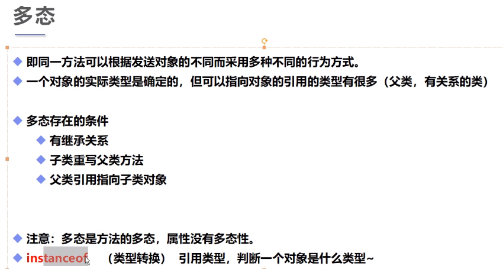
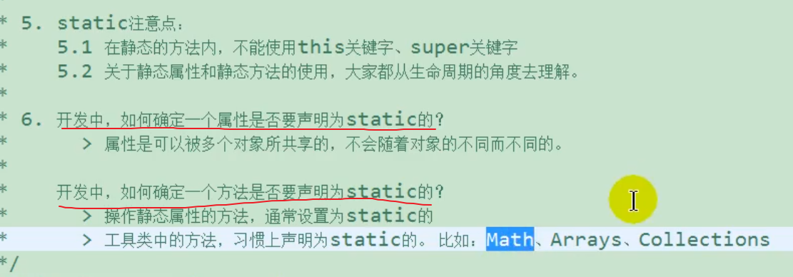
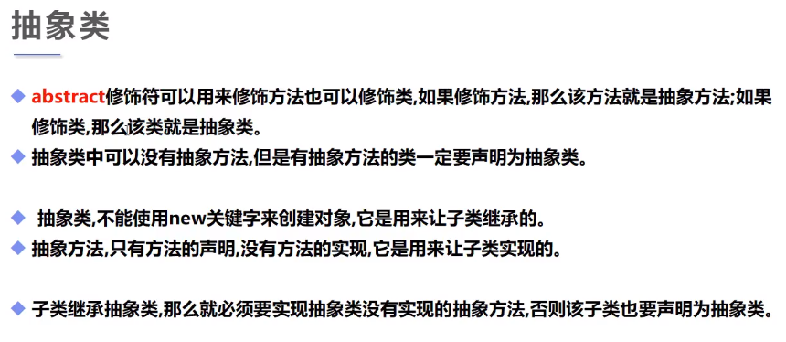
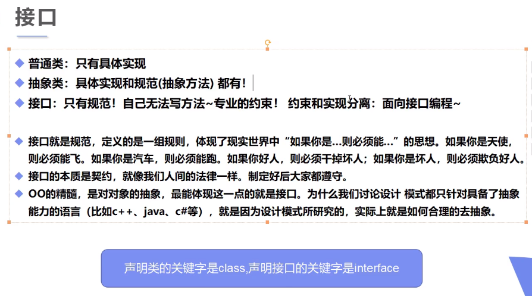
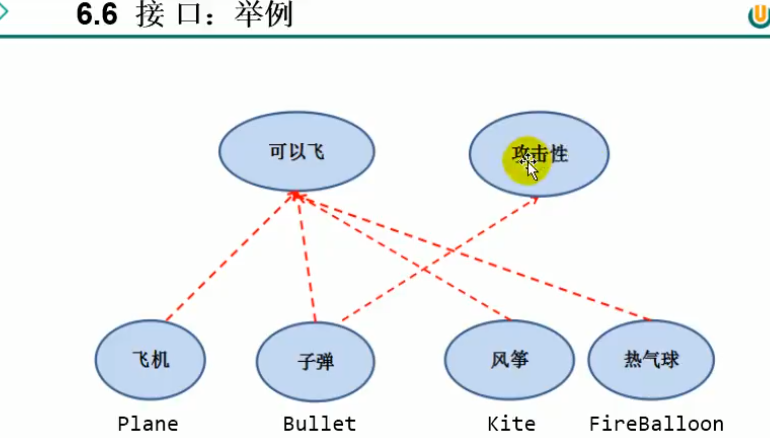
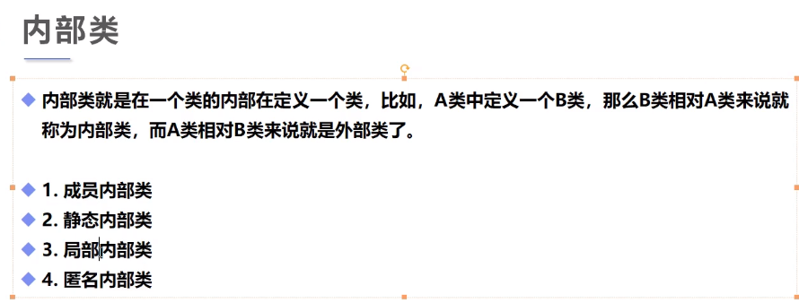
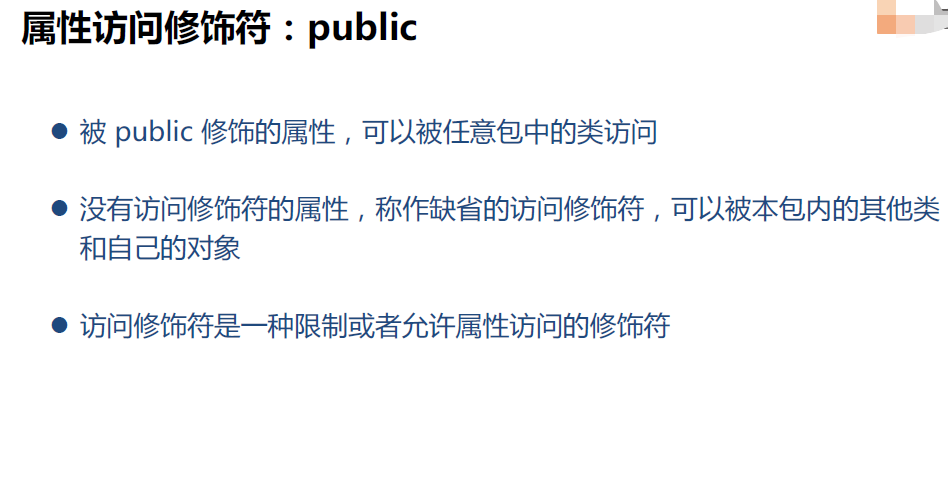
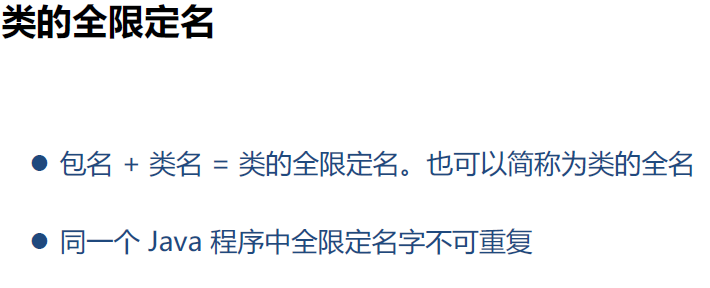

## 1.方法重写（覆盖）（非常重要）

又被称为方法覆盖，override

**覆盖才是继承的精髓和终极奥义**

记住：重写是方法的重写，和属性无关

覆盖：通过使用和父类方法签名一样，而且返回值也必须一样的方法，可以让子类覆盖掉父类的方法

如果方法签名一样，但返回值不同，会报错

<!--more-->

```java
public class B {
    public static void test(){
        System.out.println("B=>test()");
    }
}
public class A extends B {
    public static void test(){
        System.out.println("A=>test()");
    }
}
public class Application {
    public static void main(String[] args) {
        A a = new A();
        a.test();//A

        // 静态方法的调用只与左边定义的数据类型有关
        // 父类的引用指向了子类
        B b = new A();
        b.test();//B
    }
}
/*A=>test()
B=>test()*/
```

test方法去掉static修饰

```java
public class B {
    public void test(){
        System.out.println("B=>test()");
    }
}
public class A extends B {
    // Override 重写
    public void test(){
        System.out.println("A=>test()");
    }
}
public class Application {
    // 静态方法与非静态方法区别很大！
    public static void main(String[] args) {
        A a = new A();
        a.test();

        B b = new A();// 子类重写了父类的方法
        // 重写只与非静态方法有关
        b.test();
    }
}
/*A=>test()
A=>test()*/
```

静态方法是类的方法，而非静态方法是对象的方法。

在demo1中，b是A new出来的对象，所以调用A的方法test。

> **重写的关键字只能是public，不能是static或者private，子类继承父类才有重写**

重写：（IDEA快捷键：Alt + Insert：override）

- 需要有继承关系，子类重写父类的方法！
- 方法名必须相同
- 参数列表必须相同
- 修饰符：范围可以扩大但不能缩小，`public > porotected > default > private`
- 抛出的异常：范围可以缩小但不能扩大，例：`ClassNotFoundException(小)-->Exception(大)`

-为什么需要重写？

-父类的功能，子类不一定需要或不一定满足！


-什么方法不能重写？

1. static方法：它属于类，不属于实例（对象）
2. final 常量
3. private方法

## 2.多态（重要）



多态注意事项：

1. 多态是方法的多态，属性没有多态
2. 必须是父类与子类间的继承关系
3. 存在条件：继承关系，方法需要重写，**父类引用指向子类对象！**
4. 一个Person类既可以引用Person类型的对象，也可以引用Person类的任何一个子类的对象
5. **可以调用哪些方法，取决于引用类型是什么，具体调用哪个方法，取决于对象所属的类是什么**

```java
// 对于同一方法run有不同的行为
public class Person {
    public void run(){
        System.out.println("run");
    }
}
public class Student extends Person{
    public void run(){// 方法覆盖，体现了多态
        System.out.println("son");
    }
    public void eat(){
        System.out.println("eat");
    }
}
public class Application {
    public static void main(String[] args) {
        // 一个对象的实现类型是确定的
        // 如new Student();

        // 但是可以指向的引用类型就不确定了
        Student s1 = new Student();
        // Student能调用的方法都是自己的或者继承父类的！
        //父类的引用指向子类的对象
        Person s2 = new Student();
        //Person可以指向子类，但是不能调用子类独有的方法，只能重写
        Object s3 = new Student();

        // 对象能执行哪些方法，主要看左边的类型，与右边关系不大
        s2.run();//子类重写父类的方法，执行子类的方法
        //s2.eat(); 无法重写，报错
        s1.run();
        s1.eat();
    }
}
```

**当父类的引用指向子类的实例，只能通过父类的引用，像父类一样操作子类的对象**，也就是说左边“名”的类型，决定了能执行哪些操作（调用哪些方法...）。

总结：无论一个方法是使用哪个引用被调用的，"它都是在实际的对象上执行的"。执行的任何一个方法，都是这个对象所属的类的方法。如果没有，就去父类找，再没有，就去父类的父类找，依次寻找，直到找到。那么自然的，即使是在继承自父类的代码里，去调用一个方法，也是先从子类开始，一层层继承关系的找。这也是Java选择单继承的重要原因之一。在多继承的情况下，如果使用不当，多态可能会非常复杂，以至于使用的代价超过其带来的好处。

在这里我再总结一下这三个模式。

1）父类引用指向子类对象，**可以调用只在父类中的方法**（继承） 2）父类引用指向子类对象，**可以调用子类覆盖了父类的方法**（覆盖，多态） 3）父类引用指向子类对象，在1）和2）这两种情况下。如果这个方法的代码中又调用了别的方法，那么还是会遵循这个规则。举个例子，如果父类中有m1，m2两个方法。子类覆盖了m2方法。那么如果调用m1，则m1中调用的m2会是子类中定义的m2。

## 3.instanceof和类型转换

### instanceof

instanceof 是 Java 的一个二元操作符，类似于 ==，>，< 等操作符。

它的作用是测试它左边的对象是否是它右边的类（或子类）的实例，返回 boolean 的数据类型。

```java
public class Application {
    public static void main(String[] args) {
        // Object > Person > Student
        // Object > Person > Teacher
        // Object > String
        Object object = new Student();//注意object是Student类的对象
        System.out.println(object instanceof Student);//true
        System.out.println(object instanceof Person);//true
        System.out.println(object instanceof Object);//true
        System.out.println(object instanceof Teacher);//false
        System.out.println(object instanceof String);//false
    }
}
```

`System.out.println(x instanceof Y);`能不能编译（无关对错）通过取决于x指向的类型是不是与Y有继承·关系。

如果引用时null，肯定返回false。

**“is-a”规则**

用来判断是否应该将数据设计为继承关系，它指出子类的每个对象也是父类的对象。

例如：将Student类设计为Person类的子类，因为“Student is a Person”。

### 类型转换

1. **父类引用指向子类的对象，不能反过来**
2. 把子类转换为父类，向上转型
3. 把父类转换为子类，向下转型，强制转换，**只能在继承关系下进行强制转换**
4. 方便方法的调用，减少重复代码
5. 在将父类强制类型转换成子类之前，应该使用instanceof进行检查
6. 一般情况下，最好尽量少使用强制转换和instanceof
7. 父类若转换为子类，父类引用必须指向的是一个子类对象。实质上是将一个指向子类对象的父类引用改为了子类引用

```java
// 注:Person是Student的父类
public class Application {
    public static void main(String[] args) {
        // 类型之间的转换（高到低）：父  子
        Person s = new Student();//低 --> 高，自动转换
        //将s这个对象转换为Student类型，就可以使用Student类方法
        Student obj = (Student)s;//高 --> 低，强制类型转换
        obj.go();
        //上面两行等价于((Student)s).go();

        Student student = new Student();
        Person person = student;
    }
}
```

**所谓强制转型（转自CSDN）**

- 你没有改变对象，只是改变了引用而已

- 父类引用不能访问子类方法

  所以当你用父类引用指向子类对象时，不能访问子类的方法

  而当你转回子类引用指向子类对象时，又可以访问子类方法了

- 记住，这个过程中对象一直没变过，一直都是那个子类对象，变的只是引用

## 4.static关键字

静态方法里面只能调用静态的东西，而main函数也是静态的。



```java
public class Person {
    // 2.
    {
        System.out.println("匿名代码块");
    }
    // 1.只执行一次
    static {
        System.out.println("静态代码块");
    }
	// 3.
    public Person() {
        System.out.println("构造方法");
    }

    public static void main(String[] args) {
        Person person = new Person();
    }
}
/*静态代码块
匿名代码块
构造方法*/
```

小例子

```java
// 静态导入包
import static java.lang.Math.random;
public class Test {
	public static void main(String[] args){
		System.out.println(random());
	}
}
```

## 5.抽象类（不是重点)



```java
// abstract 抽象类
// Java类是单继承的，但是接口可以多继承
public abstract class Action {
    //抽象方法，只有方法名字，没有方法的实现
    public abstract void doSomething();
    //1.不能new这个抽象类，只能靠子类去实现它
    //2.抽象类中可以写普通方法
    //3.抽象方法必须在抽象类中
}

// 抽象类的所有方法，继承它的子类都必须要实现它的方法，除非它也是抽象类
public class A extends Action {
    @Override // 注解
    public void doSomething() {

    }
}
```

1.不能new这个抽象类，只能靠子类去实现它

2.抽象类中可以写普通方法

3.抽象方法必须在抽象类中

## 6.接口（重要）

Java通过接口来实现C++中多继承的效果，一个类可以实现多个接口。接口与接口之前可以多继承。

接口是一种特殊的抽象类，它的所有方法都是抽象方法，里面全部由**全局常量**和公共的抽象方法组成。

接口中的所有属性都会自动声明为`final static`。没有变量，都是常量。

接口和类是两个并列的结构。





```java
//interface修饰接口，接口都需要实现类
public interface UserService {
    //接口中的所有定义其实都是抽象的，默认为public abstract
    void run(String name);// public abstract void run(String name);

}
public interface TimeService {
    void timer();
}
// 类可以通过implements实现接口
// 实现接口的类，需要重写接口中的所有方法
// 利用接口实现多继承
public class UserServiceImpl implements UserService,TimeService{

    @Override
    public void run(String name) {

    }

    @Override
    public void timer() {

    }
}
```

**接口作用**

1. 约束
2. 定义一些方法，让不同的人实现
3. 接口中方法默认用`public abstract`修饰
4. 接口中属性默认用`public static final`修饰，也即静态常量，必须初始化
5. 接口不能被实例化，接口中没有构造方法
6. 接口中定义的静态方法只能通过接口来调用
7. 通过实现类的对象，可以调用接口的default方法
8. 通过implements可以实现多个接口
9. 必须要重写接口中的方法

## 7.N种内部类



```java
public class Outer {
    private int id = 10;
    public void out(){
        System.out.println("这是外部类的方法");
    }
	// 内部类
    public class Inner{
        public void in(){
            System.out.println("这是内部类的方法");
        }
        //内部类可以获得外部类的私有属性
        public void getID(){
            System.out.println(id);
        }
    }
}
public class Application {
    public static void main(String[] args) {
        Outer outer = new Outer();
        // 通过外部类来实例化内部类
        Outer.Inner inner = outer.new Inner();
        inner.in();//这是内部类的方法
        inner.getID();//10
    }
}
```

```java
public class Outer {

}
//一个java类中可以有多个class类，但是只能有一个public class
class D{

}
```

以下小例子只作为扩展眼界，不必深究。

小例子1：

```java
public class Outer {
    //局部内部类
	public void method(){
        class Inner{
            
        }
    }
}
```

小例子2：

```java
public class Test(){
    public static void main(String[] args){
        //没有名字初始化类，不用将实例保存到变量中
        new Apple().eat();
    }
}
class Apple{
    public void eat(){
		System.out.println("1");
    }
}
```

```Java
public class Outer {
    // 成员内部类
        class D{

    }
}
```

## 8.属性访问修饰符



