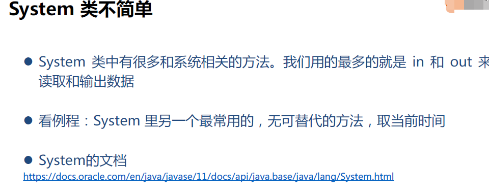
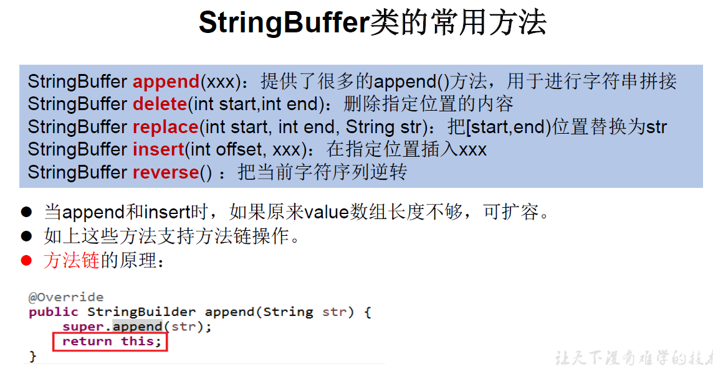
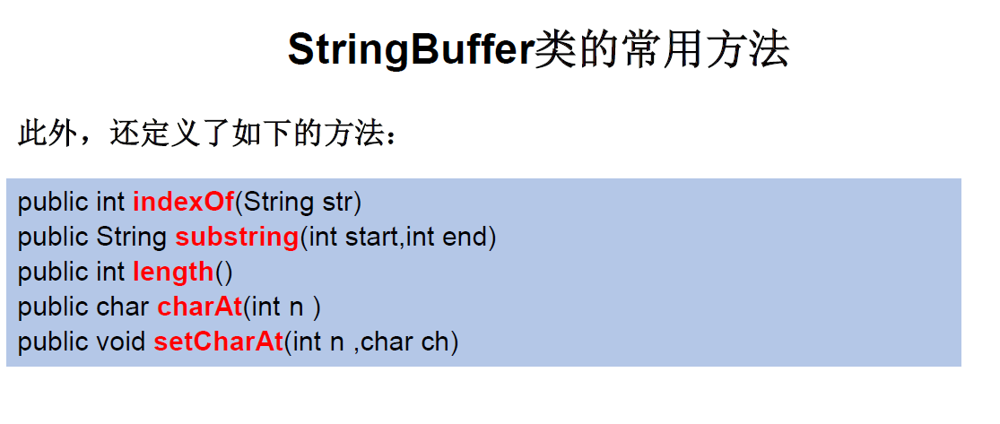
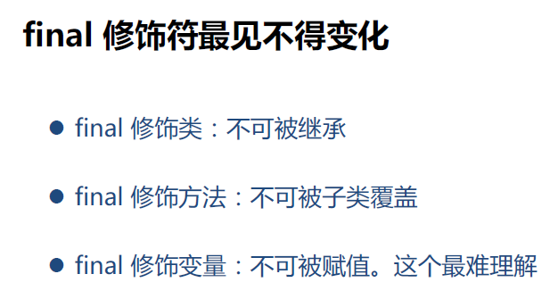

## 1.System类不简单

<!--more-->



```java
public class LearnSystem {
    public static void main(String[] args) {
        long startMS = System.currentTimeMillis();

        int counter = 0;
        for (int i = 0; i < 1000; i++) {
            counter++;
        }

        long endMS = System.currentTimeMillis();
        System.out.println("程序执行使用了几个毫秒？" + (endMS - startMS));

        long startNS = System.nanoTime();

        counter = 0;
        for (int i = 0; i < 1000; i++) {
            counter++;
        }

        long endNS = System.nanoTime();
        System.out.println("程序执行使用了几个纳秒？" + (endNS - startNS));
    }
}
// 一般常用毫米
/*
程序执行使用了几个毫秒？0
程序执行使用了几个纳秒？7600*/
```

`System.currentTimeMillis()` 返回当前的计算机时间，时间的表达格式为当前计算机时间和GMT时间(格林威治时间)1970年1月1号0时0分0秒所差的毫秒数。

```java
public static long currentTimeMillis() // 返回long
```

## 2.String类的好兄弟：StringBuilder

它是一个非常方便用于拼接和处理字符串的类，它和String不同在于**它是可变的**。

这对“好兄弟”的关系有点像C++中的string类和vector。

**StringBuffer** 与**StringBuilder**类似。 

**由于 StringBuilder 相较于 StringBuffer 有速度优势，所以多数情况下建议使用 StringBuilder 类。然而在应用程序要求线程安全的情况下，则必须使用 StringBuffer 类。**

**String、StringBuffer、StringBuilder三者的对比**

- `String`:不可变的字符序列；底层使用char[]存储
- `StringBuffer`:可变的字符序列；线程安全的，效率低；底层使用char[]存储
- `StringBuilder`:可变的字符序列；jdk5.0新增的，线程不安全的，效率高；底层使用char[]存储

虽然可以直接拼接String字符串，但是，在循环中，每次循环都会创建新的字符串对象，然后扔掉旧的字符串。这样，绝大部分字符串都是临时对象，不但浪费内存，还会影响GC效率。

为了能高效拼接字符串，Java标准库提供了`StringBuilder`，它是一个可变对象，可以预分配缓冲区，这样，往`StringBuilder`中新增字符时，不会创建新的临时对象：

```java
public static void main(String[] args) {
        //StringBuilder首先是可变的
        //而且对它进行操作的方法，都会返回this自引用。这样我们就可以一直点下去，对String进行构造。
        StringBuilder strBuilder = new StringBuilder();
        long longVal = 123456789;
		//StringBuilder sb = new StringBuilder("Run");// 可以传入参数
        //StringBuilder sb = new StringBuilder(10);// 初始长度为10，可以一直append
    
        strBuilder.append(true).append("abc").append(longVal);

        System.out.println(strBuilder.toString());// 转换为String对象
        System.out.println(strBuilder.reverse().toString());//反转
        System.out.println(strBuilder.reverse().toString());
        System.out.println(strBuilder.toString());

        System.out.println(strBuilder.delete(0, 4).toString());// 左闭右开

        System.out.println(strBuilder.insert(3,"LLLLL").toString());// 放在索引为3的位置
    }
```





```Java
//常用方法
增：append(xxx)
删：delete(int start,int end)
改：setCharAt(int n ,char ch) / replace(int start, int end, String str)
查：charAt(int n )
插：insert(int offset, xxx)
长度：length();
*遍历：for() + charAt() / toString()
```

> append、reverse、delete和insert均不会创建新对象，直接在原对象上修改。

## 3.多态里更多的语法

静态多态：重载（Overload）

```java
//重载调用哪个方法，和参数的引用类型相关，和引用实际指向的类型无关
merchandiseTest.testMerchandiseOverload(m);
merchandiseTest.testMerchandiseOverload((Phone) m);
merchandiseTest.testMerchandiseOverload((ShellColorChangePhone) m);
//甚至是个null也可以，但是要用强制类型转换，告诉Java这个类型是什么，否则找不到一个唯一的方法去调用
// 重载的参数类型，相同位置，不一定要有继承或者兼容的关系，完全free style
//如果引用类型没有完全匹配的，则会根据继承关系，沿着参数当前类型，向下撸       
merchandiseTest.testMerchandiseOverloadNotExactlyMatchType((ShellColorChangePhone) null);
```

重载总结：静态多态，调用的方法和参数实际指向的对象无关，只和引用本身的类型相关。

因为调用时参数类型是确定的，所以，在编译期间就可以明确的知道哪个方法会被调用。如果有多种可能，则会有编译错误

如果没有类型完全匹配的候选，则根据类型的继承关系向下撸着找。找到最贴近参数类型的那个方法

无论是静态方法，还是成员方法，重载寻找方法的顺序是一样的，在这里就不赘述了

动态多态：覆盖（Override）

## 4.继承专属的访问控制符

protected 可见性= default + 对子类可见

子类覆盖父类的方法，不可以使用可见性更低的修饰符，但可以使用可见性更高的修饰符。

## 5.final修饰符

final意为最终的。不可变！！不需要再扩充功能了，已经够用了。



我们常用的String类就是用final修饰的，不能被随意修改。

final修饰变量，也就成了常量，必须在定义时初始化，或在构造器里初始化，且不能修改。

final修饰static变量，必须在定义时初始化，或在`static{}`代码块里赋值。

final修饰父类的方法，确保不会被子类覆盖。

**final不能修饰构造方法！**

final修饰的类不可被继承：比如：String类、System类、StringBuffer类。

**final修饰引用**：不能修改令引用指向别的对象，但是可以修改引用指向的对象。

这就有C语言的常量指针内味了，不可修改指针的指向，但能修改指针指向的值。

注：常量指针与指向常量的指针不一样！

## 6.继承里的静态方法

静态方法可以被继承，方法签名和返回值必须一样。

用引用调用（即用对象）静态方法不会被覆盖，不推荐这样调用，应该用类名调用。

```java
m.staticMethod();
((Phone) m).staticMethod(); // 会调用对应对象的方法
((ShellColorChangePhone) m).staticMethod();
// TODO 有些东西，学会就应该马上忘掉，比如上面使用引用调用静态方法的内容
((MerchandiseV2) null).staticMethod();
((Phone) null).staticMethod(); // 会调用对应对象的方法
((ShellColorChangePhone) null).staticMethod();
// TODO 有些东西，学会就应该马上忘掉，比如上面使用有类型的null引用调用静态方法的内容
```

## 7.for-each循环

语法基本同C++/Python中的类似写法，循环对象必须是一个数组或者一个实现了Iterable接口的类对象。

```java
int[] arr= {1,2,3,4,5}
//forEach写法（效果跟下面同等）
for(int i:arr)
	System.out.println("数组元素:"+i);
```


