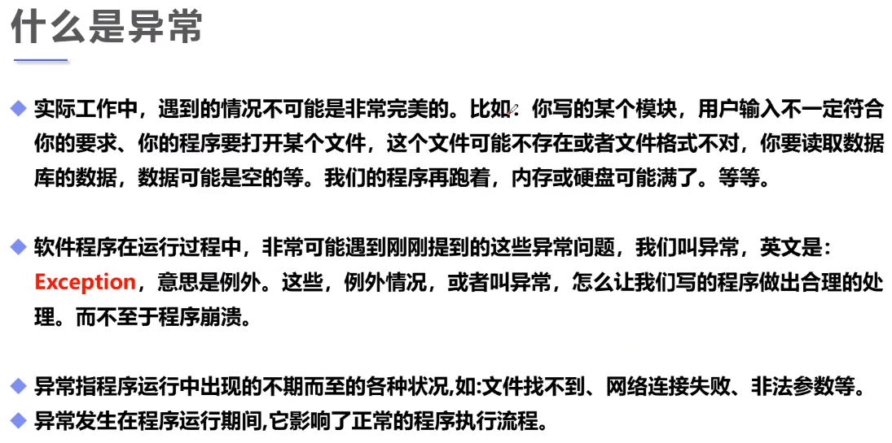
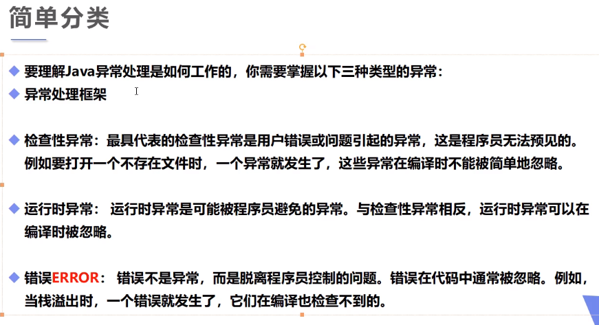
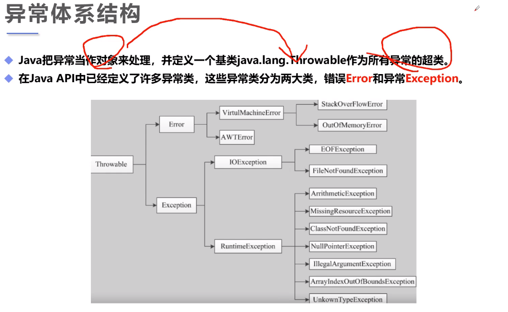
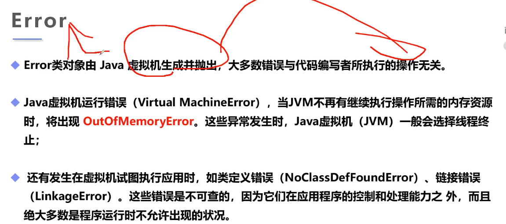
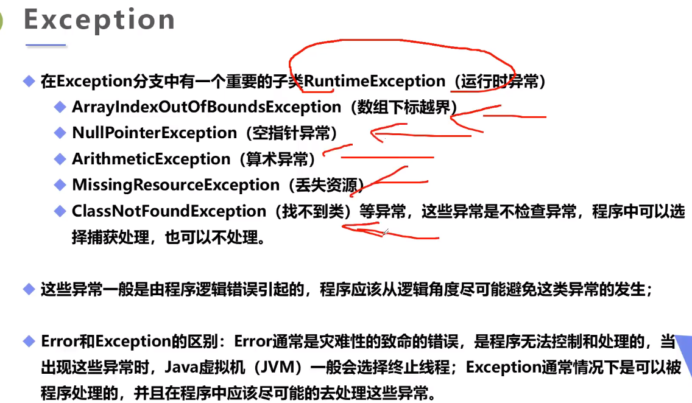
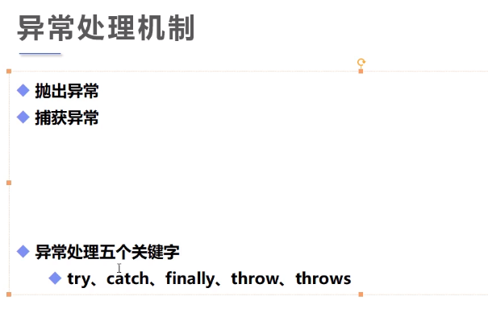
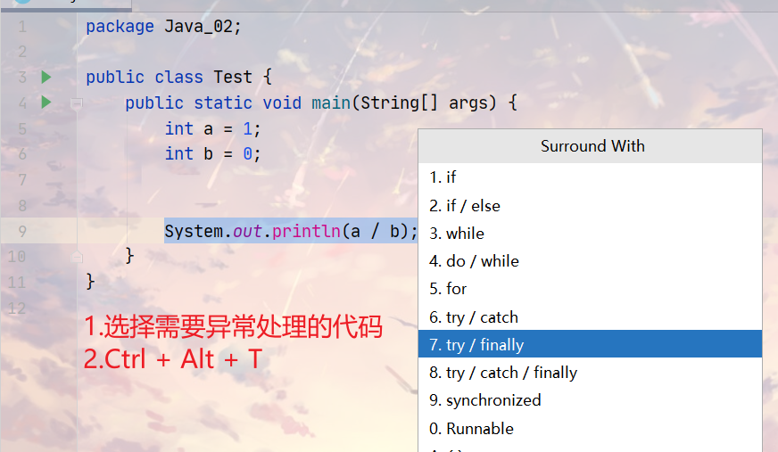
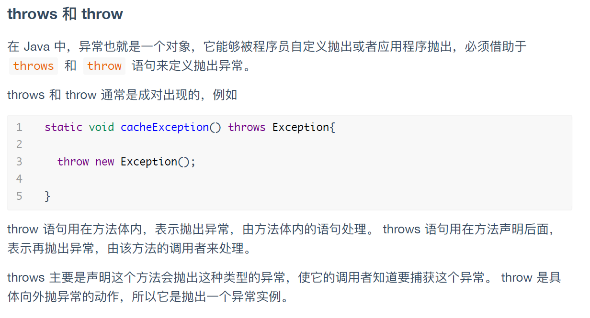
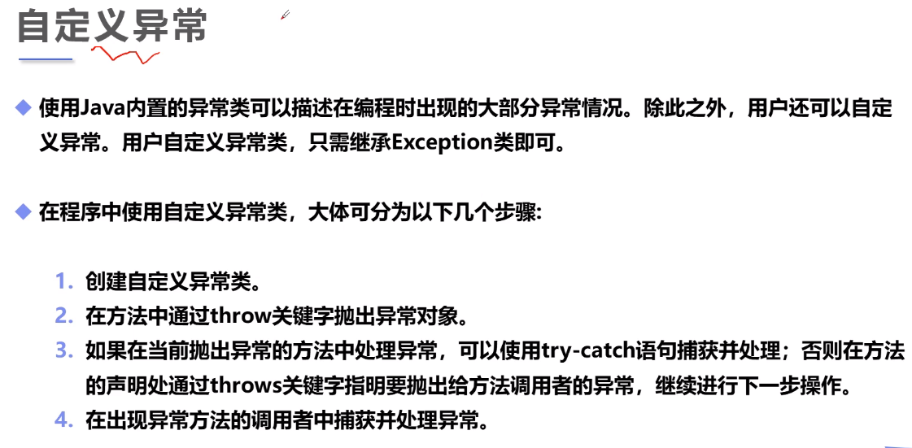
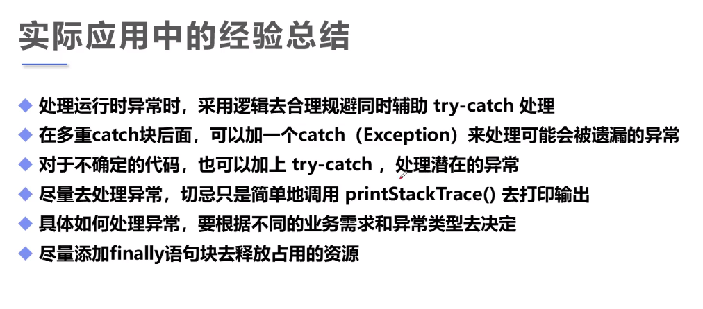

## Java异常机制（Exception）

<!--more-->



```java
//小例子
public class A {
    public static void main(String[] args) {
        new A().a();
    }
    public void a(){
        b();
    }
    public void b(){
        a();
    }
}
//Exception in thread "main" java.lang.StackOverflowError 栈溢出
```





### 错误（Error）与异常（Exception）





Exception可以分成运行时异常和非运行时异常。

以上理论只作为了解内容，重点是如何处理异常。

### 异常处理（抛出与捕获）



```java
public class Test {
    public static void main(String[] args) {
        int a = 1;
        int b = 0;
        //try监控区域
        try {
            System.out.println(a/b);
        }catch (ArithmeticException e){
            //catch用于捕获异常
            System.out.println("程序异常，变量b不能为0");
        }finally{
            //处理善后工作，无论是否异常都会执行
            System.out.println("finally");
        }
        //try-catch代码块是必要的
        //finally不是必须的
    }
}
```

```java
public class Test {
    public static void main(String[] args) {

        try{
            new Test().a();
        }catch (Throwable e){
            //catch(想要捕获的异常类型)
            System.out.println("Exception");
        }
    }
    public void a(){
        b();
    }
    public void b(){
        a();
    }
}
```

try-catch...-catch结构：一般把较大的异常放在后面。

假设要捕获多个异常，必须从小到大，否则会报错！

```java
public class Test {
    public static void main(String[] args) {
        int a = 1;
        int b = 0;

        try {
            System.out.println(a/b);
        }catch (Error e){
            //catch用于捕获异常
            System.out.println("Error");
        }catch (Exception e){
            System.out.println("Exception");
        }catch (Throwable t){
            System.out.println("Throwable");
        }
        finally{
            //处理善后工作，无论是否异常都会执行
            System.out.println("finally");
        }
        //try-catch代码块是必要的
        //finally不是必须的
    }
}
```

IDEA异常处理快捷键：



```java
public class Test {
    public static void main(String[] args) {
        try {
            new Test().test(1,0);
        } catch (ArithmeticException e) {
            e.printStackTrace();
        }

    }
    //假设这个方法处理不了这个异常，就从方法上抛出异常
    public void test(int a,int b) throws ArithmeticException{
        if (b == 0) {
            throw new ArithmeticException();//主动抛出异常，一般在方法中使用
        }
    }
}
```



**异常处理的一般经验**：捕获那些你知道如何处理的异常，继续传播（抛出）那些不知道如何处理的异常。

### 自定义异常

大部分情况下，我们不需要自定义异常。



```java
//自定义的异常类
public class MyException extends Exception{
    //传递数字>10抛出异常
    private int detail;

    public MyException(int a) {
        this.detail = a;
    }
    //toString:异常的打印信息
    @Override
    public String toString() {
        return "MyException{" +
                "detail=" + detail +
                '}';
    }
}
public class Test {
    // 可能会存在异常的方法
    static void test(int a) throws MyException{
        System.out.println("传递的参数为："+a);
        if (a>10){
            throw new MyException(a);
        }
        System.out.println("OK");
    }

    public static void main(String[] args) {
        try {
            test(1);
            //传递的参数为：1 OK
            test(11);
            //传递的参数为：11 MyException=>MyException{detail=11}
        } catch (MyException e) {
            System.out.println("MyException=>"+e);
        }
    }
}
```



IDEA代码出现波浪线（一些异常等），按住Alt + Enter进行处理。
