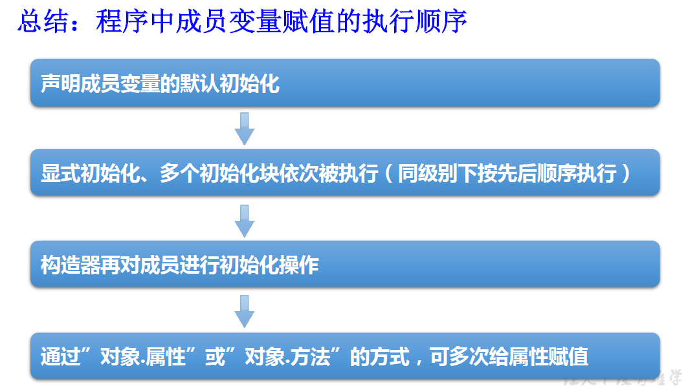
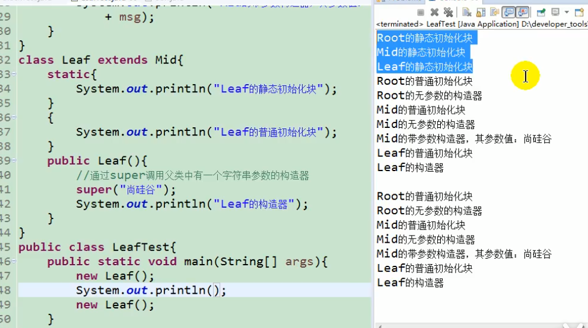
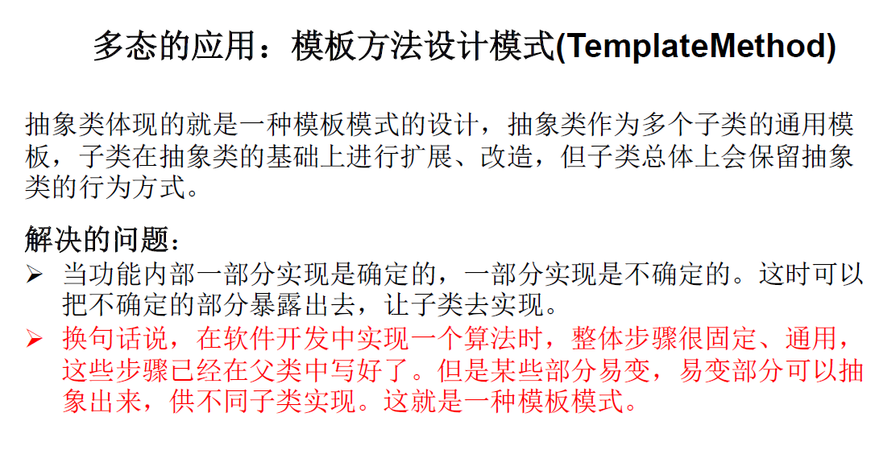
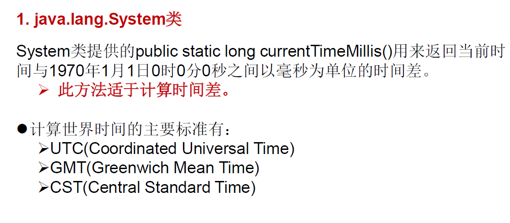
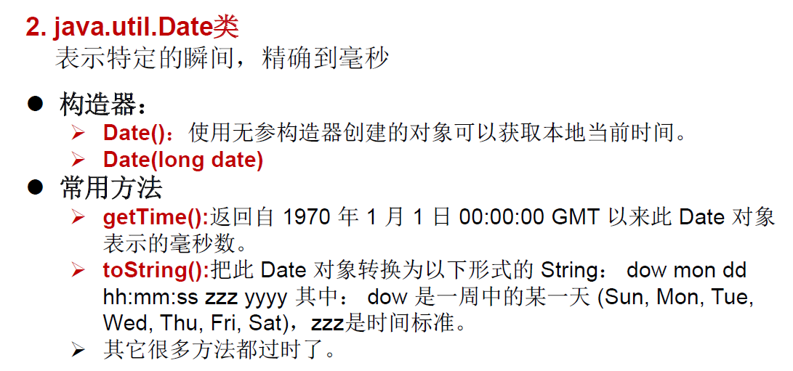
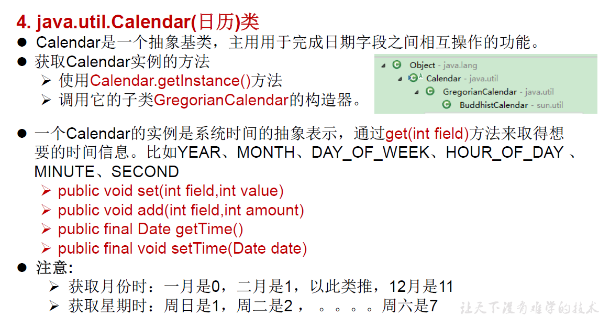

## 1.类的结构：代码块（初始化块）

1. 代码块的作用：用来初始化类、对象的信息
2. 分类：静态代码块 VS 非静态代码块
3. 代码块要是使用修饰符，只能使用static

<!--more-->

静态代码块：

- 内部可以输出语句

- 随着**类的加载而执行**,而且只执行一次
- 作用：初始化类的信息

- 静态方法也随着类的加载而加载，但是不执行

- 如果一个类中定义了多个静态代码块，则按照声明的先后顺序执行
- 静态代码块的执行要优先于非静态代码块的执行
- 静态代码块内只能调用静态的属性、静态的方法，**不能**调用**非静态**的结构

非静态代码块：

- 内部可以输出语句
- 随着**对象的创建**而执行
- 每创建一个对象，就执行一次非静态代码块
- 作用：可以在创建对象时，对对象的属性等进行初始化
- 如果一个类中定义了多个非静态代码块，则按照声明的先后顺序执行
- 非静态代码块内可以调用静态的属性、静态的方法，或非静态的属性、非静态的方法





**总结：由父及子，静态先行。**

```Java
成员变量赋值顺序
 * ①默认初始化
 * ②显式初始化/⑤在代码块中赋值，看先后顺序
 * ③构造器中初始化
 * ④有了对象以后，可以通过"对象.属性"或"对象.方法"的方式，进行赋值
 * 
 * 
 * 执行的先后顺序：① - ② / ⑤ - ③ - ④
```

## 2.抽象类的应用：模板方法设计模式



```Java
public class TemplateTest {
    public static void main(String[] args) {
        SubTemplate t = new SubTemplate();
        t.spendTime();
    }
}

// 模板方法设计模式的一个应用案例
abstract class Template{
    // 计算某段代码执行时间
    public void spendTime(){
        long start = System.currentTimeMillis();
        code(); // 不确定部分
        long end = System.currentTimeMillis();
        System.out.println("花费的时间是："+(end-start));
    }

    public abstract void code();
}

class SubTemplate extends Template{
    @Override
    public void code() {
        for (int i = 2;i <= 1000;i++){
            boolean isFlag = true;
            for (int j = 2;j <= Math.sqrt(i);j++){
                if (i % j == 0){
                    isFlag = false;
                    break;
                }
            }
            if (isFlag){
                System.out.println(i);
            }
        }
    }
}
```

## 3.时间日期API





```Java
import java.util.Date;
class JunitTest {
    @Test
    public void Test1(){
        // JDK8之前的日期和时间API
        long start = System.currentTimeMillis();
        //返回1970年XXX到现在的时间差，时间戳形式
        System.out.println(start);
    }

    @Test
    public void Test2(){
        //构造器1：Date()，对应当前时间的Date对象
        Date date1 = new Date();
        System.out.println(date1.toString());
        System.out.println(date1.getTime());// 返回毫秒数,时间戳

        //构造器2：Date(long Date)
        Date date2 = new Date(1619941526721L);//记得加L
        System.out.println(date2.toString());

        //创建java.sql.Date对象，它是java.util.Date的子类
        java.sql.Date date3 = new java.sql.Date(1619941526721L);
        System.out.println(date3.toString());

        //将java.util.Date对象转换为java.sql.Date对象
        //1.
        Date date4 = new java.sql.Date(1619941526721L);
        java.sql.Date date5 = (java.sql.Date) date4;
        //2.
        Date date6 = new Date();
        java.sql.Date date7 = new java.sql.Date(date6.getTime());
    }
}
```

## 4.java.text.SimpleDataFormat类

SimpleDateFormat对日期Date类的格式化和解析

- 两个操作
  - 格式化：日期 --->字符串
  - 解析：格式化的逆过程，字符串 ---> 日期
- SimpleDateFormat的实例化:new + 构造器

```Java
SimpleDateFormat sdf1 = new SimpleDateFormat("yyyy-MM-dd hh:mm:ss");
//格式化
String format1 = sdf1.format(date);
System.out.println(format1);//2019-02-18 11:48:27
//解析:要求字符串必须是符合SimpleDateFormat识别的格式(通过构造器参数体现),
//否则，抛异常
Date date2 = sdf1.parse("2020-02-18 11:48:27");
System.out.println(date2);
```

## 5.Calendar类：日历类、抽象类

它是抽象类，所以不能实例化。



```Java
public void testCalendar(){
        //实例化
        //1.创建子类GregorianCalendar的对象
        //2.调用其静态方法getInstance()，方便记忆
        Calendar calendar = Calendar.getInstance();

        //常用方法
        //get方法获取常用的属性信息
        int days = calendar.get(Calendar.DAY_OF_MONTH);
        System.out.println(days);
        System.out.println(calendar.get(Calendar.DAY_OF_WEEK));
        //set修改信息
        calendar.set(Calendar.DAY_OF_MONTH,19);
        int day = calendar.get(Calendar.DAY_OF_MONTH);
        System.out.println(day);
        //add追加信息
        calendar.add(Calendar.DAY_OF_MONTH,2);
        day = calendar.get(Calendar.DAY_OF_MONTH);
        System.out.println(day);
        //getTime():日历类--->Date
        Date date = calendar.getTime();
        System.out.println(date);
        //setTime():Date--->日历类
        Date date1 = new Date();
        calendar.setTime(date1);
        System.out.println(calendar.get(Calendar.DAY_OF_MONTH));
    }
```

