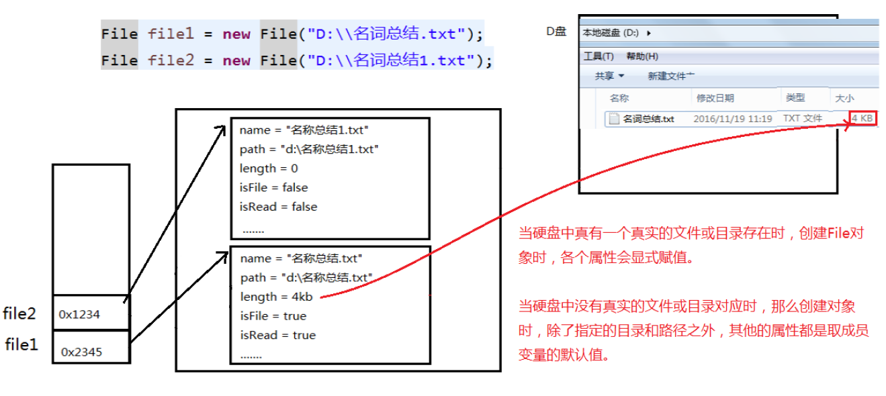
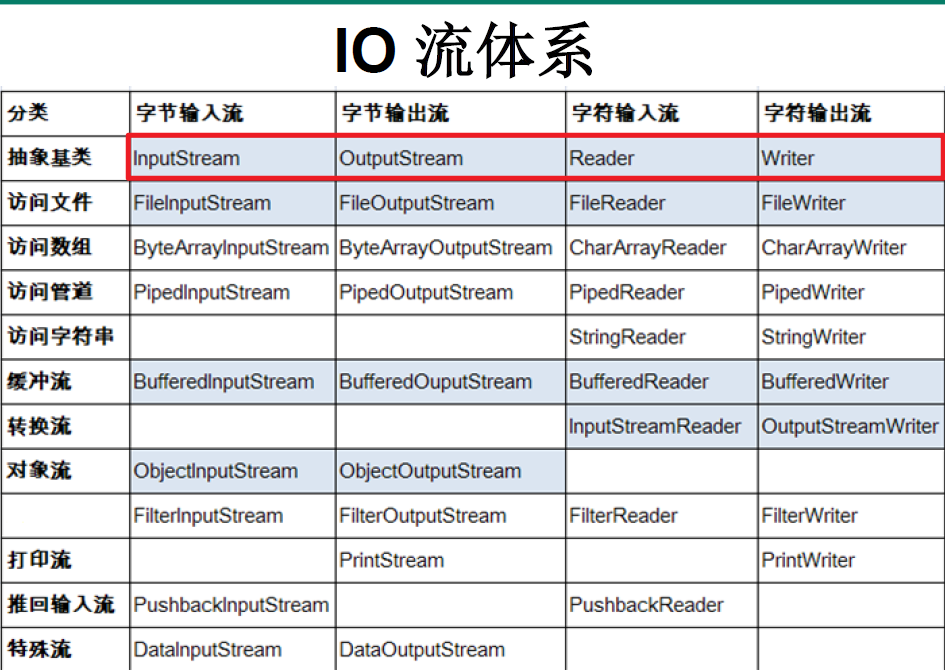
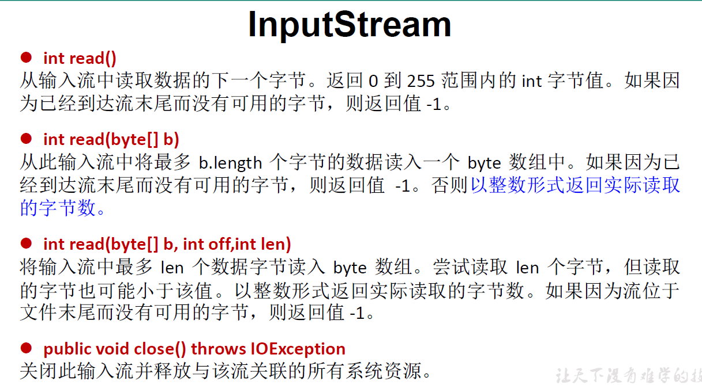
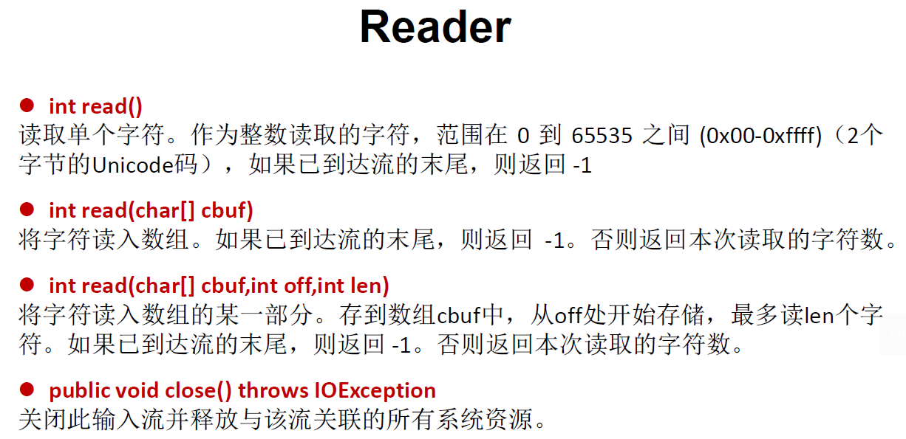

## 1.File类

File类的一个对象，代表一个文件或一个文件目录(俗称：文件夹)

File类声明在java.io包下

File类中涉及到关于文件或文件目录的创建、删除、重命名、修改时间、文件大小等方法，并未涉及到**写入或**

**读取文件内容**的操作。如果需要读取或写入文件内容，必须使用**IO流**来完成。

后续File类的对象常会作为参数传递到流的构造器中，指明读取或写入的”终点”。

<!--more-->

### File类的常用构造器：File的实例化

```Java
public File(String filePath)
public File(String parentPath,String childPath)
public File(File parentFile,String childPath)
```

说明：
	IDEA中：

如果大家开发使用JUnit中的**单元测试方法**测试，相对路径即为当前Module下。

如果大家使用main()测试，相对路径即为当前的Project下。
	Eclipse中：

不管使用单元测试方法还是使用main()测试，相对路径都是当前的Project下。

路径分隔符：

```Java
windows和DOS系统默认使用“\”来表示
// D:\xxx\Java01_基础    在java中就需要加上\\，或者/也行

UNIX和URL使用“/”来表示
// home/cyb
```

例子：

```Java
 @Test
public void test1(){
    // 方式1：
    // 相对路径, 相对于当前module
    File file = new File("hello.txt");// hello.txt
    // 绝对路径
    File file1 = new File("D:/xxx/xxx/hello.txt");// D:\xxx\xxx\hello.txt
    System.out.println(file);
    System.out.println(file1);
    // 方式2：
    File file2 = new File("D:/Java","Java基础");
    System.out.println(file2);// D:\Java\Java基础
    // 方式3：
    File file3 = new File(file2,"hi.txt");
    System.out.println(file3);// D:\Java\Java基础\hi.txt
    // 以上的file对象只是内存层面的，在硬盘中实际并不存在
}
```



### File类的常用方法

File类的获取功能

```java
public String getAbsolutePath()：获取绝对路径
public String getPath() ：获取路径
public String getName() ：获取名称
public String getParent()：获取上层文件目录路径。若无，返回null
public long length() ：获取文件长度（即：字节数）。不能获取目录的长度。
public long lastModified() ：获取最后一次的修改时间，毫秒值
如下的两个方法适用于文件目录
public String[] list() ：获取指定目录下的所有文件或者文件目录的名称数组
public File[] listFiles() ：获取指定目录下的所有文件或者文件目录的File数组
```

```java
@Test
public void test2(){
    File file = new File("D:\\Hexo\\blog");
    System.out.println(file.getPath());
    String[] list = file.list();
    for (String s: list){
        System.out.println(s);
    }
    System.out.println();
    File[] files = file.listFiles();
    for (File f:files){
        System.out.println(f);
    }
}
/*D:\Hexo\blog
.deploy_git
.git
.gitignore
db.json
xxx省略

D:\Hexo\blog\.deploy_git
D:\Hexo\blog\.git
D:\Hexo\blog\.gitignore
D:\Hexo\blog\db.json
xxx*/
```

File类的重命名功能

```java
public boolean renameTo(File dest):把文件重命名为指定的文件路径
```

```java
@Test
public void test3(){
    File file1 = new File("hello.txt");
    File file2 = new File("F:\\VS_cpp\\hi.txt");
    // 要想保证返回true，file1必须在硬盘中存在，file2不能存在
    // 结果是true，file1不存在hello，file2多了hi，文件内容还是hello的，只是改名了
    boolean renameTo = file1.renameTo(file2);
    System.out.println(renameTo);
}
```

File类的判断功能

```java
public boolean isDirectory()：判断是否是文件目录
public boolean isFile() ：判断是否是文件
public boolean exists() ：判断是否存在
public boolean canRead() ：判断是否可读
public boolean canWrite() ：判断是否可写
public boolean isHidden() ：判断是否隐藏
```

File类的创建功能：硬盘中文件的创建

```Java
public boolean createNewFile() ：创建文件。若文件存在，则不创建，返回false
public boolean mkdir() ：创建文件目录。如果此文件目录存在，就不创建了。如果此文件目录的上层目录不存在，也不创建。
public boolean mkdirs() ：创建文件目录。如果上层文件目录不存在，一并创建
```

注意事项：如果你创建文件或者文件目录没有写盘符路径，那么，默认在项目 路径下。

File类的删除功能

```java
public boolean delete()：删除文件或者文件夹
```

删除注意事项：

Java中的删除不走回收站。 要删除一个文件目录，请注意**该文件目录内不能包含文件或者文件目录**

```java
@Test
public void test4() throws IOException {
    // 文件的创建与删除
    File file = new File("hello.txt");
    if (!file.exists()){
        file.createNewFile();
        System.out.println("创建成功");
    }
    else{
        file.delete();
        System.out.println("删除成功");
    }
}
```

## 2.IO流

输入input：读取外部数据（磁盘、光盘等存储设备的数据）到程序（内存）中。

输出output：将程序（内存） 数据输出到磁盘、光盘等存储设备中。

分界是以内存为标准：进内存处理就是输入流、 出内存就是输出流。

**程序员从内存（程序）的角度来看是输入还是输出。**

最基本的流：4个抽象基类

| (抽象基类) | 字节流       | 字符流 |
| ---------- | ------------ | ------ |
| 输入流     | InputStream  | Reader |
| 输出流     | OutputStream | Writer |

字节流：Byte，字符流：char。字符流更适合处理文本文件。

流的分类

1. 操作数据单位：字节流、字符流
2. 数据的流向：输入流、输出流
3. 流的角色：节点流、处理流

**流的体系结构**



**说明：红框对应的是IO流中的4个抽象基类。**

蓝框的流需要大家重点关注。**看到流的名字要明确它属于哪两种分类。**

- 基本的四个抽象基类
- 文件的四个
- 缓冲的四个
- 转换的两个流
    - `BufferedReader br= new BufferedReader(new InputStreamReader(System.in));`
    - `BufferedWriter bw = new BufferedWriter(new OutStreamWriter(System.out));`

关于节点流（文件流）和处理流：


**重点说明的几个流：**

抽象基类         节点流（或文件流）                               缓冲流（处理流的一种）
 * InputStream     FileInputStream   (read(byte[] buffer))        BufferedInputStream (read(byte[] buffer))
 * OutputStream    FileOutputStream  (write(byte[] buffer,0,len)  BufferedOutputStream (write(byte[] buffer,0,len) / flush()
 * Reader          FileReader (read(char[] cbuf))                 BufferedReader (read(char[] cbuf) / readLine())
 * Writer          FileWriter (write(char[] cbuf,0,len)           BufferedWriter (write(char[] cbuf,0,len) / flush()

InputStream & Reader

```C++
InputStream 和 Reader 是所有输入流的基类
InputStream
    int read()
    int read(byte[] b)
    int read(byte[] b, int off, int len)
Reader
    int read()
    int read(char [] c)
    int read(char [] c, int off, int len)

// 程序中打开的文件 IO 资源不属于内存里的资源，垃圾回收机制无法回收该资
源，所以应该显式关闭文件 IO 资源

// FileInputStream 从文件系统中的某个文件中获得输入字节。FileInputStream
用于读取非文本数据之类的原始字节流。要读取字符流，需要使用 FileReader
```



