## 1.BigInteger类和BigDecimal类

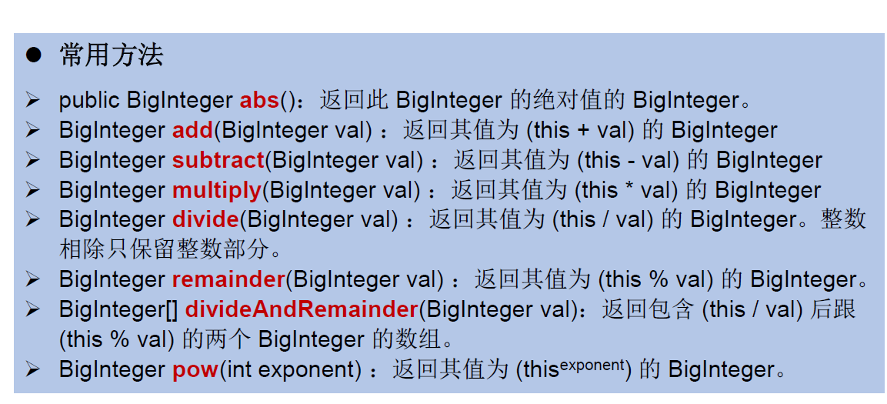

<!--more-->

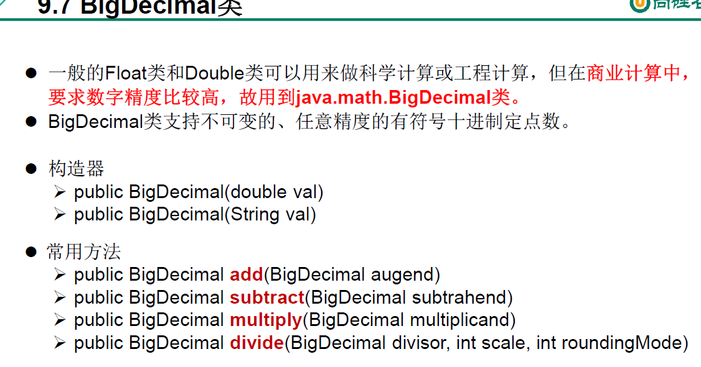

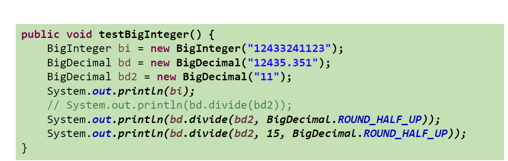

## 2.枚举类的使用

JDK1.5之前自定义枚举类了解就行。

- 重点掌握JDK1.5的新特性，enum关键字定义枚举类。

- 类的对象只有有限个，确定的。

- 当需要定义一组常量时，强烈建议使用枚举类。
- 若枚举只有一个对象 , 则可以作为一种**单例模式**的实现方式。

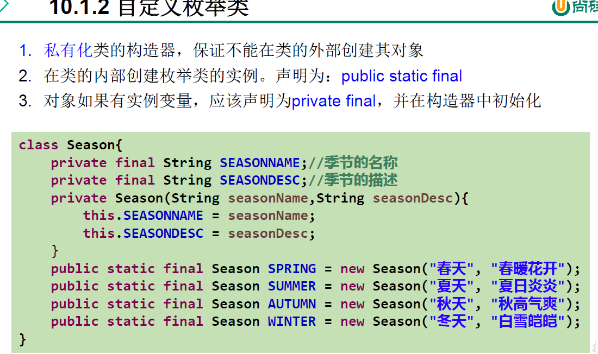

看看就行。

```Java
//enum关键字定义枚举类
public class SeasonTest {
    public static void main(String[] args) {
        Season summer = Season.SUMMER;
        System.out.println(summer);//SUMMER，无需重写toString
    }
}

//定义的枚举类默认继承于java.lang.Enum类
enum Season{
    //提供当前枚举类的对象，之间用","隔开，";"结束
    SPRING("春天"),//默认为private final
    SUMMER("夏天"),
    AUTUMN("秋天"),
    WINTER("冬天");
    //声明Season对象的四有属性
    private final String name;
    //私有化类的构造器，并给属性赋值
    private Season(String name){
        this.name = name;
    }
    //其他诉求，获取对象属性
    public String getName() {
        return name;
    }
}
```

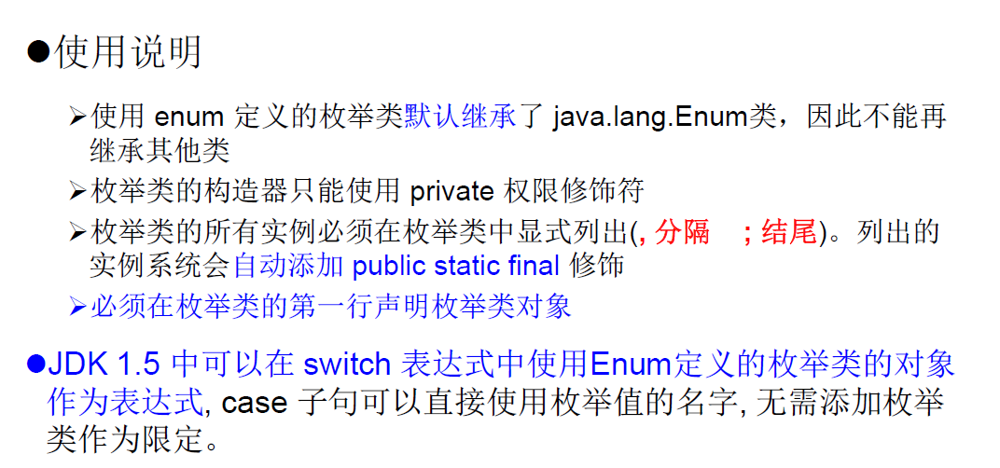

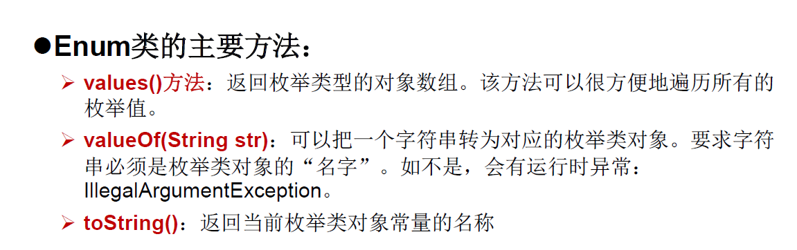

```Java
public static void main(String[] args) {
    Season[] values = Season.values();
    for (int i = 0;i < values.length;i++){
        System.out.println(values[i].toString());
    }
    System.out.println("____________________________");
    //valueOf(String objname)，返回枚举类中对象名是objname的对象
    Season winter = Season.valueOf("WINTER");
    System.out.println(winter);
}
/*SPRING
SUMMER
AUTUMN
WINTER
____________________________
WINTER*/
```

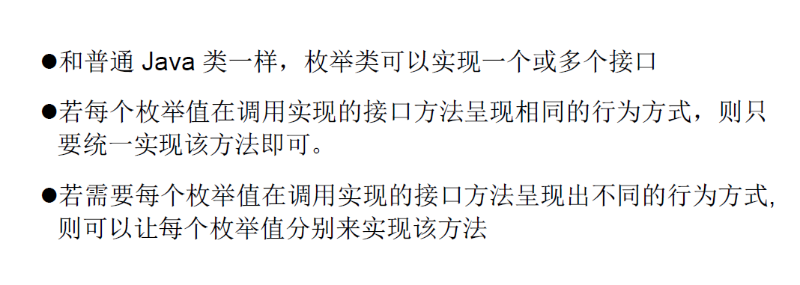

```Java
//每个枚举值分别实现同一个接口方法
public class SeasonTest {
    public static void main(String[] args) {
        Season season1 = Season.SUMMER;
        Season season2 = Season.SPRING;
        Season season3 = Season.AUTUMN;
        season1.show();
        season2.show();
        season3.show();
    }
/*summer
spring
autumn*/
}
interface Info{
    void show();
}
//定义的枚举类默认继承于java.lang.Enum类
enum Season implements Info{
    //提供当前枚举类的对象，之间用","隔开，";"结束
    SPRING("春天"){
        public void show(){
            System.out.println("spring");
        }
    },
    SUMMER("夏天"){
        public void show(){
            System.out.println("summer");
        }
    },
    AUTUMN("秋天"){
        public void show(){
            System.out.println("autumn");
        }
    },
    WINTER("冬天"){
        public void show(){
            System.out.println("winter");
        }
    };
    //声明Season对象的四有属性
    private final String name;
    //私有化类的构造器，并给属性赋值
    private Season(String name){
        this.name = name;
    }
    //其他诉求，获取对象属性
    public String getName() {
        return name;
    }
}
```

## 3.注解 (Annotation）

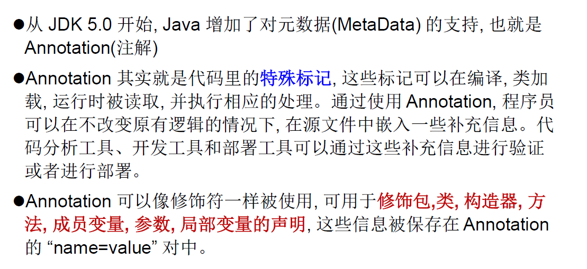

一定程度上可以说： **框架 = 注解 + 反射 + 设计模式**。

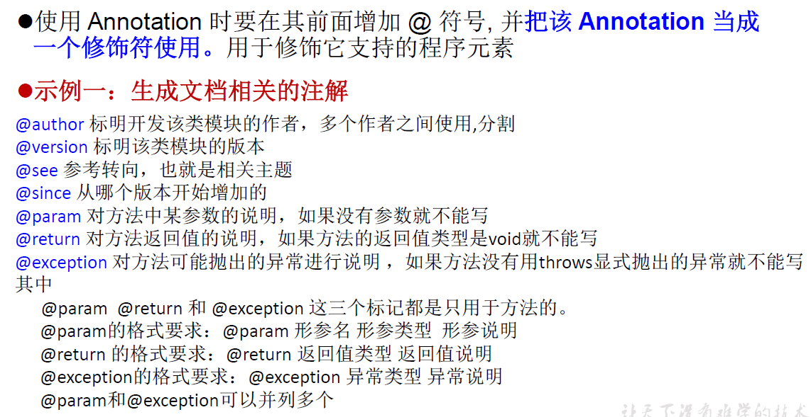

**自定义Annotation**：

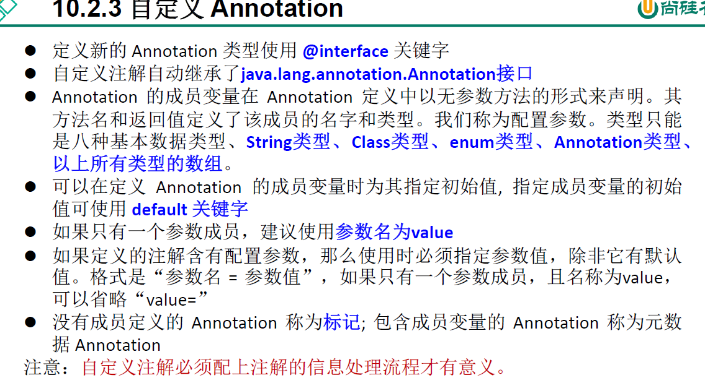

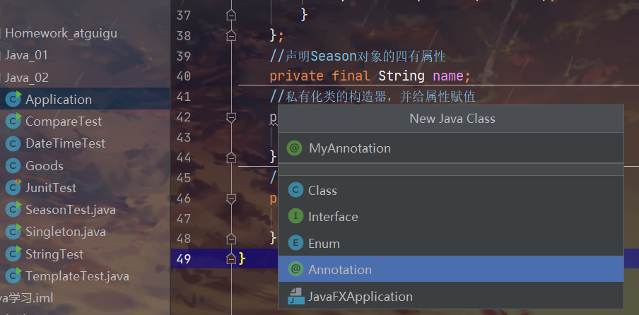

没有成员定义的 Annotation 称为 **标记** ，包含成员变量的 Annotation 称为**元数据** Annotation

```Java
//注解声明为@interface
public @interface MyAnnotation {
    //内部定义成员，通常使用value表示
    //可以指定成员的默认值，使用default定义
    //自定义注解必须使用反射才有意义
    String value() default "string";

}
```

元注解：注解其他注解的注解

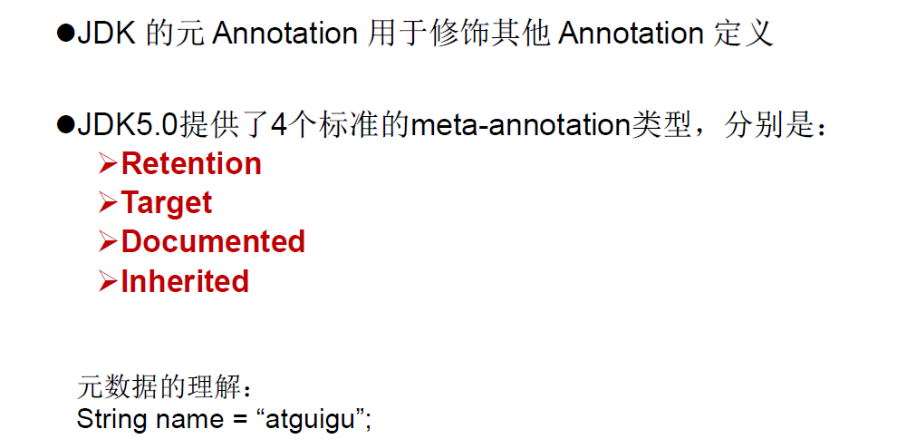

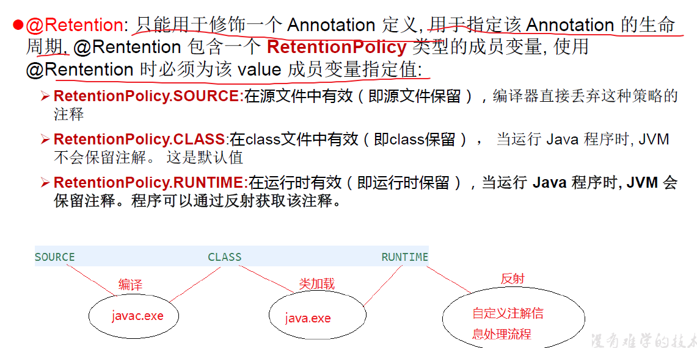

默认为CLASS。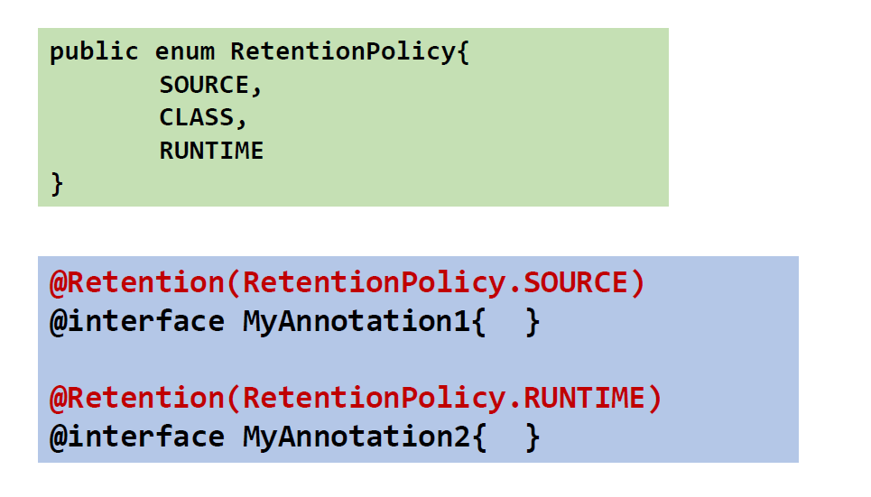

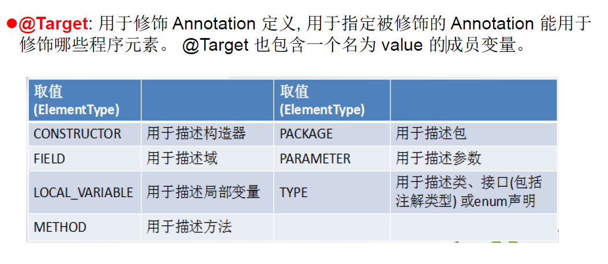

**自定义注解一般会指明以上两个元注解：Retention、Target。**

下面两个用到频率较低。

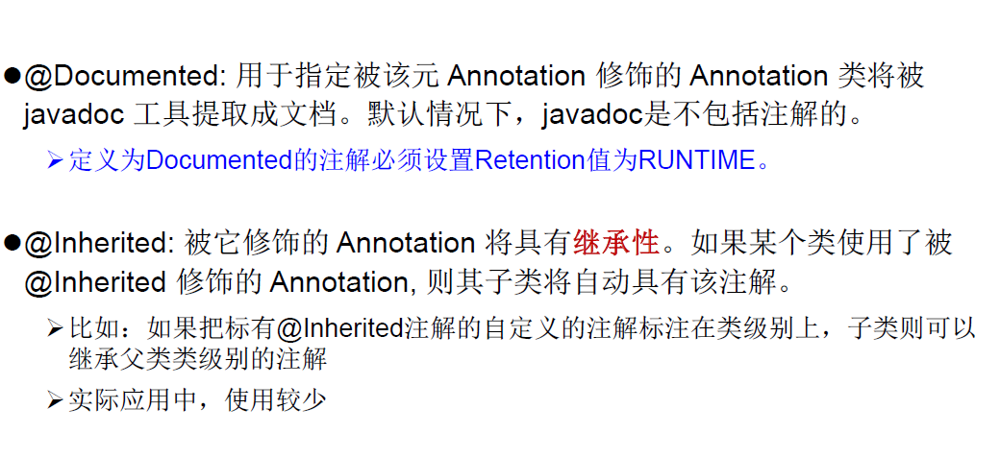

Java 8对注解处理提供了两点改进： **可重复的注解** 及 **可用于类型的注解** 。此外，反射也得到了加强，在 

Java8 中能够得到方法参数的名称。这会简化标注在方法参数上的注解。

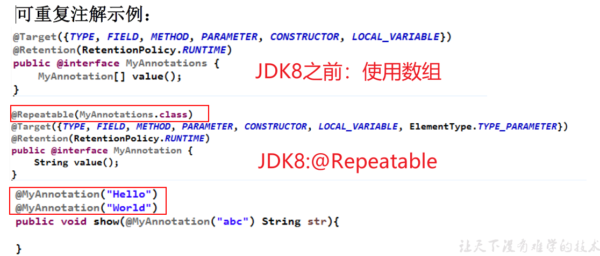