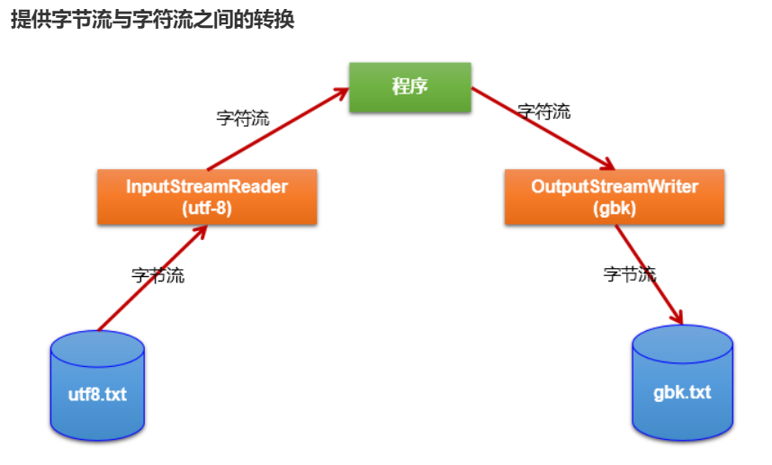
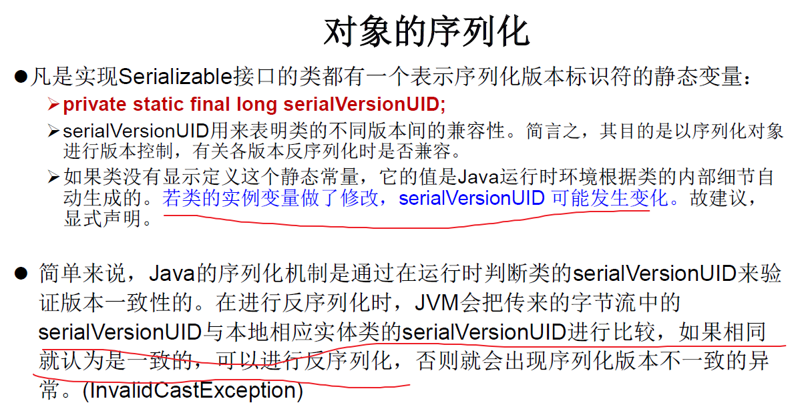

## 1.缓冲流（处理流的一种）

缓冲流也就是对4个文件（文本）流的包装。

目的：提高文件的读写效率，内部提供了一个缓冲区。

<!--more-->

缓冲流涉及到的类：

BufferedInputStream

BufferedOutputStream

BufferedReader

BufferedWriter

使用BufferedInputStream和BufferedOutputStream:处理非文本文件。

```Java
// 实现文件复制
@Test
public void test1(){
    BufferedInputStream bis = null;
    BufferedOutputStream bos = null;
    try {
        // 1.造文件
        File srcfile = new File("miku.png");
        File destfile = new File("test.png");
        // 2.造流：先造节点流，再造缓冲流
        FileInputStream fis = new FileInputStream(srcfile);
        FileOutputStream fos = new FileOutputStream(destfile);
        bis = new BufferedInputStream(fis);
        bos = new BufferedOutputStream(fos);
        // 3.复制过程
        byte[] buffer = new byte[5];
        int len;
        while ((len = bis.read(buffer)) != -1){
            bos.write(buffer,0,len);
        }
    } catch (IOException e) {
        e.printStackTrace();
    } finally {
        // 4.流的关闭
        //说明：关闭外层流的同时，内层流也会自动的进行关闭。关于内层流的关闭，我们可以省略.
        try {
            if (bis != null)
                bis.close();
        } catch (IOException e) {
            e.printStackTrace();
        } finally {
            try {
                if (bos != null)
                    bos.close();
            } catch (IOException e) {
                e.printStackTrace();
            }
        }
    }
}
```

使用BufferedReader和BufferedWriter：处理文本文件。

```Java
@Test
public void test2(){
    BufferedReader br = null;
    BufferedWriter bw = null;
    try {
        // 一步到位
        br = new BufferedReader(new FileReader(new File("hao.txt")));
        bw = new BufferedWriter(new FileWriter(new File("hello.txt")));

        // 读写操作
        // 方式1：使用char数组
        char[] cbuf = new char[1024];
        int len;
        while ((len = br.read(cbuf)) != -1){
            bw.write(cbuf,0,len);
            bw.flush();// 刷新缓冲区
        }

        // 方式2：使用String
        String data;
        while ((data = br.readLine()) != null){
            // 方法1
            bw.write(data+"\n");// data中不包含换行符
            // 方法2
            //bw.write(data);
            //bw.newLine();//提供换行的操作
        }
    } catch (IOException e) {
        e.printStackTrace();
    } finally {
        // 关闭流
        try {
            if (br != null)
                br.close();
        } catch (IOException e) {
            e.printStackTrace();
        } finally {
            try {
                if (bw != null)
                    bw.close();
            } catch (IOException e) {
                e.printStackTrace();
            }
        }
    }
}
```

## 2.转换流（处理流的一种）

转换流提供了在字节流和字符流之间的转换。

作用：处理文件乱码问题，实现编码和解码功能。

InputStreamReader：将一个字节的输入流转换为字符的输入流

解码：字节、字节数组 —>字符数组、字符串

OutputStreamWriter：将一个字符的输出流转换为字节的输出流

编码：字符数组、字符串 —> 字节、字节数组

这两个流都属于字符流。（看后缀）

说白了。看下图，就是为了使用字符流处理字节流



```Java
// InputStreamReader的解码示例
@Test
public void test3(){
    InputStreamReader isr = null;
    try {
        FileInputStream fis = new FileInputStream("hao.txt");
        // 第2个参数可以省略，IDEA默认为UTF-8，文件才用UTF-8保存，所以用它解码
        isr = new InputStreamReader(fis,"UTF-8");

        char[] cbuf = new char[20];
        int len;
        while ((len = isr.read(cbuf)) != -1){
            String str = new String(cbuf,0,len);
            System.out.print(str);
        }
    } catch (IOException e) {
        e.printStackTrace();
    } finally {
        try {
            if (isr != null)
                isr.close();
        } catch (IOException e) {
            e.printStackTrace();
        }
    }
}
```

```Java
// 综合使用InputStreamReader和OutputStreamWriter
@Test
public void test4(){
    InputStreamReader isr = null;
    OutputStreamWriter osw = null;

    try {
        File file1 = new File("hao.txt");
        File file2 = new File("hao_GBK.txt");

        FileInputStream fis = new FileInputStream(file1);
        FileOutputStream fos = new FileOutputStream(file2);

        isr = new InputStreamReader(fis,"utf-8");// 解码
        osw = new OutputStreamWriter(fos,"gbk");// 编码

        char[] cbuf = new char[20];
        int len;
        while ((len = isr.read(cbuf)) != -1){
            osw.write(cbuf,0,len);
        }
    } catch (IOException e) {
        e.printStackTrace();
    } finally {
        try {
            if (isr != null)
                isr.close();
        } catch (IOException e) {
            e.printStackTrace();
        } finally {
            try {
                if (osw != null)
                    osw.close();
            } catch (IOException e) {
                e.printStackTrace();
            }
        }
    }
}
```

## 3.其他流的使用（了解内容）

3.1标准输入、输出流（处理流的一种）

System.in:标准的输入流，默认从键盘输入

System.out:标准的输出流，默认从控制台输出

和后续的打印流和数据流一起作为了解内容。

后面只有对象流是需要重点掌握的。

3.2打印流
		PrintStream 和PrintWriter

提供了一系列重载的print()和println()方法，用于多种数据类型的输出

System.out返回的是PrintStream的实例

3.3数据流
		DataInputStream 和 DataOutputStream

作用：用于读取或写出基本数据类型的变量或字符串

## 4.对象流（处理流的一种）

对象流：
ObjectInputStream 和 ObjectOutputStream

作用：
ObjectOutputStream:内存中的对象—>存储中的文件、通过网络传输出去：序列化过程
ObjectInputStream:存储中的文件、通过网络接收过来 —>内存中的对象：反序列化过程

对象序列化机制允许把内存中的Java对象转换成平台无关的二进制流，从而允许把这种二进制流持久地保存在磁盘上，或通过网络将这种二进制流传输到另一个网络节点。//当其它程序获取了这种二进制流，就可以恢复成原来的Java对象。

Java对象要求可序列化才能进行序列化和反序列化过程。

String对象和自定义Person对象的序列化与反序列化示例。

```Java
@Test
public void test5(){
    // 通过ObjectOutputStream实现序列化过程
    ObjectOutputStream oos = null;
    try {
        oos = new ObjectOutputStream(new FileOutputStream("object.dat"));

        oos.writeObject(new String("high quality man"));
        oos.flush();// 刷新操作
        oos.writeObject(new Person(23,"xuqingen"));
        oos.flush();// 刷新操作，每写出一次就需要刷新一次
    } catch (IOException e) {
        e.printStackTrace();
    } finally {
        try {
            if (oos != null)
                oos.close();
        } catch (IOException e) {
            e.printStackTrace();
        }
    }
}
// -------------
@Test
public void test6(){
    // 通过ObjectInputStream实现反序列化过程
    ObjectInputStream ois = null;
    try {
        ois = new ObjectInputStream(new FileInputStream("object.dat"));
        Object obj = ois.readObject();
        String str = (String) obj;
        System.out.println(str);

        Person p = (Person) ois.readObject();
        System.out.println(p);
    } catch (IOException | ClassNotFoundException e) {
        e.printStackTrace();
    } finally {
        try {
            if (ois != null)
                ois.close();
        } catch (IOException e) {
            e.printStackTrace();
        }
    }
}
// Person.java
import java.io.Serializable;
public class Person implements Serializable {
    public static final long serialVersionUID = 2352466735L;
    private int age;
    private String name;

    public Person(int age, String name) {
        this.age = age;
        this.name = name;
    }
    public int getAge() {
        return age;
    }
    public String getName() {
        return name;
    }

    public void setAge(int age) {
        this.age = age;
    }
    public void setName(String name) {
        this.name = name;
    }
    @Override
    public String toString() {
        return "Person{" +
                "age=" + age +
                ", name='" + name + '\'' +
                '}';
    }
}
```

如果需要让某个对象支持序列化机制，则必须让对象所属的类及其属性是可序列化的，为了让某个类是 可序列化的，该类必须实现如下两个接口之一。
否则，会抛出 NotSerializableException 异常。
Serializable（通常会选这个）
Externalizable

实现序列化的对象所属的类需要满足

1. 需要实现接口：Serializable
2. 当前类提供一个全局常量：serialVersionUID（随便写，没有严格要求）
3. 除了当前Person类需要实现Serializable接口之外，还必须保证其内部所属性也必须是可序列化的。（默认情况下，基本数据类型可序列化）

补充：ObjectOutputStream和ObjectInputStream不能序列化static和transient修饰的成员变量

