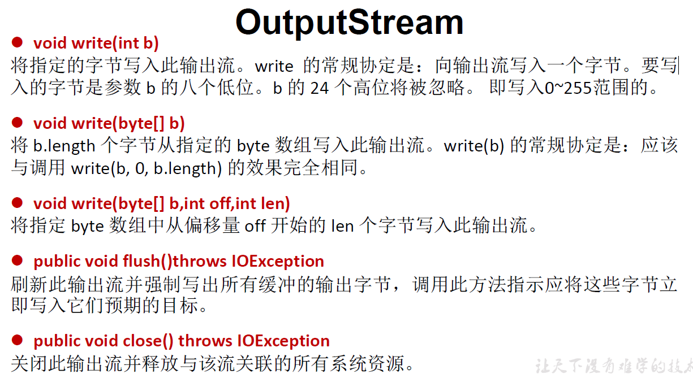
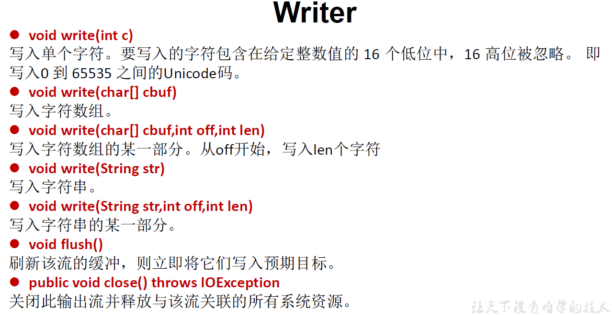

**四个节点流：**

**FileReader使用。**

read初级方法，一个一个字符读入。

<!--more-->

```Java
@Test
public void test01(){
    FileReader fr = null;// 需要抛出异常
    try {
        // 1.实例化File对象，指明要操作的文件
        File file = new File("hello.txt");
        // 2.提供具体的流
        fr = new FileReader(file);
        // 3.数据的读入
        // read()：返回读入的1个字符，达到文件末尾返回-1
        // 方式1
        int data = fr.read();
        while (data != -1){
            System.out.println((char)data);
            data = fr.read();
        }
        // 方式2
        //int data;
        //while ((data = fr.read()) != -1){
        //    System.out.println(data);
        //}
    } catch (IOException e) {
        e.printStackTrace();
    } finally {
        try {
            // 4.流的关闭操作
            if (fr != null)
                fr.close();// 处理流关闭本身的异常
        } catch (IOException e) {
            e.printStackTrace();
        }
    }

    // 为了保证流资源一定可以执行关闭操作。需要使用try-catch-finally处理
    // 使用throws如果IO流已经创建，但是中途抛出异常导致流没有关闭可能造成内存泄漏
    // ctrl+alt+T，将选中代码用try-catch-finally包住
}
```

read重载方法，一次读入一个char数组。

```Java
@Test
public void test02(){
    // 对read()操作升级，使用它的重载方法
    FileReader fr = null;

    try {
        // 1.File类的实例化
        File file = new File("hello.txt");
        // 2.FileReader类的实例化
        fr = new FileReader(file);
        // 3.读入操作
        // read(char[] cbuf)：返回每次读入cbuf数组中的字符个数，如果达到文件末尾，返回-1
        char[] cbuf = new char[5];
        int len;
        while ((len = fr.read(cbuf)) != -1) {
            // 错误演示1：数组可能存在不能完全覆盖
            // 比如2次分别读入5、3个字符，第2次输出时会包括第1次的后2个字符
            //    for (int i = 0;i < cbuf.length;i++){
            //        System.out.print(cbuf[i]);
            //    }

            // 正确示范1
            //    for (int i = 0;i < len;i++){// 拿到几个字符就输出几个
            //        System.out.print(cbuf[i]);
            //    }

            // 错误演示2：数组可能存在不能完全覆盖
            //String str = new String(cbuf);
            //System.out.print(str);

            // 正确示范2
            String str = new String(cbuf,0,len);
            System.out.print(str);
        }
    } catch (IOException e) {
        e.printStackTrace();
    } finally {
        if (fr != null){// if放在try的里面还是外面都一样
            try {
                // 4.流的关闭
                fr.close();
            } catch (IOException e) {
                e.printStackTrace();
            }
        }
    }
}
```

说明：

read()的理解：返回读入的一个字符。如果达到文件末尾，返回-1

异常的处理：为了保证流资源一定可以执行关闭操作。需要使用try-catch-finally处理

读入的文件一定要存在，否则就会报FileNotFoundException

输入的标准化过程总结： 
① 创建File类的对象，指明读取的数据的来源。（要求此文件一定要存在）
② 创建相应的输入流，将File类的对象作为参数，传入流的构造器中
③ 具体的读入过程：
    创建相应的byte[] 或 char[]。
④ 关闭流资源
说明：程序中出现的异常需要使用try-catch-finally处理。

OutputStream & Writer

```Java
void write(int b/int c);
void write(byte[] b/char[] cbuf);
void write(byte[] b/char[] buff, int off, int len);
void flush();
void close(); 需要先刷新，再关闭此流

// 因为字符流直接以字符作为操作单位，所以 Writer 可以用字符串来替换字符数组，
即以 String 对象作为参数

void write(String str);
void write(String str, int off, int len);

// FileOutputStream 从文件系统中的某个文件中获得输出字节。FileOutputStream
用于写出非文本数据之类的原始字节流。要写出字符流，需要使用 FileWriter
```





**FileWriter使用。**

```Java
@Test
public void testFileWriter(){
    // 从内存中写出数据到硬盘文件中，文件不存在会自动创建
    FileWriter fw = null;

    try {
        // 1.提供File类对象，指明写出到的文件
        File file = new File("hello1.txt");
        // 2.提供FileWriter的对象，用于数据的写出
        fw = new FileWriter(file,false);
        // 3.写出的操作
        fw.write("I have a dream!\n");// 以String形式写入
        fw.write("you have a dream!");
    } catch (IOException e) {
        e.printStackTrace();
    } finally {
        if (fw != null){
            // 4.流的关闭
            try {
                fw.close();
            } catch (IOException e) {
                e.printStackTrace();
            }
        }
    }
}
```

说明：

输出操作，对应的File可以不存在的。并不会报异常
File对应的硬盘中的文件如果不存在，在输出的过程中，会自动创建此文件。
File对应的硬盘中的文件如果存在：
如果流使用的构造器是：FileWriter(file,false) / FileWriter(file):对原文件的覆盖
如果流使用的构造器是：FileWriter(file,true):不会对原文件覆盖，而是在原文件基础上追加内容
因为字符流直接以字符作为操作单位，所以 Writer 可以用字符串来替换字符数组，
即以 String 对象作为参数
void write(String str);
void write(String str , int off, int len);

输出的标准化过程总结： 
① 创建File类的对象，指明写出的数据的位置。（不要求此文件一定要存在）
② 创建相应的输出流，将File类的对象作为参数，传入流的构造器中
③ 具体的写出过程：
    write(char[]/byte[] buffer,0,len)
④ 关闭流资源

说明：程序中出现的异常需要使用try-catch-finally处理。

**使用FileReader和FileWriter实现文本文件的复制。**

```Java
@Test
public void test03(){
    FileReader fr = null;
    FileWriter fw = null;

    try {
        // 1.创建File类的对象，指明读入和写出的文件
        File srcfile = new File("hao.txt");
        File destfile = new File("hello.txt");
        // 2.创建输入流和输出流的对象
        fr = new FileReader(srcfile);// hao文件必须存在
        fw = new FileWriter(destfile);
        // 3.数据的读入和写出操作
        char[] cbuf = new char[5];
        int len;// 记录每次读到cbuf数组的字符个数
        while ((len = fr.read(cbuf)) != -1){
            fw.write(cbuf,0,len);// 每次写出len个字符
        }
    } catch (IOException e) {
        e.printStackTrace();
    } finally {
        // 4.关闭流
        if (fr != null){
            try {
                fr.close();
            } catch (IOException e) {
                e.printStackTrace();
            }
        }

        if (fw != null){
            try {
                fw.close();// 可以并列写，也可以写在fr的finally中（嵌套）
            } catch (IOException e) {
                e.printStackTrace();
            }
        }
    }
}
```

**FileInputStream / FileOutputStream使用。**

对于文本文件(.txt,.java,.c,.cpp)，使用字符流处理

对于非文本文件(.jpg,.mp3,.mp4,.avi,.doc,.ppt,…)，使用字节流处理

想要复制图片，只要将FileReader和FileWriter改成相应的FileInputStream和FileOutputStream就行。

用FileInput(Output)Stream这两个类也能读入写出文本文件，不过需要做一些处理，否则可能乱码。

```Java
@Test
public void test4(){
    FileInputStream fis = null;
    FileOutputStream fos = null;
    try {
        // 1.造文件
        File srcfile = new File("miku.png");
        File destfile = new File("test.png");
        // 2.造流
        fis = new FileInputStream(srcfile);
        fos = new FileOutputStream(destfile);
        // 3.复制过程
        byte[] buffer = new byte[5];// 数字太小影响复制速度，太大占用内存大
        int len;
        while ((len = fis.read(buffer)) != -1){
            fos.write(buffer,0,len);
        }
    } catch (IOException e) {
        e.printStackTrace();
    } finally {
        // 4.流的关闭
        try {
            if (fis != null)
                fis.close();
        } catch (IOException e) {
            e.printStackTrace();
        } finally {
            try {
                if (fos != null)
                    fos.close();
            } catch (IOException e) {
                e.printStackTrace();
            }
        }
    }
}
```

**相对路径在IDEA和Eclipse中使用的区别？**

IDEA:

如果使用单元测试方法，相对路径基于当前的Module的。

如果使用main()测试，相对路径基于当前Project的。
Eclipse:

单元测试方法还是main(),相对路径都是基于当前Project的。

