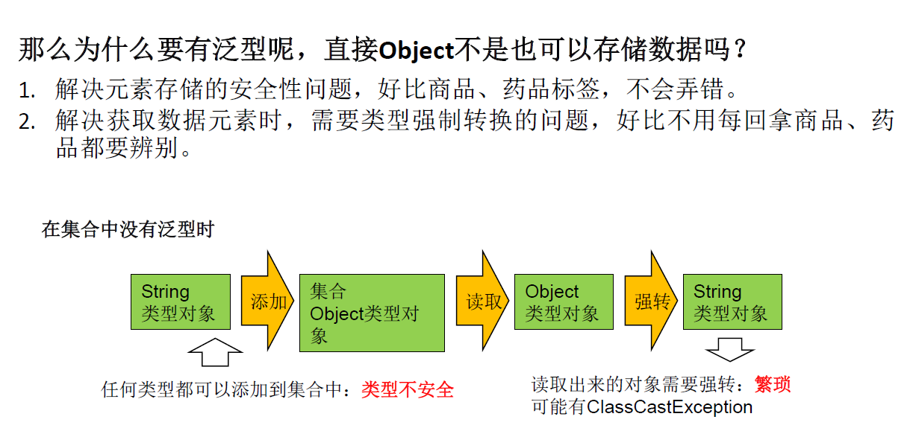
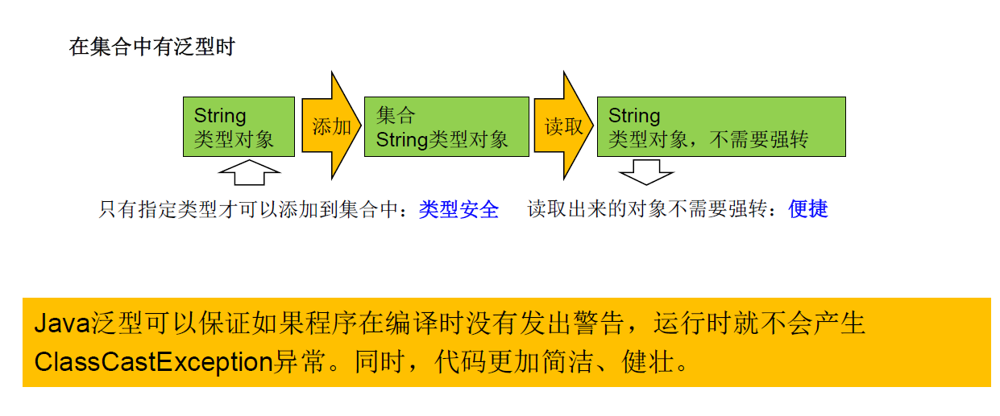
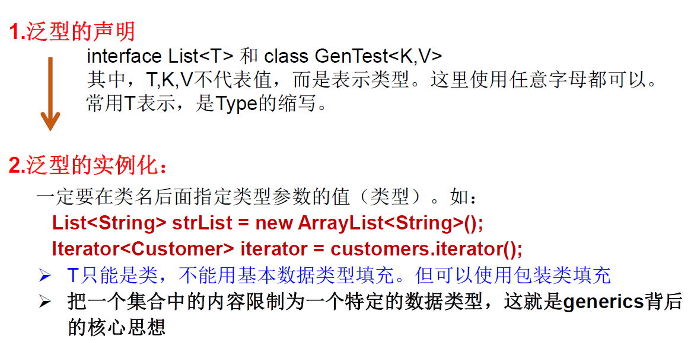
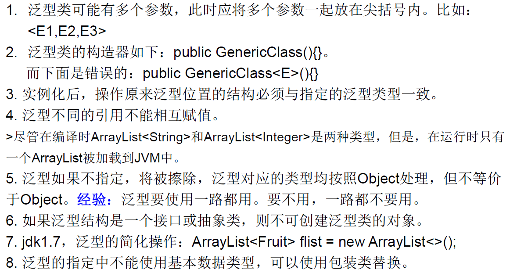
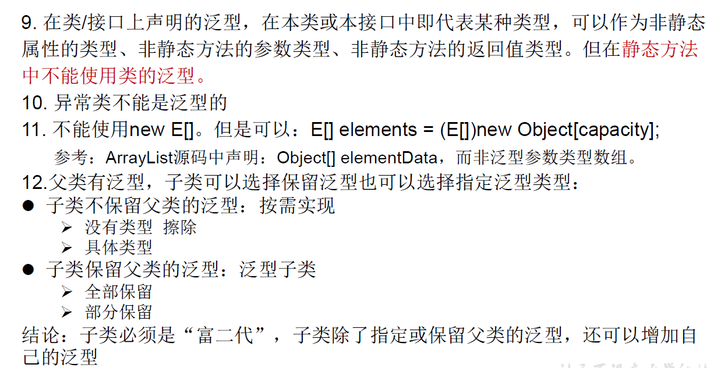
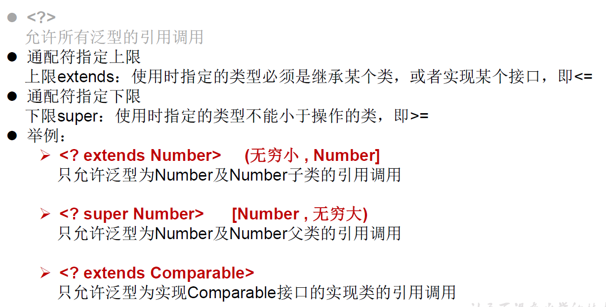

## 1.泛型（Generic）

和C++中的模板有些相似。

从 JDK 1 5 以后 Java 引入了 参数化类型 Parameterized type 的概念允许我们在创建集合时再指定集合元素

的类型 正如： List<String> 这表明该 List 只能保存字符串类型的对象 。

<!--more-->





集合中使用泛型总结：

```Java
*  ① 集合接口或集合类在jdk5.0时都修改为带泛型的结构。
*  ② 在实例化集合类时，可以指明具体的泛型类型
*  ③ 指明完以后，在集合类或接口中凡是定义类或接口时，内部结构（比如：方法、构造器、属性等）使用到类的泛型的位置，都指定为实例化的泛型类型。
*    比如：add(E e)  --->实例化以后：add(Integer e)
*  ④ 注意点：泛型的类型必须是类，不能是基本数据类型。需要用到基本数据类型的位置，拿包装类替换
*  ⑤ 如果实例化时，没指明泛型的类型。默认类型为java.lang.Object类型。
```

```Java
// 在集合中使用泛型
// 泛型不能是基本数据类型，只能用包装类
ArrayList<Integer> list = new ArrayList<Integer>();
// JDK7写法，类型推断：ArrayList<Integer> list = new ArrayList<>();
list.add(12);// 编译时就会进行类型检查，保证数据的安全
list.add(234);
list.add(345);
list.add(45);
//list.add("asf");爆红，不能添加String
// 方式1
for (Integer integer:list){
    // 避免了强制类型转换
    int score = integer;
}
// 方式2
Iterator<Integer> iterator = list.iterator();
while (iterator.hasNext()){
    int score = iterator.next();
    System.out.println(score);
}
--------
Map<String,Integer> map = new HashMap<String,Integer>();
map.put("tom",12);
Set<Map.Entry<String,Integer>> entry = map.entrySet();
Iterator<Map.Entry<String, Integer>> iterator = entry.iterator();
while (iterator.hasNext()){
    Map.Entry<String, Integer> next = iterator.next();
    System.out.println(next);
}
--------/*带泛型的自然排序*/
public class Person implements Comparable<Person>{
    @Override
    public int compareTo(Person o) {
        return this.name.compareTo(o.name);
    }
}
```

## 2.如何自定义泛型结构

自定义泛型类、泛型接口、泛型方法。



泛型的主要优点是能够在编译时而不是在运行时检查错误。

泛型类的例子：

```Java
@Test
public void test5(){
    // 在实例化时指明类的泛型
    Order<String> order = new Order<>("sda",12,"dfs");

    // subOrder是Order的子类，定义时已经指明了泛型类型
    // 所以实例化时不用再说明
    subOrder suborder = new subOrder();
    // 测试泛型方法
    Order<String> order = new Order<>();
    Integer[] arr = new Integer[]{1,2,3};
    // 泛型方法在调用时指定泛型参数
    List<Integer> list = order.copyFromArrayToList(arr);
}
/*Order.java*/
public class Order<T> {
    String ordername;
    int orderId;
    T orderT;// 在类的内部使用类的泛型

    public Order(){
		//编译不通过
//        T[] arr = new T[10];
        //编译通过
        T[] arr = (T[]) new Object[10];
    }
    public Order(String ordername,int orderId,T orderT){
        this.orderId = orderId;
        this.ordername = ordername;
        this.orderT = orderT;
    }
    // 静态方法中不能使用类的泛型。因为静态方法随类加载
    //public static void show(T orderT){
    //    System.out.println(orderT);
    //}
    
    public void show(){
        //编译不通过
//        try{
//
//
//        }catch(T t){
//
//        }

    }
    //如下的个方法都不是泛型方法
    public T getOrderT(){
        return orderT;
    }

    public void setOrderT(T orderT){
        this.orderT = orderT;
    }
    //泛型方法：在方法中出现了泛型的结构，泛型参数与类的泛型参数没任何关系。
    //换句话说，泛型方法所属的类是不是泛型类都没关系。
    //泛型方法，可以声明为静态的。原因：泛型参数是在调用方法时确定的。并非在实例化类时确定。
    public static <E>  List<E> copyFromArrayToList(E[] arr){

        ArrayList<E> list = new ArrayList<>();

        for(E e : arr){
            list.add(e);
        }
        return list;

    }
}
class subOrder extends Order<Integer> {
}
```





## 3.泛型在继承方面的体现

虽然类A是类B的父类，但是G<A> 和G<B>二者不具备子父类关系，二者是并列关系

补充：类A是类B的父类，A<G> 是 B<G>的父类

```Java
@Test
public void test1(){

    Object obj = null;
    String str = null;
    obj = str;

    Object[] arr1 = null;
    String[] arr2 = null;
    arr1 = arr2;
    //编译不通过
    //        Date date = new Date();
    //        str = date;
    List<Object> list1 = null;
    List<String> list2 = new ArrayList<String>();
    //此时的list1和list2的类型不具子父类关系
    //编译不通过
    //        list1 = list2;
    /*
        反证法：
        假设list1 = list2;
           list1.add(123);导致混入非String的数据。出错。
         */
    show(list1);
    show1(list2);

}

public void show1(List<String> list){

}

public void show(List<Object> list){

}
@Test
public void test2(){

    AbstractList<String> list1 = null;
    List<String> list2 = null;
    ArrayList<String> list3 = null;

    list1 = list3;
    list2 = list3;

    List<String> list4 = new ArrayList<>();

}
```

## 4.通配符的使用

通配符：?

类A是类B的父类，G<A>和G<B>是没关系的，二者共同的父类是：G<?>

```Java
@Test
public void test3(){
    List<Object> list1 = null;
    List<String> list2 = null;
    List<?> list = null;// List<?>相当于一个通用父类

    list = list1;
    list = list2;
    //编译通过
    //        print(list1);
    //        print(list2);

    List<String> list3 = new ArrayList<>();
    list3.add("AA");
    list3.add("BB");
    list3.add("CC");
    list = list3;
    //添加(写入)：对于List<?>就不能向其内部添加数据。
    //除了添加null之外。
    //        list.add("DD");
    //        list.add('?');

    list.add(null);
    //获取(读取)：允许读取数据，读取的数据类型为Object。
    Object o = list.get(0);
    System.out.println(o);

}
public void print(List<?> list){
    Iterator<?> iterator = list.iterator();
    while(iterator.hasNext()){
        Object obj = iterator.next();
        System.out.println(obj);
    }
}
```

有限制的通配符：



```Java
@Test
public void test6(){
    List<? extends Person> list1 = null;// ?<=Person
    List<? super Person> list2 = null;// ?>=Person

    List<Student> list3 = new ArrayList<>();
    List<Person> list4 = new ArrayList<>();
    List<Object> list5 = new ArrayList<>();

    list1  = list3;
    list1  = list4;
    //list1  = list5;报错

    //list2  = list3;报错
    list2  = list4;
    list2  = list5;

    // 读取数据
    list1 = list3;
    Person p = list1.get(0);// 左边只能用范围的最大值Person接收
    list2  = list4;
    Object obj = list2.get(0);// 左边只能用范围的最大值Object接收
    // 总结：写上限
}
```

