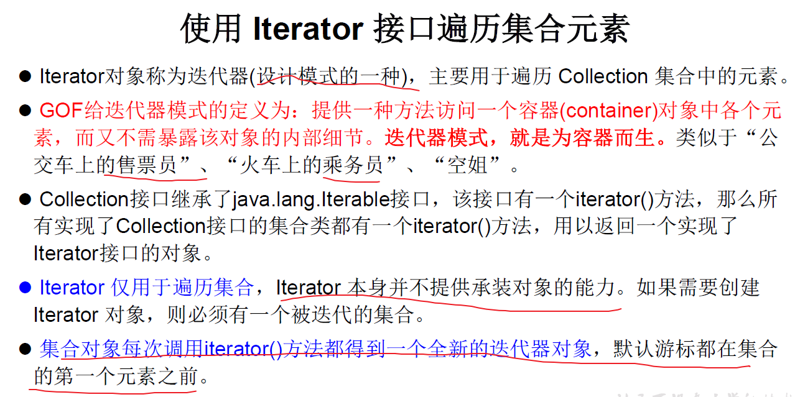
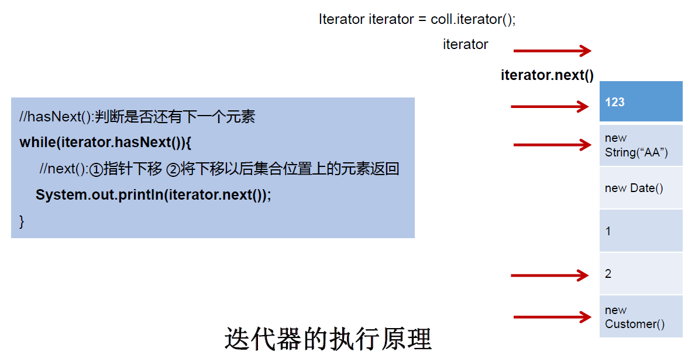
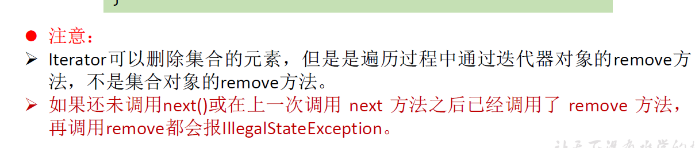
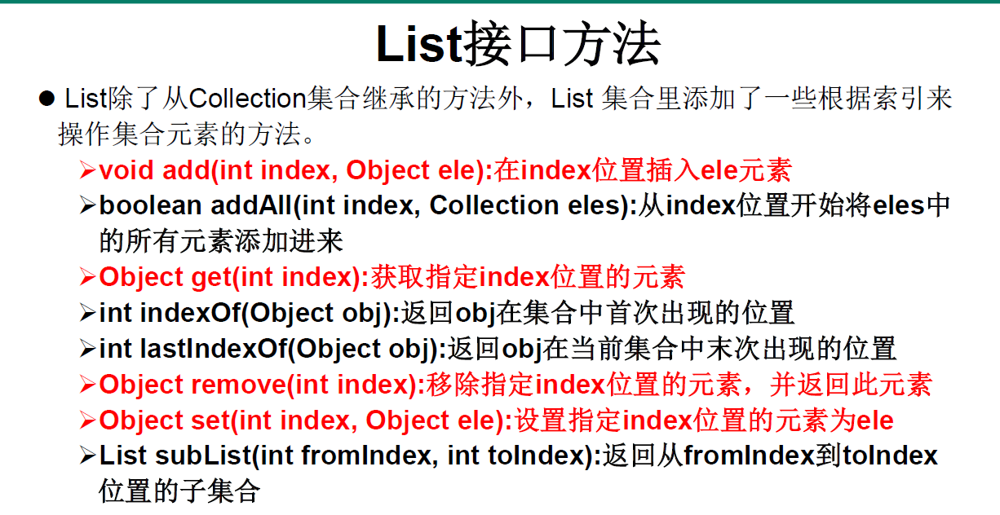

## 1.集合框架概述

参考博客：https://www.acwing.com/blog/content/4414/

集合、数组都是对多个数据进行存储操作的结构，简称Java容器。

<!--more-->

**Java集合类库将接口与实现分离。**


这两个都是接口，不是类。

Collection的接口继承树：


Map的接口继承树：


List接口：动态数组，存储有序可重复数据；Set接口：集合，存储无序不可重复数据；Queue接口：队列。

Map接口：类似函数，存储key-value的键值对，一个key不能对应多个value。

## 2.Collection接口方法

推荐一个Java全面教程：https://blog.csdn.net/qq_38490457/article/details/108281646


Collection接口的13种常用方法：

```Java
// 以ArrayList作为示例，不能直接new Collection，它是个接口
Collection coll = new ArrayList();

// 1.add(Object e);将元素e添加到集合coll中
coll.add("asd");// 任意类型都行
coll.add(123);// 自动装箱
coll.add(new Date());

// 2.size();获取的添加的元素的个数
System.out.println(coll.size());//3

// 3.coll2.addAll(Collection coll1);将coll1添加到coll2中
Collection coll1 = new ArrayList();
coll1.add(12);
coll1.add("asdf");
coll.addAll(coll1);
System.out.println(coll);

// 4.clear();清空集合元素
coll1.clear();
// 5.isEmpty();判断集合是否为空，即size为0
System.out.println(coll1.isEmpty());// true
```

向Collection接口的实现类的对象中添加数据obj时，要求重写equals()，因为cnontains方法会调用equals。

```Java
Collection coll = new ArrayList();

coll.add(123);
coll.add(new String("Tom"));
coll.add(false);// 包装类Boolean
coll.add(new Person("Jerry",20));// 自定义类Person

// 1.contains(Object obj);判断当前集合中是否包含obj
// 我们在判断时会调用obj对象所在类的equals方法
boolean contains = coll.contains(123);
System.out.println(contains);// true
// equals方法判断对象内容是否相等，==判断是否同一个对象
// contains看内容是否相等
System.out.println(coll.contains(new String("Tom")));// true
// Person没有重写equals方法，是false，重写之后就是true
System.out.println(coll.contains(new Person("Jerry",20)));// false

// 2.coll2.containsAll(Collection coll1);判断coll1中所有元素是否都在coll2中
// 也是调用元素的 equals 方法来比较的,拿两个集合的元素挨个比较
Collection coll1 = new ArrayList();
coll1.add(123);
System.out.println(coll.containsAll(coll1));// true

// 3.remove(Object ojb);移除集合中的元素
coll.remove(123);// 返回是否移除成功，true或false
coll.remove(new Person("Jerry",20));
System.out.println(coll);

// 4.removeAll(Collection coll1);从当前集合中移除coll1中的所有元素
Collection coll2 = Arrays.asList(false,new String("asd"));
coll.removeAll(coll2);
System.out.println(coll);

// 5.retainAll(Collection coll3);求两集合的交集，结果存放在当前集合，不影响集合coll3
coll.add(1);
coll.add(new String("ad"));
Collection coll3 = Arrays.asList(1,new String("ad"));
coll.retainAll(coll3);
System.out.println(coll);

// 6.equals(Object obj);判断两个集合是否相等
Collection coll4 = Arrays.asList(new String("asd"),false);
System.out.println(coll2.equals(coll4));//false,ArrayList有序，交换顺序是不等的

// 7.hasnCode();返回当前对象的哈希值
Collection coll = Arrays.asList(false,new String("asd"),123);
System.out.println(coll.hashCode());

// 8.toArray();集合 -- > 数组
Object[] arr = coll.toArray();
for (int i = 0;i < arr.length;i++){
    System.out.print(arr[i]+" ");
}
System.out.println();

// 拓展：数组 -- > 集合,调用Arrays类的静态方法asList()
List<String> list = Arrays.asList(new String[]{"aa","bb","cc"});
System.out.println(list);
// new int[]构造的数组被看成了一个整体
List arr1 = Arrays.asList(new int[]{12,23,34});
System.out.println(arr1.size());//1
// 只有用包装类如Integer才会看成多个元素
List arr2 = Arrays.asList(new Integer[]{12,23,34});
System.out.println(arr2.size());//3
```

还有一个iterator方法放在下个知识点，它的作用是返回迭代器对象，用于集合遍历。

## 3.使用Iterator接口遍历集合



迭代器的执行原理：



```Java
Collection coll = new ArrayList();
coll.add("asd");// 任意类型都行
coll.add(123);// 自动装箱
coll.add(new String("fsdf"));

Iterator iterator = coll.iterator();
// 输出第一个元素
System.out.println(iterator.next());// 如果下一个元素没有会异常

//next()推荐配合hasNext()使用
while (iterator.hasNext()){
    System.out.println(iterator.next());
}

// 迭代器内部定义了remove方法，可以在便利的时候删除集合中的元素
// 注意：此处的remove方法不同于集合的remove方法
Iterator ite = coll.iterator();
while (ite.hasNext()){
    Object obj = ite.next();
    if ("fsdf".equals(obj)){
        // “fsdf"从集合中删除了
        ite.remove();//remove跟着next指针走
    }
}
```



## 4.使用for-each遍历集合

JDK5.0的新特性，增强for循环

可用于迭代访问Collection和数组。

和C++中的for-each用法类似。

foreach适用于循环次数未知，只是进行集合或数组遍历，for则在**较复杂的循环**中效率更高。

foreach**不能**对数组或集合进行**修改**（添加删除操作），如果想要**修改就要用for循环**。

```Java
Collection coll = new ArrayList();
coll.add("asd");// 任意类型都行
coll.add(123);// 自动装箱
coll.add(new String("fsdf"));

for(Object obj:coll){
    System.out.println(obj);
}

int[] arr = new int[]{1,2,3,4};
for (int i : arr){
    System.out.print(i+" ");
}
```

## 5.Collection子接口之一：List接口

鉴于 Java 中数组用来存储数据的局限性，我们通常使用 List 替代数组。

List 集合类中元素有序、且可重复 ，集合中的每个元素都有其对应的顺序索引。

List 容器中的元素都对应一个整数型的序号记载其在容器中的位置，可以根据序号存取容器中的元素。

List 接口的实现类常用的有： **ArrayList 、 LinkedList 和 Vector** 。

三者的异同？

相同点：都用于存储有序、可重复元素。

不同点：

```Java
|----Collection接口：单列集合，用来存储一个一个的对象
   |----List接口：存储序的、可重复的数据。  -->“动态”数组,替换原的数组
     |----ArrayList：作为List接口的主要实现类；线程不安全的，效率高；底层使用Object[] elementData存储      |----LinkedList：对于频繁的插入、删除操作，使用此类效率比ArrayList高；底层使用双向链表存储
     |----Vector：作为List接口的古老实现类；线程安全的，效率低；底层使用Object[] elementData存储
```

ArrayList是最常用的，但是线程不安全。

**一些源码分析**

ArrayList的源码分析：

```Java
//jdk 7
ArrayList list = new ArrayList();//底层创建了长度是10的Object[]数组elementData
list.add(123);//elementData[0] = new Integer(123);
...
list.add(11);//如果此次的添加导致底层elementData数组容量不够，则扩容
//默认情况下，扩容为原来的容量的1.5倍，同时需要将原有数组中的数据复制到新的数组中。
//结论：建议开发中使用带参的构造器：ArrayList list = new ArrayList(int capacity)


//jdk 8中ArrayList的变化
ArrayList list = new ArrayList();//底层Object[] elementData初始化为{}.并没创建长度为10的数组
list.add(123);//第一次调用add()时，底层才创建了长度10的数组，并将数据123添加到elementData[0]
...//后续的添加和扩容操作与jdk 7 无异。
//小结：jdk7中的ArrayList的对象的创建类似于单例的饿汉式，而jdk8中的ArrayList的对象的创建类似于单例的懒汉式，延迟了数组的创建，节省内存。
```

LinkedList的源码分析：

```Java
LinkedList list = new LinkedList(); //内部声明了Node类型的first和last属性，默认值为null
list.add(123);//将123封装到Node中，创建了Node对象。
//其中，Node定义为：体现了LinkedList的双向链表的说法

private static class Node<E> {
    E item;
    Node<E> next;
    Node<E> prev;

    Node(Node<E> prev, E element, Node<E> next) {
        this.item = element;
        this.next = next;
        this.prev = prev;
    }
}
```

Vector的源码分析：

jdk7和jdk8中通过Vector()构造器创建对象时，底层都创建了长度为10的数组。在扩容方面，默认扩容为原来

的数组长度的2倍。

List接口的常见方法：



注意：subList返回子集合，不会对原集合造成影响。

```Java
最常用的几种方法
增：add(Object obj)
删：remove(int index) / remove(Object obj)这两个方法是重载的
改：set(int index, Object ele)
查：get(int index)
插：add(int index, Object ele)
长度：size()
遍历：① Iterator迭代器方式
     ② 增强for循环
     ③ 普通的循环
```

