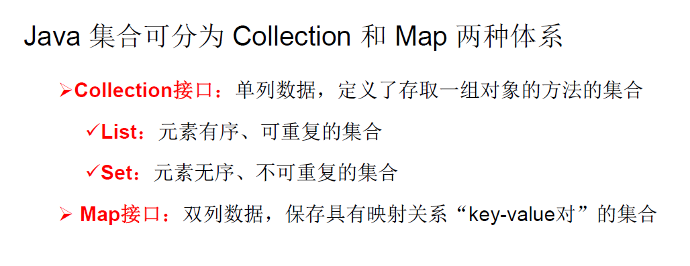
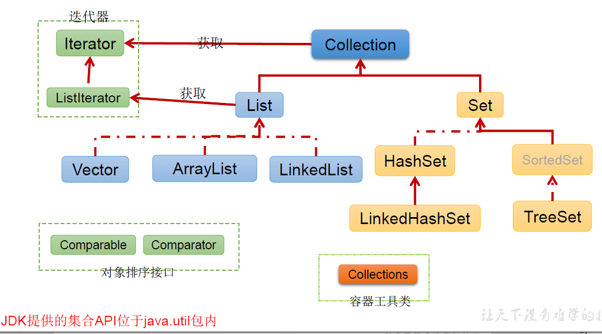
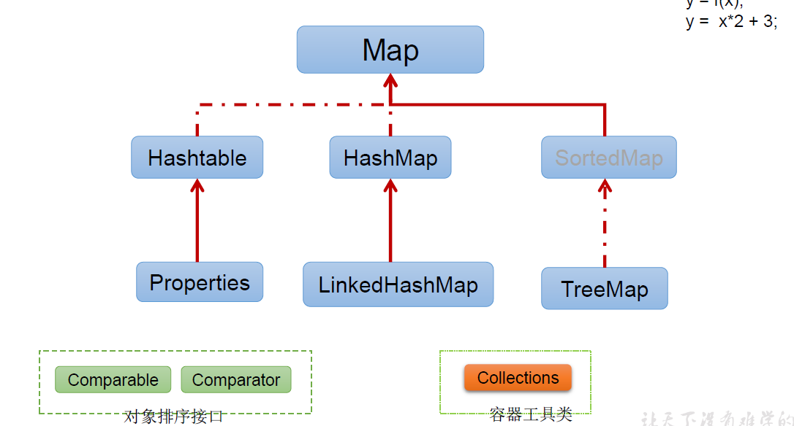
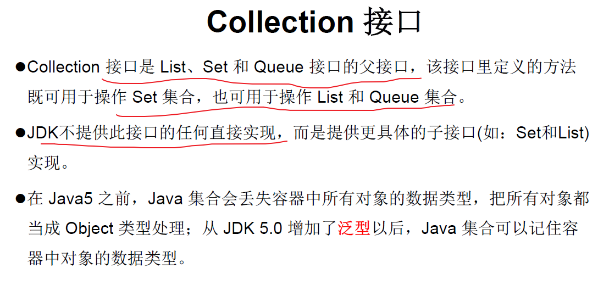

## 1.集合框架概述

参考博客：https://www.acwing.com/blog/content/4414/

集合、数组都是对多个数据进行存储操作的结构，简称Java容器。

<!--more-->

**Java集合类库将接口与实现分离。**

这两个都是接口，不是类。

List接口：动态数组，Set接口：集合，Queue接口：队列。

Map接口：函数，一个key不能对应多个value。

## 3.Collection接口

推荐一个Java全面教程：https://blog.csdn.net/qq_38490457/article/details/108281646