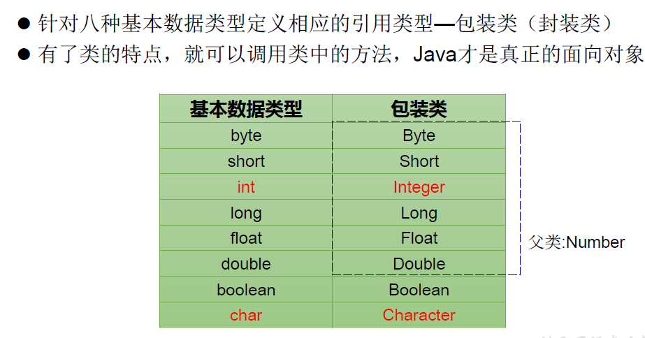
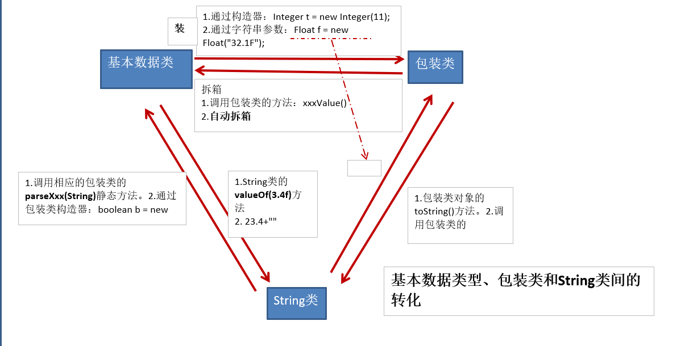

## 1.包装类 (Wrapper) 的使用

<!--more-->





包装类的重点就在于基本数据类型、包装类和String类之间的转换。

**重点记住：自动装/拆箱，parseXXX()/valueOf()。**

```java
// 基本数据类型-->包装类：调用包装类的构造器
@org.junit.jupiter.api.Test
    public void test1(){
    int num1 = 10;
    Integer in1 = new Integer(num1);
    System.out.println(in1.toString());

    Integer in2 = new Integer("1234");
    System.out.println(in2);// 输出对象默认调用toString

    Float f1 = new Float("123.34F");
    System.out.println(f1);
    Float f2 = new Float("234");
    System.out.println(f2);

    Boolean b1 = new Boolean(true);//true
    System.out.println(b1);
    Boolean b2 = new Boolean("TRue12");//false，不会报错
    System.out.println(b2);
    Boolean b3 = new Boolean("TRue");//true，忽略大小写
    System.out.println(b3);
}
```

```java
// 包装类-->基本数据类型：调用包装类的xxxValue()
@Test
public void test2(){
    Integer in1 = new Integer(12);
    int i1 = in1.intValue();
    System.out.println(i1%5);
}
```

```java
// JDK5.0新特性，自动装箱与自动拆箱
    @Test
    public void test3(){
        int num1 = 10;
        // 基本数据类型-->包装类的对象
        method(num1);
        // 自动装箱：基本数据类型-->包装类
        //不需要调用包装类的构造器
        int num2 = 18;
        Integer in1 = num2;

        // 自动拆箱：包装类-->基本数据类型
        int num3 = in1;
        System.out.println(num3);
    }
    public void method(Object obj){
        System.out.println(obj);
    }
```

```java
// 基本数据类型、包装类-->String类型：调用String重载的valueOf()
@Test
public void test4(){
    int num1 = 10;
    // 方式1：连接运算
    String s1 = num1+"";
    System.out.println(s1);
    // 方式2
    float f1 = 12.3F;
    String s2 = String.valueOf(f1);//基本数据类型
    System.out.println(s2);

    Double d1 = new Double(12.4);//包装类
    String s3 = String.valueOf(d1);
    System.out.println(s3);
}
```

```java
// String类型-->基本数据类型、包装类：调用包装类的parseXXX()
@Test
public void test5(){
    String s1 = "123";
    int num1 = Integer.parseInt(s1);
    System.out.println(num1+3);

    String s2 = "true";
    boolean num2 = Boolean.parseBoolean(s2);
    System.out.println(num2);
}
```

```java
//关于包装类使用的面试题
// 问test1和test2输出是否相等
// 问test3的输出内容
public class InterviewTest {
	@Test
	public void test1() {
        // 三元运算符要求后面两个返回值类型一致，否则自动类型转换
		Object o1 = true ? new Integer(1) : new Double(2.0);
		System.out.println(o1);// 1.0
	}

	@Test
	public void test2() {
		Object o2;
		if (true)
			o2 = new Integer(1);
		else
			o2 = new Double(2.0);
		System.out.println(o2);// 1

	}

	@Test
	public void test3() {
		Integer i = new Integer(1);
		Integer j = new Integer(1);
		System.out.println(i == j);//false		
//Integer内部定义了IntegerCache结构，IntegerCache中定义了Integer[],
//保存了从-128~127范围的整数。如果我们使用自动装箱的方式，给Integer赋值的范围在
//-128~127范围内时，可以直接使用数组中的元素，不用再去new了。目的：提高效率		
		Integer m = 1;
		Integer n = 1;
		System.out.println(m == n);//true

		Integer x = 128;//相当于new了一个Integer对象
		Integer y = 128;//相当于new了一个Integer对象
		System.out.println(x == y);//false
	}

}
```

